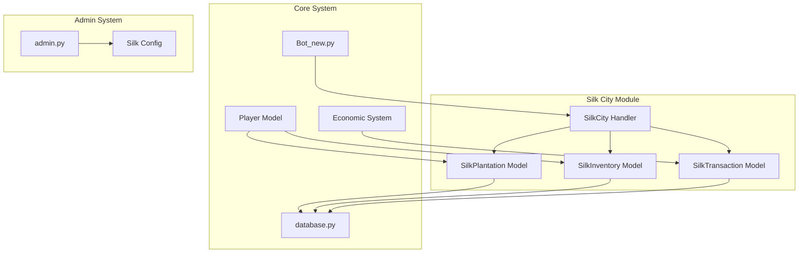
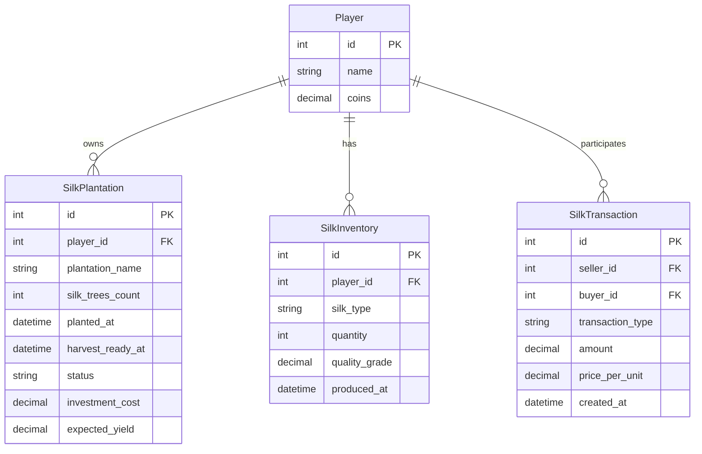
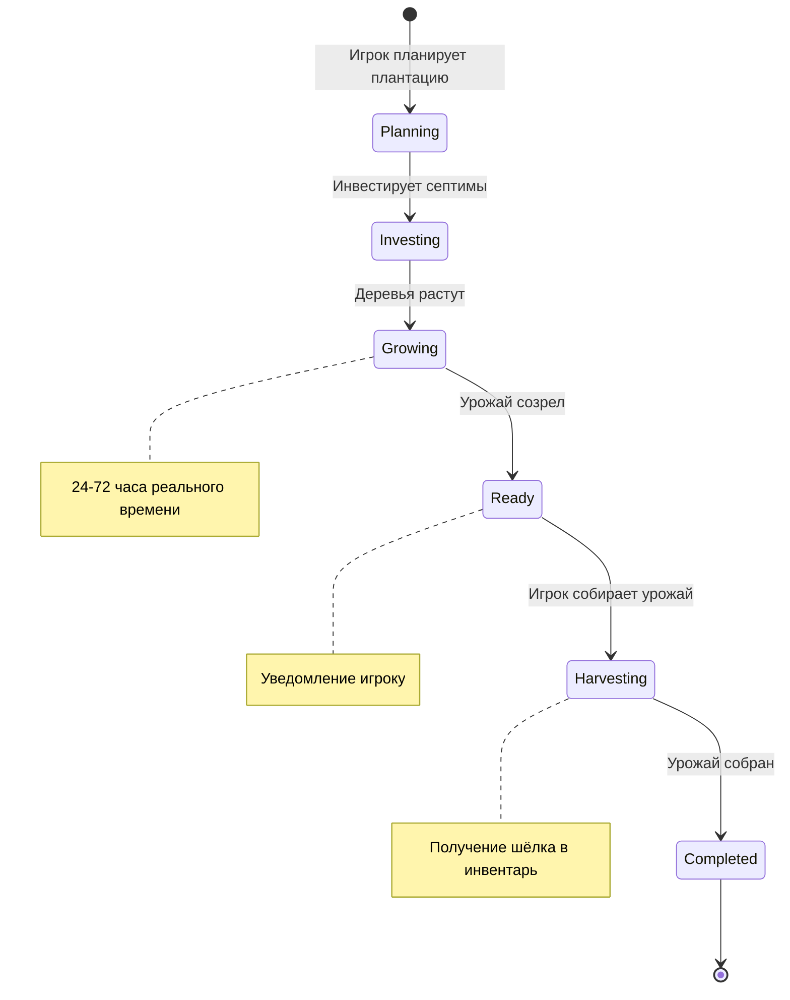
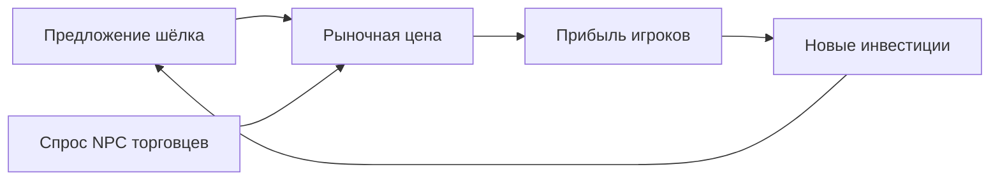
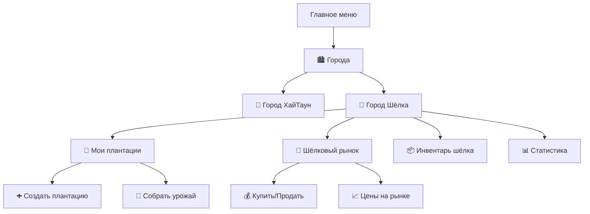

# Дизайн: Город Шёлка - Специализированный город для выращивания шёлка

## Обзор

Город Шёлка - это новая игровая локация в RELOAD боте, которая специализируется на выращивании и производстве шёлка. Игроки смогут инвестировать септимы в шёлковые плантации, управлять производством и торговать готовой продукцией. Эта функция расширяет экономическую систему бота, добавляя новый источник дохода и игровую механику.

### Основные цели
- Создать новый источник дохода для игроков через выращивание шёлка
- Расширить экономическую экосистему бота
- Добавить долгосрочную игровую механику с инвестициями
- Интегрировать с существующей системой септимов

## Архитектура

### Компонентная диаграмма


### Интеграция с существующей системой
- Использует существующую модель `Player` для хранения септимов
- Интегрируется с текущей экономической системой
- Следует паттерну Repository для доступа к данным
- Использует asyncio для асинхронных операций

## Модели данных

### SilkPlantation (Шёлковая плантация)


### Атрибуты моделей

#### SilkPlantation
- `id`: Уникальный идентификатор плантации
- `player_id`: Внешний ключ на игрока-владельца
- `plantation_name`: Название плантации (задается игроком)
- `silk_trees_count`: Количество шёлковых деревьев
- `planted_at`: Дата посадки
- `harvest_ready_at`: Дата готовности урожая
- `status`: Статус ('growing', 'ready', 'harvesting', 'completed')
- `investment_cost`: Стоимость инвестиции в септимах
- `expected_yield`: Ожидаемый урожай

#### SilkInventory
- `id`: Уникальный идентификатор записи
- `player_id`: Внешний ключ на игрока
- `silk_type`: Тип шёлка ('raw', 'refined', 'premium')
- `quantity`: Количество единиц
- `quality_grade`: Оценка качества (1.0-5.0)
- `produced_at`: Дата производства

#### SilkTransaction
- `id`: Уникальный идентификатор транзакции
- `seller_id`: ID продавца
- `buyer_id`: ID покупателя
- `transaction_type`: Тип операции ('buy', 'sell', 'trade')
- `amount`: Количество товара
- `price_per_unit`: Цена за единицу
- `created_at`: Дата транзакции

## Игровая механика

### Жизненный цикл шёлковой плантации


### Экономическая модель

#### Инвестиционные уровни
| Уровень | Стоимость (септимы) | Деревья | Время роста | Ожидаемый доход |
|---------|-------------------|---------|-------------|----------------|
| Starter | 1,000 | 10 | 24 часа | 1,200-1,400 |
| Standard | 5,000 | 50 | 48 часов | 6,500-7,500 |
| Premium | 15,000 | 150 | 72 часа | 20,000-25,000 |
| Master | 50,000 | 500 | 96 часов | 70,000-90,000 |

#### Факторы, влияющие на доходность
- Качество семян (случайный модификатор 0.8-1.2)
- Погодные условия (случайный модификатор 0.9-1.1)
- Уровень VIP игрока (бонус +5-20%)
- Опыт игрока в выращивании (накопительный бонус)

### Торговая система

#### Типы шёлка и их стоимость
- **Сырой шёлк**: Базовая стоимость, получается после сбора урожая
- **Рафинированный шёлк**: +30% к стоимости, требует обработки
- **Премиум шёлк**: +60% к стоимости, редкий тип с низкой вероятностью

#### Рыночная динамика


## Пользовательский интерфейс

### Интеграция в меню городов

Город Шёлка интегрируется в существующее меню городов бота как новая локация. Вместо отдельных команд используется система inline кнопок для навигации.

#### Навигационная структура


### Интерфейс сообщений

#### Меню выбора городов
```
🏙️ Города
Выберите город:

[🏰 Город ХайТаун] [🧵 Город Шёлка]
               [🔙 В меню]
```

#### Главное меню Города Шёлка
```
🧵 **ГОРОД ШЁЛКА** 🧵

🌳 Ваши плантации: 3 активных
📦 Шёлковый инвентарь: 150 единиц
💰 Доступно септимов: 25,000

[🌳 Мои плантации] [🏪 Шёлковый рынок]
[📦 Инвентарь шёлка] [📊 Статистика]

       [🔙 К городам] [🔙 В меню]
```

#### Статус плантации
```
🌳 **Плантация "Изумрудная долина"**

📊 Статус: 🌱 Растёт (67% готовности)
⏱️ До сбора: 8 часов 23 минуты
🌲 Деревьев: 50 шт.
💰 Инвестировано: 5,000 септимов
📈 Ожидаемый доход: 6,800-7,200 септимов

🔄 Прогресс: ████████████░░░░ 75%

    [🌾 Собрать урожай] [💧 Полить]
    [🔙 К плантациям] [🔙 В меню]
```

### Callback Data схема

#### Основные callback данные
- `city_silk` - Главное меню Города Шёлка
- `silk_plantations` - Мои плантации
- `silk_market` - Шёлковый рынок
- `silk_inventory` - Инвентарь шёлка
- `silk_stats` - Статистика
- `silk_create_plantation` - Создать плантацию
- `silk_harvest_{plantation_id}` - Собрать урожай с плантации
- `silk_buy_{item_type}_{quantity}` - Купить товары
- `silk_sell_{item_type}_{quantity}` - Продать товары
- `silk_plant_{level}` - Посадить плантацию уровня

#### Навигационные callback данные
- `cities_menu` - Возврат к списку городов
- `menu` - Возврат в главное меню

## Интеграция с существующими системами

### Экономическая интеграция
- Использует септимы как основную валюту
- Интегрируется с системой VIP для бонусов
- Совместима с существующими экономическими механиками
- Добавляет новый источник дохода наряду с энергетиками

### Техническая интеграция
- Использует существующую архитектуру базы данных
- Следует паттернам кодирования проекта
- Интегрируется с системой уведомлений
- Использует общие утилиты и константы
- Добавляется в `button_handler` функцию для обработки callback данных
- Интегрируется в функцию `show_cities_menu` как новая кнопка
- Следует паттерну inline клавиатур существующих городов

### Добавление в button_handler

В функцию `button_handler` в `Bot_new.py` нужно добавить обработку новых callback данных:

```python
# Добавить после существующих обработчиков городов
elif data == 'city_silk':
    await show_city_silk(update, context)
elif data == 'silk_plantations':
    await show_silk_plantations(update, context)
elif data == 'silk_market':
    await show_silk_market(update, context)
elif data == 'silk_inventory':
    await show_silk_inventory(update, context)
elif data == 'silk_stats':
    await show_silk_stats(update, context)
elif data.startswith('silk_plant_'):
    level = data.split('_')[-1]
    await handle_silk_plant(update, context, level)
elif data.startswith('silk_harvest_'):
    plantation_id = int(data.split('_')[-1])
    await handle_silk_harvest(update, context, plantation_id)
```

### Модификация show_cities_menu

В функцию `show_cities_menu` нужно добавить кнопку для Города Шёлка:

```python
keyboard = [
    [InlineKeyboardButton("🏰 Город ХайТаун", callback_data='city_hightown')],
    [InlineKeyboardButton("🧵 Город Шёлка", callback_data='city_silk')],
    [InlineKeyboardButton("🔙 В меню", callback_data='menu')],
]
```

### Функции обработки

Основные функции, которые нужно создать:

- `show_city_silk(update, context)` - Главное меню Города Шёлка
- `show_silk_plantations(update, context)` - Показ плантаций игрока
- `show_silk_market(update, context)` - Шёлковый рынок
- `show_silk_inventory(update, context)` - Инвентарь шёлка
- `show_silk_stats(update, context)` - Статистика города
- `handle_silk_plant(update, context, level)` - Обработка создания плантации
- `handle_silk_harvest(update, context, plantation_id)` - Обработка сбора урожая
- `handle_silk_buy(update, context, item_type, quantity)` - Обработка покупки
- `handle_silk_sell(update, context, item_type, quantity)` - Обработка продажи

## Тестирование
- Тестирование моделей данных
- Тестирование бизнес-логики расчётов
- Тестирование интеграции с экономической системой
- Валидация игровой механики

### Интеграционное тестирование
- Тестирование команд бота
- Проверка уведомлений
- Тестирование транзакций
- Валидация рыночной динамики

### Тестовые сценарии
1. **Создание плантации**: Игрок инвестирует септимы и создаёт плантацию
2. **Рост урожая**: Система отслеживает время роста и уведомляет о готовности
3. **Сбор урожая**: Игрок собирает урожай и получает шёлк в инвентарь
4. **Торговля**: Игрок продаёт шёлк на рынке и получает прибыль
5. **Реинвестиция**: Игрок использует прибыль для создания новых плантаций