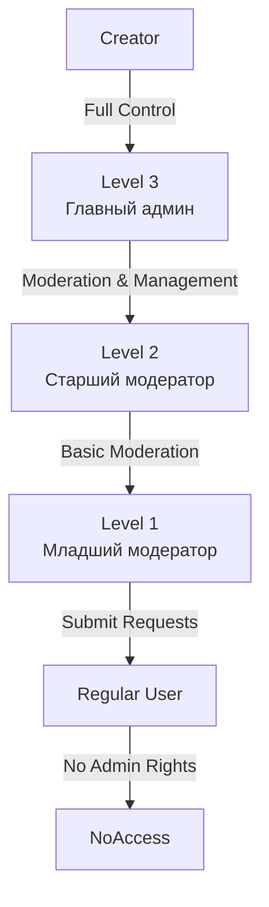
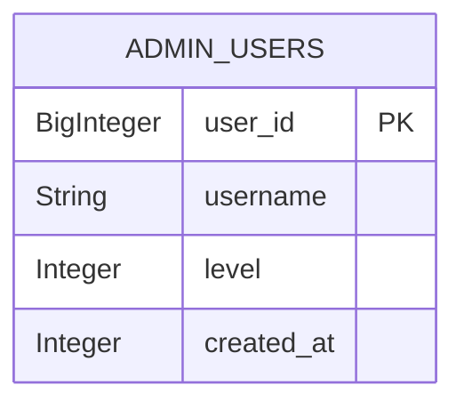

# Administrative Permissions and Role-Based Access Control

<cite>
**Referenced Files in This Document**   
- [admin.py](file://admin.py)
- [admin2.py](file://admin2.py)
- [database.py](file://database.py)
- [constants.py](file://constants.py)
</cite>

## Table of Contents
1. [Introduction](#introduction)
2. [Hierarchical Permission Model](#hierarchical-permission-model)
3. [Role Definitions and Escalation Paths](#role-definitions-and-escalation-paths)
4. [Permission Enforcement Implementation](#permission-enforcement-implementation)
5. [Command Access Restrictions by Role](#command-access-restrictions-by-role)
6. [Database Schema and AdminUser Model](#database-schema-and-adminuser-model)
7. [Integration with Constants](#integration-with-constants)
8. [Security Considerations](#security-considerations)
9. [Audit Logging and Moderation Logs](#audit-logging-and-moderation-logs)
10. [Adding and Modifying Admin Roles](#adding-and-modifying-admin-roles)
11. [Practical Examples](#practical-examples)
12. [Conclusion](#conclusion)

## Introduction

The EnergoBot system implements a comprehensive role-based access control (RBAC) framework across its administrative interface, primarily managed through the `admin.py` and `admin2.py` modules. This system enforces strict permission hierarchies to ensure secure and controlled access to sensitive operations within the bot's ecosystem. The RBAC model is built around three distinct administrative levels, supplemented by a special "Creator" role derived from configuration constants. This documentation details the architecture, implementation, and operational procedures of this access control system, providing administrators with the knowledge required to manage roles effectively while maintaining system integrity and security.

**Section sources**
- [admin.py](file://admin.py#L1-L184)
- [admin2.py](file://admin2.py#L1-L771)

## Hierarchical Permission Model

The administrative permission model in EnergoBot is a tiered hierarchy designed to delegate responsibilities while maintaining centralized control over critical operations. This model consists of four distinct roles: Creator, Level 3 (Главный админ), Level 2 (Старший модератор), and Level 1 (Младший модератор). The hierarchy is strictly enforced, with higher-level roles possessing all permissions of lower levels, plus additional exclusive capabilities. This structure ensures that sensitive operations, such as managing other administrators or modifying system-wide configurations, are restricted to the most trusted roles. The model is implemented through a combination of database-stored user levels and configuration-based bootstrap accounts, creating a robust and flexible access control system. The permission checks are performed at the command level, with each administrative command verifying the caller's role before execution, thereby preventing unauthorized access to protected functionality.



**Diagram sources**
- [admin.py](file://admin.py#L1-L184)
- [admin2.py](file://admin2.py#L1-L771)

**Section sources**
- [admin.py](file://admin.py#L1-L184)
- [admin2.py](file://admin2.py#L1-L771)

## Role Definitions and Escalation Paths

The system defines four distinct administrative roles, each with specific responsibilities and capabilities. The **Creator** role is a special bootstrap role defined in `constants.py` and is not stored in the database. Users with usernames matching those in the `ADMIN_USERNAMES` constant possess the highest level of authority, equivalent to or exceeding Level 3. The **Level 3 (Главный админ)** role is the highest database-stored administrative level, responsible for managing other administrators and accessing financial records. **Level 2 (Старший модератор)** can approve or reject deletion requests and handle more complex moderation tasks, while **Level 1 (Младший модератор)** can submit and approve addition requests but cannot manage other administrators. Escalation between these roles is strictly controlled; only the Creator or a Level 3 administrator can promote or demote other administrators. This ensures that the integrity of the administrative hierarchy is maintained and prevents unauthorized privilege escalation. The system also provides clear feedback to users attempting actions beyond their permission level, enhancing security and user experience.

**Section sources**
- [admin.py](file://admin.py#L1-L184)
- [admin2.py](file://admin2.py#L1-L771)
- [constants.py](file://constants.py#L1-L75)

## Permission Enforcement Implementation

Permission enforcement is implemented through a combination of database queries and configuration checks, primarily using the `is_admin()` and `is_super_admin()` patterns (represented by `is_admin()` and `_is_creator_or_lvl3()` functions). The `is_admin()` function in `database.py` performs a direct database query against the `AdminUser` table to verify if a user ID exists, returning a boolean result. This check is used for basic administrative access. For higher-level permissions, the `_is_creator_or_lvl3()` helper function in `admin2.py` combines a configuration check (verifying the user's username against `ADMIN_USERNAMES`) with a database query to retrieve the user's level. This dual-check mechanism ensures that both bootstrap creators and database-managed Level 3 administrators can access privileged commands. The implementation uses a decorator-like pattern within command handlers, where the permission check is performed at the beginning of each function, and execution is terminated with an error message if the check fails. This pattern is consistently applied across all administrative commands, ensuring uniform security enforcement.

```mermaid
sequenceDiagram
participant User
participant Command as admin_command()
participant DB as database.py
participant Constants as constants.py
User->>Command : Execute /admin add
Command->>DB : is_admin(user.id)
DB-->>Command : Return True/False
alt Not Admin
Command->>User : Reply "Нет прав"
deactivate Command
else Is Admin
Command->>Constants : Check user.username in ADMIN_USERNAMES
Constants-->>Command : Return True/False
Command->>DB : get_admin_level(user.id)
DB-->>Command : Return level (1-3)
alt Can Manage Admins
Command->>DB : add_admin_user()
DB-->>Command : Return success
Command->>User : Reply "Добавлен"
else Cannot Manage
Command->>User : Reply "Нет прав : требуется уровень 3 или Создатель."
end
end
```

**Diagram sources**
- [admin.py](file://admin.py#L1-L184)
- [database.py](file://database.py#L2430-L2470)
- [constants.py](file://constants.py#L1-L75)

**Section sources**
- [admin.py](file://admin.py#L1-L184)
- [database.py](file://database.py#L2430-L2470)
- [constants.py](file://constants.py#L1-L75)

## Command Access Restrictions by Role

Administrative commands are meticulously restricted based on user roles, ensuring that sensitive operations are only accessible to appropriately privileged users. The `/admin` command provides a dynamic help menu that displays only the commands the user is authorized to use. Basic commands like `/admin list`, `/requests`, `/add`, `/delrequest`, and `/editdrink` are available to all administrators (Levels 1-3) and the Creator. Commands for managing other administrators (`/admin add`, `/admin remove`, `/admin level`) are restricted to the Creator and Level 3 administrators only. In `admin2.py`, the `/admin2` command and its associated suite of privileged commands (e.g., `/receipt`, `/verifyreceipt`, `/stock`, `/tgstock`, `/addvip`, `/addautosearch`) are exclusively available to the Creator and Level 3 administrators. Some commands, like `/addvip` and `/addautosearch`, have additional logic to apply changes to all users, further emphasizing the power delegated to these top-tier roles. This granular restriction ensures that the principle of least privilege is upheld throughout the system.

**Section sources**
- [admin.py](file://admin.py#L1-L184)
- [admin2.py](file://admin2.py#L1-L771)

## Database Schema and AdminUser Model

The administrative roles are underpinned by the `AdminUser` model defined in `database.py`, which represents the core data structure for the RBAC system. This model is mapped to the `admin_users` table in the SQLite database and contains four primary fields: `user_id` (the primary key, stored as a BigInteger), `username` (a String for the user's Telegram handle), `level` (an Integer with a default value of 1, representing the administrative tier), and `created_at` (an Integer storing the Unix timestamp of when the admin was added). The `level` field is critical to the permission model, with values 1, 2, and 3 corresponding to Младший модератор, Старший модератор, and Главный админ, respectively. The database functions `add_admin_user()`, `remove_admin_user()`, `get_admin_level()`, and `is_admin()` provide the CRUD operations and query logic necessary to manage and verify administrative status. This schema design allows for efficient lookups and updates, forming a reliable foundation for the entire access control system.



**Diagram sources**
- [database.py](file://database.py#L78-L83)

**Section sources**
- [database.py](file://database.py#L78-L83)

## Integration with Constants

The RBAC system integrates with the `constants.py` module to define bootstrap administrative accounts, creating a hybrid permission model that combines configuration-based and database-managed roles. The `ADMIN_USERNAMES` constant is a set containing the usernames of the system's creators (e.g., `{'aAntiLoxX'}`). These usernames are not stored in the `admin_users` table but are granted the highest level of authority through direct code checks. This integration is evident in functions like `_is_creator_or_lvl3()` in `admin2.py`, which first checks if the user's username is in `ADMIN_USERNAMES` before querying the database for their level. This design allows for a "super-admin" role that exists outside the standard administrative hierarchy, providing a backdoor for system recovery or emergency management. The use of a configuration file for these critical bootstrap accounts ensures that the highest level of access is defined at deployment time and is not subject to runtime modification by even the highest database-stored administrators.

**Section sources**
- [admin.py](file://admin.py#L1-L184)
- [admin2.py](file://admin2.py#L1-L771)
- [constants.py](file://constants.py#L1-L75)

## Security Considerations

The RBAC implementation incorporates several key security principles to protect the system from unauthorized access and privilege escalation. The most critical is **privilege separation**, which ensures that no single administrator (except the Creator) has complete control over the system. For example, while a Level 3 administrator can manage other admins, they cannot directly modify the `ADMIN_USERNAMES` constant. The system also employs **defense in depth** by combining database checks with configuration checks for the highest privileges. **Input validation** is performed on all command arguments, such as ensuring user IDs are integers and levels are within the valid range (1-3). The system avoids storing sensitive information like passwords, relying instead on Telegram's user ID and username for authentication. A significant security consideration is the reliance on username matching for the Creator role; if a malicious user changes their username to match one in `ADMIN_USERNAMES`, they could gain elevated privileges. This risk is mitigated by the fact that the Creator role is intended for a small, trusted group, and the username is a relatively stable identifier on Telegram.

**Section sources**
- [admin.py](file://admin.py#L1-L184)
- [admin2.py](file://admin2.py#L1-L771)
- [constants.py](file://constants.py#L1-L75)

## Audit Logging and Moderation Logs

The system includes a robust audit logging mechanism to track all administrative actions, providing accountability and a trail for forensic analysis. The `ModerationLog` model in `database.py` records key events such as `admin_add`, `admin_remove`, `admin_level_change`, `approve_add`, `reject_add`, and `create_edit_request`. Each log entry captures the timestamp (`ts`), the actor's user ID (`actor_id`), the action performed (`action`), and optional details (`details`) such as the target user ID or the new level assigned. These logs are inserted into the database within try-except blocks in the command handlers (e.g., in `admin.py` after `add_admin_user()` or `set_admin_level()`), ensuring that the primary operation is not blocked by a logging failure. This design provides a reliable record of administrative activity, which is crucial for maintaining trust and security in a multi-administrator environment. The logs can be used to review past decisions, identify potential misuse, and understand the history of changes to the system.

**Section sources**
- [admin.py](file://admin.py#L1-L184)
- [database.py](file://database.py#L158-L173)

## Adding and Modifying Admin Roles

Adding and modifying administrative roles is a privileged operation restricted to the Creator and Level 3 administrators. The process is initiated through the `/admin add`, `/admin remove`, and `/admin level` commands. To add a new administrator, the command requires the target user's ID (obtained via reply to a message or direct input) and optionally their username and desired level (defaulting to Level 1). The system first verifies the caller's permission level, then calls the `add_admin_user()` function in `database.py`, which either creates a new `AdminUser` record or updates an existing one. Modifying a user's level is done with the `/admin level` command, which similarly checks permissions before calling `set_admin_level()`. The system automatically updates the stored username by querying the Telegram API if a reply is used, ensuring the database remains current. This process is idempotent, meaning that adding an existing admin or setting an existing level will not cause an error but will update the username if necessary.

**Section sources**
- [admin.py](file://admin.py#L1-L184)
- [database.py](file://database.py#L2430-L2470)

## Practical Examples

Practical examples of the RBAC system in action include the use of the `/admin` command to list all administrators, where the output is dynamically filtered and sorted based on the viewer's role. A Level 1 administrator will see a list of admins but will not have the option to add or remove them. In contrast, a Level 3 administrator will see the full management commands in the help text. Another example is the `/addautosearch` command in `admin2.py`, which can only be executed by the Creator or a Level 3 administrator. This command allows granting temporary boosts to users' daily search limits, a powerful feature that could be abused if available to lower-level admins. The command includes comprehensive input validation, checking that the count and days are positive integers, and provides detailed feedback upon success or failure. The system also demonstrates safe modification practices by using database transactions and rollback mechanisms in functions like `addvip_command`, ensuring data consistency even if an error occurs during batch operations.

**Section sources**
- [admin.py](file://admin.py#L1-L184)
- [admin2.py](file://admin2.py#L1-L771)

## Conclusion

The role-based access control system in EnergoBot provides a secure and scalable framework for managing administrative privileges. By implementing a clear hierarchical model with distinct roles, integrating configuration-based bootstrap accounts, and enforcing permissions through consistent database queries, the system effectively balances operational flexibility with security. The use of audit logging ensures accountability, while the well-defined escalation paths prevent unauthorized privilege changes. Administrators can confidently manage the system, knowing that sensitive operations are protected and that all actions are recorded. Future enhancements could include a more formal `is_super_admin()` function and additional safeguards for the Creator role, but the current implementation provides a solid foundation for secure bot administration.