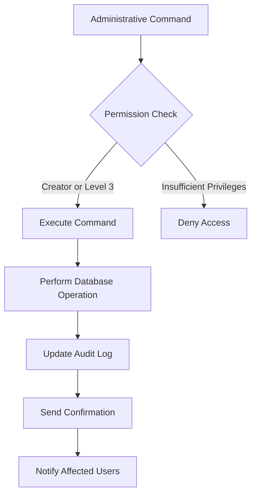
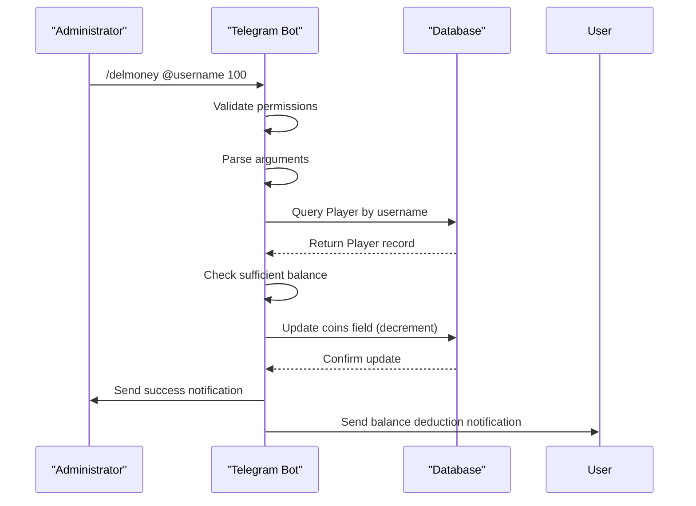
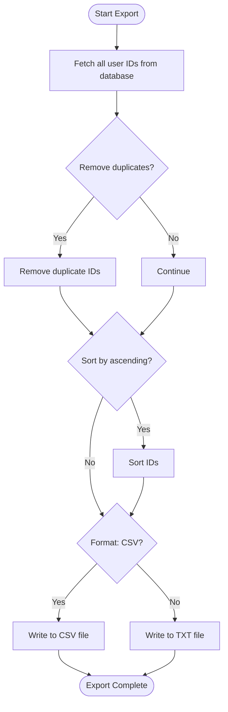
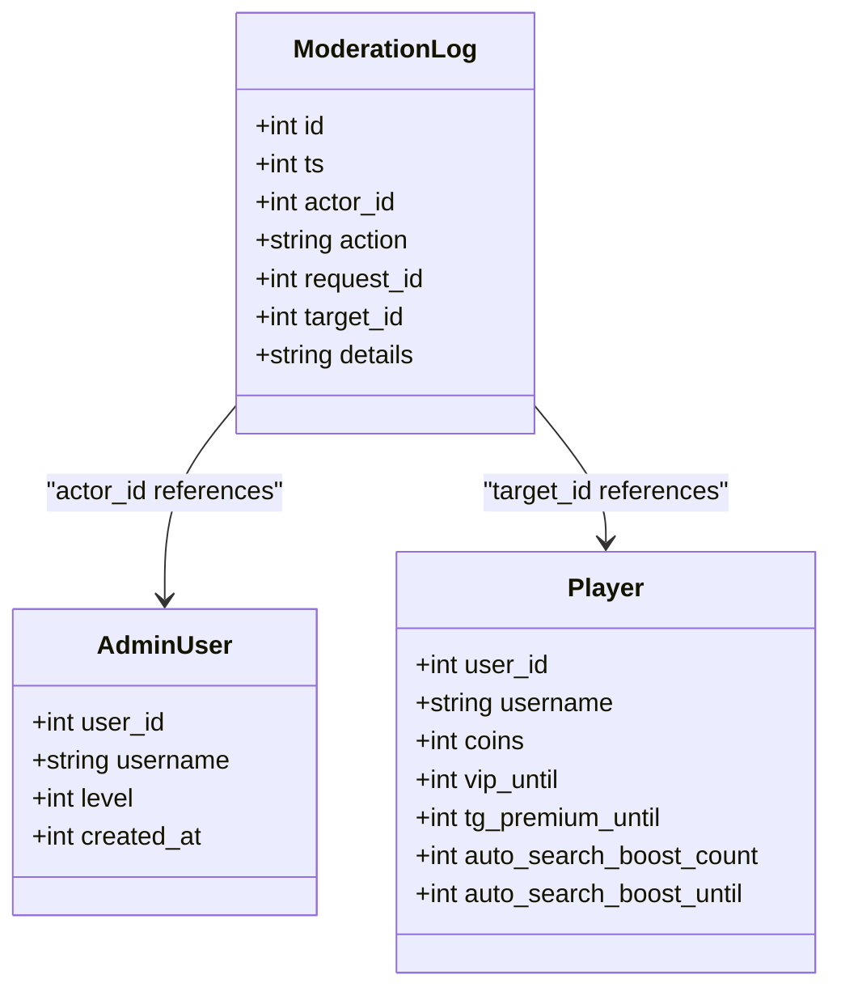
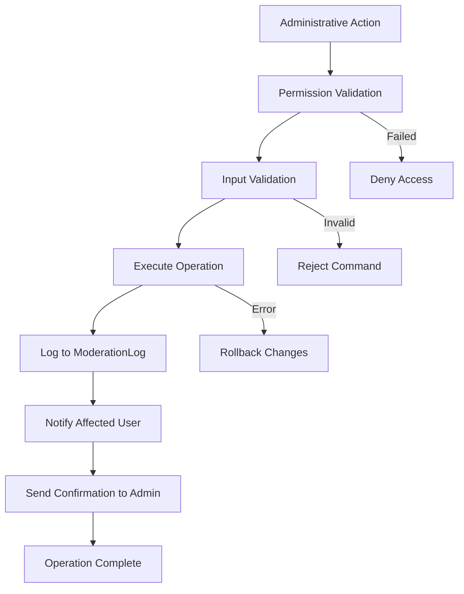

# Administrative User Management

<cite>
**Referenced Files in This Document**   
- [admin2.py](file://admin2.py) - *Updated in recent commit*
- [database.py](file://database.py) - *Updated in recent commit*
- [export_user_ids.py](file://export_user_ids.py)
- [constants.py](file://constants.py)
- [Bot_new.py](file://Bot_new.py) - *Contains related command implementation*
</cite>

## Update Summary
**Changes Made**   
- Added documentation for the new `/delmoney` command for deducting coins from user accounts
- Updated the User Data Modification Operations section to include balance deduction functionality
- Enhanced security and audit mechanisms to reflect coin removal operations
- Added new sequence diagram for the `/delmoney` command workflow
- Updated section sources to reflect changes in admin2.py and database.py

**Table of Contents**
1. [Introduction](#introduction)
2. [Administrative Command Structure](#administrative-command-structure)
3. [User Data Modification Operations](#user-data-modification-operations)
4. [Data Export and Compliance](#data-export-and-compliance)
5. [Security and Audit Mechanisms](#security-and-audit-mechanisms)
6. [Safeguards Against Misuse](#safeguards-against-misuse)

## Introduction
This document details the administrative user management capabilities implemented in the EnergoBot system, focusing on the privileged operations available through the admin2.py module. The system provides comprehensive tools for administrators to view, modify, and export user data while maintaining strict security controls and audit trails. The administrative framework is designed to support both individual user management and bulk operations, with particular emphasis on balance adjustments, VIP status management, inventory modifications, and data compliance requirements. The system implements a hierarchical permission model that restricts sensitive operations to appropriately authorized personnel.

## Administrative Command Structure

The administrative command structure in admin2.py implements a tiered permission system that differentiates between Creator-level privileges and Level 3 administrator capabilities. Commands are accessible through Telegram bot interactions and require proper authentication before execution. The system validates administrative privileges by checking both the user's username against the ADMIN_USERNAMES constant in constants.py and their database-stored admin level. This dual verification mechanism ensures that only authorized personnel can execute sensitive operations. The command interface is designed to be intuitive, with clear usage instructions provided through the /admin2 command, which displays all available privileged operations and their proper syntax.

**Diagram sources**
- [admin2.py](file://admin2.py#L112-L149)
- [constants.py](file://constants.py#L74)

**Section sources**
- [admin2.py](file://admin2.py#L1-L50)
- [constants.py](file://constants.py#L74)

## User Data Modification Operations

The system provides several commands for modifying user data through the Player model in the database. These operations include balance adjustments, VIP status changes, and inventory modifications, all implemented with proper validation and error handling. The addvip_command function allows administrators to grant VIP status to individual users or all users simultaneously, with the duration specified in days. The operation calculates the expiration timestamp by converting days to seconds and updating the vip_until field in the Player model. Similarly, the addautosearch_command enables administrators to grant additional auto-search boosts to users, increasing their daily search limit for a specified period.

The system now includes the `/delmoney` command, which allows the Creator to deduct coins from user accounts. This functionality complements the existing `/addcoins` command and provides complete balance management capabilities. When executing `/delmoney`, administrators must specify the amount to deduct and the target user (by user ID or @username). The system validates that the user has sufficient funds before processing the transaction and returns an appropriate error message if the balance would become negative.

**Diagram sources**
- [admin2.py](file://admin2.py#L300-L350)
- [database.py](file://database.py#L19-L38)
- [Bot_new.py](file://Bot_new.py#L4766-L4855)

**Section sources**
- [admin2.py](file://admin2.py#L300-L350)
- [database.py](file://database.py#L19-L38)
- [Bot_new.py](file://Bot_new.py#L4766-L4855)

## Data Export and Compliance

The system includes a dedicated data export functionality through the export_user_ids.py script, designed to support compliance requirements and data analysis needs. This standalone script extracts all user IDs from the database and exports them to a file in either CSV or TXT format. The export process includes options for sorting user IDs in ascending order and removing duplicates, ensuring data integrity and consistency. The script is designed to be run from the command line with configurable parameters for output file path, format, sorting, and deduplication. This functionality enables administrators to generate user lists for various purposes, including statistical analysis, communication campaigns, or regulatory compliance reporting.

**Diagram sources**
- [export_user_ids.py](file://export_user_ids.py#L40-L93)

**Section sources**
- [export_user_ids.py](file://export_user_ids.py#L40-L93)

## Security and Audit Mechanisms

The administrative system implements comprehensive security and audit mechanisms to ensure the integrity and traceability of all privileged operations. Every administrative action is logged in the database with details including the timestamp, actor ID, action type, and relevant details. The system maintains a hierarchical permission model where only the Creator (identified by username in ADMIN_USERNAMES) and Level 3 administrators can execute the most sensitive operations. All commands perform permission validation at execution time, preventing unauthorized access even if command syntax is known. The audit trail is stored in the ModerationLog table, which records critical information about each administrative action, enabling retrospective analysis and compliance verification.

The system now logs coin deduction operations with the action type 'remove_coins' in the ModerationLog table. This ensures that all balance modifications, whether additions or deductions, are properly tracked and auditable. The log entry includes the amount deducted and the target user ID, providing complete transparency for financial operations.

**Diagram sources**
- [database.py](file://database.py#L2430-L2470)
- [database.py](file://database.py#L19-L38)

**Section sources**
- [database.py](file://database.py#L2430-L2470)
- [admin.py](file://admin.py#L159-L183)
- [database.py](file://database.py#L2144-L2186)

## Safeguards Against Misuse

The system incorporates multiple safeguards to prevent misuse of administrative privileges and protect user data. These safeguards include permission validation, operation logging, and user notifications. When an administrator performs an action that affects a user, such as granting VIP status or removing a boost, the affected user receives a notification message through the Telegram bot. This transparency ensures that users are aware of changes to their account status. Additionally, the system implements parameter validation for all commands, preventing invalid inputs from causing unintended consequences. The hierarchical permission model restricts the most sensitive operations, such as adding or removing coins, to the Creator role only, minimizing the risk of unauthorized balance modifications.

The `/delmoney` command includes specific safeguards to prevent accidental or malicious balance depletion. The system checks that the user has sufficient funds before processing the transaction and returns a detailed error message if the requested amount exceeds the current balance. This prevents negative account balances and provides administrators with clear feedback about transaction failures.

**Diagram sources**
- [admin2.py](file://admin2.py#L300-L350)
- [database.py](file://database.py#L2430-L2470)

**Section sources**
- [admin2.py](file://admin2.py#L300-L350)
- [admin.py](file://admin.py#L159-L183)
- [database.py](file://database.py#L2430-L2470)