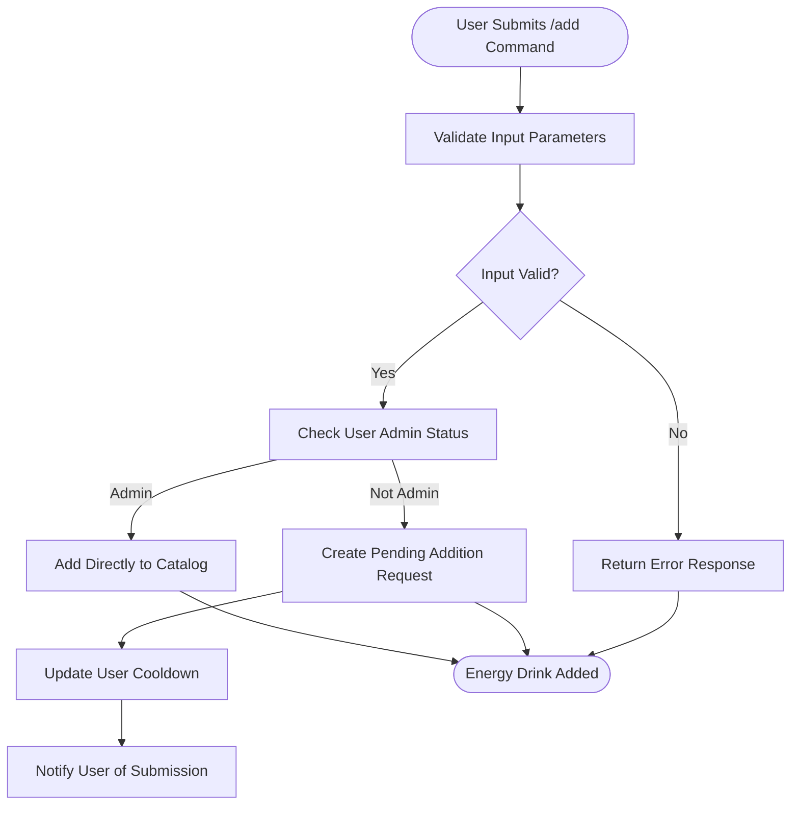
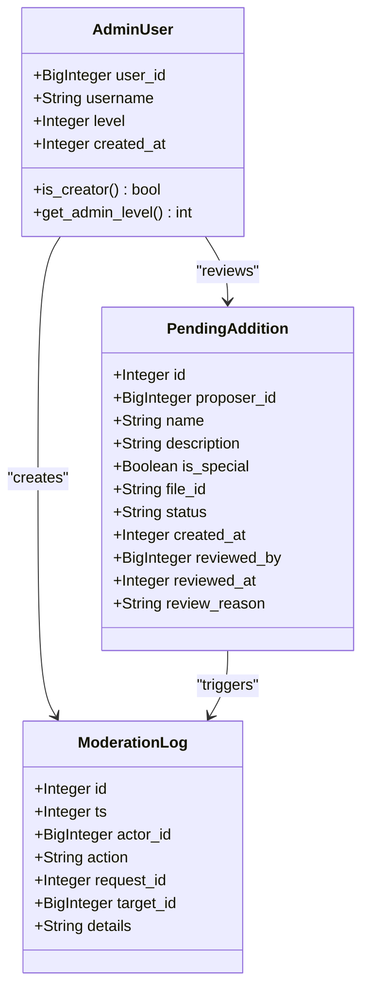
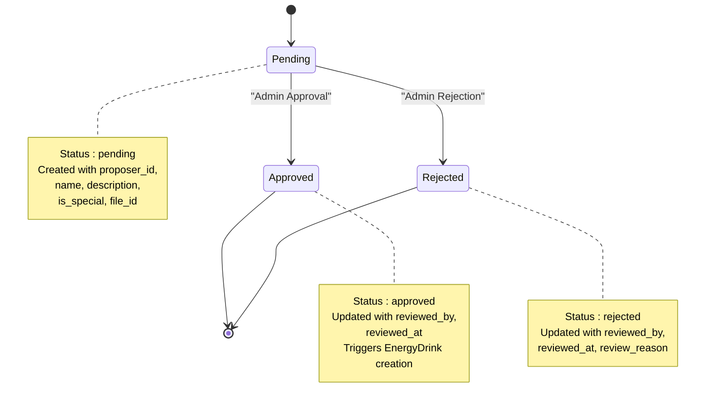
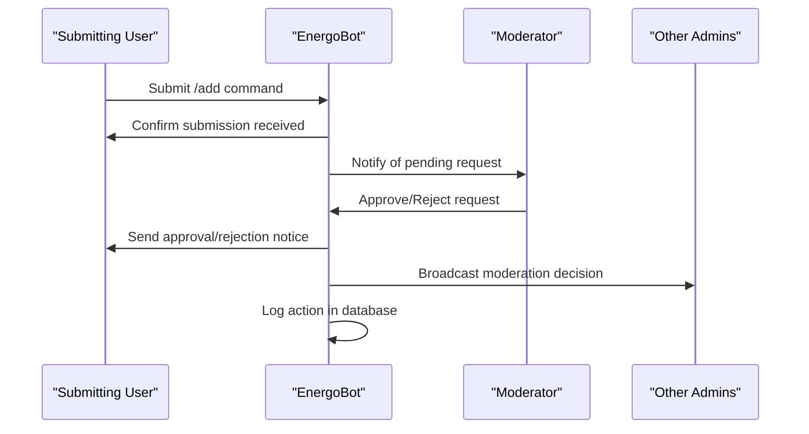

# Content Moderation Workflow

<cite>
**Referenced Files in This Document**   
- [admin.py](file://admin.py)
- [database.py](file://database.py)
- [Bot_new.py](file://Bot_new.py)
- [add_energy_drink_new.py](file://add_energy_drink_new.py)
- [constants.py](file://constants.py)
</cite>

## Table of Contents
1. [Introduction](#introduction)
2. [Submission Process](#submission-process)
3. [Moderation Interface](#moderation-interface)
4. [Database Transitions](#database-transitions)
5. [Notification Mechanisms](#notification-mechanisms)
6. [Validation Rules](#validation-rules)
7. [Image Handling Procedures](#image-handling-procedures)
8. [Integration with EnergyDrink Catalog](#integration-with-energydrink-catalog)
9. [Common Issues and Best Practices](#common-issues-and-best-practices)
10. [Conclusion](#conclusion)

## Introduction
This document details the content moderation workflow for user-submitted energy drinks in the EnergoBot system. The process begins with a user submitting a new energy drink via the `/add` command and concludes with administrators approving or rejecting the submission. The workflow involves several components including database management, administrative interfaces, notification systems, and integration with the existing EnergyDrink catalog. This comprehensive guide explains each step of the moderation lifecycle, highlighting key functions, data models, and best practices for maintaining content quality and system integrity.

**Section sources**
- [admin.py](file://admin.py#L1-L184)
- [database.py](file://database.py#L1-L3060)
- [Bot_new.py](file://Bot_new.py#L1-L5000)

## Submission Process
The submission process for new energy drinks is initiated through the `/add` command, which can be used by both regular users and administrators. When a user submits a new energy drink, the system creates a `PendingAddition` record in the database with the provided details including name, description, special status, and optional image. The submission includes validation checks to ensure required fields are present and properly formatted. For non-administrative users, submissions enter a moderation queue where they await review by authorized personnel. Administrators have the privilege to add energy drinks directly without moderation. The submission process also enforces cooldown periods to prevent spam and ensure fair usage of the system.

**Diagram sources**
- [Bot_new.py](file://Bot_new.py#L4141-L4171)
- [database.py](file://database.py#L2573-L2604)

**Section sources**
- [Bot_new.py](file://Bot_new.py#L4141-L4171)
- [database.py](file://database.py#L2573-L2604)

## Moderation Interface
The moderation interface in `admin.py` provides administrators with tools to manage pending content submissions. Administrators access the moderation queue through the `/requests` command, which displays a list of pending additions, edits, and deletions with interactive buttons for approval or rejection. The interface implements role-based access control, where different administrative levels have varying permissions. Level 1 moderators can approve additions, while level 2+ or creators can reject submissions. The interface also includes administrative commands for managing moderator roles, viewing moderator lists, and checking energy drink details. When processing a request, the system prompts for rejection reasons using ForceReply, ensuring proper documentation of moderation decisions.

**Diagram sources**
- [admin.py](file://admin.py#L1-L184)
- [database.py](file://database.py#L74-L101)

**Section sources**
- [admin.py](file://admin.py#L1-L184)
- [database.py](file://database.py#L74-L101)

## Database Transitions
The database transitions for content moderation are managed through the `PendingAddition` model in `database.py`. When a user submits a new energy drink, a record is created in the `pending_additions` table with status set to 'pending'. Upon approval, the `mark_pending_as_approved` function updates the status to 'approved', records the reviewer ID and timestamp, and triggers the creation of a new `EnergyDrink` record. If rejected, the `mark_pending_as_rejected` function updates the status to 'rejected' and stores the rejection reason. The system maintains referential integrity through foreign key relationships and indexes for efficient querying. All moderation actions are logged in the `moderation_logs` table for audit purposes, capturing the actor, action type, request ID, and relevant details.

**Diagram sources**
- [database.py](file://database.py#L2606-L2653)
- [database.py](file://database.py#L2573-L2604)

**Section sources**
- [database.py](file://database.py#L2606-L2653)
- [database.py](file://database.py#L2573-L2604)

## Notification Mechanisms
The notification system ensures timely communication between users and administrators throughout the moderation process. When a submission is approved, the system sends a direct message to the proposer with a success notification. For rejections, users receive a message indicating their submission was declined, optionally including the moderator's reason. Administrators are notified of new pending requests through the `/requests` command interface. When a moderation decision is made, other administrators receive notifications about the action taken, promoting transparency and coordination among the moderation team. The system uses Telegram's messaging capabilities to deliver these notifications, with error handling to prevent failures from disrupting the moderation workflow.

**Diagram sources**
- [Bot_new.py](file://Bot_new.py#L4257-L4270)
- [Bot_new.py](file://Bot_new.py#L4310-L4335)

**Section sources**
- [Bot_new.py](file://Bot_new.py#L4257-L4270)
- [Bot_new.py](file://Bot_new.py#L4310-L4335)

## Validation Rules
The system enforces several validation rules during the approval process to maintain content quality and consistency. These rules include checking for duplicate names by querying the `EnergyDrink` table before approval, validating that required fields like name and description are not empty, and verifying that special status is properly designated. The moderation interface prevents self-approval, ensuring that users cannot approve their own submissions. Administrative actions are validated based on user roles, with only creators or level 3 administrators able to modify moderator levels. The system also validates image files to ensure they meet format requirements (PNG, JPG, JPEG) and size limitations before processing.

**Section sources**
- [database.py](file://database.py#L2606-L2653)
- [add_energy_drink_new.py](file://add_energy_drink_new.py#L39-L75)

## Image Handling Procedures
Image handling procedures are implemented to manage user-submitted images for new energy drinks. When a user includes an image in their submission, the system stores the Telegram file ID in the `PendingAddition` record. Upon approval, the system downloads the image using the Telegram Bot API, generates a unique filename based on timestamp and random number, and saves it to the `energy_images` directory. The relative path to the saved image is then stored in the `image_path` field of the `EnergyDrink` record. The system uses asynchronous file operations to prevent blocking during image processing. For local administration via `add_energy_drink_new.py`, images are selected through a GUI file dialog and copied directly to the images directory with their original filenames preserved.

**Section sources**
- [Bot_new.py](file://Bot_new.py#L4229-L4257)
- [add_energy_drink_new.py](file://add_energy_drink_new.py#L39-L75)

## Integration with EnergyDrink Catalog
The content moderation system integrates seamlessly with the existing EnergyDrink catalog. Approved submissions are added as new entries in the `energy_drinks` table, making them immediately available throughout the system. The integration ensures that new energy drinks are properly indexed and can be referenced by other system components such as the shop, inventory, and search functions. When a new energy drink is added, the system automatically creates corresponding seed types for plantation features if they don't already exist. The catalog maintains uniqueness constraints on energy drink names to prevent duplicates. The moderation system also supports editing existing catalog entries through the `PendingEdit` model, allowing for controlled updates to energy drink information.

**Section sources**
- [database.py](file://database.py#L2044-L2074)
- [database.py](file://database.py#L1981-L2018)

## Common Issues and Best Practices
Common issues in the content moderation system include spam submissions, duplicate entries, and delayed moderator response times. To address spam, the system implements cooldown periods between submissions and validates user input thoroughly. Duplicate entries are prevented through database uniqueness constraints and pre-approval checks. To mitigate slow response times, best practices include maintaining an adequate number of active moderators, setting clear response time expectations, and using the notification system to alert administrators of pending requests. Additional best practices include regularly reviewing moderation logs for consistency, providing clear rejection reasons to submitters, and ensuring all administrators understand their role-based permissions. The system should be monitored for edge cases such as image upload failures or database connection issues that could disrupt the moderation workflow.

**Section sources**
- [database.py](file://database.py#L2606-L2653)
- [admin.py](file://admin.py#L1-L184)

## Conclusion
The content moderation workflow for user-submitted energy drinks in EnergoBot provides a robust system for managing user-generated content while maintaining quality control. By combining a well-structured database schema, role-based access control, comprehensive notification mechanisms, and clear validation rules, the system ensures that new content is reviewed efficiently and consistently. The integration between user submissions, administrative interfaces, and the core catalog enables a seamless experience for both contributors and moderators. Following best practices for moderation, including timely responses and clear communication, helps maintain user engagement and trust in the system. Regular monitoring and refinement of the moderation process will ensure the continued quality and integrity of the energy drink catalog.