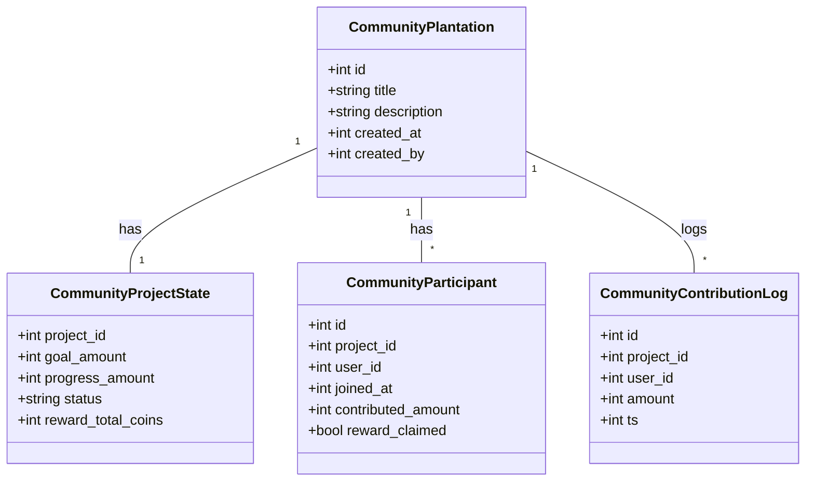
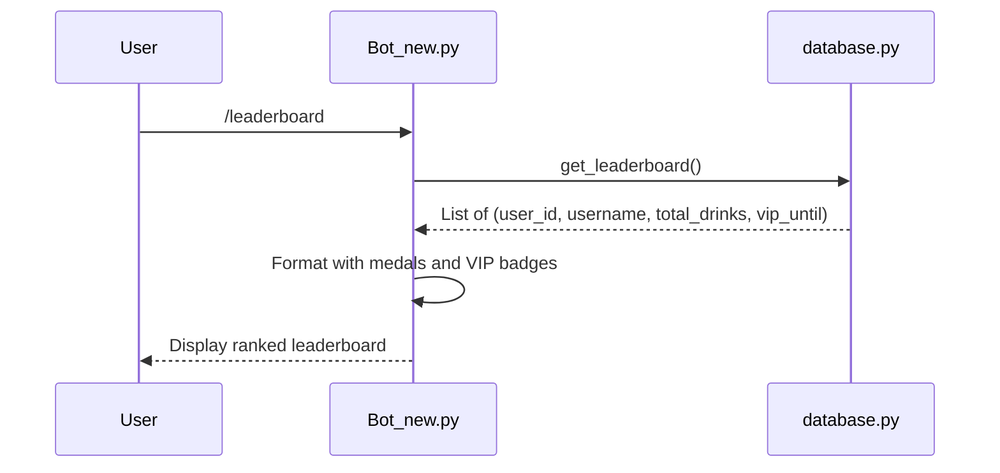
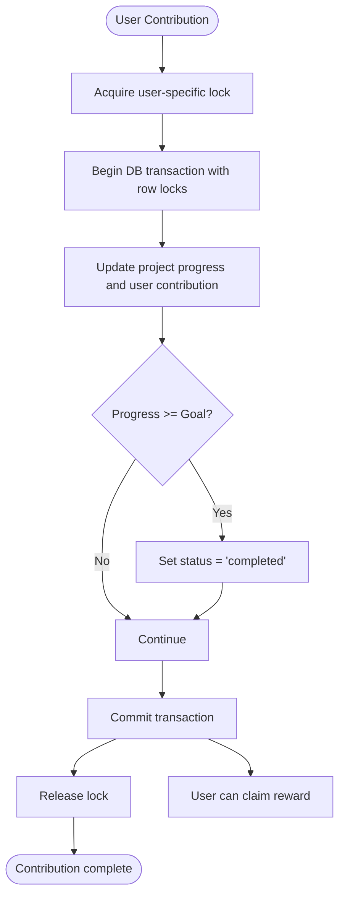

# Community Features

<cite>
**Referenced Files in This Document**   
- [Bot_new.py](file://Bot_new.py)
- [database.py](file://database.py)
</cite>

## Table of Contents
1. [Community Plantations and Collaborative Projects](#community-plantations-and-collaborative-projects)
2. [Leaderboards and User Recognition](#leaderboards-and-user-recognition)
3. [Shared State Management and Synchronization](#shared-state-management-and-synchronization)
4. [Integration with Core Collection and Economy](#integration-with-core-collection-and-economy)
5. [Common Issues and Solutions](#common-issues-and-solutions)

## Community Plantations and Collaborative Projects

The system implements community-oriented functionality through collaborative projects known as "Community Plantations." These projects allow multiple players to contribute toward a shared goal, tracked via the `CommunityProjectState` model in the database. Each project has a defined goal amount, progress tracking, status (active/completed), and a total coin reward pool.

Users can create new community plantations using the `create_community_plantation` function, which initializes both the project metadata (`CommunityPlantation`) and its state (`CommunityProjectState`). Players join projects via `join_community_project`, which ensures their participation is recorded in the `CommunityParticipant` table.

Contributions are made using the `contribute_to_community_project` function, where users spend coins to increase the project's progress. The contribution is logged in `CommunityContributionLog`, and the participant's individual contribution is updated atomically. When the project's progress reaches or exceeds the goal, the status automatically changes to "completed."

**Diagram sources**
- [database.py](file://database.py#L283-L345)

**Section sources**
- [database.py](file://database.py#L689-L722)
- [database.py](file://database.py#L769-L807)
- [database.py](file://database.py#L834-L874)

## Leaderboards and User Recognition

The leaderboard system ranks players based on their total collected energy drinks. The `show_leaderboard` command handler retrieves data via `db.get_leaderboard()` and formats it with HTML-safe usernames and VIP badges for visual distinction. The top three users receive gold, silver, and bronze medals respectively, while others are numbered.

VIP users are visually highlighted with a special emoji (`VIP_EMOJI`) next to their names, reinforcing status visibility. This leaderboard serves as a motivational tool, encouraging competition and engagement within the community.

**Diagram sources**
- [Bot_new.py](file://Bot_new.py#L3212-L3233)

**Section sources**
- [Bot_new.py](file://Bot_new.py#L3212-L3233)

## Shared State Management and Synchronization

To prevent race conditions during collaborative actions, the system employs atomic database operations with row-level locking using `with_for_update(read=False)`. This ensures that concurrent contributions to the same project are processed sequentially, maintaining data consistency.

For example, when a user contributes to a community project, the `CommunityProjectState` and `CommunityParticipant` records are updated within a single transaction. If the contribution completes the project, the status is atomically set to "completed," preventing over-contribution.

Additionally, the system uses asyncio locks (`_LOCKS`) to prevent double-click issues at the user level. Each user has a unique lock for actions like searching or contributing, ensuring only one operation proceeds at a time per user.

**Section sources**
- [database.py](file://database.py#L834-L874)
- [Bot_new.py](file://Bot_new.py#L0-L799)

## Integration with Core Collection and Economy

Community features are tightly integrated with the core collection system and economic model. Contributions require users to spend coins, which are part of the broader in-game economy driven by activities like finding energy drinks and claiming daily bonuses.

The reward distribution system is proportional: when a completed project's reward is claimed via `claim_community_reward`, each participant receives coins based on their contribution share relative to the total. This incentivizes early and consistent participation.

Moreover, the `Player` model tracks coins, VIP status, and other economic attributes that influence both individual gameplay and community interactions. For instance, VIP status affects cooldowns but does not directly alter contribution mechanics, maintaining fairness in collaborative efforts.

**Section sources**
- [database.py](file://database.py#L895-L968)
- [database.py](file://database.py#L834-L874)
- [Bot_new.py](file://Bot_new.py#L0-L799)

## Common Issues and Solutions

A common issue in collaborative features is inconsistent state updates due to concurrent access. Without proper synchronization, multiple users contributing simultaneously could result in lost updates or incorrect progress calculations.

The solution implemented uses **transactional integrity** and **atomic updates**:
- All critical operations use database transactions with `with_for_update()` to lock relevant rows.
- Application-level asyncio locks prevent duplicate submissions from the same user.
- The system validates state before and after updates, rolling back on exceptions.

Another potential issue is reward claiming after project completion. To prevent double claims, the `reward_claimed` flag in `CommunityParticipant` is updated atomically within the same transaction as the coin distribution.

These patterns ensure reliable, consistent behavior even under high concurrency, preserving the integrity of community-driven gameplay.

**Section sources**
- [database.py](file://database.py#L895-L968)
- [database.py](file://database.py#L834-L874)
- [Bot_new.py](file://Bot_new.py#L0-L799)