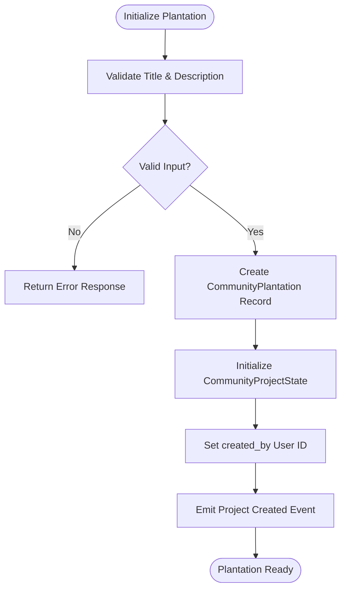
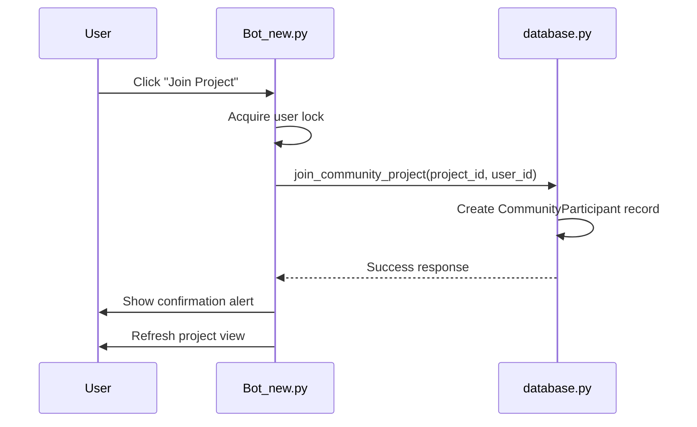
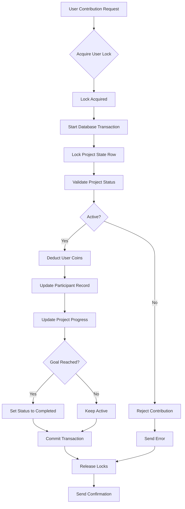

# Community Plantations

<cite>
**Referenced Files in This Document**   
- [Bot_new.py](file://Bot_new.py)
- [database.py](file://database.py)
- [constants.py](file://constants.py)
</cite>

## Table of Contents
1. [Introduction](#introduction)
2. [Plantation Initialization](#plantation-initialization)
3. [User Contribution Tracking](#user-contribution-tracking)
4. [Growth Mechanics and Synchronization](#growth-mechanics-and-synchronization)
5. [Command Handlers](#command-handlers)
6. [Data Models](#data-models)
7. [State Transitions and Reward Distribution](#state-transitions-and-reward-distribution)
8. [Integration with Inventory and Economy](#integration-with-inventory-and-economy)
9. [Race Condition Handling](#race-condition-handling)
10. [Configuration Options](#configuration-options)

## Introduction
The Community Plantation feature in the EnergoBot enables cooperative gameplay where users collectively contribute to shared agricultural projects. This system fosters community engagement by allowing players to join community-driven initiatives, contribute resources, and receive rewards upon project completion. The implementation integrates tightly with the bot's economy, inventory, and user progression systems, providing a dynamic and interactive experience.

**Section sources**
- [Bot_new.py](file://Bot_new.py#L1467-L1494)
- [database.py](file://database.py#L283-L309)

## Plantation Initialization
Community plantations are initialized through the `create_community_plantation` function in the database module. Each plantation is defined by a title, description, creator ID, contribution goal, and total reward pool. Upon creation, the system automatically initializes the project state with default values for progress tracking and reward distribution. Administrators can seed demonstration projects using the `handle_community_seed_demo` handler, which creates predefined community plantations for user engagement.



**Diagram sources**
- [database.py](file://database.py#L689-L722)
- [Bot_new.py](file://Bot_new.py#L1409-L1441)

**Section sources**
- [database.py](file://database.py#L689-L722)
- [Bot_new.py](file://Bot_new.py#L1409-L1441)

## User Contribution Tracking
User contributions are tracked through the `CommunityParticipant` and `CommunityContributionLog` data models. When a user joins a project via the `handle_community_join` command, a `CommunityParticipant` record is created or updated with their contribution history. Each monetary contribution is recorded in the `CommunityContributionLog` table, which maintains an immutable ledger of all transactions. The system updates the participant's `contributed_amount` field and increments the project's `progress_amount` in the `CommunityProjectState`.

```mermaid
erDiagram
COMMUNITY_PLANTATION ||--o{ COMMUNITY_PROJECT_STATE : "has"
COMMUNITY_PLANTATION ||--o{ COMMUNITY_PARTICIPANT : "has"
COMMUNITY_PLANTATION ||--o{ COMMUNITY_CONTRIBUTION_LOG : "logs"
COMMUNITY_PARTICIPANT ||--o{ COMMUNITY_CONTRIBUTION_LOG : "makes"
COMMUNITY_PLANTATION {
int id PK
string title
string description
int created_at
bigint created_by FK
}
COMMUNITY_PROJECT_STATE {
int project_id PK FK
int goal_amount
int progress_amount
string status
int reward_total_coins
}
COMMUNITY_PARTICIPANT {
int id PK
int project_id FK
bigint user_id
int joined_at
int contributed_amount
bool reward_claimed
}
COMMUNITY_CONTRIBUTION_LOG {
int id PK
int project_id FK
bigint user_id
int amount
int ts
}
```

**Diagram sources**
- [database.py](file://database.py#L283-L309)

**Section sources**
- [database.py](file://database.py#L283-L309)
- [Bot_new.py](file://Bot_new.py#L1830-L1847)

## Growth Mechanics and Synchronization
The community plantation system synchronizes growth mechanics across participants by using a centralized progress tracking model. The `CommunityProjectState` entity maintains the collective progress toward the contribution goal. As users contribute septims, the system atomically updates both individual contribution records and the global project progress. When the `progress_amount` reaches or exceeds the `goal_amount`, the project status automatically transitions to 'completed', unlocking reward distribution for all participants.

**Section sources**
- [database.py](file://database.py#L283-L309)
- [Bot_new.py](file://Bot_new.py#L1496-L1534)

## Command Handlers
The system implements several command handlers to manage community plantation interactions:

- `show_plantation_community`: Displays available community projects with join options
- `handle_community_join`: Processes user requests to join a specific project
- `handle_community_contrib`: Handles monetary contributions to active projects
- `show_community_project`: Shows detailed project information including progress bar
- `handle_community_seed_demo`: Allows administrators to create demo projects

These handlers follow a consistent pattern of input validation, state checking, database operations, and user feedback. Each handler uses callback queries to provide real-time interaction within the Telegram interface.



**Diagram sources**
- [Bot_new.py](file://Bot_new.py#L1467-L1494)
- [Bot_new.py](file://Bot_new.py#L1830-L1847)

**Section sources**
- [Bot_new.py](file://Bot_new.py#L1467-L1494)
- [Bot_new.py](file://Bot_new.py#L1830-L1847)

## Data Models
The community plantation feature relies on several key data models defined in `database.py`:

- `CommunityPlantation`: Stores project metadata including title, description, creation timestamp, and creator ID
- `CommunityProjectState`: Tracks project progress with goal amount, current progress, status, and total reward pool
- `CommunityParticipant`: Maintains per-user contribution data including amount contributed and reward claim status
- `CommunityContributionLog`: Provides an audit trail of all contributions with timestamps

These models are interconnected through foreign key relationships, ensuring data integrity and enabling efficient querying of project statistics and participant information.

**Section sources**
- [database.py](file://database.py#L283-L309)

## State Transitions and Reward Distribution
The system implements a state machine for community projects with two primary states: 'active' and 'completed'. Transitions occur when the `progress_amount` meets or exceeds the `goal_amount`. Upon completion, participants can claim their proportional share of the `reward_total_coins` based on their contribution percentage. The `reward_claimed` flag in the `CommunityParticipant` model prevents double claiming. The reward distribution logic ensures fair allocation while maintaining the integrity of the game economy.

**Section sources**
- [database.py](file://database.py#L283-L309)
- [Bot_new.py](file://Bot_new.py#L1496-L1534)

## Integration with Inventory and Economy
Community plantations integrate with the broader game economy by using septims as the contribution currency. When users contribute to a project, the system deducts septims from their balance in the `Player` model and records the transaction. Upon project completion, rewards are distributed as septims added to the player's coin balance. This seamless integration with the existing economic system allows for natural resource flow between different game features, including the inventory system where septims can be earned through energy drink sales.

**Section sources**
- [database.py](file://database.py#L810-L874)
- [Bot_new.py](file://Bot_new.py#L1849-L1870)

## Race Condition Handling
The system prevents race conditions during contribution through several mechanisms:

1. **Atomic Database Operations**: All contribution updates use `with_for_update(read=False)` to lock relevant rows during transaction processing
2. **User-Level Locks**: Each user action is protected by an asyncio lock using `_get_lock(f"user:{user.id}:community_contrib")`
3. **Transaction Management**: Database operations are wrapped in try-catch blocks with explicit rollback on exceptions
4. **State Validation**: The system checks project status before accepting contributions to prevent overfunding

These measures ensure that concurrent contributions from the same user or rapid successive actions do not result in inconsistent state or financial discrepancies.



**Diagram sources**
- [database.py](file://database.py#L810-L874)
- [Bot_new.py](file://Bot_new.py#L1849-L1870)

**Section sources**
- [database.py](file://database.py#L810-L874)
- [Bot_new.py](file://Bot_new.py#L1849-L1870)

## Configuration Options
The community plantation system is configured through parameters in `constants.py` that affect growth rates and yield calculations:

- `RECEIVER_PRICES`: Defines base prices for different rarity levels, affecting contribution amounts
- `SHOP_PRICES`: Determines market prices, influencing the economic balance of contributions
- `SHOP_PRICE_MULTIPLIER`: Controls the markup on energy drink purchases, indirectly affecting user wealth and contribution capacity

These configuration options allow administrators to tune the economic dynamics of the community plantation feature without modifying core game logic. The values are imported into both `Bot_new.py` and `database.py` to maintain consistency across the application.

**Section sources**
- [constants.py](file://constants.py#L60-L75)
- [database.py](file://database.py#L10-L11)
- [Bot_new.py](file://Bot_new.py#L45-L46)