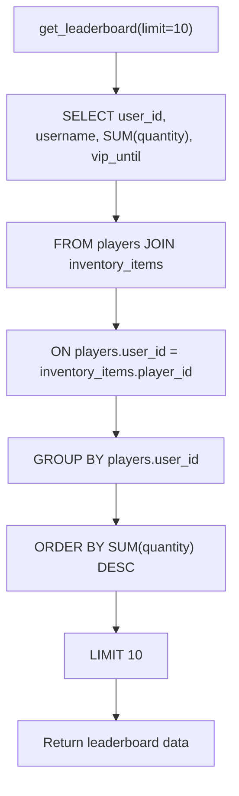

# Leaderboards and Rankings

<cite>
**Referenced Files in This Document**   
- [Bot_new.py](file://Bot_new.py)
- [database.py](file://database.py)
- [constants.py](file://constants.py)
</cite>

## Table of Contents
1. [Introduction](#introduction)
2. [Leaderboard Types and Metrics](#leaderboard-types-and-metrics)
3. [Database Queries and Aggregation](#database-queries-and-aggregation)
4. [Real-time Updates and Recalculation](#real-time-updates-and-recalculation)
5. [UI Integration and Display](#ui-integration-and-display)
6. [Performance Considerations](#performance-considerations)
7. [Tie-breaking and Sorting Logic](#tie-breaking-and-sorting-logic)
8. [Troubleshooting Common Issues](#troubleshooting-common-issues)

## Introduction
The leaderboard system in the EnergoBot application tracks player rankings based on their energy drink collection activities. The system integrates with the bot's core mechanics including VIP status, community participation, and periodic collection events. This document details the implementation of the leaderboard system, focusing on ranking calculations, database efficiency, real-time updates, and user interface integration.

**Section sources**
- [Bot_new.py](file://Bot_new.py#L4660-L4681)
- [database.py](file://database.py#L2915-L2935)

## Leaderboard Types and Metrics
The system implements a primary global leaderboard that ranks players by their total energy drink collections. The ranking calculation is based on the sum of all drink quantities in a player's inventory, retrieved from the database through an aggregation query. 

VIP status is integrated into the leaderboard display through a visual badge (👑) that appears next to players with active VIP subscriptions. This visual indicator enhances the competitive aspect without affecting the ranking calculation itself. The system does not currently implement separate leaderboard types for community features or weekly challenges, focusing instead on the cumulative collection metric.

The ranking data includes player usernames, total drink counts, and VIP expiration timestamps, which are used to determine badge visibility. The leaderboard displays the top performers with special medal emojis (🥇, 🥈, 🥉) for the first three positions, followed by numbered rankings for subsequent players.

**Section sources**
- [Bot_new.py](file://Bot_new.py#L4660-L4681)
- [database.py](file://database.py#L2915-L2935)

## Database Queries and Aggregation
The leaderboard data is retrieved through an optimized SQL query that performs server-side aggregation to ensure efficiency with large user bases. The `get_leaderboard` function in the database module executes a JOIN between the players and inventory_items tables, grouping results by user ID and ordering by the sum of inventory quantities in descending order.

**Diagram sources **
- [database.py](file://database.py#L2915-L2935)

The query leverages database indexing on the player_id column in the inventory_items table to optimize the JOIN operation. The result set is limited to the top 10 players by default, implementing pagination at the database level rather than in application code. This approach minimizes data transfer and memory usage, particularly important for bots with large player bases.

The system does not implement caching for leaderboard queries, meaning each request triggers a fresh database aggregation. For high-traffic scenarios, implementing a caching layer with periodic refresh intervals could improve performance.

**Section sources**
- [database.py](file://database.py#L2915-L2935)

## Real-time Updates and Recalculation
The leaderboard system updates in real-time as players collect energy drinks through the search functionality. When a player successfully finds a drink, the system immediately updates their inventory in the database, which automatically affects their position in subsequent leaderboard queries.

The recalculation process is event-driven rather than scheduled, meaning rankings are always current as of the last database transaction. When a player performs a search, the `_perform_energy_search` function adds the found drink to their inventory, which increments the quantity in the inventory_items table. This change is immediately reflected in future leaderboard queries without requiring any additional recalculation steps.

The system does not implement batch recalculation or periodic ranking updates, relying instead on the atomic nature of database transactions to maintain data consistency. This approach ensures that leaderboard data is always accurate, though it places the computational load on read operations rather than distributing it across periodic write operations.

**Section sources**
- [Bot_new.py](file://Bot_new.py#L4660-L4681)
- [database.py](file://database.py#L2915-L2935)

## UI Integration and Display
The leaderboard is integrated into the bot's user interface through the `show_leaderboard` command handler, which formats the ranking data into an HTML message for display in Telegram. The UI implementation includes several visual elements to enhance user experience:

- Medal emojis (🥇, 🥈, 🥉) for top three positions
- VIP badges (👑) for players with active subscriptions
- HTML formatting for bold text and proper username escaping
- Numbered rankings for positions beyond the top three

The display function processes the raw leaderboard data by iterating through the results and formatting each entry with appropriate visual indicators. Usernames are HTML-escaped to prevent injection issues, and VIP status is determined by comparing the current timestamp with the VIP expiration time stored in the database.

The UI does not implement pagination for the leaderboard, displaying only the top 10 players by default. This design choice prioritizes simplicity over comprehensive ranking visibility, encouraging competition for the highest positions.

**Section sources**
- [Bot_new.py](file://Bot_new.py#L4660-L4681)

## Performance Considerations
The leaderboard system is designed with performance in mind, particularly for scenarios with large user bases. The primary optimization strategy involves pushing aggregation and sorting operations to the database level rather than handling them in application code. This reduces memory usage and processing time in the application server.

Key performance features include:
- Database-level aggregation using SUM() and GROUP BY
- Indexing on foreign key columns to optimize JOIN operations
- Result limiting at the database level to minimize data transfer
- Efficient query execution plan through proper indexing

The system could benefit from additional performance optimizations, such as:
- Implementing query result caching with a TTL (time-to-live) to reduce database load
- Adding a composite index on the inventory_items table covering player_id and quantity columns
- Introducing periodic materialized views for the leaderboard data
- Implementing incremental updates rather than full recalculation on each query

For very large user bases, these enhancements would help maintain responsive leaderboard performance while reducing database resource consumption.

**Section sources**
- [database.py](file://database.py#L2915-L2935)

## Tie-breaking and Sorting Logic
The current leaderboard implementation uses a simple sorting logic based solely on the total number of collected energy drinks. When players have identical collection counts, the tie-breaking behavior is determined by the database's default row ordering, which typically follows the primary key sequence.

The system does not implement explicit tie-breaking rules, such as secondary sorting by username, account creation date, or last activity timestamp. This means that players with equal collection counts may appear in arbitrary order relative to each other, potentially changing positions between queries even without any new collections.

The sorting is performed entirely at the database level using the ORDER BY clause on the aggregated quantity sum. The DESC (descending) modifier ensures that players with higher collection counts appear at the top of the leaderboard. No client-side sorting is performed, as the database returns results in the final display order.

**Section sources**
- [database.py](file://database.py#L2915-L2935)

## Troubleshooting Common Issues
Several common issues may arise with the leaderboard system, particularly related to data consistency and display accuracy.

**Stale Rankings**: If leaderboard rankings appear outdated, this typically indicates a database connection issue or transaction failure. Verify that inventory updates are being committed to the database successfully. Check application logs for database errors during search operations.

**Incorrect Sorting**: If players appear in unexpected order, verify that the ORDER BY clause is functioning correctly. Database index corruption or query plan issues could affect sorting. Restarting the database connection or rebuilding indexes may resolve the issue.

**Missing VIP Badges**: If VIP players are not displaying the crown emoji, check that the vip_until timestamp is being stored correctly and that the current system time is synchronized. Time zone mismatches between the application server and database could cause incorrect VIP status evaluation.

**Performance Degradation**: For large user bases, monitor query execution times. If leaderboard queries become slow, consider implementing caching or optimizing database indexes. Adding an index on the aggregated quantity field could improve sorting performance.

**Data Inconsistencies**: If collection counts appear incorrect, verify the integrity of the inventory_items table. Ensure that transactions are properly committed when drinks are added to inventories. Check for any race conditions in the search functionality that might affect inventory updates.

**Section sources**
- [Bot_new.py](file://Bot_new.py#L4660-L4681)
- [database.py](file://database.py#L2915-L2935)