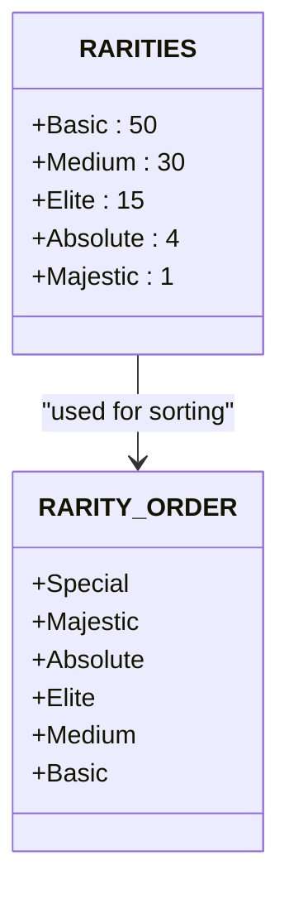
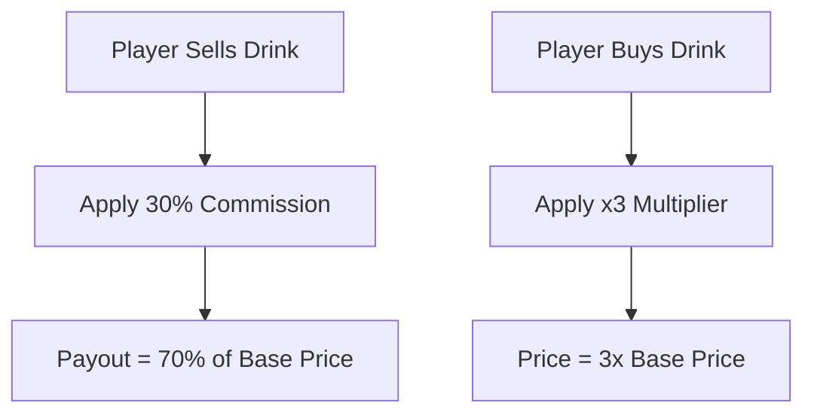
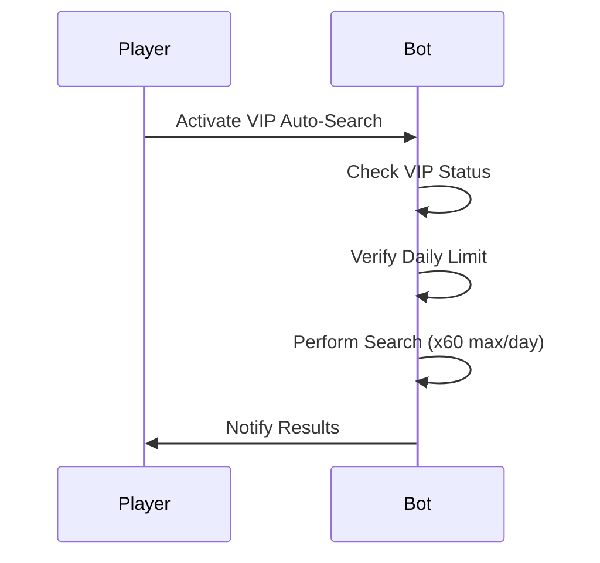

# Configuration Guide

<cite>
**Referenced Files in This Document**   
- [constants.py](file://constants.py)
- [Bot_new.py](file://Bot_new.py)
- [admin.py](file://admin.py)
- [database.py](file://database.py)
</cite>

## Table of Contents
1. [Introduction](#introduction)
2. [Game Balance Settings](#game-balance-settings)
3. [Economic Parameters](#economic-parameters)
4. [Administrative Settings](#administrative-settings)
5. [VIP Benefits and Auto-Search](#vip-benefits-and-auto-search)
6. [Usage Across Modules](#usage-across-modules)
7. [Best Practices for Modifying Constants](#best-practices-for-modifying-constants)
8. [Common Configuration Issues](#common-configuration-issues)

## Introduction
The RELOAD application's configuration system is centralized in the `constants.py` module, which defines key gameplay mechanics, economic models, administrative roles, and VIP features. These constants are imported and utilized across multiple modules including `Bot_new.py`, `admin.py`, and `database.py`. This guide details each constant's purpose, impact on gameplay, and recommended tuning practices to maintain game balance and prevent runtime errors.

**Section sources**
- [constants.py](file://constants.py#L1-L75)

## Game Balance Settings
Game balance settings govern cooldown durations and item rarity distribution, directly influencing player engagement and progression.

### SEARCH_COOLDOWN and DAILY_BONUS_COOLDOWN
- **Purpose**: Controls the minimum interval between search actions and daily bonus claims.
- **Impact**: 
  - `SEARCH_COOLDOWN = 300` (5 minutes) regulates how frequently players can find energy drinks.
  - `DAILY_BONUS_COOLDOWN = 86400` (24 hours) defines the reset period for daily rewards.
- **Tuning Guidance**: Adjusting these values affects player retention. Shorter cooldowns increase activity but may devalue rewards; longer intervals promote patience and strategic timing.

### RARITIES and RARITY_ORDER
- **Purpose**: Defines the probability distribution for energy drink rarities and their display order.
- **Impact**: 
  - `RARITIES` uses weighted probabilities: Basic (50%), Medium (30%), Elite (15%), Absolute (4%), Majestic (1%).
  - `RARITY_ORDER` determines sorting in inventory displays.
- **Tuning Guidance**: Modify weights carefully to preserve rarity hierarchy. Increasing rare drop chances can inflate economy if not balanced with pricing.

**Diagram sources**
- [constants.py](file://constants.py#L15-L25)

**Section sources**
- [constants.py](file://constants.py#L15-L25)

## Economic Parameters
Economic parameters define pricing models for buying, selling, and receiving energy drinks.

### RECEIVER_PRICES and SHOP_PRICE_MULTIPLIER
- **Purpose**: Establishes base prices for selling energy drinks and scales them for purchase.
- **Impact**: 
  - `RECEIVER_PRICES` sets base sell values (e.g., Basic: 10, Majestic: 750).
  - `SHOP_PRICE_MULTIPLIER = 3` triples base prices for purchases.
- **Tuning Guidance**: Ensure multiplier aligns with inflation goals. A higher multiplier increases profit margins but may discourage new players.

### RECEIVER_COMMISSION
- **Purpose**: Deducts 30% from base price when players sell drinks.
- **Impact**: Players receive 70% of `RECEIVER_PRICES`, creating a buy-sell spread that stabilizes market dynamics.
- **Tuning Guidance**: Commission rates above 40% risk player dissatisfaction; below 20% may lead to rapid coin accumulation.

**Diagram sources**
- [constants.py](file://constants.py#L50-L60)

**Section sources**
- [constants.py](file://constants.py#L50-L60)

## Administrative Settings
Administrative settings control access and permissions for bot management.

### ADMIN_USERNAMES
- **Purpose**: Specifies fallback usernames with elevated privileges.
- **Impact**: Users listed (e.g., `aAntiLoxX`) can execute admin commands regardless of database roles.
- **Tuning Guidance**: Limit entries to trusted developers. Avoid hardcoding sensitive accounts in production.

**Section sources**
- [constants.py](file://constants.py#L45-L47)
- [admin.py](file://admin.py#L5-L7)

## VIP Benefits and Auto-Search
VIP configurations enhance gameplay for premium users through reduced cooldowns and automated actions.

### VIP_COSTS and VIP_DURATIONS_SEC
- **Purpose**: Defines purchase costs and durations for VIP status.
- **Impact**: 
  - 1-day: 500 coins, 7-day: 3000 coins, 30-day: 10000 coins.
  - Durations in seconds ensure precise expiration tracking.
- **Tuning Guidance**: Align costs with average player earnings to maintain accessibility.

### AUTO_SEARCH_DAILY_LIMIT
- **Purpose**: Caps the number of automatic searches VIP users can perform daily.
- **Impact**: Prevents abuse while allowing passive progression.
- **Tuning Guidance**: Increase gradually based on server load and player feedback.

**Diagram sources**
- [constants.py](file://constants.py#L40-L43)
- [Bot_new.py](file://Bot_new.py#L100-L150)

**Section sources**
- [constants.py](file://constants.py#L40-L43)
- [Bot_new.py](file://Bot_new.py#L100-L150)

## Usage Across Modules
Constants are imported and applied consistently across core modules.

### In Bot_new.py
- Imports `SEARCH_COOLDOWN`, `DAILY_BONUS_COOLDOWN`, and `RARITIES` for search logic.
- Uses `VIP_COSTS` and `TG_PREMIUM_COST` in purchase workflows.
- References `ADMIN_USERNAMES` for fallback authorization checks.

### In admin.py
- Leverages `ADMIN_USERNAMES` to validate privileged commands.
- Integrates with database functions using constant-defined roles.

### In database.py
- Utilizes `RECEIVER_PRICES` and `SHOP_PRICES` in transaction calculations.
- Applies `RARITIES` during inventory updates and rarity assignments.

**Section sources**
- [Bot_new.py](file://Bot_new.py#L20-L30)
- [admin.py](file://admin.py#L5-L7)
- [database.py](file://database.py#L10-L15)

## Best Practices for Modifying Constants
Follow these guidelines when adjusting configuration values:

1. **Test in Staging**: Validate changes in a non-production environment.
2. **Monitor Metrics**: Track player behavior post-deployment.
3. **Document Rationale**: Record reasons for adjustments in version control.
4. **Avoid Hardcoded Values**: Use calculated expressions where possible (e.g., `24 * 60 * 60` for seconds in a day).
5. **Preserve Dependencies**: Update related constants simultaneously (e.g., adjust `SHOP_PRICE_MULTIPLIER` and `RECEIVER_PRICES` together).

**Section sources**
- [constants.py](file://constants.py#L1-L75)

## Common Configuration Issues
Address these frequent problems during configuration updates:

### Invalid Numeric Ranges
- **Issue**: Setting `SEARCH_COOLDOWN` below 60 seconds may cause spam.
- **Solution**: Enforce minimum thresholds in validation layers.

### Conflicting Settings
- **Issue**: Mismatched `SHOP_PRICE_MULTIPLIER` and `RECEIVER_PRICES` leading to negative margins.
- **Solution**: Implement cross-constant validation at startup.

### Runtime Errors
- **Issue**: Missing `ENERGY_IMAGES_DIR` path causing file not found exceptions.
- **Solution**: Verify directory existence during initialization.

**Section sources**
- [constants.py](file://constants.py#L5-L10)
- [Bot_new.py](file://Bot_new.py#L50-L60)