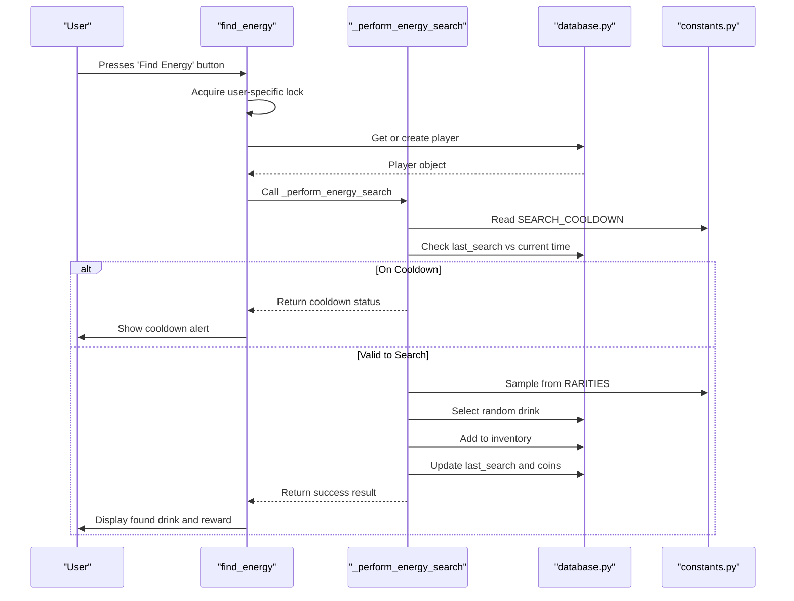
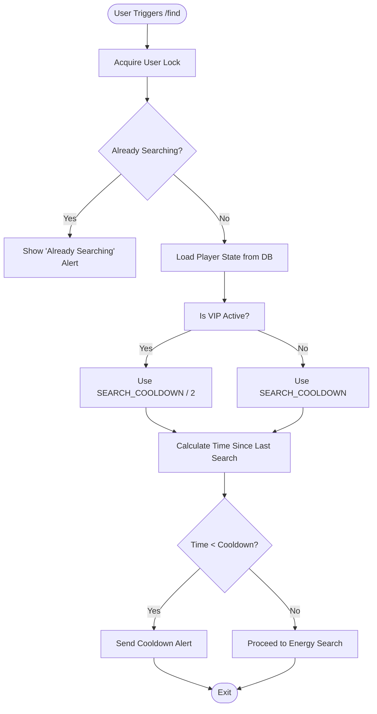
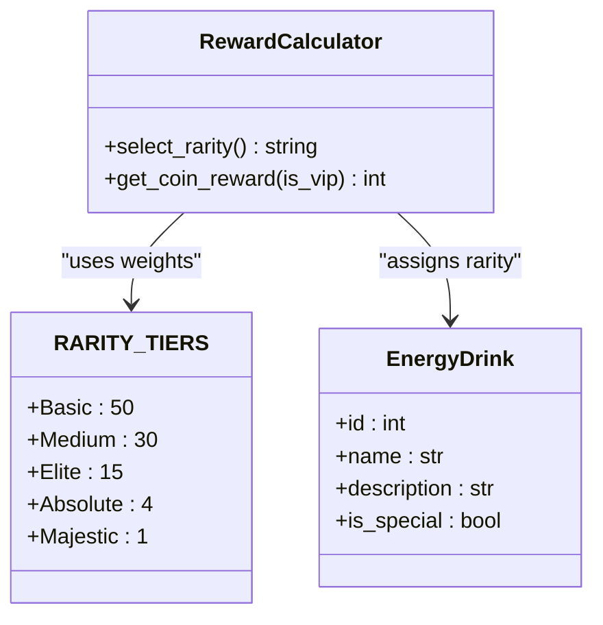
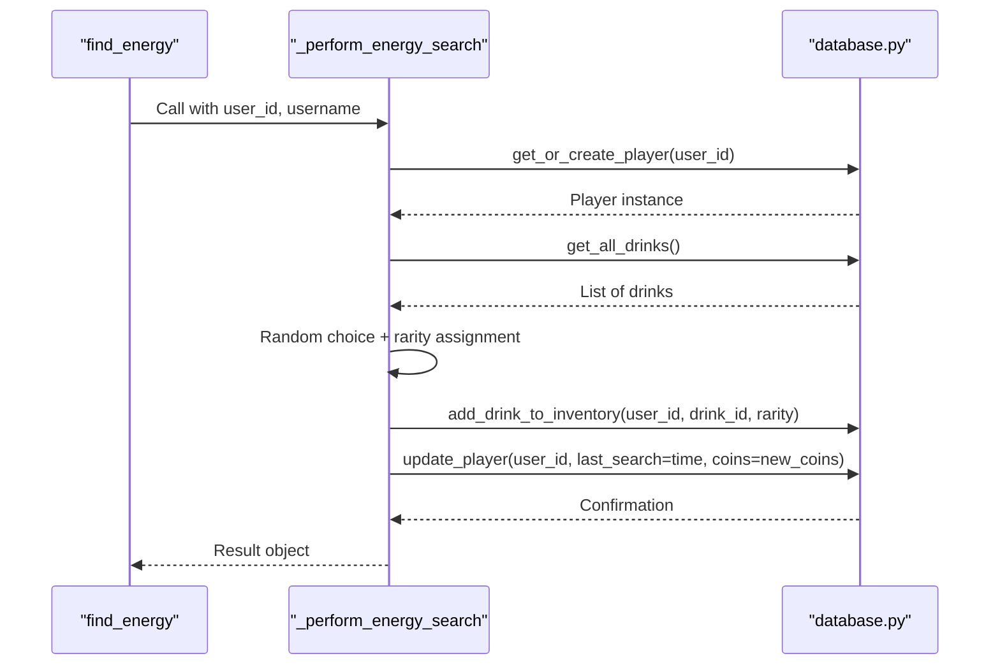
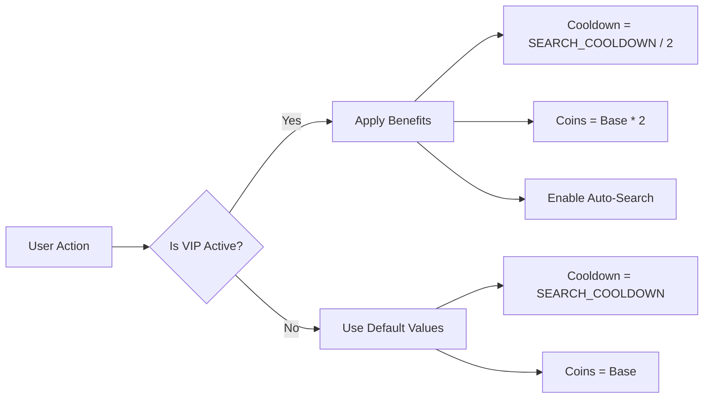
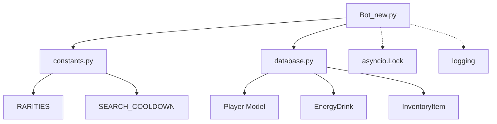

# Energy Collection System

<cite>
**Referenced Files in This Document**   
- [Bot_new.py](file://Bot_new.py)
- [constants.py](file://constants.py)
- [database.py](file://database.py)
</cite>

## Table of Contents
1. [Introduction](#introduction)
2. [Core Components](#core-components)
3. [Architecture Overview](#architecture-overview)
4. [Detailed Component Analysis](#detailed-component-analysis)
5. [Dependency Analysis](#dependency-analysis)
6. [Performance Considerations](#performance-considerations)
7. [Troubleshooting Guide](#troubleshooting-guide)
8. [Conclusion](#conclusion)

## Introduction
The Energy Collection System in the RELOAD bot enables users to collect virtual energy drinks through the `/find` command. This system integrates cooldown enforcement, rarity-based reward distribution, VIP benefits, and robust database interactions to ensure fair gameplay and prevent exploits. The implementation leverages constants from `constants.py`, player state management in `database.py`, and asynchronous handling in `Bot_new.py`. This document details the mechanics of the search functionality, including time-based restrictions, probabilistic rewards, concurrency control, and integration with premium features.

## Core Components

The energy drink collection system revolves around three core components: the `/find` command handler, cooldown enforcement via `SEARCH_COOLDOWN`, and reward calculation based on `RARITY_TIERS`. The system uses the `Player` model to track user state such as last search timestamp and coin balance. When a user triggers the `/find` command, the system checks against a cooldown period, selects a random drink, applies rarity weights, updates inventory, and grants coins. VIP users receive reduced cooldowns and doubled coin rewards. All operations are synchronized using asyncio locks and database transactions to prevent race conditions.

**Section sources**
- [Bot_new.py](file://Bot_new.py#L498-L585)
- [constants.py](file://constants.py#L7-L15)
- [database.py](file://database.py#L20-L45)

## Architecture Overview

**Diagram sources**
- [Bot_new.py](file://Bot_new.py#L498-L585)
- [constants.py](file://constants.py#L7-L15)
- [database.py](file://database.py#L20-L45)

## Detailed Component Analysis

### Search Command Implementation
The `/find` command is implemented through the `find_energy` function in `Bot_new.py`, which serves as the entry point for user interaction. Upon invocation, it enforces anti-spam measures using asyncio locks to prevent duplicate searches. It then delegates the core logic to `_perform_energy_search`, ensuring separation between UI handling and business logic.

#### Cooldown Enforcement

**Diagram sources**
- [Bot_new.py](file://Bot_new.py#L508-L525)
- [constants.py](file://constants.py#L7)
- [database.py](file://database.py#L100-L110)

**Section sources**
- [Bot_new.py](file://Bot_new.py#L571-L585)
- [constants.py](file://constants.py#L7)
- [database.py](file://database.py#L100-L110)

#### Reward Calculation Logic
The reward system uses weighted random selection based on the `RARITIES` dictionary defined in `constants.py`. Each rarity tier has an associated probability weight that determines its likelihood of being selected. Special items bypass this system and are always assigned the 'Special' rarity.

**Diagram sources**
- [constants.py](file://constants.py#L17-L23)
- [Bot_new.py](file://Bot_new.py#L535-L545)

**Section sources**
- [constants.py](file://constants.py#L17-L23)
- [Bot_new.py](file://Bot_new.py#L535-L545)

### Database Integration
The `search_handler` function interacts with the database session to persist changes after a successful search. It updates the `last_search` timestamp and adds the collected item to the user's inventory using atomic operations.

**Diagram sources**
- [Bot_new.py](file://Bot_new.py#L546-L565)
- [database.py](file://database.py#L150-L170)

**Section sources**
- [Bot_new.py](file://Bot_new.py#L546-L565)
- [database.py](file://database.py#L150-L170)

### VIP System Integration
VIP users receive multiple benefits: halved cooldowns, doubled coin rewards, and access to auto-search. These are enforced by checking `vip_until` timestamp in the `Player` model and adjusting behavior accordingly.

**Diagram sources**
- [Bot_new.py](file://Bot_new.py#L249-L255)
- [database.py](file://database.py#L30-L35)

**Section sources**
- [Bot_new.py](file://Bot_new.py#L249-L255)
- [database.py](file://database.py#L30-L35)

## Dependency Analysis

**Diagram sources**
- [Bot_new.py](file://Bot_new.py#L1-L50)
- [constants.py](file://constants.py#L1-L80)
- [database.py](file://database.py#L1-L100)

**Section sources**
- [Bot_new.py](file://Bot_new.py#L1-L50)
- [constants.py](file://constants.py#L1-L80)
- [database.py](file://database.py#L1-L100)

## Performance Considerations
To optimize frequent search operations under high load:
- Use connection pooling for database sessions
- Cache frequently accessed data like drink lists
- Minimize lock scope and duration
- Batch database updates where possible
- Monitor and index critical fields (`last_search`, `user_id`)
- Implement rate limiting at the API level
- Use asynchronous I/O throughout to maximize concurrency

## Troubleshooting Guide
Common issues include time manipulation exploits and race conditions during concurrent searches. The system mitigates these by:
- Using server-side timestamps instead of client time
- Enforcing row-level locking via `with_for_update()` in SQLAlchemy
- Employing asyncio locks per user to prevent parallel executions
- Validating state before and after transactions
- Logging all search attempts for audit purposes

**Section sources**
- [Bot_new.py](file://Bot_new.py#L575-L580)
- [database.py](file://database.py#L150-L170)

## Conclusion
The energy drink collection system in RELOAD bot is a robust implementation combining cooldown mechanics, probabilistic rewards, and VIP integrations. By leveraging proper concurrency controls and database transactions, it ensures data integrity even under heavy load. Future improvements could include more granular rate limiting, enhanced analytics, and dynamic rarity adjustments based on population statistics.