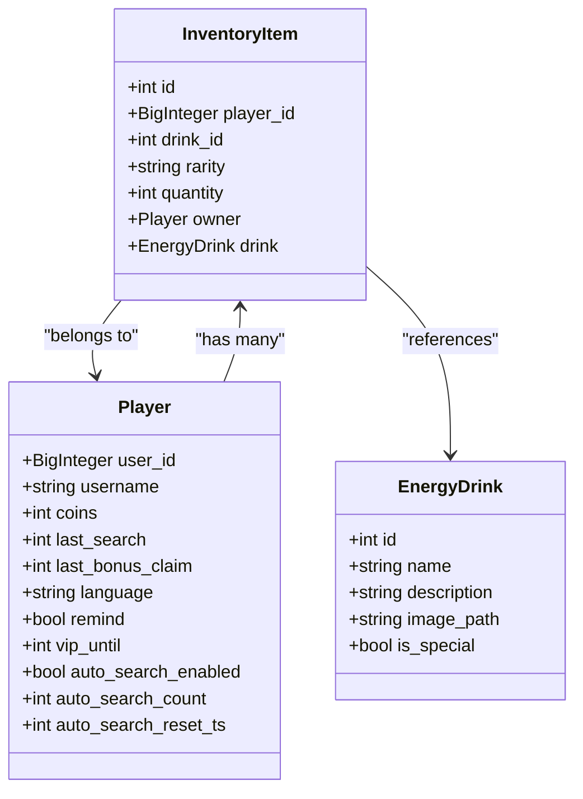
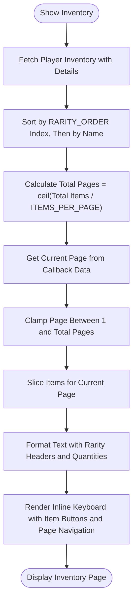
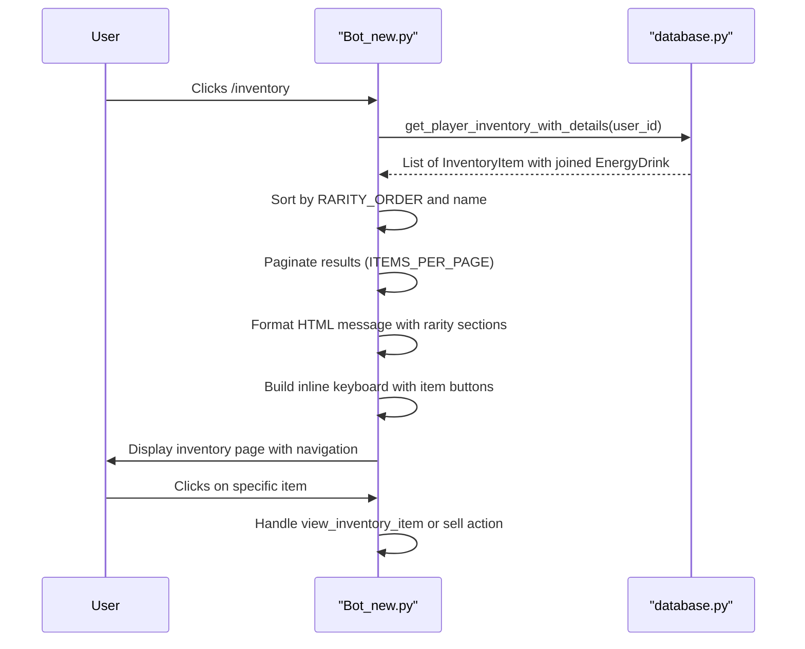
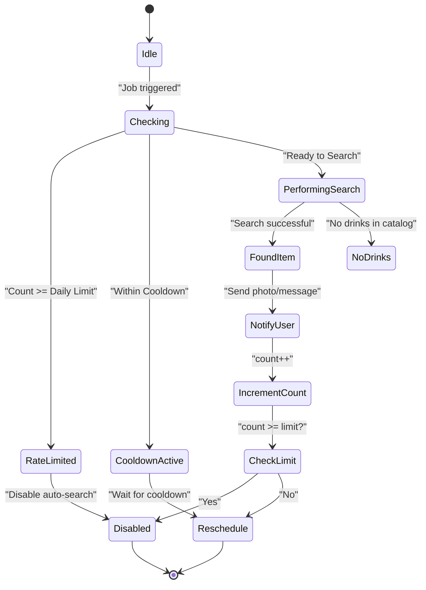

# Inventory Management

<cite>
**Referenced Files in This Document**   
- [Bot_new.py](file://Bot_new.py)
- [database.py](file://database.py)
- [constants.py](file://constants.py)
</cite>

## Table of Contents
1. [Introduction](#introduction)
2. [InventoryItem Model and Database Structure](#inventoryitem-model-and-database-structure)
3. [Sorting and Pagination Logic](#sorting-and-pagination-logic)
4. [Inventory Display and User Interaction](#inventory-display-and-user-interaction)
5. [Economic Integration: Selling Items](#economic-integration-selling-items)
6. [VIP Auto-Search Feature](#vip-auto-search-feature)
7. [Concurrency and Transaction Management](#concurrency-and-transaction-management)
8. [Performance Optimization with SQLAlchemy](#performance-optimization-with-sqlalchemy)

## Introduction
The inventory management system in the RELOAD bot enables users to collect, view, and manage energy drinks through interactive commands like `/inventory`. This system integrates with the bot's economic model, allowing players to sell collected items for in-game currency (septims). The implementation leverages SQLAlchemy for database operations, supports pagination for large collections, and sorts items by rarity using a predefined tier system. Users interact with their inventory via inline keyboards that provide actions such as viewing details and selling items. The system also supports VIP features like auto-search, which automatically collects items on behalf of the user within daily limits.

## InventoryItem Model and Database Structure

The `InventoryItem` model in `database.py` represents a player's collected energy drinks and establishes relationships with both the `Player` and `EnergyDrink` models.



**Diagram sources**
- [database.py](file://database.py#L48-L62)

**Section sources**
- [database.py](file://database.py#L48-L62)

## Sorting and Pagination Logic

The inventory is sorted by rarity using the `RARITY_ORDER` list defined in `constants.py`, which specifies the hierarchy from rarest to most common: `['Special', 'Majestic', 'Absolute', 'Elite', 'Medium', 'Basic']`. Within each rarity tier, items are sorted alphabetically by name.

Pagination is implemented with a fixed page size of 10 items per page (`ITEMS_PER_PAGE`). The current page is determined from the callback data (e.g., `inventory_p2` for page 2). The total number of pages is calculated based on the total item count, and navigation buttons allow users to move between pages.



**Diagram sources**
- [Bot_new.py](file://Bot_new.py#L738-L771)
- [constants.py](file://constants.py#L27)

**Section sources**
- [Bot_new.py](file://Bot_new.py#L738-L771)
- [constants.py](file://constants.py#L27)

## Inventory Display and User Interaction

The `show_inventory` handler in `Bot_new.py` retrieves the player's inventory with drink details using `db.get_player_inventory_with_details(user_id)`. It formats the output with HTML parsing to display emojis and bold text for rarity categories. Each item is shown with its name and quantity, grouped under rarity headers.

Users can click on individual items to view more details or perform actions like selling. The inline keyboard includes pagination controls (←, →) and a back-to-menu button. If the current message contains media (photo, document, etc.), it is deleted and replaced with a new text message to ensure consistent rendering.



**Diagram sources**
- [Bot_new.py](file://Bot_new.py#L696-L771)
- [database.py](file://database.py#L2044-L2074)

**Section sources**
- [Bot_new.py](file://Bot_new.py#L696-L771)
- [database.py](file://database.py#L2044-L2074)

## Economic Integration: Selling Items

Players can sell inventory items through the `/sell` command or inline buttons. The sale price is determined by `RECEIVER_PRICES` in `constants.py`, adjusted by a commission rate (`RECEIVER_COMMISSION = 0.30`). For example, a "Majestic" rarity item with a base price of 750 yields 525 septims after commission.

The `sell_inventory_item` function in `database.py` handles the transaction:
- Validates ownership and quantity
- Calculates payout using `get_receiver_unit_payout(rarity)`
- Updates the player's coin balance
- Decrements or deletes the inventory item

```mermaid
flowchart TD
A[User Selects Sell Action] --> B{Valid Item & Quantity?}
B --> |No| C[Return Error: not_found/forbidden/bad_quantity]
B --> |Yes| D[Calculate Unit Payout = Base Price × (1 - Commission)]
D --> E{Payout > 0?}
E --> |No| F[Return Error: unsupported_rarity]
E --> |Yes| G[Compute Total Payout = Unit Payout × Quantity]
G --> H[Update Player Coins += Total Payout]
H --> I[Decrement Inventory Quantity or Delete Item]
I --> J[Commit Transaction]
J --> K[Send Success Message with New Balance]
```

**Diagram sources**
- [database.py](file://database.py#L2733-L2763)
- [constants.py](file://constants.py#L58-L64)

**Section sources**
- [database.py](file://database.py#L2733-L2763)
- [constants.py](file://constants.py#L58-L64)

## VIP Auto-Search Feature

VIP users can enable auto-search, which automatically performs energy drink searches up to a daily limit (`AUTO_SEARCH_DAILY_LIMIT = 60`). The feature uses Telegram's `JobQueue` to schedule periodic searches respecting the reduced cooldown (x0.5 for VIP users).

The `auto_search_job` function:
- Checks VIP status and daily count
- Respects search cooldown
- Uses a lock to prevent race conditions with manual searches
- Increments the daily counter and resets it every 24 hours
- Sends found items directly to the user via private message



**Diagram sources**
- [Bot_new.py](file://Bot_new.py#L300-L400)

**Section sources**
- [Bot_new.py](file://Bot_new.py#L300-L400)

## Concurrency and Transaction Management

To prevent display inconsistencies due to concurrent updates (e.g., selling an item while viewing inventory), the system uses:
- **Row-level locking** with `with_for_update()` in critical operations like `purchase_shop_offer` and `sell_inventory_item`
- **Application-level locks** using `asyncio.Lock` per user (e.g., `_get_lock(f"user:{user_id}:search")`)
- **Transaction isolation** via SQLAlchemy sessions to ensure atomic updates

For example, when selling an item, the database query uses `with_for_update(read=False)` to lock the relevant rows until the transaction completes, preventing other processes from modifying the same data.

**Section sources**
- [database.py](file://database.py#L2733-L2763)
- [Bot_new.py](file://Bot_new.py#L250-L260)

## Performance Optimization with SQLAlchemy

Best practices for efficient querying include:

### Eager Loading
Use `joinedload()` to fetch related `EnergyDrink` data when retrieving inventory items, avoiding the N+1 query problem:
```python
db.query(InventoryItem).options(joinedload(InventoryItem.drink))
```

### Indexing
Critical indexes are defined on:
- `idx_inventory_player` (player_id) for fast inventory lookups
- `idx_inventory_drink` (drink_id) for catalog joins
- `idx_inventory_rarity` (rarity) for sorting by rarity

### Session Management
- Use `SessionLocal()` context managers to ensure proper closure
- Avoid long-lived sessions to prevent memory leaks
- Use `autocommit=False` and explicit `commit()`/`rollback()` for transaction control

**Section sources**
- [database.py](file://database.py#L48-L62)
- [database.py](file://database.py#L2044-L2074)