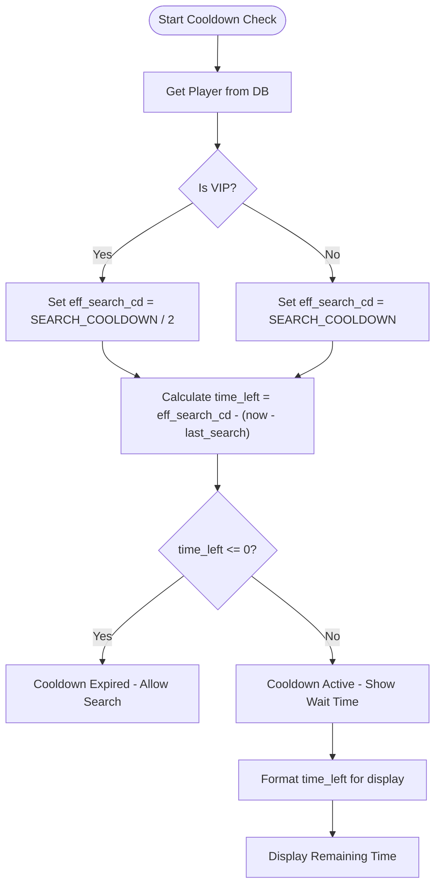

# Search Mechanics and Cooldowns

<cite>
**Referenced Files in This Document**   
- [Bot_new.py](file://Bot_new.py)
- [database.py](file://database.py)
- [constants.py](file://constants.py)
</cite>

## Table of Contents
1. [Introduction](#introduction)
2. [Core Components](#core-components)
3. [Cooldown Calculation Logic](#cooldown-calculation-logic)
4. [Command Handler and Search Execution](#command-handler-and-search-execution)
5. [VIP and Special Event Adjustments](#vip-and-special-event-adjustments)
6. [Database Transaction and State Update](#database-transaction-and-state-update)
7. [Edge Case Handling](#edge-case-handling)
8. [Troubleshooting Common Issues](#troubleshooting-common-issues)
9. [Monitoring and Logging Recommendations](#monitoring-and-logging-recommendations)

## Introduction
The RELOAD bot implements a search cooldown system to regulate player interaction frequency with the "Find Energy" feature. This document details the mechanics behind this system, focusing on how remaining cooldown time is calculated using the `last_search` timestamp from the Player model in `database.py` and the `COOLDOWN_DURATION` (named `SEARCH_COOLDOWN`) from `constants.py`. It explains the logic in `Bot_new.py` that prevents premature searches and provides accurate wait time feedback. The document also covers adjustments for VIP users, the interaction between the command handler, database transactions, and state updates, edge cases, and provides troubleshooting and monitoring guidance.

## Core Components

This section outlines the key files and components involved in the search cooldown system.

**Section sources**
- [Bot_new.py](file://Bot_new.py#L0-L799)
- [database.py](file://database.py#L0-L799)
- [constants.py](file://constants.py#L0-L75)

## Cooldown Calculation Logic

The core of the cooldown system lies in comparing the current time with the `last_search` timestamp stored in the `Player` model, adjusted by the `SEARCH_COOLDOWN` constant.

The effective cooldown duration is determined by the player's VIP status. For VIP users, the cooldown is halved. The calculation is performed in multiple places, primarily within `Bot_new.py`.

The remaining cooldown time is calculated using the formula:
`time_left = effective_cooldown - (current_time - last_search_timestamp)`

Where:
- `effective_cooldown` is `SEARCH_COOLDOWN` or `SEARCH_COOLDOWN / 2` for VIP users.
- `current_time` is obtained via `time.time()`, which returns the current Unix timestamp in seconds.
- `last_search_timestamp` is retrieved from the `last_search` field of the `Player` object.

If `time_left` is greater than zero, the player is still on cooldown. This logic is used both for displaying the remaining time in the menu and for enforcing the cooldown during a search attempt.



**Diagram sources**
- [Bot_new.py](file://Bot_new.py#L150-L160)
- [constants.py](file://constants.py#L7)

## Command Handler and Search Execution

The search process is initiated by the `find_energy` callback handler in `Bot_new.py`. This function is triggered when a user presses the "Find Energy" button.

The handler first acquires a per-user lock (`_get_lock(f"user:{user.id}:search")`) to prevent race conditions from double-clicks. It then performs a preliminary cooldown check. If the cooldown is not met, it sends an immediate alert and returns.

If the cooldown is met, the handler displays a loading animation and then calls the `_perform_energy_search` function. This function performs the definitive cooldown check again (to ensure no state change occurred during the animation) before proceeding with the search logic, which includes selecting a random drink, updating the inventory, rewarding coins, and updating the `last_search` timestamp.

```mermaid
sequenceDiagram
participant User
participant Handler as find_energy()
participant Core as _perform_energy_search()
participant DB as database.py
User->>Handler : Press "Find Energy"
Handler->>Handler : Acquire user-specific lock
Handler->>Handler : Preliminary cooldown check
alt Cooldown Active
Handler-->>User : Show "Wait" alert
deactivate Handler
else Cooldown Expired
Handler->>Handler : Show loading animation
Handler->>Core : Call _perform_energy_search()
Core->>Core : Definitive cooldown check
Core->>DB : Get all drinks
DB-->>Core : Return drink list
Core->>Core : Select random drink
Core->>DB : Add drink to inventory
Core->>DB : Update player (last_search, coins)
Core-->>Handler : Return success result
Handler->>User : Send found drink message
end
```

**Diagram sources**
- [Bot_new.py](file://Bot_new.py#L450-L550)

## VIP and Special Event Adjustments

The system dynamically adjusts the search cooldown based on the player's VIP status. The `is_vip()` function in `database.py` checks if the current timestamp is less than the `vip_until` value stored in the `Player` model.

When a player has an active VIP status, the effective cooldown (`eff_search_cd`) is set to `SEARCH_COOLDOWN / 2`, effectively reducing the wait time from 5 minutes to 2.5 minutes. This adjustment is applied in both the menu display logic and the search execution logic.

The `purchase_vip` function in `database.py` handles the transaction for buying VIP status. It checks the player's coin balance, calculates the new `vip_until` timestamp by adding the purchased duration to the current time (or extending from the current expiration time if it's in the future), and updates the player record in the database.

While the provided code does not show a specific "special event" mechanism, the architecture allows for such features. A future implementation could introduce a global or per-user multiplier that further modifies the `eff_search_cd` calculation, similar to the VIP logic.

**Section sources**
- [Bot_new.py](file://Bot_new.py#L150-L160)
- [database.py](file://database.py#L2517-L2539)

## Database Transaction and State Update

A successful search involves a critical database transaction to ensure data consistency. The `_perform_energy_search` function orchestrates this process.

After a drink is selected, the function calls `add_drink_to_inventory()` and `update_player()` from the `db` module. The `update_player()` call is crucial as it performs a single SQL UPDATE operation to set both the `last_search` field to the current Unix timestamp and the `coins` field to the new balance in one atomic operation.

This atomic update prevents race conditions where multiple simultaneous search attempts could result in incorrect coin rewards or an improperly set `last_search` time. The use of a per-user lock in the command handler further secures this transaction by serializing access.

**Section sources**
- [Bot_new.py](file://Bot_new.py#L350-L370)
- [database.py](file://database.py#L19-L38)

## Edge Case Handling

The system addresses several potential edge cases to maintain robustness.

**Clock Drift and Timezone Issues:** The system relies on Unix timestamps (seconds since epoch) from `time.time()`, which are timezone-agnostic. This eliminates issues related to user or server timezones. However, significant clock drift on the server hosting the bot could cause inaccuracies. For instance, if the server clock is fast, cooldowns would appear to end early for users, and vice versa. Ensuring the server's clock is synchronized via NTP is critical.

**Database Latency:** High database latency could create a small window for a race condition. Although the per-user lock prevents concurrent searches from the same user, a very slow database write for the `last_search` update could theoretically allow a second search to pass the cooldown check before the first update is committed. The use of `with_for_update(read=False)` in some database functions (like `purchase_next_bed`) suggests an awareness of this, but it is not used in the core `update_player` function for the search cooldown. This represents a minor risk under extreme load.

**Section sources**
- [Bot_new.py](file://Bot_new.py#L350-L370)
- [database.py](file://database.py#L19-L38)

## Troubleshooting Common Issues

This section provides guidance for diagnosing and resolving common problems.

**Stuck Cooldowns:** If a player reports being unable to search despite waiting, first verify their `last_search` timestamp in the database. If it's set to a future date, it indicates a server clock issue at the time of the last update. Manually correcting the `last_search` value to a past timestamp in the database will resolve this. If the timestamp is correct, check for client-side issues (e.g., app cache) or ensure the bot's server clock is accurate.

**Incorrect Timing Calculations:** If the displayed wait time is consistently wrong, check the server's system time. An incorrect system time will directly affect the `time.time()` value and all calculations. Synchronize the server clock immediately. Also, verify that the `SEARCH_COOLDOWN` constant in `constants.py` is set to the expected value (300 seconds).

**Section sources**
- [Bot_new.py](file://Bot_new.py#L150-L160)
- [database.py](file://database.py#L19-L38)

## Monitoring and Logging Recommendations

To detect anomalies at scale, implement the following monitoring and logging practices.

**Logging:** The bot already uses structured logging with the `logger.info()` call in `_perform_energy_search`, which records successful searches with user ID, drink name, rarity, and coin reward. Enhance this by adding logs for cooldown violations (e.g., `logger.warning(f"[COOLDOWN VIOLATION] User {user_id} attempted search too soon.")`). This helps identify potential bugs or abuse.

**Monitoring:** Monitor the rate of "Cooldown" alerts versus successful searches. A sudden spike in cooldown alerts could indicate a server clock problem. Track the average execution time of database operations like `update_player`. A significant increase could signal database latency issues affecting cooldown accuracy. Implement external health checks that simulate a search to verify the cooldown logic is functioning correctly.

**Section sources**
- [Bot_new.py](file://Bot_new.py#L370-L375)