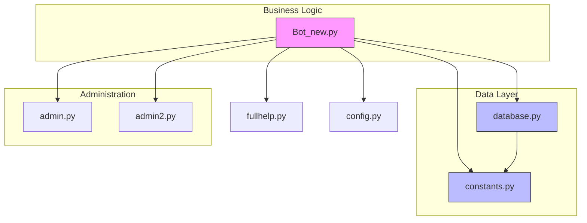
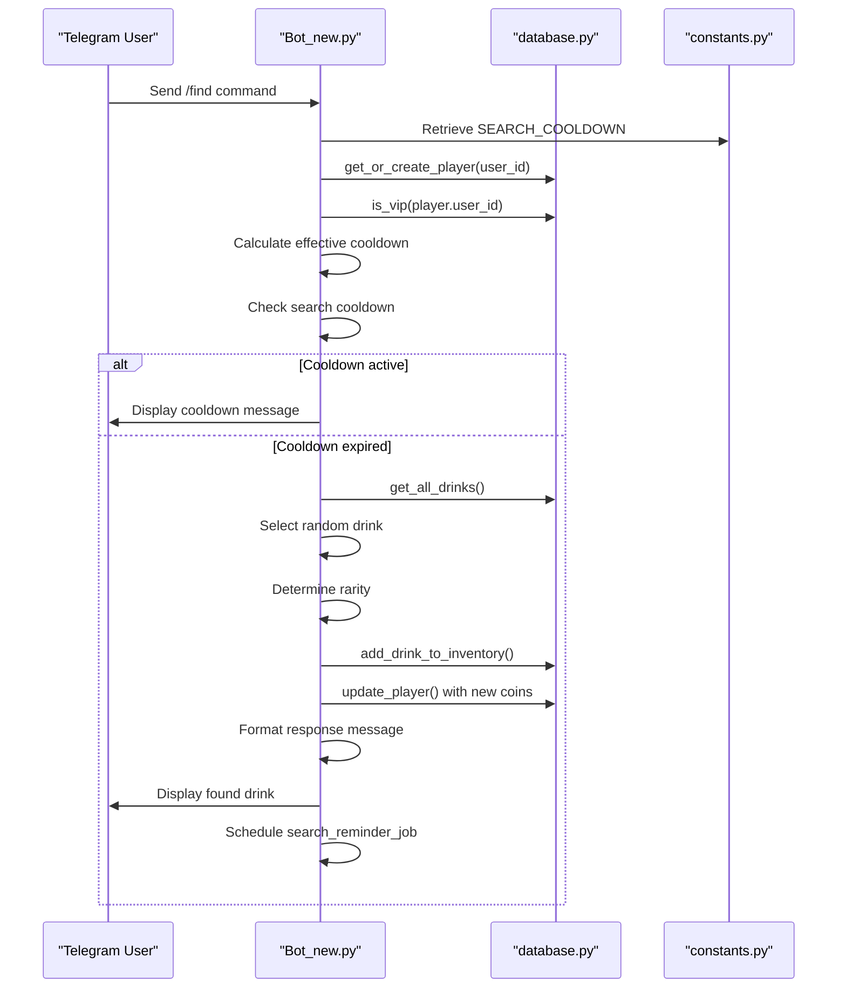

# Component Relationships

<cite>
**Referenced Files in This Document**   
- [Bot_new.py](file://Bot_new.py)
- [database.py](file://database.py)
- [constants.py](file://constants.py)
</cite>

## Table of Contents
1. [Introduction](#introduction)
2. [Core Component Overview](#core-component-overview)
3. [Dependency Graph](#dependency-graph)
4. [Command Flow Analysis](#command-flow-analysis)
5. [Sequence Diagram: /find Command](#sequence-diagram-find-command)
6. [Data Exchange Patterns](#data-exchange-patterns)
7. [Error Propagation Mechanisms](#error-propagation-mechanisms)
8. [Design Patterns and Architecture](#design-patterns-and-architecture)
9. [Future Refactoring Considerations](#future-refactoring-considerations)

## Introduction
This document details the component relationships within the RELOAD application, focusing on the central role of Bot_new.py as the orchestrator of business logic. The analysis covers the dependency structure between core components, specifically examining how Bot_new.py depends on database.py for data persistence operations and constants.py for configuration values. The document maps the complete dependency graph, explains the flow of user commands through the system, and analyzes the interaction patterns between Telegram update handlers, business logic, and data access layers.

## Core Component Overview

Bot_new.py serves as the central hub of the RELOAD application, acting as the primary entry point and orchestrator for all user interactions. It handles Telegram API communications, processes user commands, and coordinates business logic execution. The component imports and utilizes functionality from database.py for all data persistence operations and from constants.py for configuration values and game parameters.

The database.py module provides the Object-Relational Mapping (ORM) models and repository methods that are consumed by all functional modules in the application. It defines the data schema through SQLAlchemy models and implements data access operations that abstract the underlying SQLite database. This component is responsible for creating and managing the database connection, defining table structures, and providing CRUD operations for all entities.

The constants.py module supplies game parameters and administrative settings that are consumed system-wide. It contains configuration values for cooldown periods, rarity distributions, pricing structures, and administrative privileges. This centralized configuration approach ensures consistency across the application and simplifies maintenance of game mechanics.

**Section sources**
- [Bot_new.py](file://Bot_new.py#L0-L65)
- [database.py](file://database.py#L0-L17)
- [constants.py](file://constants.py#L0-L48)

## Dependency Graph

**Diagram sources**
- [Bot_new.py](file://Bot_new.py#L0-L65)
- [database.py](file://database.py#L0-L17)
- [constants.py](file://constants.py#L0-L48)

**Section sources**
- [Bot_new.py](file://Bot_new.py#L0-L65)
- [database.py](file://database.py#L0-L17)
- [constants.py](file://constants.py#L0-L48)

## Command Flow Analysis

The RELOAD application processes user commands through a well-defined flow that begins with Telegram update handlers and progresses through business logic to data access layers. When a user issues a command such as "/find", the Telegram update is received by the ApplicationBuilder in Bot_new.py, which routes it to the appropriate CommandHandler.

The command handler invokes the corresponding business logic function, which may perform validation, apply game rules, and coordinate with other components. Throughout this process, the business logic layer accesses configuration values from constants.py to determine parameters such as cooldown periods and reward amounts. When data persistence is required, the business logic calls methods provided by database.py to read from or write to the database.

This layered approach ensures separation of concerns, with the presentation layer (Telegram interface) isolated from the business logic and data access layers. The dependency inversion principle is applied, as higher-level modules (Bot_new.py) define the interfaces they need from lower-level modules (database.py), rather than being tightly coupled to specific implementations.

**Section sources**
- [Bot_new.py](file://Bot_new.py#L5169-L5220)
- [database.py](file://database.py#L229-L256)

## Sequence Diagram: /find Command

**Diagram sources**
- [Bot_new.py](file://Bot_new.py#L330-L450)
- [database.py](file://database.py#L48-L76)
- [constants.py](file://constants.py#L0-L48)

**Section sources**
- [Bot_new.py](file://Bot_new.py#L330-L450)
- [database.py](file://database.py#L48-L76)
- [constants.py](file://constants.py#L0-L48)

## Data Exchange Patterns

The RELOAD application employs consistent data exchange patterns between components, with well-defined interfaces and data structures. When Bot_new.py interacts with database.py, it passes user identifiers and command parameters, receiving structured data objects in return. The database.py module returns ORM model instances or dictionaries containing query results, which are then processed by the business logic in Bot_new.py.

Configuration data flows from constants.py to Bot_new.py through direct imports of specific constants. This includes numerical values for cooldown periods, dictionary structures for rarity distributions, and pricing information for in-game purchases. The constants are imported at module level, making them available throughout the Bot_new.py component.

Data exchange follows a request-response pattern, with synchronous function calls between components. Error conditions are communicated through return values and exceptions, with the business logic layer responsible for handling and translating database errors into user-friendly messages.

**Section sources**
- [Bot_new.py](file://Bot_new.py#L0-L65)
- [database.py](file://database.py#L0-L17)
- [constants.py](file://constants.py#L0-L48)

## Error Propagation Mechanisms

The RELOAD application implements a comprehensive error propagation system that handles exceptions at multiple levels. At the database layer, database.py wraps SQLAlchemy operations in try-except blocks and returns structured error dictionaries with "ok" and "reason" fields. This approach prevents database exceptions from propagating directly to the business logic layer.

In Bot_new.py, error handling occurs at both the function and handler levels. Individual functions perform validation and return appropriate responses for invalid inputs or state conditions. Command handlers catch exceptions and provide user feedback through Telegram messages or alerts. The application also implements anti-race condition mechanisms using asyncio locks to prevent concurrent modifications to user data.

Error propagation follows a downward pattern, with lower-level components (database.py) handling their specific errors and returning structured results, while higher-level components (Bot_new.py) handle business logic errors and user interface errors. This layered approach ensures that errors are handled at the appropriate level of abstraction.

**Section sources**
- [Bot_new.py](file://Bot_new.py#L330-L450)
- [database.py](file://database.py#L2371-L2395)

## Design Patterns and Architecture

The RELOAD application demonstrates several architectural patterns that contribute to its maintainability and scalability. The most prominent is the separation of concerns, with clear boundaries between the presentation layer (Telegram interface), business logic layer (Bot_new.py), and data access layer (database.py). This layered architecture enables independent development and testing of components.

The application employs a dependency inversion pattern, where Bot_new.py depends on the interfaces provided by database.py rather than on specific database implementations. This is evident in the use of repository methods that abstract the underlying data storage mechanism. The constants.py module implements a configuration pattern, centralizing game parameters and reducing code duplication.

The codebase also demonstrates the use of the singleton pattern for database connections, with SessionLocal providing a consistent interface to the database. The application uses a command pattern for handling Telegram updates, with specific handler functions registered for different command types.

**Section sources**
- [Bot_new.py](file://Bot_new.py#L0-L65)
- [database.py](file://database.py#L0-L17)
- [constants.py](file://constants.py#L0-L48)

## Future Refactoring Considerations

The current architecture of the RELOAD application provides a solid foundation for future refactoring and potential microservices decomposition. The clear separation of concerns and dependency inversion patterns make it feasible to extract components into independent services.

Potential refactoring opportunities include:
1. Extracting the database layer into a separate data service with a defined API
2. Creating a configuration service to manage game parameters dynamically
3. Implementing a dedicated business logic service for core game mechanics
4. Developing an authentication service for user management

The application could be decomposed into microservices based on functional boundaries, such as a User Service, Inventory Service, and Game Mechanics Service. This would require defining clear APIs between services and implementing service discovery and communication mechanisms.

The current use of global variables and module-level state in Bot_new.py represents a challenge for microservices decomposition and should be addressed by implementing proper state management patterns. Additionally, the direct imports between modules could be replaced with dependency injection to improve testability and flexibility.

**Section sources**
- [Bot_new.py](file://Bot_new.py#L0-L65)
- [database.py](file://database.py#L0-L17)
- [constants.py](file://constants.py#L0-L48)