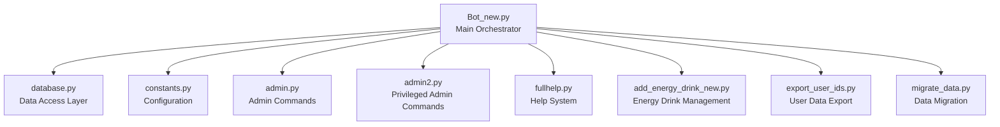
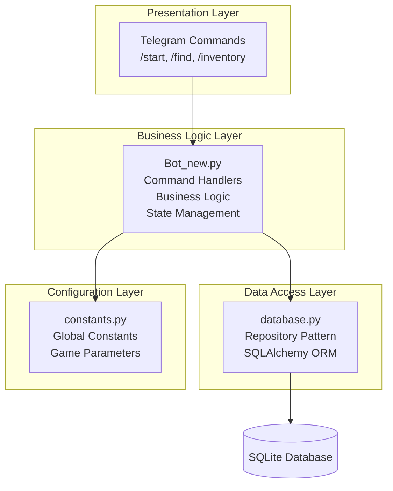
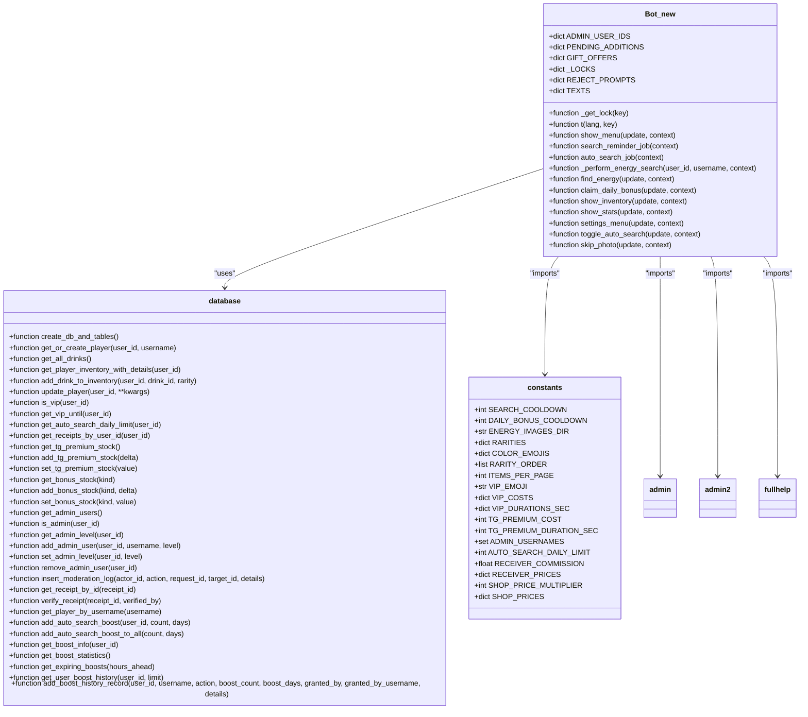
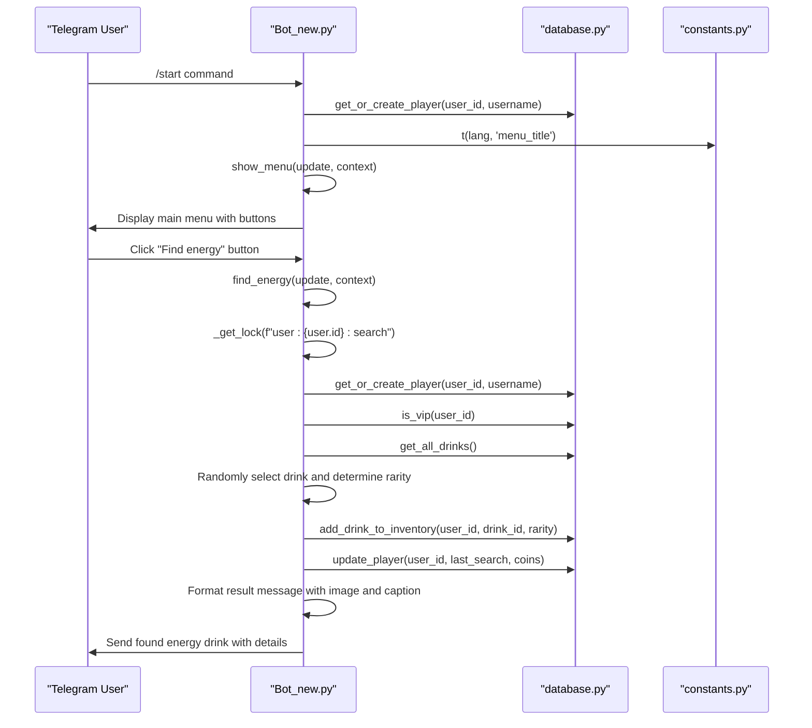
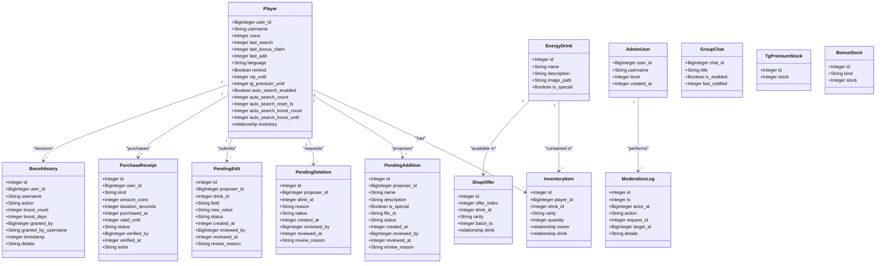
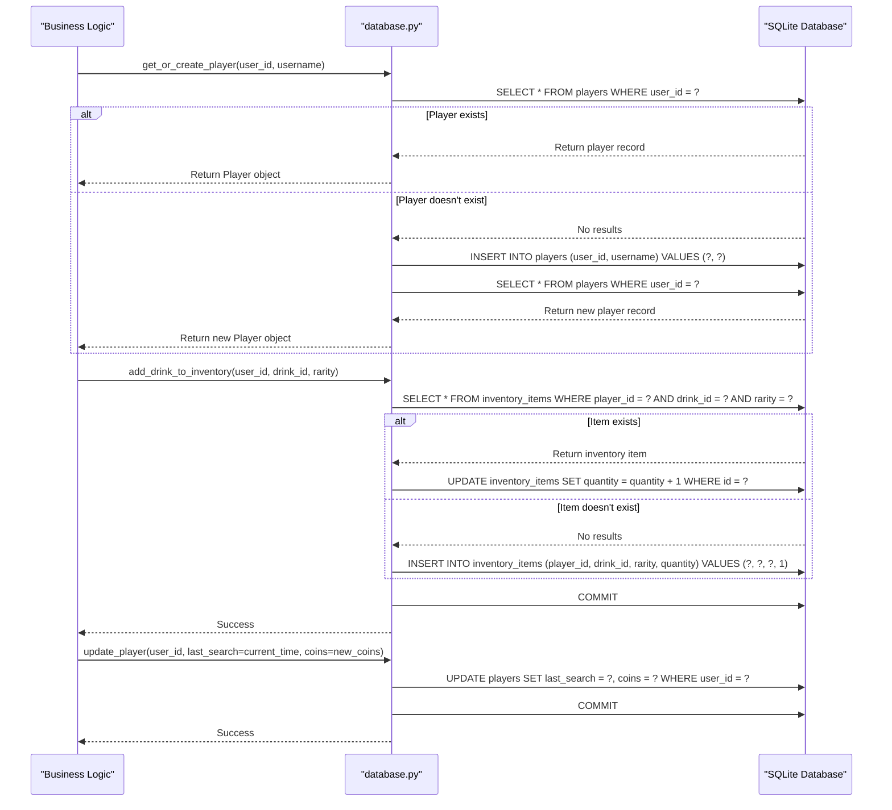
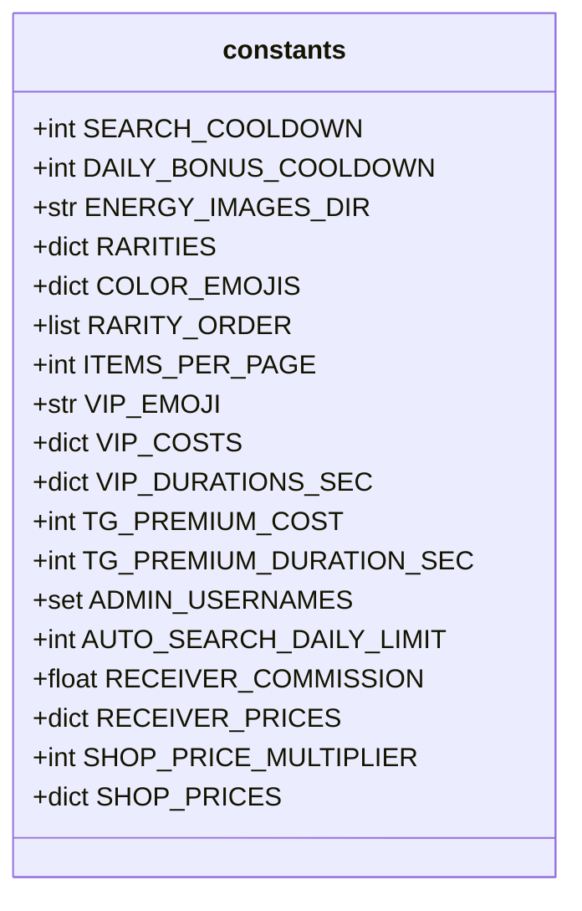
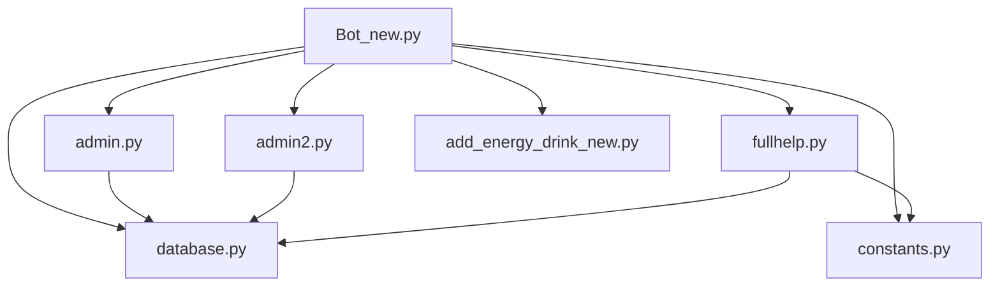

# Core System Architecture

<cite>
**Referenced Files in This Document**   
- [Bot_new.py](file://Bot_new.py)
- [database.py](file://database.py)
- [constants.py](file://constants.py)
- [admin.py](file://admin.py)
- [admin2.py](file://admin2.py)
- [fullhelp.py](file://fullhelp.py)
</cite>

## Table of Contents
1. [Introduction](#introduction)
2. [Project Structure](#project-structure)
3. [Core Components](#core-components)
4. [Architecture Overview](#architecture-overview)
5. [Detailed Component Analysis](#detailed-component-analysis)
6. [Dependency Analysis](#dependency-analysis)
7. [Performance Considerations](#performance-considerations)
8. [Troubleshooting Guide](#troubleshooting-guide)
9. [Conclusion](#conclusion)

## Introduction
The RELOAD application is a Telegram-based bot designed for energy drink collection and management. This document provides comprehensive architectural documentation for the core system, focusing on its modular design, separation of concerns, asynchronous event-driven architecture, and key design decisions. The system is orchestrated by Bot_new.py which integrates specialized modules for administration, help, and data management. The architecture follows a clean separation between presentation (Telegram commands), business logic (in Bot_new.py), data access (database.py using Repository pattern), and configuration (constants.py). The system leverages asyncio and the python-telegram-bot framework for asynchronous event handling.

## Project Structure
The RELOAD application follows a modular structure with clear separation of concerns. The main components are organized as individual Python files, each responsible for specific functionality. The core orchestrator (Bot_new.py) imports and integrates specialized modules for administration, help, and data management. Configuration is centralized in constants.py, while data access is handled through database.py which implements the Repository pattern. Administrative functions are split between admin.py and admin2.py based on privilege levels, and help functionality is encapsulated in fullhelp.py.

**Diagram sources**
- [Bot_new.py](file://Bot_new.py#L1-L50)
- [database.py](file://database.py#L1-L50)
- [constants.py](file://constants.py#L1-L10)

**Section sources**
- [Bot_new.py](file://Bot_new.py#L1-L100)
- [database.py](file://database.py#L1-L100)
- [constants.py](file://constants.py#L1-L76)

## Core Components
The RELOAD application's core system consists of several key components that work together to provide a seamless user experience. The main orchestrator (Bot_new.py) handles Telegram command routing and business logic execution. The data access layer (database.py) implements the Repository pattern for database operations, providing a clean abstraction between the business logic and data storage. Configuration is managed through constants.py which contains global constants used throughout the application. Administrative functionality is divided between admin.py (basic admin commands) and admin2.py (privileged admin commands), while help functionality is provided by fullhelp.py.

**Section sources**
- [Bot_new.py](file://Bot_new.py#L1-L100)
- [database.py](file://database.py#L1-L100)
- [constants.py](file://constants.py#L1-L76)
- [admin.py](file://admin.py#L1-L100)
- [admin2.py](file://admin2.py#L1-L100)
- [fullhelp.py](file://fullhelp.py#L1-L100)

## Architecture Overview
The RELOAD application follows a layered architecture with clear separation of concerns. The system is built on an asynchronous event-driven model using asyncio and the python-telegram-bot framework. The architecture consists of four main layers: presentation layer (Telegram commands), business logic layer (in Bot_new.py), data access layer (database.py using Repository pattern), and configuration layer (constants.py). This separation ensures maintainability and scalability of the application.

**Diagram sources**
- [Bot_new.py](file://Bot_new.py#L1-L100)
- [database.py](file://database.py#L1-L100)
- [constants.py](file://constants.py#L1-L76)

## Detailed Component Analysis
This section provides a thorough analysis of each key component in the RELOAD application, including their interactions, design patterns, and implementation details.

### Bot_new.py Analysis
Bot_new.py serves as the main orchestrator of the RELOAD application, handling all Telegram command routing and implementing the core business logic. It follows an event-driven architecture using the python-telegram-bot framework's callback system. The module imports and integrates specialized modules for administration, help, and data management, creating a cohesive system from modular components.

#### For Object-Oriented Components:

**Diagram sources**
- [Bot_new.py](file://Bot_new.py#L1-L100)
- [database.py](file://database.py#L1-L100)
- [constants.py](file://constants.py#L1-L76)

#### For API/Service Components:

**Diagram sources**
- [Bot_new.py](file://Bot_new.py#L1-L100)
- [database.py](file://database.py#L1-L100)

**Section sources**
- [Bot_new.py](file://Bot_new.py#L1-L100)
- [database.py](file://database.py#L1-L100)
- [constants.py](file://constants.py#L1-L76)

### database.py Analysis
The database.py module implements the data access layer of the RELOAD application using the Repository pattern with SQLAlchemy ORM. It defines the database schema through declarative base classes and provides a comprehensive set of functions for data manipulation. The module handles all database operations, including player management, energy drink inventory, administrative functions, and bonus tracking.

#### For Object-Oriented Components:

**Diagram sources**
- [database.py](file://database.py#L1-L100)

#### For API/Service Components:

**Diagram sources**
- [database.py](file://database.py#L1-L100)

**Section sources**
- [database.py](file://database.py#L1-L100)

### constants.py Analysis
The constants.py module serves as the central configuration point for the RELOAD application, containing global constants used throughout the system. This approach ensures consistency across the application and makes configuration changes easier to manage. The module defines game parameters, cooldown times, rarity distributions, pricing models, and administrative settings.

#### For Object-Oriented Components:

**Diagram sources**
- [constants.py](file://constants.py#L1-L76)

**Section sources**
- [constants.py](file://constants.py#L1-L76)

## Dependency Analysis
The RELOAD application follows a clear dependency hierarchy with well-defined relationships between components. The main orchestrator (Bot_new.py) depends on all other modules, while specialized modules have minimal dependencies on each other. This design promotes modularity and makes the system easier to maintain and extend.

**Diagram sources**
- [Bot_new.py](file://Bot_new.py#L1-L100)
- [database.py](file://database.py#L1-L100)
- [constants.py](file://constants.py#L1-L76)
- [admin.py](file://admin.py#L1-L100)
- [admin2.py](file://admin2.py#L1-L100)
- [fullhelp.py](file://fullhelp.py#L1-L100)

## Performance Considerations
The RELOAD application is designed with performance in mind, leveraging asynchronous programming patterns to handle multiple concurrent users efficiently. The use of asyncio and the python-telegram-bot framework allows the bot to handle multiple user interactions simultaneously without blocking. Database operations are optimized through the use of SQLAlchemy ORM with appropriate indexing on frequently queried fields. The system implements caching patterns where appropriate, such as maintaining player state in memory during active sessions. The repository pattern in database.py provides a clean abstraction that allows for future optimization of data access patterns without affecting business logic.

## Troubleshooting Guide
When troubleshooting issues with the RELOAD application, consider the following common scenarios and their solutions:

1. **Database Connection Issues**: Ensure the SQLite database file (bot_data.db) exists and has proper read/write permissions. The database is created automatically on first run if it doesn't exist.

2. **Command Not Responding**: Check if the bot has been granted necessary permissions in the Telegram group or channel. Verify that the python-telegram-bot library is properly installed and configured.

3. **Authentication Problems**: Ensure that admin users are properly registered in the database. The bootstrap admin usernames are defined in constants.py under ADMIN_USERNAMES.

4. **Image Display Issues**: Verify that the energy_images directory exists and contains the required image files. Check that the image paths in the database match the actual file locations.

5. **Asynchronous Operation Failures**: Review the asyncio event loop configuration and ensure that long-running operations are properly awaited. Check for potential race conditions in shared state.

6. **Memory Leaks**: Monitor the application for increasing memory usage over time. The use of global dictionaries (PENDING_ADDITIONS, GIFT_OFFERS, _LOCKS, REJECT_PROMPTS) should be periodically cleaned up to prevent memory bloat.

**Section sources**
- [Bot_new.py](file://Bot_new.py#L1-L100)
- [database.py](file://database.py#L1-L100)

## Conclusion
The RELOAD application demonstrates a well-architected modular design with clear separation of concerns between presentation, business logic, data access, and configuration layers. The system leverages asynchronous programming patterns through asyncio and the python-telegram-bot framework to efficiently handle concurrent user interactions. The use of the Repository pattern in database.py provides a clean abstraction between business logic and data storage, enhancing maintainability and testability. Key design decisions such as the use of global constants, singleton-like patterns in database session management, and state handling via callback data contribute to the system's robustness and scalability. The architecture supports easy extension through its modular design, allowing new features to be added with minimal impact on existing functionality.