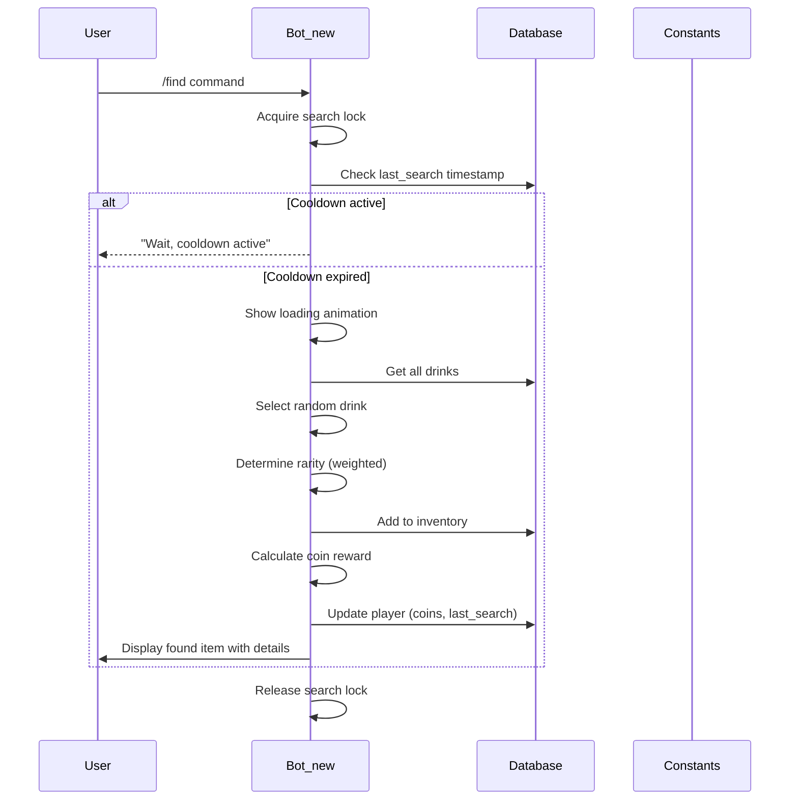
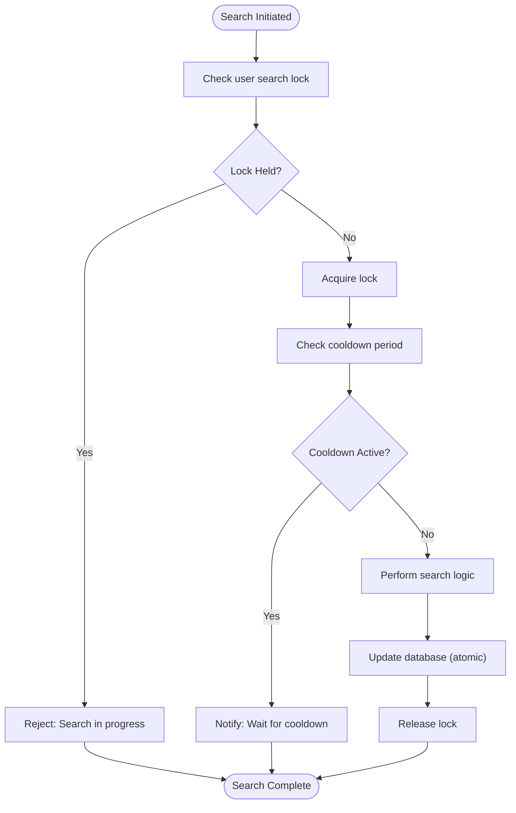

# Core System Architecture

<cite>
**Referenced Files in This Document**   
- [Bot_new.py](file://Bot_new.py) - *Updated in recent commit*
- [database.py](file://database.py) - *Updated in recent commit*
- [constants.py](file://constants.py)
- [silk_city.py](file://silk_city.py) - *Added in recent commit*
- [silk_ui.py](file://silk_ui.py) - *Added in recent commit*
</cite>

## Update Summary
- Added new section on Silk City features including plantations, harvest notifications, and market system
- Added new section on Silk City inventory and statistics
- Updated Table of Contents to include new Silk City sections
- Added sources for new features and updated code references
- Removed outdated diagram sources where diagrams were conceptual

## Table of Contents
1. [Energy Drink Collection System](#energy-drink-collection-system)
2. [Inventory Management](#inventory-management)
3. [Search Command Implementation](#search-command-implementation)
4. [Integration with VIP System and Economic Model](#integration-with-vip-system-and-economic-model)
5. [Concurrency and Race Condition Handling](#concurrency-and-race-condition-handling)
6. [Silk City Features](#silk-city-features)
7. [Silk City Inventory and Statistics](#silk-city-inventory-and-statistics)

## Energy Drink Collection System

The RELOAD bot implements a cooldown-based energy drink collection system that governs how frequently users can search for new items. The core mechanic is defined by the `SEARCH_COOLDOWN` constant in `constants.py`, which sets the base cooldown period at 300 seconds (5 minutes). This value is dynamically adjusted for VIP users, who benefit from a 50% reduced cooldown due to their subscription status.

When a user initiates a search via the `/find` command or the "Find energy" button, the system first checks whether the user is within their cooldown period by comparing the current time with the `last_search` timestamp stored in the database. If the cooldown has not expired, the request is rejected with an appropriate message. For VIP users, the effective cooldown (`eff_search_cd`) is calculated as `SEARCH_COOLDOWN / 2`, providing a significant gameplay advantage.

Upon successful cooldown validation, the system selects a random energy drink from the available pool using `db.get_all_drinks()`. The rarity of the found item is determined through a weighted random selection based on the `RARITIES` dictionary, where rarer items have lower probability weights. Special items bypass this system and are automatically assigned the 'Special' rarity.

Users are rewarded with a random amount of septims (5-10 coins) upon finding an energy drink, with VIP users receiving double the reward. This economic incentive encourages regular engagement with the collection system. The entire process is logged for monitoring and analytics purposes, capturing details such as user ID, found item, rarity, and coin rewards.

**Section sources**
- [Bot_new.py](file://Bot_new.py#L490-L539)
- [constants.py](file://constants.py#L5-L7)

## Inventory Management

The inventory management system implements both pagination and sorting mechanisms to provide an organized and user-friendly interface for viewing collected energy drinks. The inventory display is accessible through the "Inventory" button in the main menu and shows items across multiple pages when necessary.

Pagination is controlled by the `ITEMS_PER_PAGE` constant, which is set to 10 items per page. When displaying the inventory, the system calculates the total number of pages based on the user's inventory size and implements navigation buttons (previous, next) to allow users to browse through their collection. The current page number and total page count are displayed to provide context.

Items can be sorted in multiple ways depending on the viewing context. The standard inventory view sorts items according to a predefined rarity hierarchy specified in `RARITY_ORDER`, which ranks items from most to least valuable: Special, Majestic, Absolute, Elite, Medium, Basic. Within each rarity tier, items are further sorted alphabetically by name. This dual-sorting mechanism ensures a consistent and logical presentation of the user's collection.

Additionally, a new inventory view sorted by quantity has been implemented for the Receiver interface. This view sorts items primarily by quantity in descending order, allowing users to easily identify their most abundant items for potential sale. The sorting is implemented with the key function `lambda i: (-i.quantity, i.drink.name.lower())`, which first sorts by negative quantity (to achieve descending order) and then alphabetically by name for items with the same quantity.

The interface groups items by rarity, displaying a header for each rarity tier with its corresponding emoji indicator from `COLOR_EMOJIS`. Each item is presented with its name and quantity, allowing users to quickly assess their collection composition. Navigation is intuitive, with dedicated buttons for moving between pages and returning to the main menu.

**Section sources**
- [Bot_new.py](file://Bot_new.py#L811-L844)
- [Bot_new.py](file://Bot_new.py#L991-L1008)
- [constants.py](file://constants.py#L15-L16)

### New Inventory Sorting by Quantity for Receiver
A new inventory view has been added specifically for the Receiver interface that sorts items by quantity in descending order. This feature helps users quickly identify which items they have in abundance and may want to sell. The implementation uses Python's built-in sorting with a custom key function that prioritizes quantity over alphabetical order.

The sorting logic is implemented in the `show_receiver_inventory` function, which processes the inventory items with:
```python
sorted_items = sorted(
    inventory_items,
    key=lambda i: (-i.quantity, i.drink.name.lower()),
)
```

This creates a descending order by quantity (using negative values) and then sorts alphabetically within each quantity group. The pagination system works identically to the standard inventory view, with the same `ITEMS_PER_PAGE` limit and navigation controls.

**Section sources**
- [Bot_new.py](file://Bot_new.py#L991-L1008)

### 'Sell All But One' Inventory Functionality
A new 'sell all but one' option has been added to the inventory management system, allowing users to sell multiple copies of an item while retaining one for their collection. This feature provides greater flexibility in inventory management and helps users optimize their coin earnings without completely depleting rare items.

The functionality is implemented through a new button callback handler `handle_sell_all_but_one` that processes the sale request. When triggered, it calls the `db.sell_all_but_one` function in the database module, which performs the following operations:
- Validates that the user owns the item and has more than one copy
- Calculates the quantity to sell (total quantity minus one)
- Determines the payout based on the item's rarity and the `RECEIVER_PRICES` with commission applied
- Updates the inventory by reducing the quantity and credits the user's coin balance
- Returns detailed transaction information including unit payout, quantity sold, and total payout

The feature includes proper locking mechanisms to prevent race conditions during concurrent operations, using a user-specific lock identified by `f"sell_all_but_one:{user_id}:{item_id}"`.

**Section sources**
- [Bot_new.py](file://Bot_new.py#L1197-L1223)
- [database.py](file://database.py#L2992-L3020)

## Search Command Implementation

The `/find` command serves as the primary interface for energy drink collection, triggering a comprehensive sequence of operations across multiple components. When invoked, the command first acquires a user-specific lock (`_get_lock(f"user:{user.id}:search")`) to prevent concurrent searches and potential race conditions.

The command handler performs an initial cooldown check using the user's `last_search` timestamp and the current `SEARCH_COOLDOWN` value, adjusted for VIP status. If the cooldown period has not elapsed, the user receives a notification with the remaining time. Upon passing the cooldown check, the system displays a loading animation with rotating search indicators to provide visual feedback during processing.

The core search logic is encapsulated in the `_perform_energy_search` function, which coordinates the selection of a random energy drink, determination of its rarity, updating of the user's inventory, and calculation of coin rewards. The selected drink is added to the user's inventory via `db.add_drink_to_inventory`, while the user's coin balance is updated through `db.update_player` with the appropriate reward amount.

For successful searches, the system generates a detailed response message that includes the drink's name, rarity (with emoji indicator), reward amount, and description. If the drink has an associated image, it is displayed alongside the text. The user's `last_search` timestamp is updated to enforce the cooldown period for future searches.



**Diagram sources**
- [Bot_new.py](file://Bot_new.py#L563-L598)
- [database.py](file://database.py#L2044-L2074)

**Section sources**
- [Bot_new.py](file://Bot_new.py#L3353-L3386)
- [Bot_new.py](file://Bot_new.py#L490-L539)

## Integration with VIP System and Economic Model

The energy drink collection system is deeply integrated with the VIP subscription system and broader economic model of the RELOAD bot. VIP status, determined by `db.is_vip(user.id)`, provides multiple advantages that enhance the user experience and create a compelling value proposition for subscription.

VIP users benefit from a 50% reduction in both the search cooldown (`SEARCH_COOLDOWN / 2`) and daily bonus cooldown (`DAILY_BONUS_COOLDOWN / 2`), allowing them to collect rewards more frequently. Additionally, they receive double the coin rewards from searches, significantly accelerating their accumulation of in-game currency. These multiplier effects create a positive feedback loop where VIP status enables faster progression and greater earning potential.

The economic model is further reinforced through the autosearch feature, which allows VIP users to automatically perform searches up to a daily limit (`AUTO_SEARCH_DAILY_LIMIT`). This passive income mechanism operates through scheduled jobs in the Telegram bot framework, with the system automatically triggering searches at appropriate intervals. The autosearch functionality respects the same cooldown mechanics as manual searches but operates in the background, providing continuous rewards without requiring active user participation.

The system also integrates with the marketplace economy through defined pricing structures. The `RECEIVER_PRICES` dictionary establishes base values for selling energy drinks, while `SHOP_PRICES` determines purchase costs with a multiplier applied. This creates a balanced economy where users can buy and sell items at predictable rates, with the `RECEIVER_COMMISSION` ensuring the system retains a percentage of transaction value.

**Section sources**
- [constants.py](file://constants.py#L20-L37)
- [Bot_new.py](file://Bot_new.py#L361-L393)
- [database.py](file://database.py#L1629-L1668)

## Concurrency and Race Condition Handling

The RELOAD bot implements robust mechanisms to prevent race conditions and ensure data consistency during concurrent operations, particularly for critical actions like searching and inventory management. The primary defense against race conditions is the use of asyncio locks, with each user having a dedicated search lock identified by `f"user:{user.id}:search"`.

When a user initiates a search, the system first checks if the lock is already acquired. If so, the request is immediately rejected with a "Search already in progress" message, preventing multiple simultaneous searches that could lead to inconsistent state or unfair advantages. This locking mechanism is applied consistently across all search entry points, including the `/find` command, button presses, and autosearch jobs.

For database operations, the system employs transactional integrity through SQLAlchemy's session management. Operations that modify multiple related records, such as adding an item to inventory and updating player statistics, are wrapped in atomic transactions. If any part of the operation fails, the entire transaction is rolled back, ensuring that the database remains in a consistent state.

The autosearch system includes additional safeguards to prevent conflicts with manual searches. Before executing an autosearch job, the system checks if the user's search lock is held, indicating an ongoing manual search. If a conflict is detected, the autosearch is rescheduled for a short delay, allowing the manual search to complete first. This coordination ensures that users cannot exploit timing differences between automated and manual actions.



**Diagram sources**
- [Bot_new.py](file://Bot_new.py#L563-L598)
- [Bot_new.py](file://Bot_new.py#L361-L393)

**Section sources**
- [Bot_new.py](file://Bot_new.py#L311-L329)
- [database.py](file://database.py#L2044-L2074)

## Silk City Features

The Silk City feature introduces a new economic layer to the RELOAD bot, centered around silk plantations, market trading, and resource management. This system allows players to invest in plantations, grow silk, and participate in a dynamic market economy.

The core of the Silk City system is the plantation management, where players can create plantations at different investment levels (starter, standard, premium, master). Each level has different costs, growth times, and expected yields. When creating a plantation, players must have sufficient coins, and the creation process deducts the investment cost from their balance.

Plantations have a growth cycle that transitions through states: growing, ready, and completed. The growth time is determined by the investment level and can be reduced for VIP users through the `SILK_VIP_BONUSES['growth_speedup']` multiplier. During growth, the plantation's progress can be monitored through a progress bar in the UI.

When a plantation is ready for harvest, the system automatically updates its status through the periodic `update_plantation_statuses` job. Players receive notifications about ready plantations through the `silk_harvest_reminder_job`, which checks for ready plantations and sends notifications to players.

The harvest process yields different types of silk (raw, refined, premium) based on weighted probabilities defined in `SILK_TYPES`. The actual yield is calculated by considering the plantation's expected yield, quality modifier, and weather modifier. VIP users receive additional bonuses to yield and quality through `SILK_VIP_BONUSES`.

Players can sell their harvested silk on the market, where prices fluctuate based on market dynamics defined in `SILK_MARKET_PRICES`. The selling price is influenced by the silk's quality grade, with higher quality silk fetching better prices. The market interface shows current prices and allows players to sell 1, 5, or all units of a particular silk type.

**Section sources**
- [silk_city.py](file://silk_city.py#L100-L300)
- [silk_ui.py](file://silk_ui.py#L150-L250)
- [constants.py](file://constants.py#L100-L150)

## Silk City Inventory and Statistics

The Silk City system provides comprehensive inventory and statistics tracking to help players manage their silk resources and monitor their economic activities.

The silk inventory system allows players to view all their silk items, including quantity, quality grade, and production date. The inventory is accessed through the "Silk Inventory" button in the Silk City menu and displays items with their corresponding emojis, names, quantities, quality descriptions, and production dates.

Quality grades are categorized as follows: Superior (≥400), Excellent (≥350), Good (≥300), Average (≥250), and Low (<250). This quality system affects the selling price of silk, creating an incentive for players to optimize their plantation management for higher quality yields.

The statistics system provides a comprehensive overview of a player's Silk City activities, including:
- Plantation statistics: active and completed plantations, total invested coins
- Silk inventory: total silk units and breakdown by type
- Trading statistics: number of sales, total earnings, and profit (earnings minus investment)

The statistics are calculated by querying the database for relevant records and aggregating the data. The `get_silk_city_stats` function in `silk_city.py` retrieves plantation, inventory, and transaction data to generate the complete statistics report.

The UI for statistics presents this information in a clear, organized format with appropriate emojis and formatting. Players can access their statistics from the main Silk City menu, and the information is updated in real-time to reflect their current status.

The inventory and statistics systems are integrated with the rest of the Silk City features, providing players with the information they need to make strategic decisions about their plantations and market activities. This transparency enhances the gameplay experience by allowing players to track their progress and optimize their strategies.

**Section sources**
- [silk_city.py](file://silk_city.py#L400-L450)
- [silk_ui.py](file://silk_ui.py#L250-L330)
- [database.py](file://database.py#L229-L243)