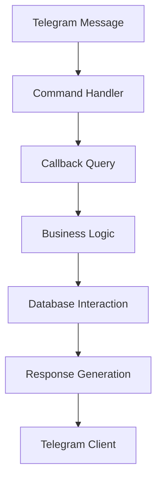
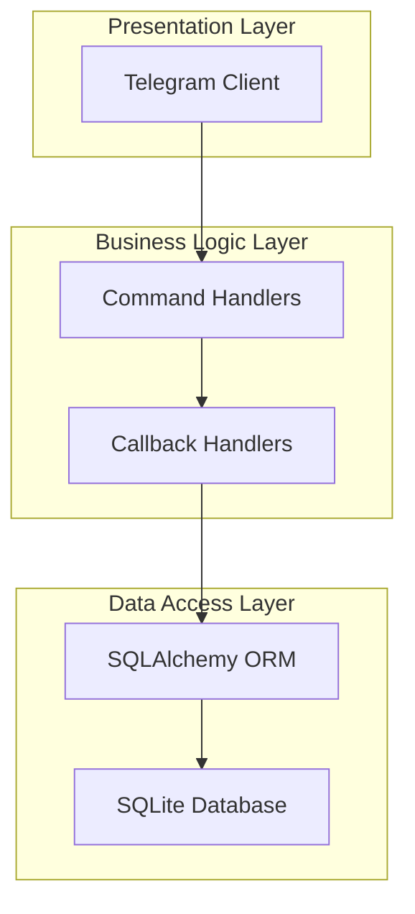
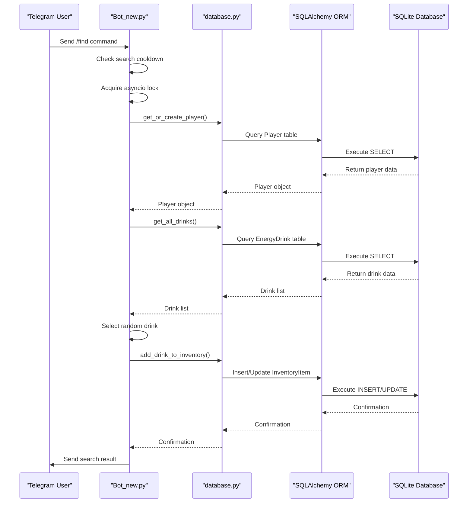
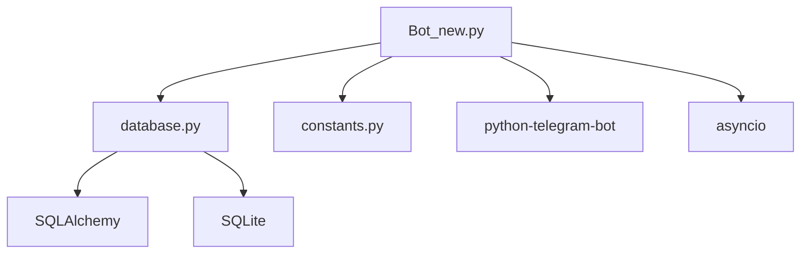

# Data Flow

<cite>
**Referenced Files in This Document**   
- [Bot_new.py](file://Bot_new.py)
- [database.py](file://database.py)
- [constants.py](file://constants.py)
</cite>

## Table of Contents
1. [Introduction](#introduction)
2. [Project Structure](#project-structure)
3. [Core Components](#core-components)
4. [Architecture Overview](#architecture-overview)
5. [Detailed Component Analysis](#detailed-component-analysis)
6. [Dependency Analysis](#dependency-analysis)
7. [Performance Considerations](#performance-considerations)
8. [Troubleshooting Guide](#troubleshooting-guide)
9. [Conclusion](#conclusion)

## Introduction
This document provides a comprehensive analysis of the data flow architecture in the RELOAD application, focusing on the lifecycle of a user action—specifically, searching for an energy drink via a Telegram message. The flow spans from command parsing through business logic execution, database interaction using SQLAlchemy ORM, and response generation. The asynchronous nature of the system is managed using asyncio and the python-telegram-bot framework’s handler system. The document also explains how callback queries manage state transitions without server-side session storage, details data transformation stages such as input validation and model hydration, and covers error handling and logging practices. A visual data flow diagram illustrates message propagation, database transactions, and external API interactions. Performance considerations, including database query optimization and rate limiting, are also addressed.

## Project Structure
The RELOAD application is structured as a modular Telegram bot with distinct components for handling user interactions, business logic, and data persistence. The core files include `Bot_new.py` for command and callback handling, `database.py` for ORM-based database interactions, and `constants.py` for shared configuration values. Additional modules such as `admin.py`, `admin2.py`, and `fullhelp.py` provide administrative functionality and user assistance. The project uses SQLite for data storage, with SQLAlchemy ORM facilitating database operations. The structure supports asynchronous execution through asyncio, enabling non-blocking I/O operations for handling multiple user interactions concurrently.

**Diagram sources**
- [Bot_new.py](file://Bot_new.py#L0-L5444)
- [database.py](file://database.py#L0-L3060)

**Section sources**
- [Bot_new.py](file://Bot_new.py#L0-L5444)
- [database.py](file://database.py#L0-L3060)
- [constants.py](file://constants.py#L0-L76)

## Core Components
The core components of the RELOAD application include the command handlers in `Bot_new.py`, which process user actions such as searching for an energy drink. The `find_energy` function handles the search command, performing cooldown checks and initiating the search logic. The `_perform_energy_search` function encapsulates the core business logic, including rarity determination, inventory updates, and reward calculation. Database interactions are managed through SQLAlchemy ORM in `database.py`, with functions like `get_or_create_player` and `add_drink_to_inventory` ensuring data consistency. The application uses asyncio for asynchronous execution, allowing non-blocking operations during database queries and message handling.

**Section sources**
- [Bot_new.py](file://Bot_new.py#L0-L5444)
- [database.py](file://database.py#L0-L3060)

## Architecture Overview
The RELOAD application follows a layered architecture with clear separation between the presentation layer (Telegram interface), business logic layer (command and callback handlers), and data access layer (SQLAlchemy ORM). The python-telegram-bot framework handles incoming messages and dispatches them to appropriate handlers. Business logic is executed asynchronously using asyncio, ensuring that the application remains responsive during long-running operations. Database interactions are abstracted through SQLAlchemy ORM, providing a high-level interface for CRUD operations. The architecture supports state management through callback queries, eliminating the need for server-side session storage.

**Diagram sources**
- [Bot_new.py](file://Bot_new.py#L0-L5444)
- [database.py](file://database.py#L0-L3060)

## Detailed Component Analysis
### Search Functionality Analysis
The search functionality is initiated when a user sends a Telegram message or clicks a button to search for an energy drink. The `find_energy` function in `Bot_new.py` handles this action, first checking for cooldowns and then invoking `_perform_energy_search` to execute the core logic. The function uses asyncio locks to prevent race conditions during concurrent searches. Rarity is determined using weighted random selection based on probabilities defined in `constants.py`. The found drink is added to the user's inventory via `add_drink_to_inventory`, and the player's coin balance is updated.

#### Sequence Diagram for Search Flow

**Diagram sources**
- [Bot_new.py](file://Bot_new.py#L0-L5444)
- [database.py](file://database.py#L0-L3060)

**Section sources**
- [Bot_new.py](file://Bot_new.py#L0-L5444)
- [database.py](file://database.py#L0-L3060)

### Data Transformation and Validation
Data transformation occurs throughout the search process, starting with input validation in the command handlers. The `find_energy` function validates the user's cooldown status before proceeding. During inventory updates, the `add_drink_to_inventory` function ensures data consistency by checking for existing items and incrementing quantities as needed. Model hydration is handled by SQLAlchemy ORM, which maps database rows to Python objects. Output formatting is performed in the response generation phase, where the search result is formatted as a Telegram message with HTML parsing enabled.

**Section sources**
- [Bot_new.py](file://Bot_new.py#L0-L5444)
- [database.py](file://database.py#L0-L3060)

## Dependency Analysis
The RELOAD application has a well-defined dependency structure, with `Bot_new.py` depending on `database.py` for data access and `constants.py` for configuration values. The `database.py` module depends on SQLAlchemy for ORM functionality and SQLite for data storage. External dependencies include the python-telegram-bot framework for handling Telegram interactions and asyncio for asynchronous execution. The application uses a modular design, with administrative functionality separated into `admin.py` and `admin2.py`, reducing coupling between components.

**Diagram sources**
- [Bot_new.py](file://Bot_new.py#L0-L5444)
- [database.py](file://database.py#L0-L3060)
- [constants.py](file://constants.py#L0-L76)

**Section sources**
- [Bot_new.py](file://Bot_new.py#L0-L5444)
- [database.py](file://database.py#L0-L3060)
- [constants.py](file://constants.py#L0-L76)

## Performance Considerations
Performance in the RELOAD application is optimized through several mechanisms. Database queries are optimized using SQLAlchemy ORM's `joinedload` feature, which reduces the number of queries by loading related data in a single operation. Rate limiting is implemented through cooldown checks in the command handlers, preventing abuse of the search functionality. The use of asyncio ensures that the application remains responsive during long-running operations, such as database queries. Additionally, the application uses caching mechanisms, such as the `SHOP_OFFERS` dictionary, to reduce the frequency of database queries.

**Section sources**
- [Bot_new.py](file://Bot_new.py#L0-L5444)
- [database.py](file://database.py#L0-L3060)

## Troubleshooting Guide
Common issues in the RELOAD application include database connection errors, race conditions during concurrent searches, and incorrect cooldown calculations. Database connection errors can be resolved by ensuring that the SQLite database file is accessible and properly configured. Race conditions can be mitigated by using asyncio locks to synchronize access to shared resources. Cooldown calculation errors can be addressed by verifying the accuracy of the `SEARCH_COOLDOWN` and `DAILY_BONUS_COOLDOWN` constants in `constants.py`. Logging is implemented using Python's built-in logging module, with log messages written to a file for debugging purposes.

**Section sources**
- [Bot_new.py](file://Bot_new.py#L0-L5444)
- [database.py](file://database.py#L0-L3060)
- [constants.py](file://constants.py#L0-L76)

## Conclusion
The RELOAD application demonstrates a robust data flow architecture, leveraging asyncio and the python-telegram-bot framework to handle user interactions asynchronously. The use of SQLAlchemy ORM simplifies database interactions, while the modular design promotes maintainability and scalability. The application effectively manages state through callback queries, eliminating the need for server-side session storage. Performance is optimized through query optimization, rate limiting, and caching, ensuring a responsive user experience. The comprehensive error handling and logging practices facilitate troubleshooting and debugging, making the application reliable and easy to maintain.