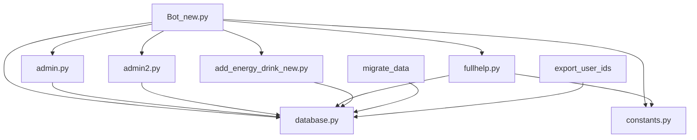
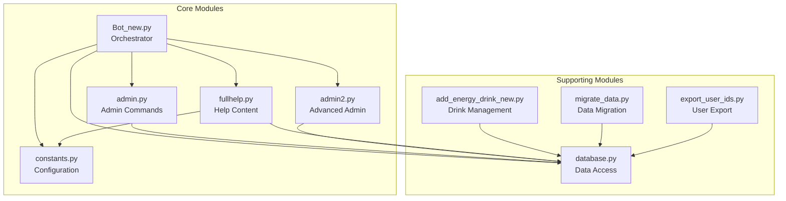
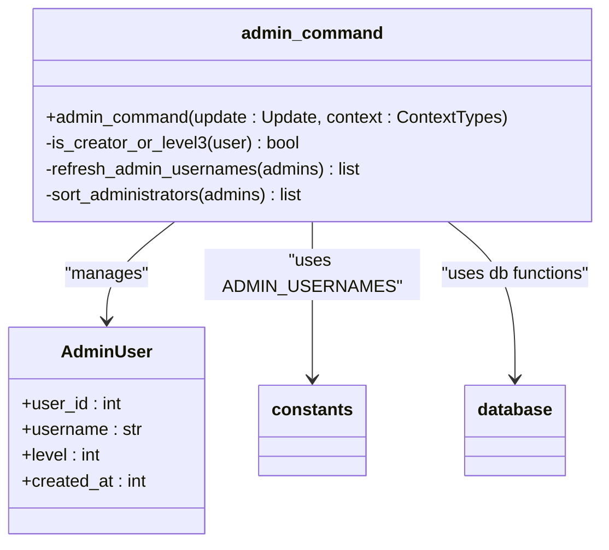
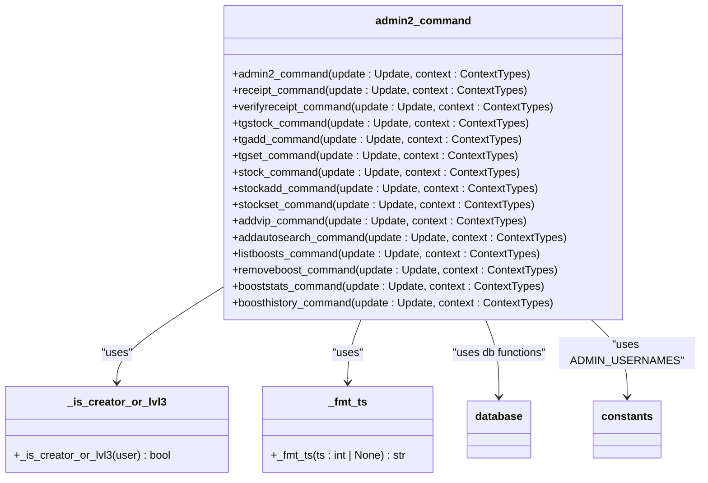
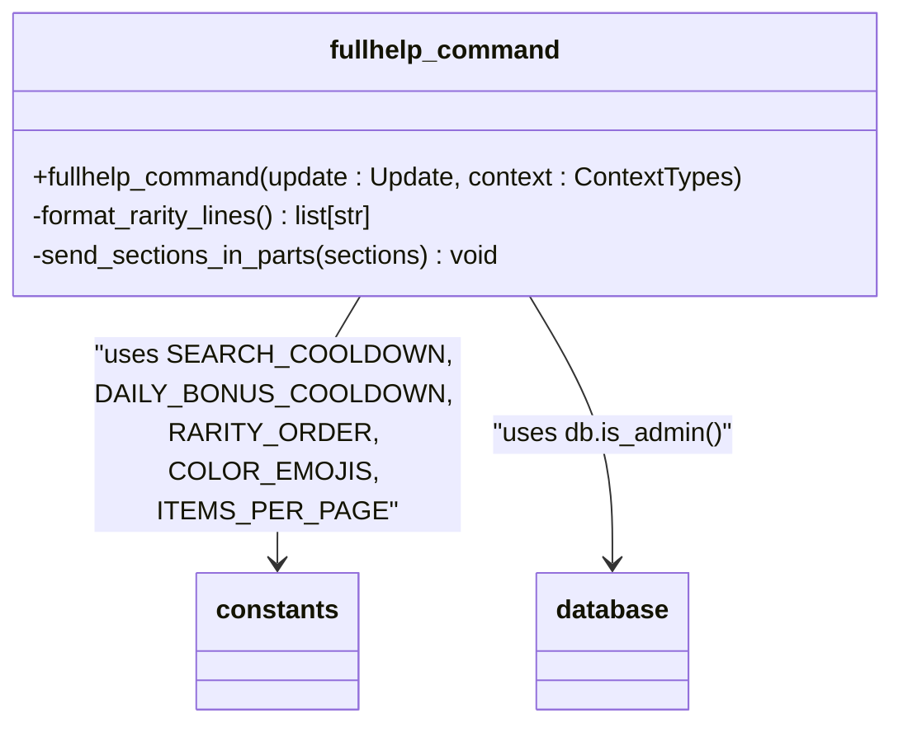
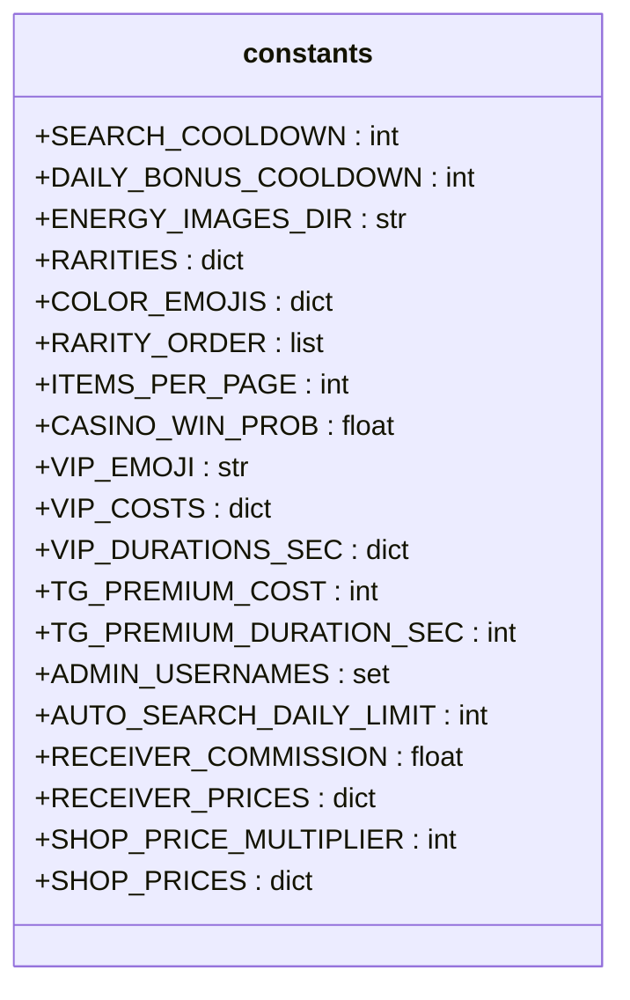
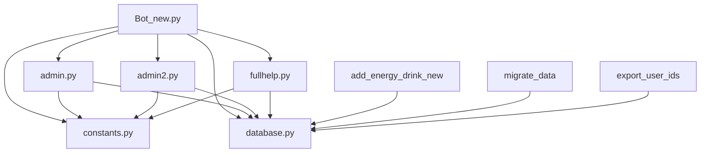

# Modular Design

<cite>
**Referenced Files in This Document**   
- [Bot_new.py](file://Bot_new.py)
- [admin.py](file://admin.py)
- [admin2.py](file://admin2.py)
- [fullhelp.py](file://fullhelp.py)
- [constants.py](file://constants.py)
</cite>

## Table of Contents
1. [Introduction](#introduction)
2. [Project Structure](#project-structure)
3. [Core Components](#core-components)
4. [Architecture Overview](#architecture-overview)
5. [Detailed Component Analysis](#detailed-component-analysis)
6. [Dependency Analysis](#dependency-analysis)
7. [Performance Considerations](#performance-considerations)
8. [Troubleshooting Guide](#troubleshooting-guide)
9. [Conclusion](#conclusion)

## Introduction
This document provides architectural documentation for the modular design of the RELOAD application, a Telegram bot for collecting energy drinks. The system is structured into distinct, reusable components that follow the principle of separation of concerns. The main orchestrator, `Bot_new.py`, integrates various modules responsible for administrative commands (`admin.py`, `admin2.py`), help content delivery (`fullhelp.py`), and configuration management (`constants.py`). This modular approach enables loose coupling between components, allowing for easier maintenance, testing, and extension of functionality. The document details how these modules interact through well-defined interfaces and imports, while also addressing design trade-offs related to global state usage and their implications for testability and maintainability.

## Project Structure
The RELOAD application follows a flat module structure where each file represents a distinct functional component. The core modules include `Bot_new.py` as the main entry point, administrative command handlers in `admin.py` and `admin2.py`, help content management in `fullhelp.py`, and centralized configuration in `constants.py`. Supporting modules handle database operations, data migration, and utility functions. This organization promotes separation of concerns by isolating specific responsibilities within dedicated files, making the codebase more maintainable and understandable.

**Diagram sources**
- [Bot_new.py](file://Bot_new.py#L1-L5444)
- [admin.py](file://admin.py#L1-L185)
- [admin2.py](file://admin2.py#L1-L772)
- [fullhelp.py](file://fullhelp.py#L1-L150)
- [constants.py](file://constants.py#L1-L76)
- [database.py](file://database.py#L1-L3060)
- [add_energy_drink_new.py](file://add_energy_drink_new.py#L1-L76)
- [migrate_data.py](file://migrate_data.py#L1-L110)
- [export_user_ids.py](file://export_user_ids.py#L1-L95)

**Section sources**
- [Bot_new.py](file://Bot_new.py#L1-L5444)
- [admin.py](file://admin.py#L1-L185)
- [admin2.py](file://admin2.py#L1-L772)
- [fullhelp.py](file://fullhelp.py#L1-L150)
- [constants.py](file://constants.py#L1-L76)

## Core Components
The RELOAD application's architecture centers around several core components that work together to provide a cohesive user experience. `Bot_new.py` serves as the primary orchestrator, initializing the application and registering command handlers from various modules. The administrative functionality is split between `admin.py` and `admin2.py`, with the former handling basic administrative commands and the latter providing advanced administrative features. The `fullhelp.py` module delivers comprehensive help content to users, while `constants.py` centralizes configuration values used throughout the application. This separation of concerns allows each component to focus on its specific responsibilities while maintaining loose coupling through well-defined interfaces.

**Section sources**
- [Bot_new.py](file://Bot_new.py#L1-L5444)
- [admin.py](file://admin.py#L1-L185)
- [admin2.py](file://admin2.py#L1-L772)
- [fullhelp.py](file://fullhelp.py#L1-L150)
- [constants.py](file://constants.py#L1-L76)

## Architecture Overview
The RELOAD application follows a modular architecture where `Bot_new.py` acts as the main entry point and orchestrator. It imports and integrates various specialized modules that handle specific aspects of the application's functionality. The architecture emphasizes separation of concerns by isolating administrative command logic in `admin.py` and `admin2.py`, help content delivery in `fullhelp.py`, and configuration management in `constants.py`. These modules communicate through well-defined interfaces, primarily via function imports and shared data structures. The application leverages the python-telegram-bot library to handle Telegram API interactions, with command handlers registered to respond to user inputs. This modular design enables loose coupling between components, making the system more maintainable and extensible.

**Diagram sources**
- [Bot_new.py](file://Bot_new.py#L1-L5444)
- [admin.py](file://admin.py#L1-L185)
- [admin2.py](file://admin2.py#L1-L772)
- [fullhelp.py](file://fullhelp.py#L1-L150)
- [constants.py](file://constants.py#L1-L76)
- [database.py](file://database.py#L1-L3060)
- [add_energy_drink_new.py](file://add_energy_drink_new.py#L1-L76)
- [migrate_data.py](file://migrate_data.py#L1-L110)
- [export_user_ids.py](file://export_user_ids.py#L1-L95)

## Detailed Component Analysis
This section provides an in-depth analysis of the key components in the RELOAD application, examining their responsibilities, interactions, and implementation details. Each component is designed to encapsulate specific functionality while maintaining loose coupling with other parts of the system through well-defined interfaces and import mechanisms.

### Bot_new.py - Main Orchestrator
The `Bot_new.py` module serves as the primary entry point and orchestrator for the RELOAD application. It initializes the Telegram bot using the python-telegram-bot library and registers command handlers from various modules. The file imports administrative command handlers from `admin.py` and `admin2.py`, help content from `fullhelp.py`, and configuration constants from `constants.py`. This centralized registration mechanism allows the orchestrator to maintain control over the application flow while delegating specific responsibilities to specialized modules. The use of global variables for configuration and state management enables consistent access to shared data across different components.

**Section sources**
- [Bot_new.py](file://Bot_new.py#L1-L5444)

### Admin Command Modules
The administrative functionality in the RELOAD application is divided between two modules: `admin.py` and `admin2.py`. This separation allows for a clear distinction between basic and advanced administrative capabilities, with different access levels and permissions.

#### admin.py - Basic Administrative Commands
The `admin.py` module handles fundamental administrative commands such as managing administrator roles, viewing moderation requests, and providing administrative help. It imports the `ADMIN_USERNAMES` constant from `constants.py` to determine bootstrap administrators and uses the database module for persistent storage operations. The module implements role-based access control, with different command availability based on administrator levels. This design enables a hierarchical administrative structure where higher-level administrators can manage lower-level ones, promoting a scalable and secure administration model.

**Diagram sources**
- [admin.py](file://admin.py#L1-L185)
- [constants.py](file://constants.py#L1-L76)
- [database.py](file://database.py#L1-L3060)

#### admin2.py - Advanced Administrative Commands
The `admin2.py` module provides advanced administrative features that require higher privileges, such as managing inventory stock, verifying receipts, and granting VIP status. It builds upon the basic administrative framework by implementing more complex operations that affect the game economy and user privileges. The module uses helper functions like `_is_creator_or_lvl3` to enforce access control and `_fmt_ts` for timestamp formatting. This separation of advanced commands into a dedicated module enhances security by limiting access to sensitive operations while maintaining a consistent administrative interface.

**Diagram sources**
- [admin2.py](file://admin2.py#L1-L772)
- [constants.py](file://constants.py#L1-L76)
- [database.py](file://database.py#L1-L3060)

### fullhelp.py - Help Content Delivery
The `fullhelp.py` module is responsible for delivering comprehensive help content to users, particularly administrators. It imports configuration constants from `constants.py` to provide accurate information about cooldown times, rarity systems, and other game mechanics. The module implements a paginated response system to handle Telegram's message length limitations, ensuring that help content is delivered reliably. Access control is enforced through database queries to verify administrator status, preventing unauthorized access to sensitive information. This design centralizes help content in a single module, making it easier to maintain and update as the application evolves.

**Diagram sources**
- [fullhelp.py](file://fullhelp.py#L1-L150)
- [constants.py](file://constants.py#L1-L76)
- [database.py](file://database.py#L1-L3060)

### constants.py - Configuration Centralization
The `constants.py` module serves as the central repository for configuration values used throughout the RELOAD application. It defines various game mechanics such as cooldown periods, rarity distributions, VIP pricing, and economic parameters. By centralizing these values, the module enables consistent behavior across different components and simplifies configuration management. The use of dictionaries for related values (e.g., `RARITIES`, `VIP_COSTS`) provides a structured approach to configuration that is both readable and maintainable. This design pattern reduces the risk of configuration inconsistencies and makes it easier to modify game parameters without changing code in multiple locations.

**Diagram sources**
- [constants.py](file://constants.py#L1-L76)

## Dependency Analysis
The RELOAD application demonstrates a well-structured dependency graph where modules are organized to promote loose coupling and separation of concerns. The main orchestrator `Bot_new.py` imports functionality from specialized modules, creating a clear hierarchy of dependencies. Administrative modules (`admin.py` and `admin2.py`) depend on both the `constants.py` module for configuration and the `database.py` module for persistent storage operations. The `fullhelp.py` module similarly depends on configuration constants and database functions for access control. This dependency structure enables each module to focus on its specific responsibilities while maintaining consistent access to shared resources.

**Diagram sources**
- [Bot_new.py](file://Bot_new.py#L1-L5444)
- [admin.py](file://admin.py#L1-L185)
- [admin2.py](file://admin2.py#L1-L772)
- [fullhelp.py](file://fullhelp.py#L1-L150)
- [constants.py](file://constants.py#L1-L76)
- [database.py](file://database.py#L1-L3060)
- [add_energy_drink_new.py](file://add_energy_drink_new.py#L1-L76)
- [migrate_data.py](file://migrate_data.py#L1-L110)
- [export_user_ids.py](file://export_user_ids.py#L1-L95)

## Performance Considerations
The RELOAD application's modular design has several performance implications that affect both runtime efficiency and development workflow. The use of global variables for configuration and state management in `Bot_new.py` provides fast access to shared data but may introduce contention in high-concurrency scenarios. The database module implements connection pooling through SQLAlchemy's SessionLocal, which helps mitigate database connection overhead. The help content delivery system in `fullhelp.py` uses message chunking to handle Telegram's length limitations, ensuring reliable delivery at the cost of multiple API calls. The administrative command modules implement access control checks that add minimal overhead but are essential for security. Overall, the modular architecture enables targeted performance optimizations by isolating functionality in dedicated components.

## Troubleshooting Guide
When troubleshooting issues in the RELOAD application, consider the following common scenarios and their solutions:

1. **Command handlers not responding**: Verify that command handlers are properly registered in `Bot_new.py` and that the bot has the necessary permissions in the Telegram group or channel.

2. **Database connection issues**: Ensure that the SQLite database file (`bot_data.db`) is accessible and not locked by another process. Check file permissions and disk space.

3. **Configuration inconsistencies**: Verify that configuration values in `constants.py` are correctly imported and used across modules. Inconsistent configuration can lead to unexpected behavior.

4. **Access control failures**: Check that administrator usernames in `constants.py` match the actual Telegram usernames and that database records for administrators are correctly maintained.

5. **Message delivery problems**: For modules that send multiple messages (like `fullhelp.py`), ensure that the bot is not exceeding Telegram's rate limits. Implement appropriate error handling for message sending failures.

**Section sources**
- [Bot_new.py](file://Bot_new.py#L1-L5444)
- [admin.py](file://admin.py#L1-L185)
- [admin2.py](file://admin2.py#L1-L772)
- [fullhelp.py](file://fullhelp.py#L1-L150)
- [constants.py](file://constants.py#L1-L76)
- [database.py](file://database.py#L1-L3060)

## Conclusion
The RELOAD application demonstrates a well-structured modular design that effectively separates concerns and promotes loose coupling between components. The architecture centers around `Bot_new.py` as the main orchestrator, which integrates specialized modules for administrative functions, help content delivery, and configuration management. This design enables maintainability and extensibility by isolating specific responsibilities within dedicated files. The use of centralized configuration in `constants.py` ensures consistency across the application, while the separation of administrative commands into `admin.py` and `admin2.py` provides a clear hierarchy of privileges. Although the use of global state introduces some challenges for testability, the overall modular approach facilitates targeted testing and debugging. The application's design supports future extensions by providing clear integration points for new functionality, making it a robust foundation for continued development.