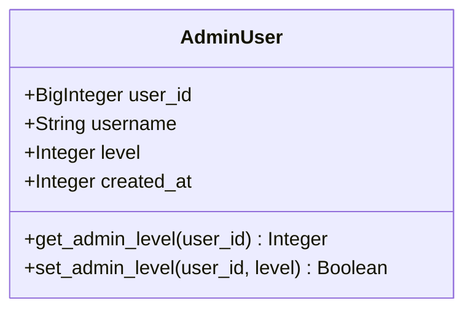
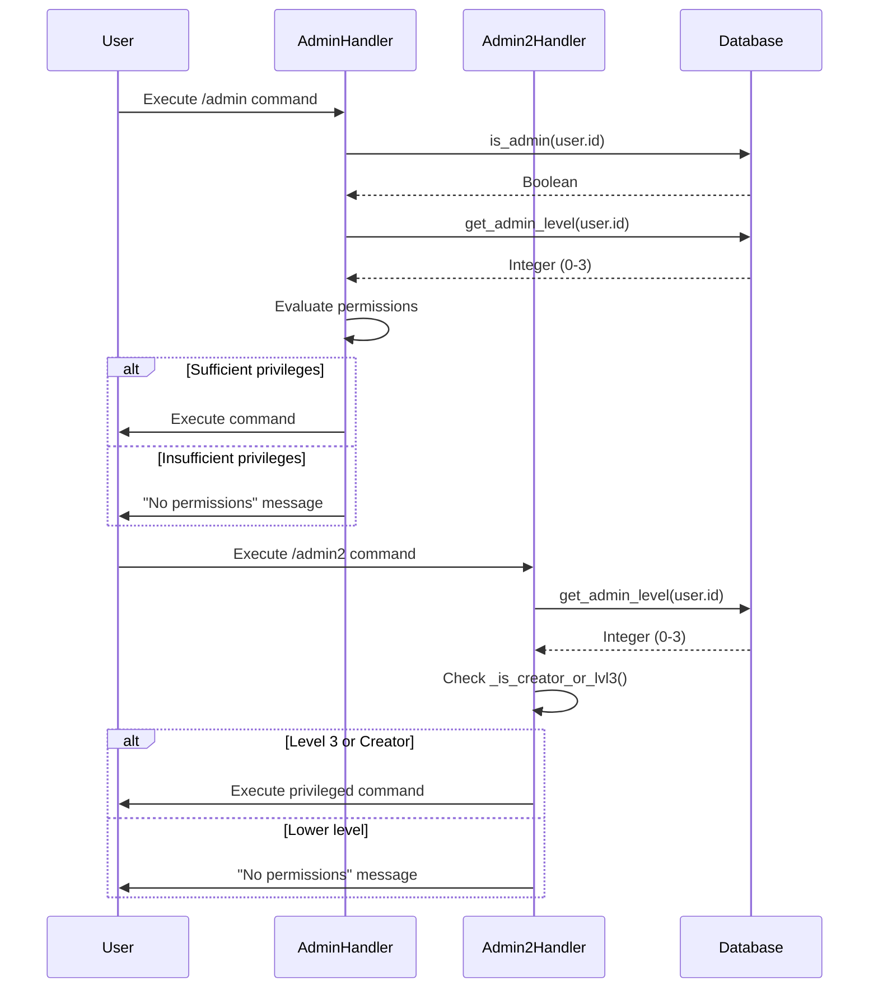
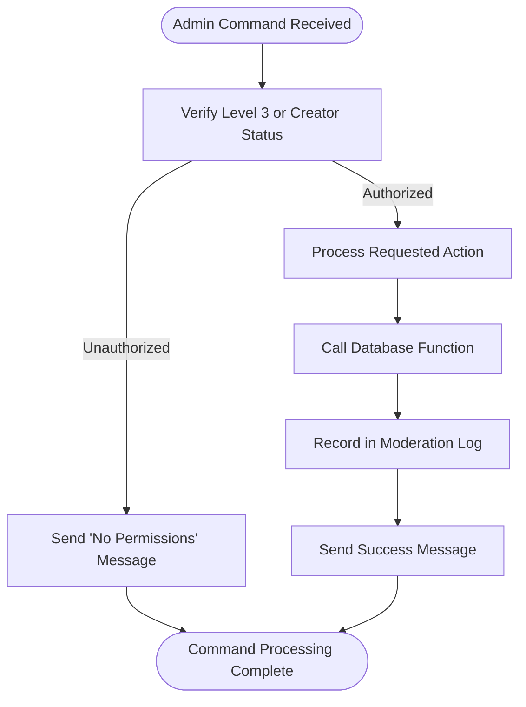

# AdminUser Model

<cite>
**Referenced Files in This Document**   
- [database.py](file://database.py#L78-L83)
- [database.py](file://database.py#L2493-L2533)
- [database.py](file://database.py#L2533-L2732)
- [admin.py](file://admin.py#L159-L183)
- [admin2.py](file://admin2.py#L15-L25)
</cite>

## Table of Contents
1. [Introduction](#introduction)
2. [Core Fields and Data Structure](#core-fields-and-data-structure)
3. [Primary Key and Indexing](#primary-key-and-indexing)
4. [Hierarchical Privilege System](#hierarchical-privilege-system)
5. [Integration with Command Handlers](#integration-with-command-handlers)
6. [Security Practices and Permission Checks](#security-practices-and-permission-checks)
7. [Administrative Queries and Examples](#administrative-queries-and-examples)
8. [Data Integrity and Audit Considerations](#data-integrity-and-audit-considerations)

## Introduction
The AdminUser model in the RELOAD application implements a role-based access control (RBAC) system that enables granular administrative privileges across multiple levels. This model supports a hierarchical structure where higher-level administrators can manage lower-level ones, ensuring proper delegation of authority and operational security. The implementation is tightly integrated with command handlers in `admin.py` and `admin2.py`, enforcing authorization checks before executing sensitive operations such as user bans or database modifications. This document details the structure, functionality, and security mechanisms of the AdminUser model.

## Core Fields and Data Structure
The AdminUser model defines the following core fields:
- **user_id**: Unique identifier for the admin user (BigInteger)
- **username**: Telegram username of the admin (String, optional)
- **level**: Administrative privilege level (Integer, default=1)
- **created_at**: Timestamp of when the admin record was created (Integer)

The `level` field implements a three-tier hierarchy:
- Level 1: Junior Moderator
- Level 2: Senior Moderator
- Level 3: Head Administrator

This structure enables progressive responsibility assignment and ensures that critical operations require higher authorization levels.

**Section sources**
- [database.py](file://database.py#L78-L83)

## Primary Key and Indexing
The AdminUser model uses `user_id` as its primary key, ensuring each administrator is uniquely identified by their Telegram user ID. Additionally, an index is created on the `user_id` field to optimize query performance for authentication and permission checks.

The primary key constraint guarantees data integrity by preventing duplicate admin entries for the same user, while the indexing strategy supports efficient lookups during authorization processes.

**Section sources**
- [database.py](file://database.py#L78-L83)

## Hierarchical Privilege System
The AdminUser model implements a hierarchical privilege system where:
- Level 3 administrators (Head Admins) have full administrative capabilities
- Level 2 administrators (Senior Moderators) have intermediate privileges
- Level 1 administrators (Junior Moderators) have basic moderation rights

Level 3 admins and bootstrap creators (defined in `constants.ADMIN_USERNAMES`) can perform all administrative actions, including adding, removing, and modifying admin levels. Lower-level admins have restricted capabilities based on their level, with permission checks enforced through the `get_admin_level()` function.

The `set_admin_level()` function allows privileged users to modify admin levels, while `get_admin_level()` returns the appropriate level (1-3) or 0 for non-admin users.

**Diagram sources**
- [database.py](file://database.py#L78-L83)
- [database.py](file://database.py#L2549-L2557)
- [database.py](file://database.py#L2621-L2634)

## Integration with Command Handlers
The AdminUser model is integrated with two primary command handlers:

### admin.py Integration
The `admin_command` function in `admin.py` serves as the main administrative interface, providing different command sets based on the user's privilege level:
- **Level 3 and Creators**: Can add, remove, and modify admin users
- **All Admin Levels**: Can manage moderation requests and view system information

The handler uses `is_admin()` and `get_admin_level()` to verify permissions before executing commands.

### admin2.py Integration
The `admin2_command` function provides additional privileged commands accessible only to Level 3 admins and creators, including:
- Stock management
- Receipt verification
- VIP status assignment
- Bonus distribution

Both handlers use the `_is_creator_or_lvl3()` helper function to consolidate permission checks for Level 3 privileges.

**Diagram sources**
- [admin.py](file://admin.py#L159-L183)
- [admin2.py](file://admin2.py#L15-L25)
- [database.py](file://database.py#L2549-L2557)

## Security Practices and Permission Checks
The system enforces strict security practices through comprehensive permission checks:

### Authorization Workflow
Before executing any sensitive operation, the system performs authorization checks using:
- `is_admin()`: Verifies if a user has any administrative privileges
- `get_admin_level()`: Determines the specific privilege level
- Username-based checks against `ADMIN_USERNAMES` for bootstrap accounts

### Permission Enforcement
Critical operations require explicit permission verification:
- Admin management (add/remove/modify) requires Level 3 or creator status
- Moderation actions have tiered requirements based on action sensitivity
- Financial operations and system modifications are restricted to highest privileges

The system implements fail-safe mechanisms by denying access by default and requiring explicit permission grants.

**Section sources**
- [admin.py](file://admin.py#L159-L183)
- [admin2.py](file://admin2.py#L15-L25)
- [database.py](file://database.py#L2549-L2557)

## Administrative Queries and Examples
The AdminUser model supports several key administrative queries:

### Common Queries
- **List all admins**: `get_admin_users()` returns all administrative accounts with their levels
- **Check admin status**: `is_admin(user_id)` verifies if a user has administrative privileges
- **Get admin level**: `get_admin_level(user_id)` returns the specific privilege level (1-3) or 0
- **Add admin**: `add_admin_user(user_id, username, level)` creates or updates an admin record
- **Remove admin**: `remove_admin_user(user_id)` deletes an admin account
- **Modify level**: `set_admin_level(user_id, level)` changes an admin's privilege level

### Example Usage
When adding a new admin:
1. Command initiator must be Level 3 or creator
2. System calls `add_admin_user()` with target user ID and desired level
3. If successful, `insert_moderation_log()` records the action
4. Appropriate confirmation is sent to the initiator

**Diagram sources**
- [database.py](file://database.py#L2493-L2533)
- [database.py](file://database.py#L2621-L2634)
- [admin.py](file://admin.py#L159-L183)

## Data Integrity and Audit Considerations
The AdminUser model incorporates several data integrity and audit mechanisms:

### Data Integrity
- **Schema Migration**: The system includes migration logic to add the `level` column to existing `admin_users` tables and backfill default values
- **Constraint Enforcement**: Primary key constraints prevent duplicate admin entries
- **Input Validation**: Level values are restricted to 1-3, with appropriate defaults

### Audit Trail
All administrative actions are logged through the `insert_moderation_log()` function, which records:
- Actor ID (who performed the action)
- Action type (e.g., admin_add, admin_remove, admin_level_change)
- Target ID (affected user)
- Details (additional context, such as level changes)

These logs provide a comprehensive audit trail for privilege changes and administrative activities, supporting accountability and security monitoring.

**Section sources**
- [database.py](file://database.py#L2365-L2374)
- [database.py](file://database.py#L2636-L2650)
- [admin.py](file://admin.py#L170-L178)