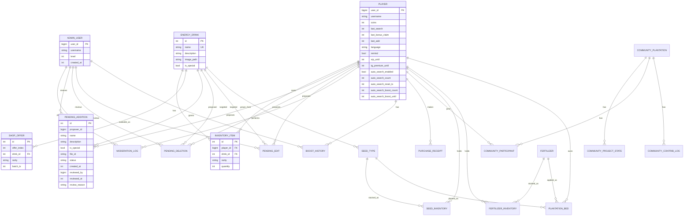

# Database Schema Design

<cite>
**Referenced Files in This Document**   
- [database.py](file://database.py)
- [constants.py](file://constants.py)
</cite>

## Table of Contents
1. [Introduction](#introduction)
2. [Entity-Relationship Diagram](#entity-relationship-diagram)
3. [Core Data Models](#core-data-models)
4. [Business Rules and Game Mechanics](#business-rules-and-game-mechanics)
5. [Data Access Patterns and Sample Queries](#data-access-patterns-and-sample-queries)
6. [Data Validation and Constraints](#data-validation-and-constraints)
7. [Indexing and Performance Optimization](#indexing-and-performance-optimization)
8. [Transaction Management](#transaction-management)
9. [Data Lifecycle and Migration](#data-lifecycle-and-migration)
10. [Conclusion](#conclusion)

## Introduction

This document provides comprehensive documentation for the database schema of the RELOAD application, a Telegram bot for collecting energy drinks. The schema is designed to support core gameplay mechanics including player progression, inventory management, shop systems, and administrative moderation. The database is implemented using SQLite with SQLAlchemy ORM, featuring a normalized structure to ensure data integrity and efficient querying.

The primary entities include Player, EnergyDrink, InventoryItem, AdminUser, PendingAddition, and ShopOffer, which form the backbone of the application's data model. These entities are interconnected through well-defined relationships that support the game's business logic, such as how player status affects collection rates and how rarity levels influence inventory sorting. The schema also includes supporting entities for moderation workflows, transaction logging, and system operations.

This documentation details the field definitions, data types, primary and foreign keys, constraints, and indexes for each table. It explains the business rules governing entity interactions, provides sample queries for common access patterns, and outlines data validation rules and performance optimization strategies. The document also covers transaction management patterns, data lifecycle policies, and considerations for future schema migrations.

**Section sources**
- [database.py](file://database.py#L1-L100)

## Entity-Relationship Diagram



**Diagram sources**
- [database.py](file://database.py#L19-L100)

## Core Data Models

### Player Model
The Player model represents a Telegram user participating in the game. Each player is uniquely identified by their user_id, which corresponds to their Telegram ID. The model tracks various gameplay metrics including coin balance, cooldown timers for actions like searching and claiming daily bonuses, and player preferences such as language and reminder settings.

VIP status is managed through the vip_until field, which stores a Unix timestamp indicating when the VIP status expires. The model also supports an auto-search feature with fields to track enabled status, daily search count, reset timestamp, and boost information. The relationship with InventoryItem establishes a one-to-many association, allowing players to own multiple inventory items.

**Section sources**
- [database.py](file://database.py#L19-L38)

### EnergyDrink Model
The EnergyDrink model defines the catalog of collectible energy drinks in the game. Each drink has a unique name, description, and optional image path. The is_special flag indicates whether the drink belongs to a special category. The model serves as the reference point for all drink-related operations, including inventory management, shop offerings, and moderation requests.

Drinks are referenced by other entities through their primary key ID, establishing foreign key relationships with InventoryItem, ShopOffer, and various moderation entities. The unique constraint on the name field ensures that no two drinks can have identical names, maintaining data integrity across the application.

**Section sources**
- [database.py](file://database.py#L40-L46)

### InventoryItem Model
The InventoryItem model represents a player's collection of energy drinks. Each inventory item is associated with a specific player and drink, with the rarity field indicating the quality tier of the collected item. The quantity field tracks how many copies of the same drink and rarity combination the player possesses.

The model includes indexes on player_id, drink_id, and rarity to optimize query performance for common operations like retrieving a player's inventory or counting specific items. The relationship with Player and EnergyDrink enables efficient navigation between entities, allowing the application to display comprehensive inventory information with minimal database queries.

**Section sources**
- [database.py](file://database.py#L48-L62)

### AdminUser Model
The AdminUser model manages administrative privileges within the application. Each admin is identified by their Telegram user_id and has a level field that determines their permissions (1=Junior Moderator, 2=Senior Moderator, 3=Head Admin). The created_at field records when the admin account was created.

This model enables role-based access control, allowing different levels of administrative functionality. Admins can perform moderation tasks such as reviewing pending additions, deletions, and edits, with their actions logged in the ModerationLog table. The relationship with moderation entities ensures accountability and auditability of administrative actions.

**Section sources**
- [database.py](file://database.py#L78-L83)

### PendingAddition Model
The PendingAddition model handles user-submitted requests to add new energy drinks to the game. Each pending addition includes the proposer's ID, proposed drink details (name, description, special status), and file ID for the drink image. The status field tracks the review progress (pending/approved/rejected).

The model supports a moderation workflow where admins can review and approve or reject submissions. The reviewed_by and reviewed_at fields record which admin processed the request and when, while review_reason stores any comments. This entity enables community-driven content expansion while maintaining quality control through administrative oversight.

**Section sources**
- [database.py](file://database.py#L87-L99)

### ShopOffer Model
The ShopOffer model implements the in-game shop system, offering players the ability to purchase energy drinks with coins. The shop refreshes every 4 hours, generating 50 randomized offers based on available drinks and their rarity weights. Each offer includes an index (1-50), associated drink ID, assigned rarity, and batch timestamp.

The batch_ts field enables the application to determine when the current set of offers was generated, facilitating automatic refresh when the 4-hour window expires. Indexes on offer_index, drink_id, rarity, and batch_ts optimize query performance for retrieving and displaying shop contents. This model supports a dynamic economy where players can acquire rare items through purchases.

**Section sources**
- [database.py](file://database.py#L66-L74)

## Business Rules and Game Mechanics

### Rarity-Based Inventory Sorting
The application implements a sophisticated sorting mechanism for player inventories based on rarity levels. The RARITY_ORDER constant in constants.py defines the hierarchy from most to least valuable: Special, Majestic, Absolute, Elite, Medium, Basic. When displaying a player's inventory, items are sorted first by rarity according to this order, then alphabetically by drink name.

This sorting behavior is implemented in the inventory display function, which uses the RARITY_ORDER.index() method to determine the sort position of each rarity level. The visual presentation groups items by rarity, with emoji indicators (from COLOR_EMOJIS) providing immediate visual feedback on item quality. This design encourages players to pursue higher rarity items and provides a clear progression path.

**Section sources**
- [database.py](file://database.py#L19-L38)
- [constants.py](file://constants.py#L25-L35)

### VIP Status and Collection Rate Modifications
VIP status significantly enhances gameplay by modifying collection rates and enabling special features. Players with active VIP status (vip_until > current timestamp) receive benefits including increased auto-search limits and potentially enhanced drop rates. The VIP system is managed through administrative commands that can grant VIP status to individual players or all players.

The auto_search_enabled field allows VIP players to perform automated searches, with the auto_search_count tracking daily usage and auto_search_reset_ts indicating when the count resets. The system also supports temporary boosts to the auto-search limit through the auto_search_boost_count and auto_search_boost_until fields, which can be granted by administrators for special events or rewards.

**Section sources**
- [database.py](file://database.py#L19-L38)
- [constants.py](file://constants.py#L45-L55)

### Shop Offer Generation and Pricing
The shop system follows a carefully balanced economic model. Shop offers are regenerated every 4 hours if the current batch is older than the refresh interval or if fewer than 50 offers exist. The generation process randomly selects drinks and assigns rarities based on weighted probabilities defined in the RARITIES constant, with Basic items being most common and Majestic items being rarest.

Pricing is determined by the SHOP_PRICES dictionary, which multiplies the base receiver prices by a SHOP_PRICE_MULTIPLIER (currently 3). This creates a balanced economy where players can sell items back at a lower price than purchase cost, preventing inflation and encouraging active gameplay. The pricing model ensures that rarer items have proportionally higher values, reinforcing their desirability.

**Section sources**
- [database.py](file://database.py#L347-L400)
- [constants.py](file://constants.py#L65-L75)

## Data Access Patterns and Sample Queries

### Retrieving User Inventory
The most common data access pattern involves retrieving a player's complete inventory with detailed information about each item. This requires joining the InventoryItem table with the EnergyDrink table to obtain drink names, descriptions, and images, while also considering the player's sorting preferences.

```sql
SELECT 
    ii.id,
    ii.quantity,
    ii.rarity,
    ed.name,
    ed.description,
    ed.image_path
FROM inventory_items ii
JOIN energy_drinks ed ON ii.drink_id = ed.id
WHERE ii.player_id = :user_id
ORDER BY 
    CASE ii.rarity 
        WHEN 'Special' THEN 0
        WHEN 'Majestic' THEN 1
        WHEN 'Absolute' THEN 2
        WHEN 'Elite' THEN 3
        WHEN 'Medium' THEN 4
        WHEN 'Basic' THEN 5
    END,
    ed.name ASC;
```

This query leverages the indexes on player_id and the relationship between inventory_items and energy_drinks to efficiently retrieve and sort the data. The application implements pagination with ITEMS_PER_PAGE items per page, reducing memory usage and improving response times for players with large inventories.

**Section sources**
- [database.py](file://database.py#L48-L62)
- [constants.py](file://constants.py#L35)

### Checking Cooldown Status
The application frequently needs to check whether a player can perform time-limited actions such as searching for energy drinks or claiming daily bonuses. This involves comparing the current timestamp with the last action timestamp stored in the Player model.

```sql
SELECT 
    user_id,
    coins,
    last_search,
    last_bonus_claim,
    vip_until,
    (strftime('%s', 'now') - last_search) as search_cooldown_remaining,
    (strftime('%s', 'now') - last_bonus_claim) as bonus_cooldown_remaining
FROM players 
WHERE user_id = :user_id;
```

The cooldown status is calculated by subtracting the last action timestamp from the current Unix timestamp. If the result is less than the cooldown period (SEARCH_COOLDOWN or DAILY_BONUS_COOLDOWN), the action is still on cooldown. VIP players may have reduced cooldowns or additional actions available through their boosted limits.

**Section sources**
- [database.py](file://database.py#L19-L38)
- [constants.py](file://constants.py#L15-L20)

### Admin Moderation Workflow
Administrators need to review pending additions, deletions, and edits to maintain game content quality. This requires querying the pending tables with status filters and joining with player and admin information for context.

```sql
SELECT 
    pa.id,
    pa.proposer_id,
    p.username as proposer_username,
    pa.name,
    pa.description,
    pa.is_special,
    pa.status,
    pa.created_at,
    a.username as reviewer_username,
    pa.reviewed_at,
    pa.review_reason
FROM pending_additions pa
LEFT JOIN players p ON pa.proposer_id = p.user_id
LEFT JOIN admin_users a ON pa.reviewed_by = a.user_id
WHERE pa.status = 'pending'
ORDER BY pa.created_at ASC;
```

This query retrieves all pending addition requests with associated proposer and reviewer information, allowing administrators to make informed decisions about content approval. Similar queries exist for pending deletions and edits, supporting a comprehensive moderation system.

**Section sources**
- [database.py](file://database.py#L87-L99)

## Data Validation and Constraints

### Field-Level Validation
The database schema implements comprehensive field-level validation through SQLAlchemy column constraints and application-level validation rules. Primary keys ensure entity uniqueness, with user_id serving as the primary key for Player and AdminUser tables, and auto-incrementing IDs for other entities.

String fields have appropriate length constraints inferred from their type definitions, while integer fields are validated to ensure non-negative values where appropriate (e.g., coins, quantities). Boolean fields are strictly typed to prevent invalid states. The application enforces additional validation rules in business logic, such as ensuring that rarity values belong to the predefined set of valid rarities.

Foreign key constraints maintain referential integrity between related entities, preventing orphaned records and ensuring that operations like cascading deletes work correctly. For example, when a player is deleted, all their inventory items are automatically removed due to the cascade="all, delete-orphan" setting on the relationship.

**Section sources**
- [database.py](file://database.py#L19-L100)

### Business Rule Validation
Beyond basic field validation, the application enforces complex business rules through application logic and database constraints. The shop offer generation process validates that only existing drinks are included in offers and that rarity assignments follow the weighted probability distribution defined in RARITIES.

Inventory operations validate that players cannot have negative quantities of items, with the decrement_inventory_item function automatically removing inventory records when quantity reaches zero. Purchase operations validate that players have sufficient coins before completing transactions, using database-level locking to prevent race conditions during concurrent purchases.

The moderation system validates that only authorized administrators can approve or reject requests, with level-based permissions ensuring that junior moderators cannot perform actions reserved for senior staff. All moderation actions are logged in the ModerationLog table, providing an audit trail for accountability.

**Section sources**
- [database.py](file://database.py#L2705-L2731)

## Indexing and Performance Optimization

### Strategic Indexing
The database schema employs strategic indexing to optimize query performance for common access patterns. The Player table has an index on user_id (primary key) and additional indexes on vip_until and tg_premium_until to optimize queries for status checks.

The InventoryItem table features composite indexes on player_id, drink_id, and rarity, enabling efficient retrieval of player inventories, item counts, and rarity-based queries. The ShopOffer table has indexes on offer_index, drink_id, rarity, and batch_ts to support fast lookup and filtering of shop contents.

Moderation-related tables include indexes on status and created_at fields to optimize queries for pending requests, while the PendingAddition table has an index on proposer_id to quickly find all requests from a specific user. These indexing strategies ensure that the application can handle growing data volumes without significant performance degradation.

**Section sources**
- [database.py](file://database.py#L48-L62)

### Query Optimization Techniques
The application implements several query optimization techniques to minimize database load and improve response times. The get_or_refresh_shop_offers function uses a two-phase approach, first checking if a refresh is needed before querying the database, reducing unnecessary operations.

Relationship loading is optimized using SQLAlchemy's joinedload option when retrieving shop offers with drink details, eliminating the N+1 query problem. The application also implements caching at the application level for frequently accessed data like the list of energy drinks, reducing database queries for static content.

For inventory operations, the application uses database-level locking (with_for_update) during purchase and decrement operations to prevent race conditions while maintaining performance. Batch operations are used where appropriate, such as when granting VIP status to all players, to minimize the number of database round-trips.

**Section sources**
- [database.py](file://database.py#L347-L400)

## Transaction Management

### Atomic Operations
The application ensures data consistency through careful transaction management, wrapping related operations in atomic transactions. When a player purchases a shop offer, the transaction includes deducting coins from the player's balance and adding the item to their inventory, ensuring that both operations succeed or fail together.

The purchase_shop_offer function uses a try-except block with explicit transaction rollback to handle errors, preventing partial updates that could lead to inconsistent states. Database-level locking (with_for_update) is used during balance checks and updates to prevent race conditions when multiple operations occur simultaneously.

Administrative operations like granting VIP status or auto-search boosts are also wrapped in transactions, with appropriate error handling to ensure that partial updates do not leave the database in an inconsistent state. The application uses SQLAlchemy's session management to automatically handle transaction boundaries in most cases, with manual control when complex operations require it.

**Section sources**
- [database.py](file://database.py#L400-L450)

### Error Handling and Rollback
Comprehensive error handling ensures that database transactions are properly managed even in exceptional circumstances. The application uses try-finally blocks to ensure that database sessions are properly closed, preventing connection leaks.

When exceptions occur during transaction processing, the application attempts to roll back the transaction to maintain data integrity. The purchase_shop_offer and add_auto_search_boost functions include explicit rollback attempts in their exception handlers, with careful consideration of potential secondary exceptions during the rollback process.

The application also logs transaction errors for monitoring and debugging purposes, helping administrators identify and resolve issues. This robust error handling ensures that the database remains consistent even under high load or unexpected conditions, maintaining a reliable user experience.

**Section sources**
- [database.py](file://database.py#L400-L450)

## Data Lifecycle and Migration

### Data Retention Policies
The application implements data retention policies to manage storage requirements while preserving user progress. Player data is retained indefinitely unless explicitly deleted by the user, with inventory items cascading delete when their owner is removed.

Moderation logs and transaction records are retained for auditing purposes, with no automatic expiration. The BoostHistory table maintains a complete record of auto-search boost grants and expirations, supporting administrative review and player inquiries. Shop offer history is retained through the batch_ts system, allowing the application to track offer generations over time.

The application does not currently implement automated data purging, relying on the relatively small data footprint of individual records. Future enhancements could include archival policies for inactive accounts or periodic cleanup of expired temporary records.

**Section sources**
- [database.py](file://database.py#L19-L100)

### Schema Migration Considerations
Future schema changes require careful planning to maintain data integrity and application functionality. The application currently uses a simple SQLite database with schema creation handled by SQLAlchemy's create_all method, which is suitable for initial deployment but not for production environments with existing data.

For future migrations, the application should implement a proper migration framework like Alembic to manage schema changes incrementally. This would allow for controlled updates to the database structure, including adding new fields, modifying constraints, or restructuring tables without data loss.

Migration strategies should include backup procedures, testing in staging environments, and rollback plans. When modifying existing fields, the application should maintain backward compatibility during transition periods. New features should be designed with extensibility in mind, using flexible data types and avoiding hard-coded assumptions that could complicate future changes.

**Section sources**
- [database.py](file://database.py#L1-L50)

## Conclusion

The RELOAD application's database schema is a well-structured foundation for a feature-rich Telegram bot game. The entity-relationship model effectively captures the core gameplay mechanics while maintaining data integrity through appropriate constraints and relationships. The design balances normalization for data consistency with performance considerations through strategic indexing and query optimization.

Key strengths of the schema include its support for complex business rules like rarity-based sorting and VIP status effects, its robust moderation system for community-driven content, and its economic model with balanced shop pricing. The transaction management and error handling ensure data consistency even under concurrent operations.

Future improvements could include implementing a formal migration framework, enhancing data retention policies, and expanding the analytics capabilities through additional logging. The current design provides a solid foundation that can accommodate these enhancements while continuing to support the game's evolving requirements.

The comprehensive documentation provided in this document enables developers and administrators to understand the data model, optimize queries, and implement new features with confidence in the underlying structure's integrity and performance characteristics.