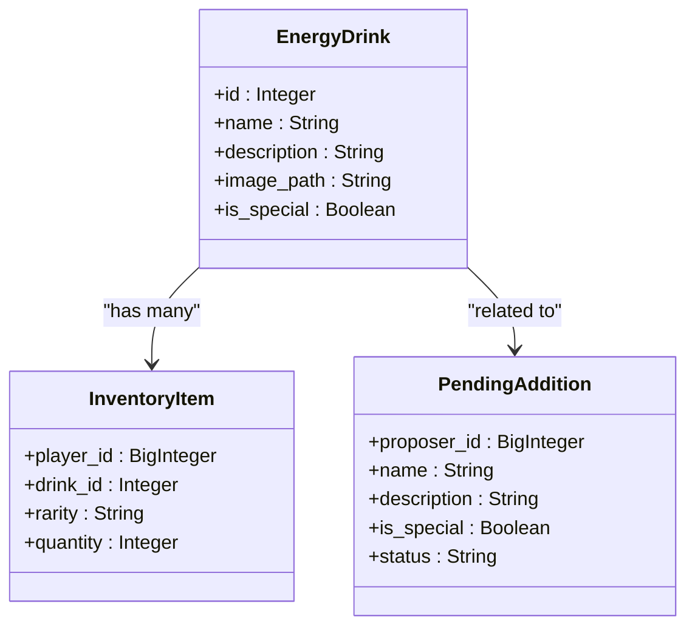
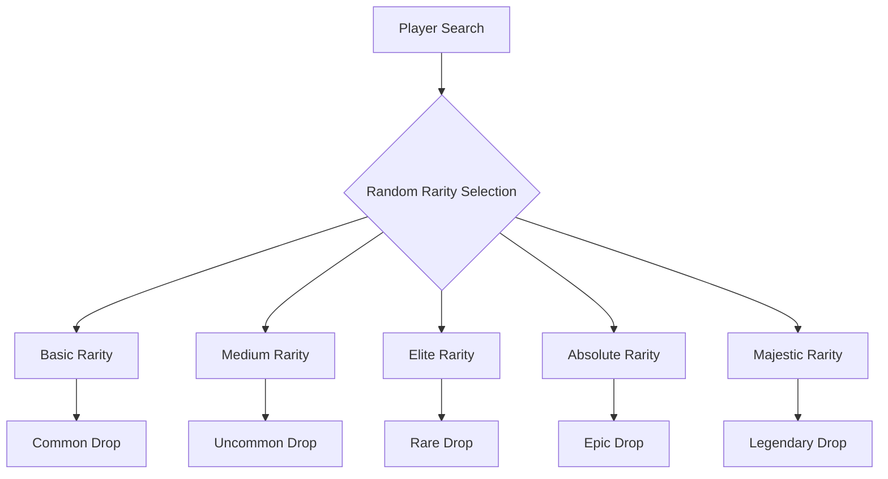
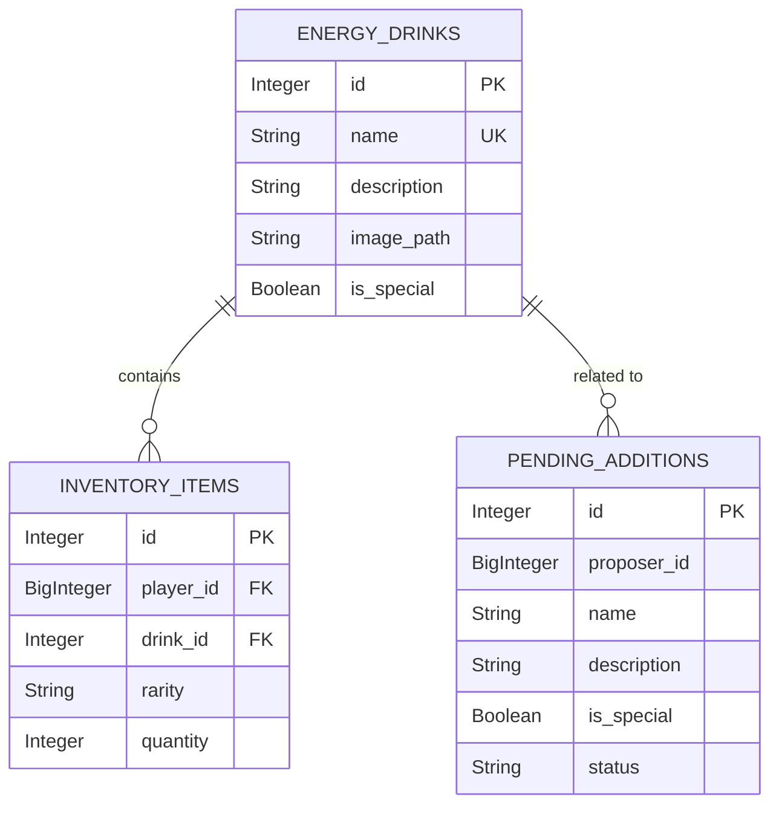

# EnergyDrink Model

<cite>
**Referenced Files in This Document**   
- [database.py](file://database.py)
- [constants.py](file://constants.py)
- [add_energy_drink_new.py](file://add_energy_drink_new.py)
- [admin.py](file://admin.py)
- [Bot_new.py](file://Bot_new.py)
</cite>

## Table of Contents
1. [Introduction](#introduction)
2. [EnergyDrink Entity Structure](#energydrink-entity-structure)
3. [Field Definitions](#field-definitions)
4. [Rarity System and Game Mechanics](#rarity-system-and-game-mechanics)
5. [Relationships with Other Entities](#relationships-with-other-entities)
6. [Content Moderation Workflow](#content-moderation-workflow)
7. [Database Indexing and Query Performance](#database-indexing-and-query-performance)
8. [Drink Addition Process](#drink-addition-process)
9. [Sample Queries](#sample-queries)
10. [Business Rules and Validation](#business-rules-and-validation)

## Introduction
The EnergyDrink entity is a core component of the RELOAD bot, serving as the foundation for the game's collectible item system. This documentation provides a comprehensive overview of the EnergyDrink model, including its structure, relationships, and integration with game mechanics. The model represents various energy drink items that players can collect, trade, and use within the game ecosystem. The design incorporates a robust moderation system for content addition and maintains data integrity through proper constraints and indexing.

## EnergyDrink Entity Structure
The EnergyDrink entity is implemented as a SQLAlchemy model with several key fields that define its properties and behavior within the game. The entity serves as the master definition for all energy drink items in the system, with each instance representing a unique collectible. The model is designed to support game mechanics such as rarity-based drop rates, inventory management, and economic systems.



**Diagram sources**
- [database.py](file://database.py#L40-L46)
- [database.py](file://database.py#L48-L62)
- [database.py](file://database.py#L87-L99)

**Section sources**
- [database.py](file://database.py#L40-L46)

## Field Definitions
The EnergyDrink entity consists of several fields that define its characteristics and behavior within the game:

- **id**: Integer field serving as the primary key with auto-increment functionality. This unique identifier is used to reference the energy drink across the system.
- **name**: String field with a uniqueness constraint and database index, ensuring no duplicate drink names exist in the system.
- **description**: String field containing the descriptive text for the energy drink.
- **image_path**: String field (nullable) that stores the filename of the associated image in the energy_images directory.
- **is_special**: Boolean field with a default value of False, indicating whether the drink has special properties.

The primary key constraint on the id field ensures each energy drink has a unique identifier, while the uniqueness constraint on the name field prevents duplicate entries. These constraints maintain data integrity and support efficient lookups throughout the application.

**Section sources**
- [database.py](file://database.py#L40-L46)

## Rarity System and Game Mechanics
The rarity system is a fundamental game mechanic that influences multiple aspects of gameplay, including drop rates, inventory sorting, and economic value. Although the rarity field is not directly present in the EnergyDrink entity, it is implemented through related systems and constants. The game defines five rarity levels: Basic, Medium, Elite, Absolute, and Majestic, with corresponding weights that determine their relative frequency.

The RARITIES constant in constants.py defines the probability weights for each rarity tier, with higher values indicating more common occurrences. This system affects drop rates during player searches, with rarer items having lower probabilities of appearing. The rarity also influences the sorting order in player inventories, with items typically displayed from rarest to most common.

Additionally, the rarity system impacts the economic aspects of the game through the RECEIVER_PRICES dictionary, which assigns different coin values to items based on their rarity. This creates an incentive structure where rarer items provide greater rewards when sold through the in-game receiver system.



**Diagram sources**
- [constants.py](file://constants.py#L10-L15)
- [constants.py](file://constants.py#L35-L41)

**Section sources**
- [constants.py](file://constants.py#L10-L15)

## Relationships with Other Entities
The EnergyDrink entity maintains several important relationships with other entities in the system, forming the foundation of the game's data model. The most significant relationship is with the InventoryItem entity, which tracks which players possess specific energy drinks and in what quantities.

The InventoryItem entity references the EnergyDrink through a foreign key relationship on the drink_id field, creating a one-to-many relationship where each energy drink can be owned by multiple players. This relationship enables the inventory system to track player collections and supports features like trading and gifting.

Additionally, the EnergyDrink entity is related to the PendingAddition entity, which represents proposed new drinks that are awaiting moderation approval. This relationship facilitates the content moderation workflow by allowing administrators to review and approve new drink submissions before they become available in the game.



**Diagram sources**
- [database.py](file://database.py#L40-L46)
- [database.py](file://database.py#L48-L62)
- [database.py](file://database.py#L87-L99)

**Section sources**
- [database.py](file://database.py#L48-L62)
- [database.py](file://database.py#L87-L99)

## Content Moderation Workflow
The content moderation workflow for energy drinks is implemented through a combination of database entities and administrative commands. The process begins when an administrator submits a new drink proposal through the add_energy_drink_new.py script or via the /add command in the bot interface.

When a new drink is proposed, a record is created in the PendingAddition table with a status of 'pending'. This record contains all the proposed drink information, including name, description, and special status. Administrators with appropriate privileges can then review these pending submissions through the /requests command, which displays a list of pending additions with approval and rejection options.

The moderation process involves several entities working together: the PendingAddition entity stores the proposed content, the ModerationLog entity records all moderation actions, and the AdminUser entity defines administrator privileges. Only administrators with sufficient privileges (level 2 or higher) can approve or reject drink additions, ensuring content quality control.

Once approved, the pending addition is processed, and a new EnergyDrink record is created in the database. The system also handles image uploads, copying the selected image file to the energy_images directory and storing only the filename in the database.

**Section sources**
- [add_energy_drink_new.py](file://add_energy_drink_new.py)
- [database.py](file://database.py#L87-L99)
- [admin.py](file://admin.py)

## Database Indexing and Query Performance
The EnergyDrink entity is optimized for efficient querying through strategic indexing on key fields. The name field has both a uniqueness constraint and a database index, enabling fast lookups when searching for drinks by name. This optimization is critical for the game's search functionality and inventory display.

Additional indexes are implemented on related entities to support common query patterns. The InventoryItem entity has indexes on player_id, drink_id, and rarity fields, allowing for efficient retrieval of player inventories filtered by specific criteria. These indexes support features like displaying a player's collection sorted by rarity or finding all instances of a specific drink across all players.

The indexing strategy also considers the content moderation workflow, with indexes on the status field in the PendingAddition table to quickly identify pending submissions. This allows administrators to efficiently manage the moderation queue and respond to new content proposals in a timely manner.

These indexing decisions balance query performance with write performance, ensuring that the database remains responsive even as the number of records grows over time.

**Section sources**
- [database.py](file://database.py#L40-L46)
- [database.py](file://database.py#L48-L62)
- [database.py](file://database.py#L87-L99)

## Drink Addition Process
The process for adding new energy drinks to the game is managed through the add_energy_drink_new.py script, which provides a command-line interface for administrators. The script guides users through a series of prompts to collect the necessary information for a new drink, including name, description, special status, and image selection.

When a name is entered, the script first checks if a drink with that name already exists in the database. If a match is found, the system switches to update mode, allowing the administrator to modify the existing drink's information. This prevents accidental duplication and supports the editing of existing content.

The image selection process uses a file dialog to allow administrators to choose an image file from their local system. Once selected, the image is copied to the energy_images directory, and only the filename is stored in the database. This approach keeps the database size manageable while ensuring that image files are properly organized.

After all information is collected, the script saves the data to the database and commits the transaction. The process includes validation checks to ensure required fields are not empty and handles potential errors gracefully, providing feedback to the administrator.

**Section sources**
- [add_energy_drink_new.py](file://add_energy_drink_new.py)

## Sample Queries
The following sample queries demonstrate common operations for retrieving energy drink data:

To retrieve all drinks of a specific rarity:
```sql
SELECT ed.* FROM energy_drinks ed 
JOIN inventory_items ii ON ed.id = ii.drink_id 
WHERE ii.rarity = 'Majestic' 
GROUP BY ed.id;
```

To find pending drink submissions:
```sql
SELECT * FROM pending_additions 
WHERE status = 'pending' 
ORDER BY created_at DESC;
```

To get a random drink for a player search:
```sql
SELECT ed.*, 
       CASE 
           WHEN ed.is_special THEN 'Special'
           ELSE (SELECT key FROM json_each('{"Basic":50,"Medium":30,"Elite":15,"Absolute":4,"Majestic":1}') ORDER BY RANDOM() LIMIT 1)
       END as assigned_rarity
FROM energy_drinks ed 
ORDER BY RANDOM() 
LIMIT 1;
```

To list all drinks sorted by rarity frequency:
```sql
SELECT ed.name, ed.description, 
       CASE 
           WHEN ed.is_special THEN 'Special'
           ELSE 'Common'
       END as effective_rarity
FROM energy_drinks ed 
ORDER BY 
       CASE 
           WHEN ed.is_special THEN 0
           ELSE 1
       END, ed.name;
```

**Section sources**
- [database.py](file://database.py)
- [constants.py](file://constants.py)

## Business Rules and Validation
The EnergyDrink system enforces several business rules to maintain data integrity and ensure a consistent player experience. The most fundamental rule is the uniqueness constraint on drink names, which prevents duplicate entries and ensures each drink has a distinct identity within the game.

Before a new drink is added to the database, the system validates that the name field is not empty and that no existing drink has the same name. The image path, while nullable, must reference a valid file in the energy_images directory when provided. These validation rules are enforced both in the add_energy_drink_new.py script and through database constraints.

The moderation workflow implements additional business rules around content approval. Only administrators with appropriate privileges can approve new drink submissions, and all moderation actions are logged in the ModerationLog table for audit purposes. This ensures that content additions are properly vetted and provides a record of all changes to the game's item database.

The system also enforces rules around special drinks, which have unique properties that distinguish them from regular items. These drinks are marked with the is_special flag and may have different drop rates or economic values compared to standard items.

**Section sources**
- [add_energy_drink_new.py](file://add_energy_drink_new.py)
- [database.py](file://database.py#L40-L46)
- [admin.py](file://admin.py)