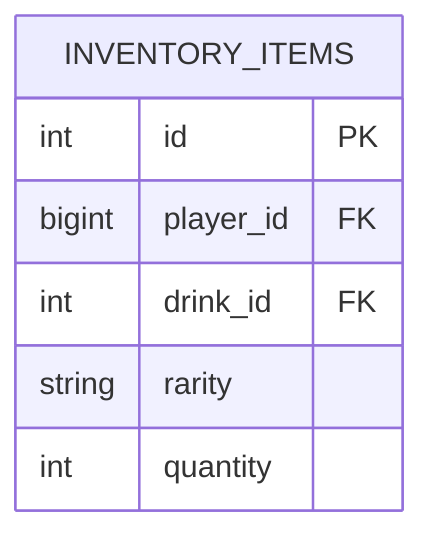
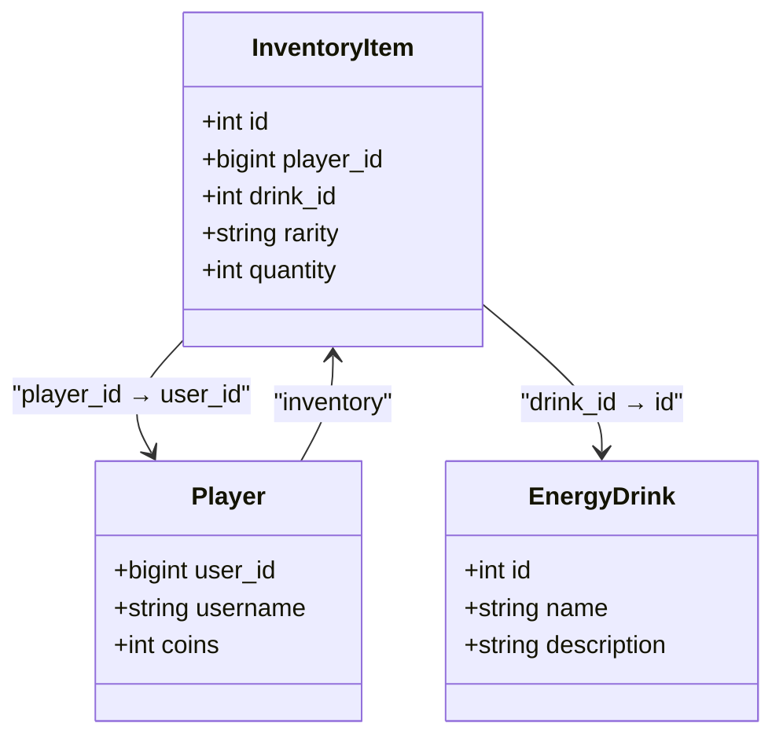
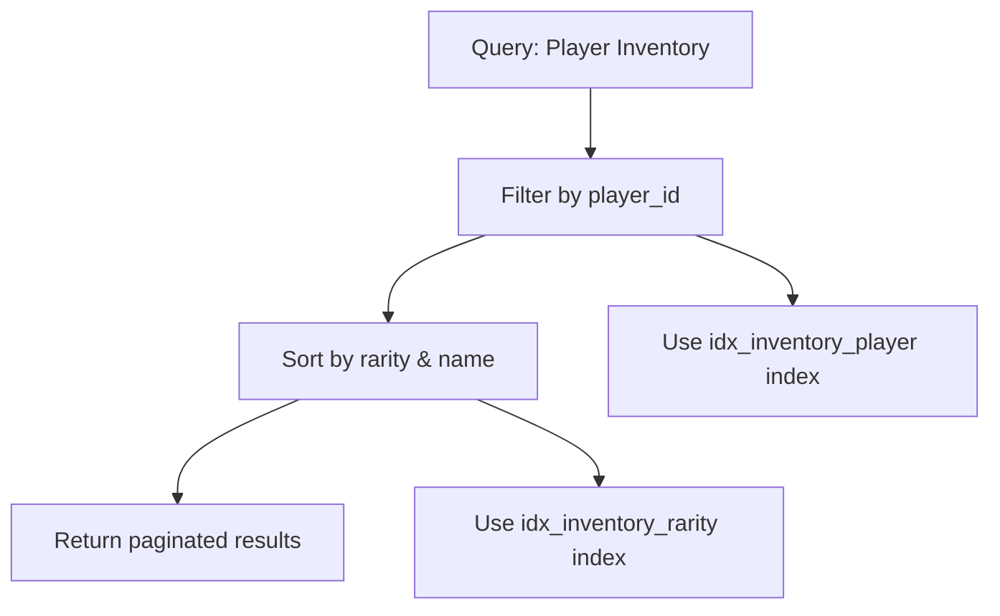
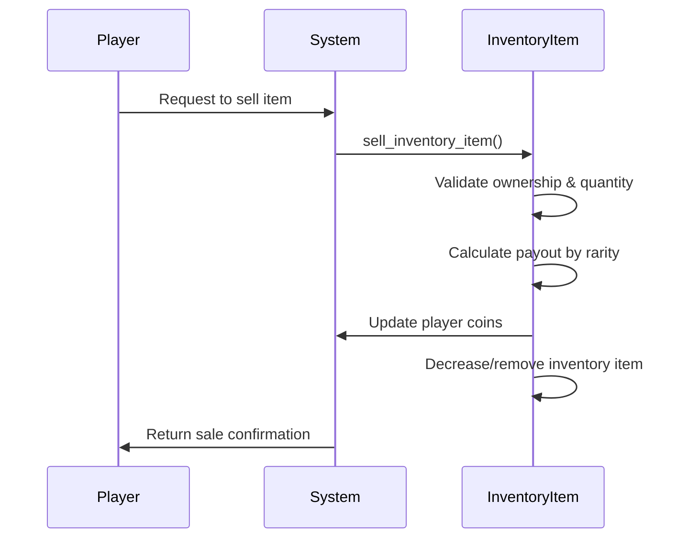

# InventoryItem Model

<cite>
**Referenced Files in This Document**   
- [database.py](file://database.py)
</cite>

## Table of Contents
1. [Introduction](#introduction)
2. [Core Fields and Structure](#core-fields-and-structure)
3. [Relationships and Constraints](#relationships-and-constraints)
4. [Indexing and Performance](#indexing-and-performance)
5. [Business Logic and Economic Actions](#business-logic-and-economic-actions)
6. [Integration with VIP System](#integration-with-vip-system)
7. [Query Examples](#query-examples)
8. [Conclusion](#conclusion)

## Introduction
The `InventoryItem` entity is a central component of the EnergoBot game economy, responsible for tracking player-owned energy drinks. This model enables core gameplay mechanics such as collection, sorting by rarity, and economic transactions through the receiver system. It maintains referential integrity with player and drink entities while supporting scalable inventory operations.

**Section sources**
- [database.py](file://database.py#L48-L62)

## Core Fields and Structure
The `InventoryItem` model contains the following key fields:

- `id`: Primary key with auto-incrementing integer value
- `player_id`: Foreign key referencing the `players.user_id` field
- `drink_id`: Foreign key referencing the `energy_drinks.id` field
- `rarity`: String field storing the item's rarity level (e.g., "Basic", "Majestic")
- `quantity`: Integer field with default value of 1, representing stack size

The model uses SQLAlchemy ORM with proper type annotations and constraints to ensure data integrity.



**Diagram sources**
- [database.py](file://database.py#L48-L62)

**Section sources**
- [database.py](file://database.py#L48-L62)

## Relationships and Constraints
The `InventoryItem` model establishes critical relationships with other entities:

- **Player Relationship**: One-to-many relationship with `Player` via `player_id` foreign key. The `owner` relationship is bidirectional with `Player.inventory`.
- **EnergyDrink Relationship**: One-to-many relationship with `EnergyDrink` via `drink_id` foreign key. The `drink` relationship provides access to drink details.
- **Cascading Deletes**: When a player is deleted, all associated inventory items are automatically removed due to the `cascade="all, delete-orphan"` setting in the `Player.inventory` relationship.

No explicit composite uniqueness constraint is defined, but the combination of `player_id`, `drink_id`, and `rarity` effectively serves as a natural key for inventory aggregation.



**Diagram sources**
- [database.py](file://database.py#L19-L38)
- [database.py](file://database.py#L40-L46)
- [database.py](file://database.py#L48-L62)

**Section sources**
- [database.py](file://database.py#L19-L38)
- [database.py](file://database.py#L40-L46)
- [database.py](file://database.py#L48-L62)

## Indexing and Performance
The model includes three database indexes to optimize query performance:

- `idx_inventory_player`: Index on `player_id` for fast player-specific inventory retrieval
- `idx_inventory_drink`: Index on `drink_id` for efficient drink-based queries
- `idx_inventory_rarity`: Index on `rarity` to support rarity-based sorting and filtering

These indexes are crucial for maintaining performance as inventory sizes grow, particularly during inventory display operations that sort by rarity and name.



**Diagram sources**
- [database.py](file://database.py#L58-L62)

**Section sources**
- [database.py](file://database.py#L58-L62)

## Business Logic and Economic Actions
The `InventoryItem` model supports key economic actions through dedicated functions:

- **Selling Items**: The `sell_inventory_item()` function handles sales through the receiver system, calculating payouts based on rarity and applying commission.
- **Inventory Updates**: The `add_drink_to_inventory()` function manages item acquisition, either creating new inventory entries or incrementing existing quantities.
- **Quantity Management**: The `decrement_inventory_item()` function safely reduces item quantities and removes entries when quantities reach zero.

These operations are wrapped in database transactions to ensure atomicity and consistency during trades and sales.



**Diagram sources**
- [database.py](file://database.py#L2733-L2763)
- [database.py](file://database.py#L2705-L2731)
- [database.py](file://database.py#L2020-L2042)

**Section sources**
- [database.py](file://database.py#L2733-L2763)
- [database.py](file://database.py#L2705-L2731)
- [database.py](file://database.py#L2020-L2042)

## Integration with VIP System
The inventory system integrates with the VIP system to provide enhanced collection benefits:

- **Rarity-Based Sorting**: Inventory display uses the `RARITY_ORDER` from constants to sort items from rarest to commonest
- **VIP Advantages**: While not directly modifying inventory, VIP status affects acquisition rates and cooldowns, indirectly influencing inventory growth
- **Collection Benefits**: VIP players can acquire items more frequently, leading to larger and potentially rarer inventories

The system leverages the `get_player_inventory_with_details()` function to retrieve complete inventory data with associated drink information for display.

**Section sources**
- [database.py](file://database.py#L2020-L2042)
- [constants.py](file://constants.py#L10-L20)

## Query Examples
### Aggregating Total Inventory Value
```python
def get_total_inventory_value(user_id: int) -> int:
    """Calculate total value of all items in player's inventory."""
    inventory = get_player_inventory_with_details(user_id)
    total_value = 0
    for item in inventory:
        unit_payout = get_receiver_unit_payout(item.rarity)
        total_value += unit_payout * item.quantity
    return total_value
```

### Filtering by Drink Rarity
```python
def get_inventory_by_rarity(user_id: int, rarity: str):
    """Retrieve inventory items filtered by specific rarity."""
    db = SessionLocal()
    try:
        return db.query(InventoryItem).options(joinedload(InventoryItem.drink)).filter(
            InventoryItem.player_id == user_id,
            InventoryItem.rarity == rarity
        ).all()
    finally:
        db.close()
```

### Counting Unique Drinks
```python
def get_unique_drink_count(user_id: int) -> int:
    """Count number of unique drinks in player's inventory."""
    db = SessionLocal()
    try:
        return db.query(InventoryItem.drink_id).filter(
            InventoryItem.player_id == user_id
        ).distinct().count()
    finally:
        db.close()
```

**Section sources**
- [database.py](file://database.py#L2020-L2042)
- [database.py](file://database.py#L2705-L2731)

## Conclusion
The `InventoryItem` model serves as the backbone of the EnergoBot collection and economy system. By maintaining relationships with players and energy drinks, enforcing data integrity through foreign keys, and optimizing performance with strategic indexing, it enables a rich gameplay experience centered around item collection and economic transactions. The integration with the receiver system and VIP mechanics creates a dynamic economy where players can strategically manage their inventories for maximum benefit.