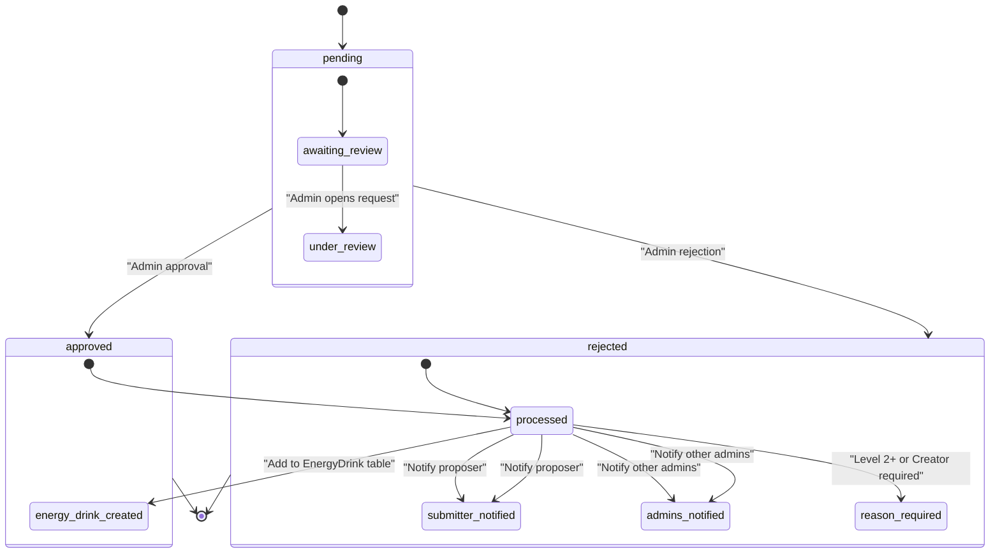
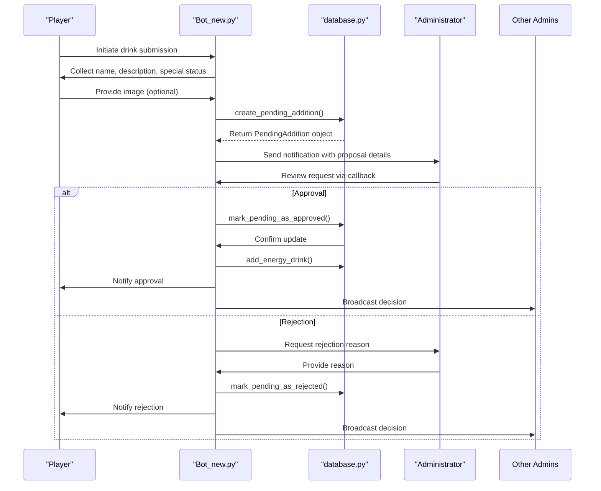
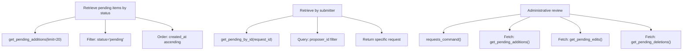

# PendingAddition Model

<cite>
**Referenced Files in This Document**   
- [database.py](file://database.py)
- [Bot_new.py](file://Bot_new.py)
- [add_energy_drink_new.py](file://add_energy_drink_new.py)
- [admin.py](file://admin.py)
</cite>

## Table of Contents
1. [Introduction](#introduction)
2. [Core Fields](#core-fields)
3. [Relationships](#relationships)
4. [Moderation Lifecycle](#moderation-lifecycle)
5. [Submission Workflow](#submission-workflow)
6. [Business Rules](#business-rules)
7. [Query Examples](#query-examples)
8. [Storage and Transaction Management](#storage-and-transaction-management)

## Introduction
The PendingAddition entity serves as a critical component in RELOAD's content moderation workflow, enabling users to submit new energy drink proposals for administrative review. This model captures essential information about proposed drinks while enforcing validation rules and maintaining audit trails throughout the moderation process. The system ensures that only verified content enters the main database, preserving data quality and integrity.

## Core Fields
The PendingAddition model contains several key fields that capture essential information about proposed energy drinks:

- **id**: Unique identifier for each pending addition request, auto-incremented primary key
- **proposer_id**: Telegram user ID of the submitter, indexed for efficient lookup
- **name**: Proposed name of the energy drink
- **description**: Detailed description of the energy drink
- **is_special**: Boolean flag indicating whether the drink is classified as "special"
- **file_id**: Telegram file identifier for the submitted image, nullable
- **status**: Current moderation state (pending/approved/rejected), defaulting to 'pending' and indexed
- **created_at**: Unix timestamp of submission, automatically set upon creation
- **reviewed_by**: Telegram user ID of the administrator who reviewed the request
- **reviewed_at**: Unix timestamp when the review was completed
- **review_reason**: Optional textual explanation for rejection decisions

**Section sources**
- [database.py](file://database.py#L87-L99)

## Relationships
The PendingAddition model establishes important relationships within the system:

- **Player (Submitter)**: The proposer_id field creates a direct relationship with the Player entity, allowing administrators to identify and communicate with submitters
- **Administrative Oversight**: The reviewed_by field links to administrator accounts, creating an audit trail of moderation decisions
- **Image Data**: The file_id field references Telegram's file system, enabling retrieval of submitted images during the review process

These relationships facilitate comprehensive tracking of submissions from creation through final disposition, supporting both operational workflows and accountability requirements.

**Section sources**
- [database.py](file://database.py#L87-L99)
- [Bot_new.py](file://Bot_new.py#L4141-L4171)

## Moderation Lifecycle
The PendingAddition model implements a structured moderation lifecycle with three distinct states:

**Diagram sources**
- [database.py](file://database.py#L87-L99)
- [Bot_new.py](file://Bot_new.py#L4141-L4171)

**Section sources**
- [database.py](file://database.py#L2669-L2716)
- [Bot_new.py](file://Bot_new.py#L4141-L4171)

## Submission Workflow
The submission workflow integrates seamlessly with the add_energy_drink_new.py script and bot interface:

**Diagram sources**
- [Bot_new.py](file://Bot_new.py#L4141-L4171)
- [database.py](file://database.py#L2651-L2667)

**Section sources**
- [Bot_new.py](file://Bot_new.py#L4141-L4171)
- [add_energy_drink_new.py](file://add_energy_drink_new.py#L39-L75)

## Business Rules
The PendingAddition model enforces several critical business rules to maintain data quality:

- **Image Validation**: Submissions with images are validated through Telegram's file system; the file_id must correspond to a valid media object
- **Duplicate Checking**: Before creating a pending addition, the system checks for existing EnergyDrink entries with the same name to prevent duplicates
- **Administrative Hierarchy**: 
  - Approval requires administrator privileges (level 1+)
  - Rejection requires higher privileges (level 2+ or Creator)
  - Self-approval is prohibited to prevent conflicts of interest
- **Audit Logging**: All moderation actions are recorded in the ModerationLog table for accountability
- **Notification System**: Both proposers and administrators receive notifications at key workflow stages

These rules ensure a fair, transparent, and secure moderation process that maintains the integrity of the energy drink database.

**Section sources**
- [database.py](file://database.py#L2651-L2716)
- [admin.py](file://admin.py#L0-L184)
- [Bot_new.py](file://Bot_new.py#L4141-L4171)

## Query Examples
The database.py module provides several functions for retrieving pending addition requests:

**Diagram sources**
- [database.py](file://database.py#L2669-L2685)
- [Bot_new.py](file://Bot_new.py#L4141-L4171)

**Section sources**
- [database.py](file://database.py#L2669-L2685)
- [Bot_new.py](file://Bot_new.py#L4141-L4171)

## Storage and Transaction Management
The PendingAddition model implements robust storage and transaction management practices:

- **Binary Image Storage**: Image data is stored externally via Telegram's file system, with only the file_id stored in the database to optimize storage efficiency
- **Transaction Safety**: Database operations use proper transaction handling with commit/rollback semantics to ensure data consistency
- **Error Handling**: Comprehensive try/finally blocks ensure database sessions are properly closed even in error conditions
- **Atomic Operations**: Approval and rejection workflows execute as atomic transactions, ensuring that related operations (status update, audit logging, notifications) succeed or fail together
- **File Management**: When approved, images are downloaded from Telegram and stored in the local energy_images directory with timestamp-based filenames to prevent collisions

This approach balances performance, reliability, and data integrity while accommodating the asynchronous nature of Telegram's file handling system.

**Section sources**
- [database.py](file://database.py#L2692-L2716)
- [Bot_new.py](file://Bot_new.py#L4141-L4171)