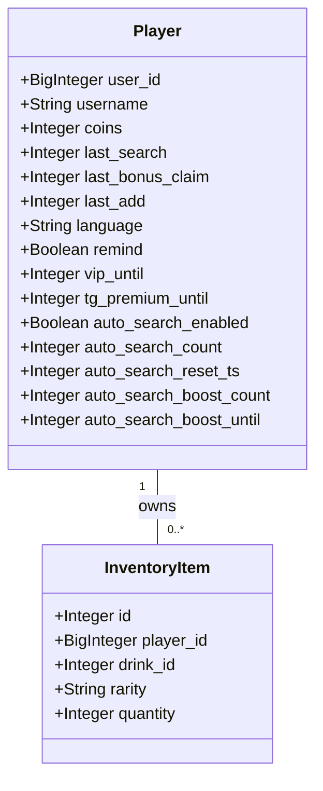
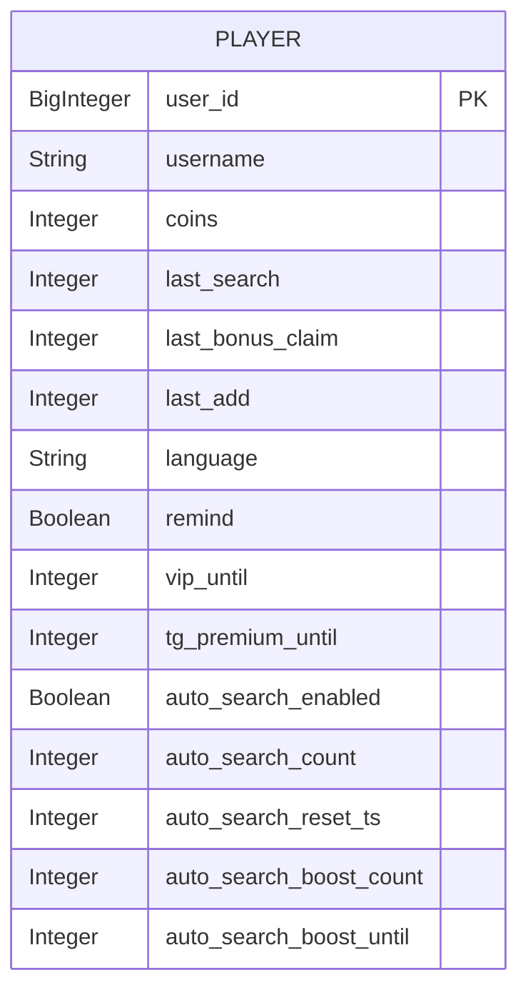
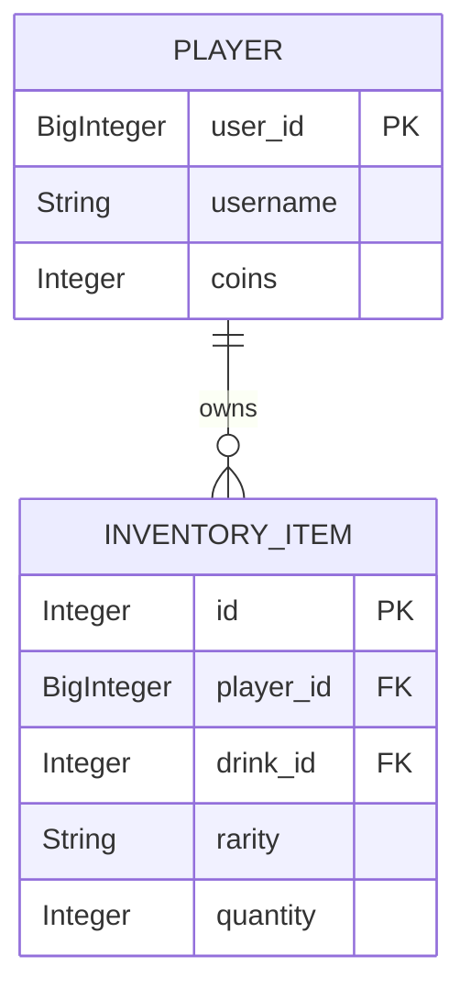
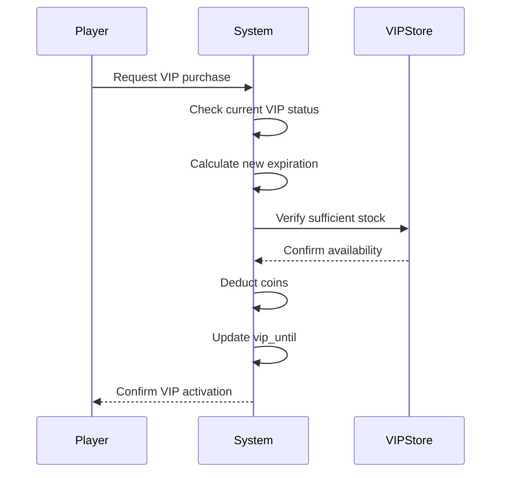
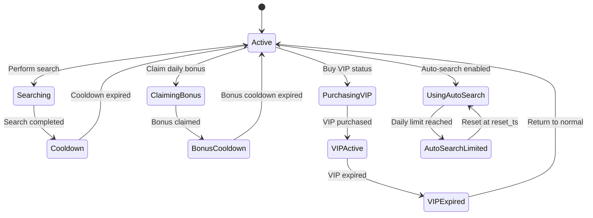
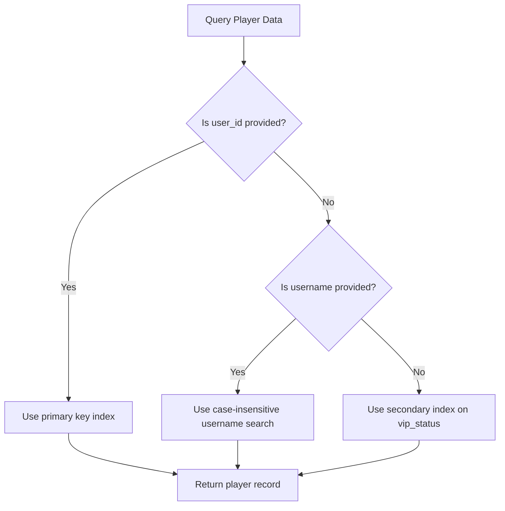
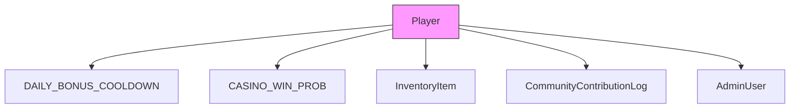

# Player Model

<cite>
**Referenced Files in This Document**   
- [database.py](file://database.py#L17-L46)
- [database.py](file://database.py#L48-L62)
- [database.py](file://database.py#L2517-L2539)
- [Bot_new.py](file://Bot_new.py#L636-L660)
- [constants.py](file://constants.py#L1-L76)
- [admin2.py](file://admin2.py#L374-L456)
</cite>

## Table of Contents
1. [Introduction](#introduction)
2. [Player Entity Structure](#player-entity-structure)
3. [Field Definitions](#field-definitions)
4. [Primary Key and Indexing](#primary-key-and-indexing)
5. [Relationships](#relationships)
6. [VIP Status and Business Rules](#vip-status-and-business-rules)
7. [Data Validation and Integrity](#data-validation-and-integrity)
8. [State Transitions](#state-transitions)
9. [Common Queries](#common-queries)
10. [Performance Optimization](#performance-optimization)
11. [Transaction Safety](#transaction-safety)
12. [Integration with Core Features](#integration-with-core-features)

## Introduction
The Player model serves as the central entity in the RELOAD application, representing user accounts and tracking their game state, progress, and inventory. This document provides comprehensive documentation of the Player entity, detailing its structure, relationships, business rules, and integration points within the system.

**Section sources**
- [database.py](file://database.py#L17-L46)

## Player Entity Structure
The Player entity is implemented as a SQLAlchemy ORM model with multiple fields that track user state, game progress, and preferences. The model includes core attributes such as user identification, balance tracking, cooldown timestamps, and VIP status indicators.

**Diagram sources**
- [database.py](file://database.py#L17-L46)
- [database.py](file://database.py#L48-L62)

**Section sources**
- [database.py](file://database.py#L17-L46)

## Field Definitions
The Player entity contains the following fields:

- **user_id**: Unique identifier for the player (BigInteger, primary key)
- **username**: Player's username or display name (String)
- **coins**: Player's balance in septims (Integer, default: 0)
- **last_search**: Timestamp of last energy drink search (Integer, default: 0)
- **last_bonus_claim**: Timestamp of last daily bonus claim (Integer, default: 0)
- **last_add**: Timestamp of last addition (Integer, default: 0)
- **language**: Preferred language code (String, default: 'ru')
- **remind**: Flag indicating if search reminders are enabled (Boolean, default: False)
- **vip_until**: Timestamp when VIP status expires (Integer, default: 0)
- **tg_premium_until**: Timestamp when Telegram Premium status expires (Integer, default: 0)
- **auto_search_enabled**: Flag indicating if VIP auto-search is enabled (Boolean, default: False)
- **auto_search_count**: Count of auto-searches performed today (Integer, default: 0)
- **auto_search_reset_ts**: Timestamp when auto-search count resets (Integer, default: 0)
- **auto_search_boost_count**: Additional searches available today (Integer, default: 0)
- **auto_search_boost_until**: Timestamp when auto-search boost expires (Integer, default: 0)

**Section sources**
- [database.py](file://database.py#L17-L46)

## Primary Key and Indexing
The Player entity uses user_id as its primary key, which is also indexed for optimal query performance. The primary key constraint ensures that each player has a unique identifier, preventing duplicate accounts.

**Diagram sources**
- [database.py](file://database.py#L17-L46)

**Section sources**
- [database.py](file://database.py#L17-L46)

## Relationships
The Player entity has a one-to-many relationship with the InventoryItem entity, representing the player's collection of energy drinks. This relationship is implemented through a foreign key constraint and is cascaded for deletion.

**Diagram sources**
- [database.py](file://database.py#L17-L46)
- [database.py](file://database.py#L48-L62)

**Section sources**
- [database.py](file://database.py#L17-L46)
- [database.py](file://database.py#L48-L62)

## VIP Status and Business Rules
VIP status is managed through the vip_until field, which stores a Unix timestamp indicating when the status expires. VIP status affects several game mechanics:

- Search cooldown is reduced by 50% (from 300s to 150s)
- Daily bonus cooldown is reduced by 50% (from 86400s to 43200s)
- Coin rewards from searches are doubled
- Auto-search functionality becomes available

VIP status can be purchased through the purchase_vip function or granted by administrators. When purchasing VIP, the system checks if the player has sufficient coins and extends the VIP period from the current expiration time or current time if expired.

**Diagram sources**
- [database.py](file://database.py#L2517-L2539)
- [Bot_new.py](file://Bot_new.py#L636-L660)
- [constants.py](file://constants.py#L1-L76)

**Section sources**
- [database.py](file://database.py#L2517-L2539)
- [Bot_new.py](file://Bot_new.py#L636-L660)
- [constants.py](file://constants.py#L1-L76)

## Data Validation and Integrity
The Player model implements several data validation rules to maintain integrity:

- Balance (coins) cannot go negative during transactions
- Timestamps are validated as non-negative integers
- Username is stored as provided but searched case-insensitively
- All monetary transactions are protected by database transactions

The system uses database-level constraints and application-level validation to ensure data consistency. When updating player balances, the system first checks if sufficient funds are available before proceeding with the transaction.

**Section sources**
- [database.py](file://database.py#L1810-L1842)
- [database.py](file://database.py#L810-L837)

## State Transitions
The Player entity undergoes several state transitions during gameplay:

**Diagram sources**
- [Bot_new.py](file://Bot_new.py#L636-L660)
- [Bot_new.py](file://Bot_new.py#L4444-L4474)

**Section sources**
- [Bot_new.py](file://Bot_new.py#L636-L660)

## Common Queries
The system implements several common queries for retrieving player information:

- **Retrieve player profile**: `get_or_create_player(user_id, username)`
- **Check search cooldown status**: Compare current time with last_search + cooldown
- **Verify VIP status**: Check if current time < vip_until
- **Get player inventory**: Join Player with InventoryItem records
- **Find player by username**: Case-insensitive search on username field

These queries are optimized with appropriate indexing on frequently accessed fields.

**Section sources**
- [database.py](file://database.py#L311-L345)
- [database.py](file://database.py#L1942-L1979)

## Performance Optimization
The Player model is optimized for performance through strategic indexing on frequently queried fields:

- user_id is indexed as it's the primary key and used in all player lookups
- vip_until is indexed to efficiently identify active VIP members
- last_search and last_bonus_claim are indexed for cooldown calculations

The system also implements caching strategies for frequently accessed player data to reduce database load.

**Diagram sources**
- [database.py](file://database.py#L2277-L2300)

**Section sources**
- [database.py](file://database.py#L2277-L2300)

## Transaction Safety
All balance updates and critical operations on the Player entity are protected by database transactions to ensure atomicity and consistency:

- Coin deductions during purchases use `with_for_update` locking
- Balance updates are wrapped in try-catch blocks with rollback on exception
- Concurrent access is prevented through row-level locking
- The system uses SQLAlchemy's session management for transaction control

This ensures that balance integrity is maintained even under high concurrency and prevents race conditions during financial operations.

**Section sources**
- [database.py](file://database.py#L1810-L1842)
- [database.py](file://database.py#L810-L837)

## Integration with Core Features
The Player entity integrates with several core features of the RELOAD application:

- **Daily bonuses**: Player state tracks last_bonus_claim for cooldown management
- **Mini-games**: Player balance is updated based on game outcomes
- **Inventory system**: Player has a one-to-many relationship with inventory items
- **Community projects**: Player can contribute coins to community efforts
- **Administration**: Admins can modify player states including VIP status

These integrations are managed through dedicated service functions that maintain data consistency across the system.

**Diagram sources**
- [constants.py](file://constants.py#L1-L76)
- [database.py](file://database.py#L311-L345)
- [admin2.py](file://admin2.py#L374-L456)

**Section sources**
- [constants.py](file://constants.py#L1-L76)
- [admin2.py](file://admin2.py#L374-L456)