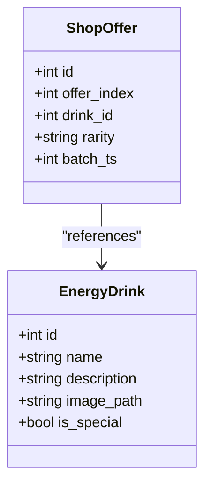
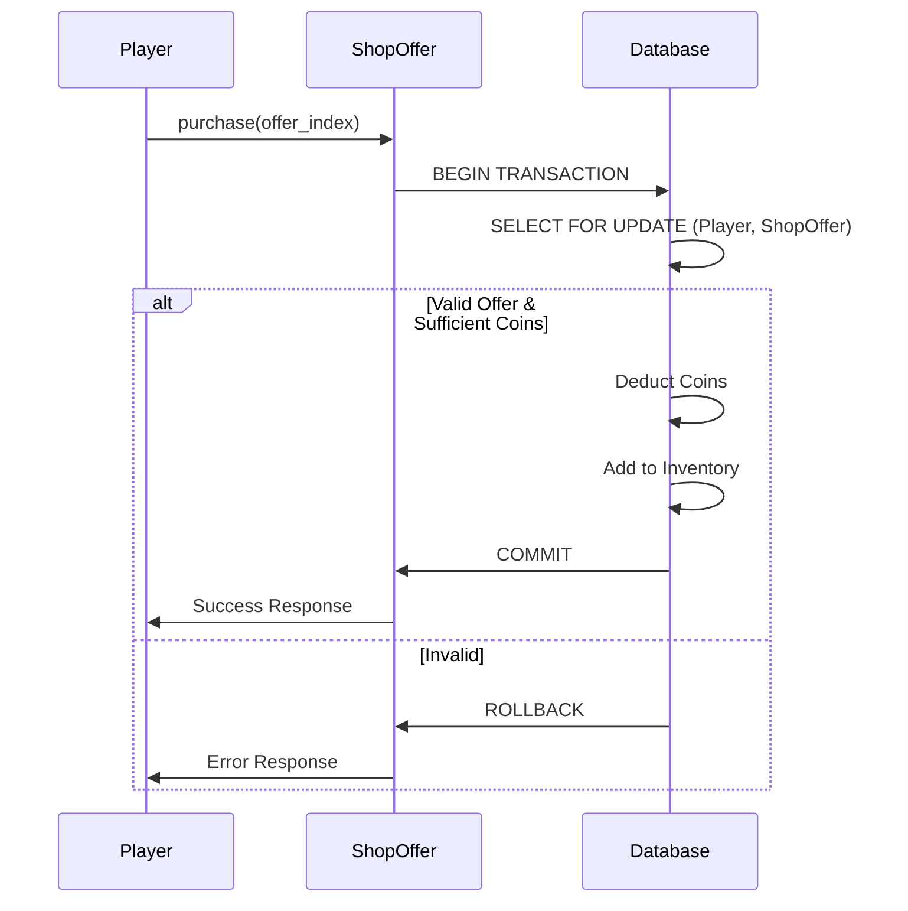

# ShopOffer Model

<cite>
**Referenced Files in This Document**   
- [database.py](file://database.py#L66-L74)
- [constants.py](file://constants.py#L74)
- [Bot_new.py](file://Bot_new.py#L2337-L2402)
- [Bot_new.py](file://Bot_new.py#L2419-L2446)
</cite>

## Table of Contents
1. [Introduction](#introduction)
2. [Core Fields and Structure](#core-fields-and-structure)
3. [Foreign Key Relationships](#foreign-key-relationships)
4. [Pricing and Inventory Constraints](#pricing-and-inventory-constraints)
5. [Business Rules](#business-rules)
6. [Marketplace Integration](#marketplace-integration)
7. [Query Examples](#query-examples)
8. [Indexing and Concurrency](#indexing-and-concurrency)

## Introduction
The ShopOffer model is a central component of the dynamic marketplace functionality in RELOAD, enabling players to purchase energy drinks using in-game currency. This model defines a persistent set of 50 offers that refresh every 4 hours, providing a rotating inventory of items for sale. The system integrates with the broader economic framework, supporting atomic transactions, price calculations based on rarity, and concurrency controls during high-demand scenarios.

**Section sources**
- [database.py](file://database.py#L66-L74)

## Core Fields and Structure
The ShopOffer model defines the following fields:
- **id**: Primary key, auto-incrementing integer
- **offer_index**: Integer from 1 to 50, indexed for fast lookup
- **drink_id**: Foreign key to energy_drinks.id, indexed for efficient joins
- **rarity**: String field indicating the rarity level, indexed for filtering
- **batch_ts**: Timestamp indicating when the offer batch was generated, indexed for refresh logic

The model maintains a relationship with the EnergyDrink entity through the `drink` relationship field, enabling direct access to drink details during queries.



**Diagram sources**
- [database.py](file://database.py#L66-L74)
- [database.py](file://database.py#L40-L46)

**Section sources**
- [database.py](file://database.py#L66-L74)

## Foreign Key Relationships
The ShopOffer model establishes a foreign key relationship with the EnergyDrink model through the `drink_id` field, which references `energy_drinks.id`. This relationship enables the marketplace to display complete drink information when presenting offers to players. Additionally, the model maintains a relationship with the Player model indirectly through the purchase process, where player coins are deducted and inventory items are created.

The relationship is implemented with SQLAlchemy's `relationship()` function, allowing for eager loading of drink details when retrieving offers.

**Section sources**
- [database.py](file://database.py#L66-L74)
- [database.py](file://database.py#L40-L46)

## Pricing and Inventory Constraints
The pricing system is determined by the rarity of the offered drink, with prices defined in the `SHOP_PRICES` dictionary in constants.py. The price multiplier is set to 3x the base receiver price, ensuring profitability for the marketplace. The system enforces positive pricing through the `SHOP_PRICES` configuration, where all values are guaranteed to be positive.

Inventory is managed through the batch refresh mechanism, which regenerates all 50 offers every 4 hours. Each offer represents a single item available for purchase, with no quantity field needed since each offer is unique and atomic.

**Section sources**
- [constants.py](file://constants.py#L74)
- [database.py](file://database.py#L511-L542)

## Business Rules
The marketplace implements several key business rules:
- **Commission Calculations**: Not applicable for purchases (only for sales via receiver)
- **Listing Expiration**: All offers expire and refresh every 4 hours, as defined by `SHOP_REFRESH_SEC`
- **Atomic Transaction Handling**: Purchases use database transactions with row-level locking to prevent race conditions
- **Concurrency Controls**: The `with_for_update()` method ensures exclusive access during purchase operations

The purchase process validates the offer existence, checks player coin balance, deducts coins, and adds the drink to inventory in a single atomic operation. If any step fails, the transaction is rolled back.



**Diagram sources**
- [database.py](file://database.py#L511-L542)

**Section sources**
- [database.py](file://database.py#L511-L542)
- [Bot_new.py](file://Bot_new.py#L2419-L2446)

## Marketplace Integration
The ShopOffer model integrates with the economic system through several mechanisms:
- Price determination using `SHOP_PRICES` based on rarity
- Coin deduction from player accounts during purchases
- Inventory updates via the `add_drink_to_inventory()` function
- UI integration through paginated display of offers

The marketplace interface displays offers in pages of 10 items, with navigation controls and real-time refresh countdowns. Players can purchase items directly from the interface, with immediate feedback on success or failure.

**Section sources**
- [Bot_new.py](file://Bot_new.py#L2337-L2402)
- [database.py](file://database.py#L406-L434)

## Query Examples
The following queries demonstrate common operations for the ShopOffer model:

**Find all active offers for a specific drink:**
```python
offers = dbs.query(ShopOffer).filter(ShopOffer.drink_id == drink_id).all()
```

**Find all offers by rarity:**
```python
offers = dbs.query(ShopOffer).filter(ShopOffer.rarity == rarity).all()
```

**Get a specific offer by index:**
```python
offer = dbs.query(ShopOffer).filter(ShopOffer.offer_index == index).first()
```

**Get all offers with drink details:**
```python
offers = (dbs.query(ShopOffer)
          .options(joinedload(ShopOffer.drink))
          .order_by(ShopOffer.offer_index.asc())
          .all())
```

**Section sources**
- [database.py](file://database.py#L511-L542)
- [database.py](file://database.py#L432-L463)

## Indexing and Concurrency
The ShopOffer model employs multiple indexes to optimize marketplace searches:
- Index on `offer_index` for direct offer lookup
- Index on `drink_id` for finding offers by drink
- Index on `rarity` for filtering by rarity level
- Index on `batch_ts` for refresh timing calculations

These indexes ensure efficient query performance even with frequent marketplace access. During high-demand item sales, the system uses row-level locking (`with_for_update()`) to prevent race conditions and ensure data consistency. The atomic transaction design guarantees that purchases either complete fully or fail completely, maintaining inventory integrity.

**Section sources**
- [database.py](file://database.py#L66-L74)
- [database.py](file://database.py#L511-L542)