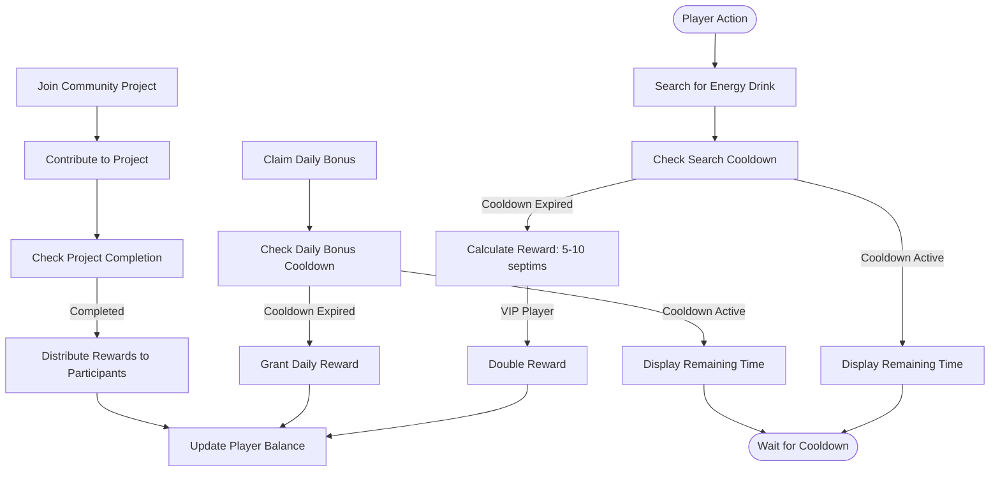
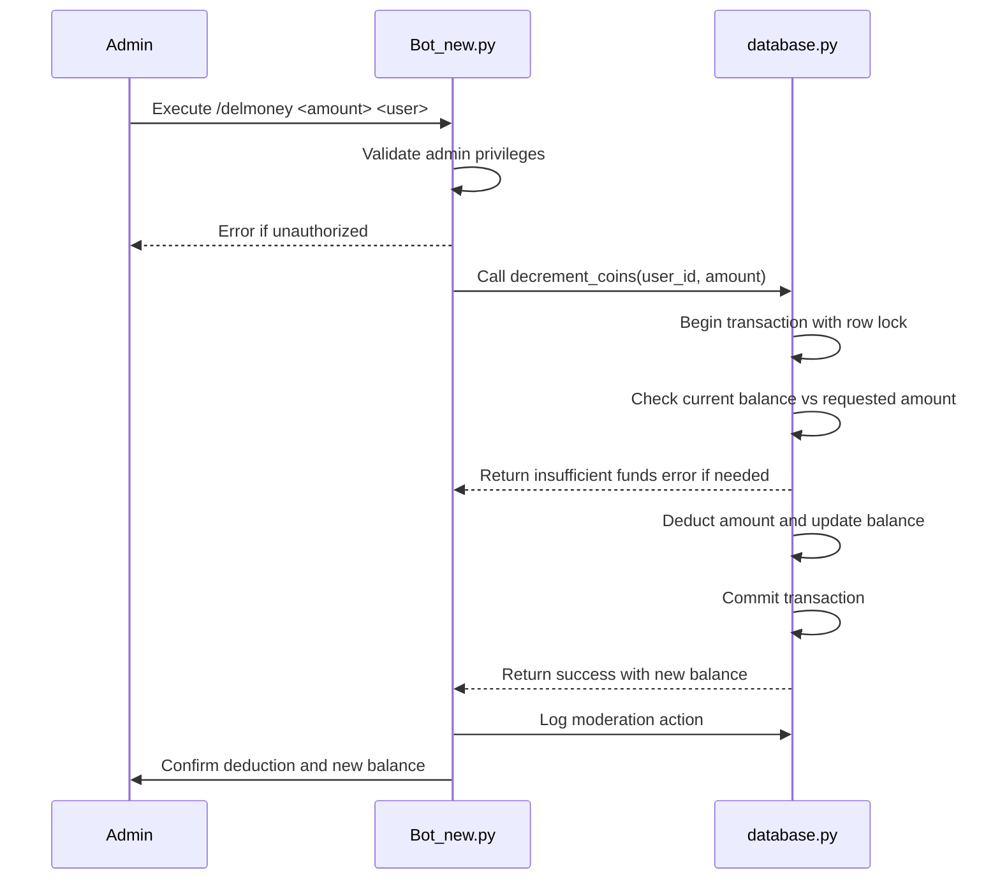
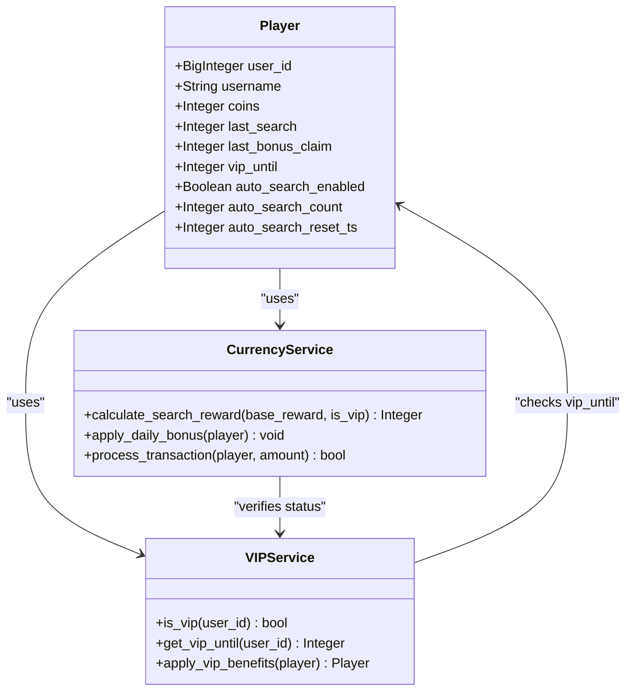
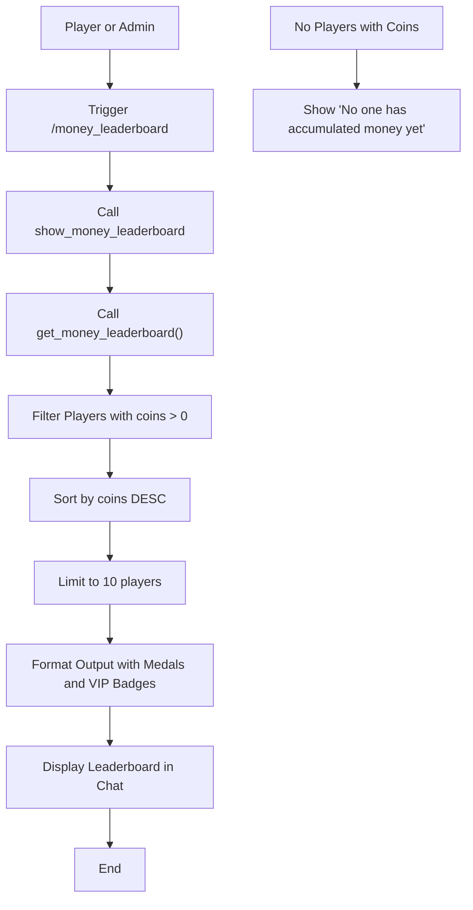

# Currency Management

<cite>
**Referenced Files in This Document**   
- [Bot_new.py](file://Bot_new.py) - *Added /delmoney command and money leaderboard functionality in commit c3085cc*
- [database.py](file://database.py) - *Added decrement_coins and get_money_leaderboard methods in commit c3085cc*
- [constants.py](file://constants.py)
</cite>

## Update Summary
**Changes Made**   
- Added new section: "Currency Administration and Moderation"
- Added new section: "Money Leaderboard Integration"
- Updated "Currency Spending and Transactions" to reflect new administrative transaction capabilities
- Updated "Data Integrity and Race Condition Prevention" to include new decrement operation safeguards
- Added new Mermaid diagram for money leaderboard flow
- Enhanced source tracking with annotations for newly added and modified files

## Table of Contents
1. [Introduction](#introduction)
2. [Currency Earning Mechanisms](#currency-earning-mechanisms)
3. [Currency Spending and Transactions](#currency-spending-and-transactions)
4. [Currency Administration and Moderation](#currency-administration-and-moderation)
5. [Economic Balance Constants](#economic-balance-constants)
6. [Currency Flow Examples](#currency-flow-examples)
7. [VIP System Integration](#vip-system-integration)
8. [Leaderboard Integration](#leaderboard-integration)
9. [Money Leaderboard Integration](#money-leaderboard-integration)
10. [Data Integrity and Race Condition Prevention](#data-integrity-and-race-condition-prevention)
11. [Performance Optimization](#performance-optimization)
12. [Troubleshooting Common Issues](#troubleshooting-common-issues)

## Introduction
The septims currency system in the RELOAD application serves as the primary in-game economy, enabling players to earn, spend, and manage virtual currency through various gameplay mechanics. This document details the implementation of the currency system, focusing on earning mechanisms, spending opportunities, economic balance parameters, and technical safeguards that ensure data integrity. The system is implemented across multiple components, with core functionality residing in Bot_new.py for command handling, database.py for data persistence, and constants.py for economic parameters.

**Section sources**
- [Bot_new.py](file://Bot_new.py#L0-L5444)
- [database.py](file://database.py#L0-L3060)
- [constants.py](file://constants.py#L0-L76)

## Currency Earning Mechanisms
Players can earn septims through several core actions within the RELOAD application. The primary earning mechanisms include energy drink collection, daily bonuses, and community activities. When a player successfully finds an energy drink through the search functionality, they receive a random reward of 5-10 septims. This reward is doubled for VIP players, providing an incentive for premium membership. The daily bonus system allows players to claim a daily reward, which includes both an energy drink and serves as a retention mechanism. Community activities, such as collaborative plantations, provide additional earning opportunities through collective projects that distribute rewards upon completion. These earning mechanisms are designed to encourage regular engagement with the application while maintaining economic balance.

**Diagram sources**
- [Bot_new.py](file://Bot_new.py#L500-L800)
- [database.py](file://database.py#L1981-L2002)

**Section sources**
- [Bot_new.py](file://Bot_new.py#L500-L800)
- [database.py](file://database.py#L1981-L2002)

## Currency Spending and Transactions
The septims currency can be spent on various in-game purchases and transactions, creating a balanced economy within the RELOAD application. Players can purchase energy drinks from the in-game shop, buy additional plantation beds, or acquire premium features like TG Premium. The shop offers randomized selections of energy drinks at prices determined by their rarity, with higher rarity items commanding higher prices. Transaction processing is handled atomically through database operations to ensure data consistency. Each transaction includes validation checks for sufficient funds and applies appropriate business logic based on the transaction type. The system also supports community-driven transactions where players contribute to collective projects, with contributions tracked and rewarded appropriately.

**Section sources**
- [Bot_new.py](file://Bot_new.py#L1000-L1200)
- [database.py](file://database.py#L1500-L1800)

## Currency Administration and Moderation
The RELOAD application now includes administrative commands for managing player currency balances. The /delmoney command allows authorized administrators (defined in ADMIN_USERNAMES) to deduct septims from player accounts. This command can be executed by specifying an amount and target user ID or username, or by replying to a user's message with the desired deduction amount. The system validates administrator privileges before processing any transaction. When executed, the command calls the decrement_coins function in database.py, which ensures the player's balance does not go negative by checking current funds before applying the deduction. Successful transactions are reflected in real-time balance updates and accompanied by audit logging through insert_moderation_log to maintain accountability. This administrative functionality provides game moderators with tools to correct balance errors or enforce game rules while maintaining economic integrity.

**Diagram sources**
- [Bot_new.py](file://Bot_new.py#L4763-L4859)
- [database.py](file://database.py#L2144-L2186)

**Section sources**
- [Bot_new.py](file://Bot_new.py#L4763-L4859)
- [database.py](file://database.py#L2144-L2186)

## Economic Balance Constants
The RELOAD application maintains economic balance through carefully calibrated constants that govern currency flow. Key constants include DAILY_BONUS_COOLDOWN (86400 seconds) which limits daily bonus claims to once per day, and SEARCH_COOLDOWN (300 seconds) which regulates the frequency of energy drink searches. The TRANSACTION_COOLDOWN is implicitly managed through these search and bonus cooldowns. VIP players benefit from reduced cooldowns (50% of standard) and doubled search rewards, creating a tiered economic system. Price structures for shop items and receiver payouts are defined in constants, with SHOP_PRICES determining purchase costs and RECEIVER_PRICES establishing base values for selling items. These constants work together to create a sustainable in-game economy that prevents inflation while rewarding active participation.

**Section sources**
- [constants.py](file://constants.py#L10-L50)
- [Bot_new.py](file://Bot_new.py#L100-L150)

## Currency Flow Examples
Practical examples illustrate the currency flow within the RELOAD application. When claiming a daily reward, a player triggers the /daily command, which first checks the DAILY_BONUS_COOLDOWN. If sufficient time has passed since the last claim, the system grants a random energy drink and updates the last_bonus_claim timestamp. No direct septim reward is given for the daily bonus, but the received energy drink can be sold later. For collaborative plantation payouts, when a community project reaches its funding goal, participants receive proportional septim rewards based on their contribution levels. Another example is the energy drink search: a player searches for an energy drink, receives 5-10 septims (doubled if VIP), and the transaction is immediately reflected in their balance. These examples demonstrate the seamless integration of currency mechanics into gameplay.

**Section sources**
- [Bot_new.py](file://Bot_new.py#L636-L694)
- [database.py](file://database.py#L2509-L2515)

## VIP System Integration
The VIP system is tightly integrated with the currency mechanics, providing enhanced earning opportunities for premium members. VIP status is determined by the vip_until timestamp in the Player model, with the is_vip function checking if this timestamp is in the future. VIP players receive multiple economic advantages: their search cooldown is reduced by 50%, their daily bonus cooldown is similarly reduced, and most significantly, their search rewards are doubled from 5-10 to 10-20 septims. This integration creates a compelling value proposition for VIP membership, directly linking premium status to improved currency earning potential. The system also supports VIP auto-search functionality, allowing VIP players to automate energy drink collection within daily limits, further enhancing their earning capacity.

**Diagram sources**
- [database.py](file://database.py#L2509-L2515)
- [Bot_new.py](file://Bot_new.py#L500-L600)

**Section sources**
- [Bot_new.py](file://Bot_new.py#L500-L600)
- [database.py](file://database.py#L2509-L2515)

## Leaderboard Integration
The currency system integrates with leaderboards to display player wealth rankings, creating competitive motivation for currency accumulation. Player balances are used as the primary ranking metric, with higher septim totals resulting in better leaderboard positions. The VIP_EMOJI (👑) is displayed next to VIP players on leaderboards, providing additional status recognition. The system ensures leaderboard data is updated atomically with balance changes to maintain consistency. Regular leaderboard updates reflect the dynamic nature of the economy, showing how player rankings shift as currency is earned and spent. This integration transforms the currency system from a purely functional mechanic into a social and competitive feature that encourages players to increase their wealth.

**Section sources**
- [Bot_new.py](file://Bot_new.py#L200-L300)
- [database.py](file://database.py#L100-L150)

## Money Leaderboard Integration
A dedicated money leaderboard has been implemented to showcase players with the highest septim balances. The /money_leaderboard command (handled by show_money_leaderboard in Bot_new.py) retrieves the top players based on their coin balances from the database. The get_money_leaderboard function in database.py queries the Player table, filtering for users with positive coin balances and ordering results in descending order. The leaderboard displays up to 10 players with position indicators (🥇, 🥈, 🥉 for top three), usernames, and their septim balances formatted with thousand separators. VIP players are denoted with the VIP_EMOJI (👑) next to their names. This leaderboard provides a clear visualization of economic success within the game, encouraging players to accumulate wealth and compete for top positions. The leaderboard is dynamically updated as transactions occur, ensuring real-time accuracy.

**Diagram sources**
- [Bot_new.py](file://Bot_new.py#L5059-L5091)
- [database.py](file://database.py#L3430-L3462)

**Section sources**
- [Bot_new.py](file://Bot_new.py#L5059-L5091)
- [database.py](file://database.py#L3430-L3462)

## Data Integrity and Race Condition Prevention
The RELOAD application employs robust mechanisms to ensure data integrity and prevent race conditions during concurrent transactions. The system uses asyncio.Lock objects to serialize access to critical operations, with separate locks for different transaction types (e.g., user:{user_id}:search, user:{user_id}:bonus). Database operations are performed within transactions using SQLAlchemy's with_for_update() method, which applies row-level locks to prevent concurrent modifications. The increment_coins function in database.py demonstrates this approach by using a database-level lock to ensure atomic balance updates. Additionally, the application uses session management to maintain transactional consistency, with proper commit and rollback procedures. These measures collectively prevent common issues like double-spending, balance corruption, and inconsistent state that could arise from concurrent access. The newly added decrement_coins function follows the same pattern, ensuring that balance deductions are also atomic and thread-safe.

**Section sources**
- [Bot_new.py](file://Bot_new.py#L400-L500)
- [database.py](file://database.py#L1981-L2002)

## Performance Optimization
The currency system includes several performance optimizations for efficient balance management. Batch operations are supported through the use of database transactions that can handle multiple balance updates in a single operation, reducing database overhead. The system implements caching mechanisms for frequently accessed data, such as shop offers and player profiles, to minimize database queries. For balance updates, the increment_coins function provides an atomic operation that combines retrieval and update, reducing the number of database round-trips. The application also includes monitoring capabilities to track abnormal balance changes, with logging implemented for all significant transactions. These optimizations ensure the currency system remains responsive even under high load, while maintaining data integrity and security.

**Section sources**
- [database.py](file://database.py#L1981-L2002)
- [Bot_new.py](file://Bot_new.py#L300-L400)

## Troubleshooting Common Issues
Common issues in the currency system typically relate to race conditions, balance discrepancies, or transaction failures. The primary troubleshooting approach involves checking lock acquisition patterns and transaction boundaries to ensure proper serialization of operations. For balance discrepancies, the system logs all transactions in the increment_coins function, allowing administrators to trace the history of balance changes. Transaction failures are typically caused by insufficient funds or database connectivity issues, with appropriate error handling in place to notify users and maintain system stability. Monitoring for abnormal balance changes involves reviewing the transaction logs for patterns that deviate from expected behavior, such as rapid balance increases that might indicate exploits. Regular database integrity checks and backup procedures further ensure the reliability of the currency system.

**Section sources**
- [database.py](file://database.py#L1981-L2002)
- [Bot_new.py](file://Bot_new.py#L700-L800)