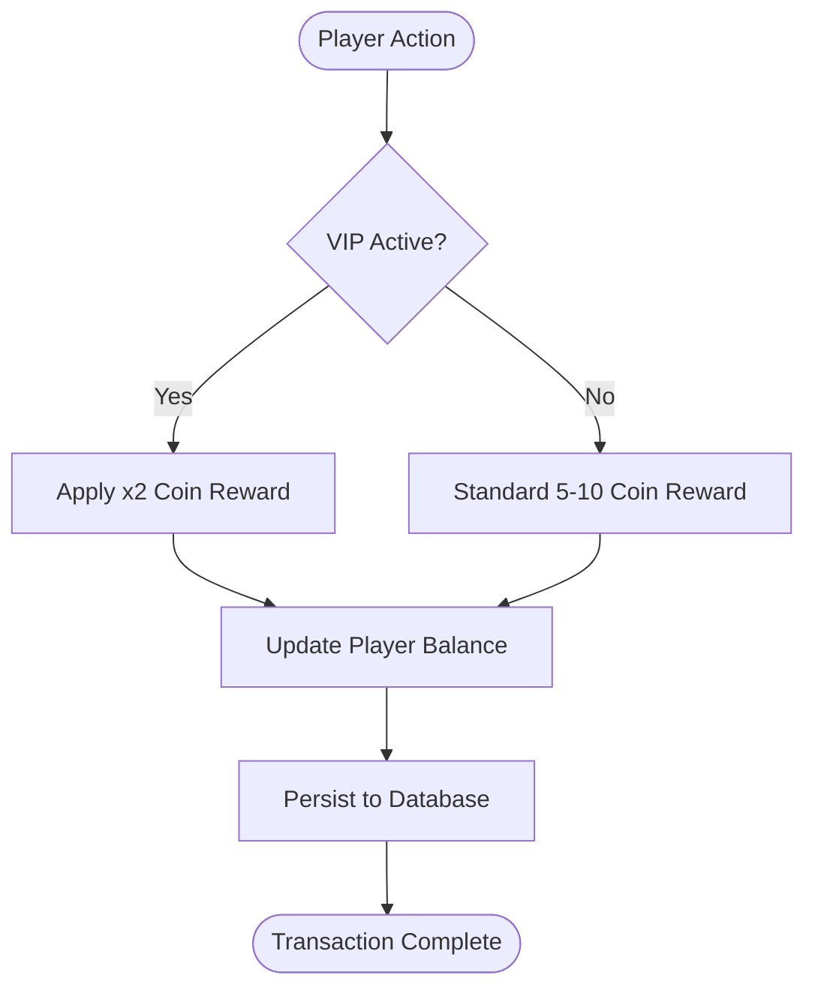
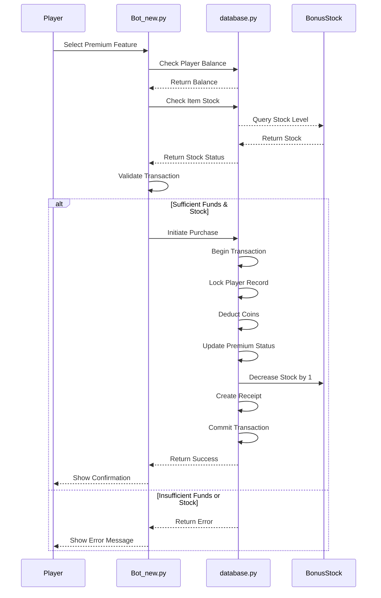
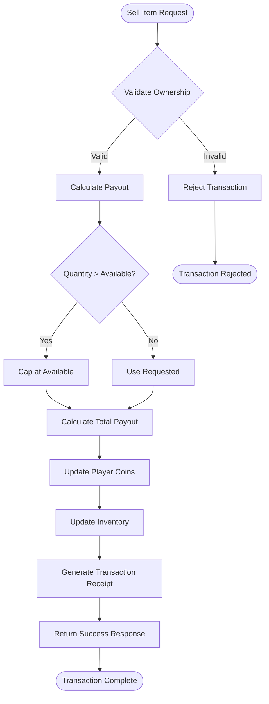
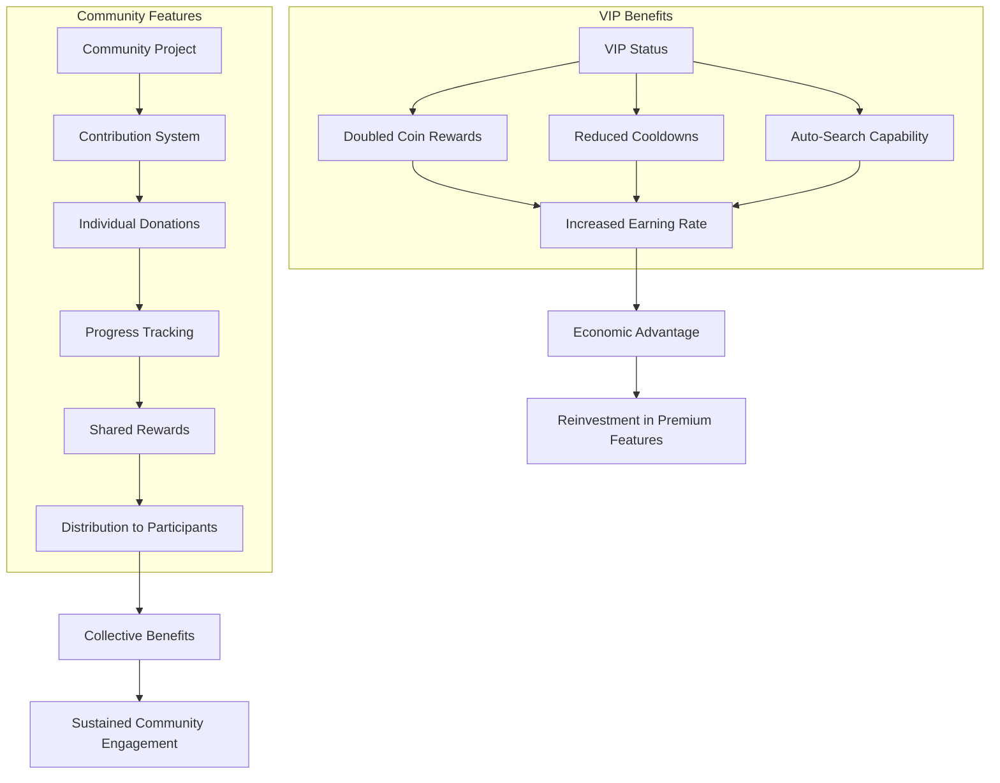
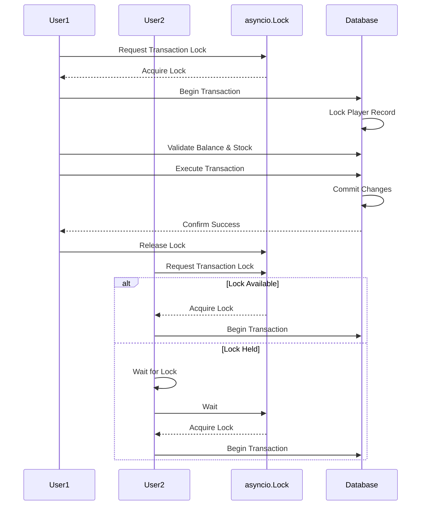

# Economic System

<cite>
**Referenced Files in This Document**   
- [Bot_new.py](file://Bot_new.py)
- [database.py](file://database.py)
- [constants.py](file://constants.py)
</cite>

## Table of Contents
1. [Introduction](#introduction)
2. [Currency and Core Mechanics](#currency-and-core-mechanics)
3. [Premium Feature Purchases](#premium-feature-purchases)
4. [Receiver System for Item Selling](#receiver-system-for-item-selling)
5. [Economic Flow Examples](#economic-flow-examples)
6. [Integration with VIP and Community Features](#integration-with-vip-and-community-features)
7. [Transaction Safety and Race Condition Prevention](#transaction-safety-and-race-condition-prevention)
8. [Constants and Pricing Configuration](#constants-and-pricing-configuration)
9. [Conclusion](#conclusion)

## Introduction
The RELOAD application implements a comprehensive in-game economy centered around the "septims" currency. This system enables players to earn, spend, and trade virtual currency through various gameplay mechanics such as searching for energy drinks, claiming daily bonuses, purchasing premium features, and selling items through the receiver system. The economic model is designed to balance player progression, reward engagement, and maintain currency stability through carefully calibrated pricing, cooldowns, and transaction safeguards.

**Section sources**
- [Bot_new.py](file://Bot_new.py#L0-L799)
- [constants.py](file://constants.py#L0-L75)

## Currency and Core Mechanics
The RELOAD application uses "septims" as its primary in-game currency, which players earn through core gameplay activities. The main sources of septims include energy drink searches and daily bonuses, with earnings modified by player status such as VIP membership. When a player successfully searches for an energy drink, they receive a random reward of 5-10 septims, which is doubled for VIP players. The search functionality is governed by cooldown periods defined in constants.py, with VIP players enjoying a 50% reduction in cooldown time, effectively doubling their earning potential over time.

Daily bonuses provide another consistent source of septims, allowing players to claim rewards on a regular basis. The system implements cooldown management to prevent abuse, with VIP players again benefiting from reduced cooldown periods. Currency balances are stored persistently in the database within the Player model's coins field, ensuring that player wealth is maintained across sessions. The economic design encourages regular engagement while providing VIP players with enhanced earning capabilities that reinforce the value proposition of premium status.

**Diagram sources**
- [Bot_new.py](file://Bot_new.py#L500-L550)
- [database.py](file://database.py#L100-L150)

**Section sources**
- [Bot_new.py](file://Bot_new.py#L500-L550)
- [database.py](file://database.py#L100-L150)
- [constants.py](file://constants.py#L0-L75)

## Premium Feature Purchases
Players can purchase premium features using septims through a secure transaction system implemented in the Bot_new.py command handlers. The primary premium offerings include TG Premium (3 months), Steam games (500 UAH value), and 500 stars packs, all priced at 600,000 septims. The purchase process begins when a player selects a premium feature from the extras menu, which displays current stock levels and pricing information. Before allowing a purchase, the system verifies that the player has sufficient septims and that the requested item is in stock.

The transaction execution occurs through specialized database methods that handle currency deduction, inventory updates, and receipt generation. For TG Premium purchases, the purchase_tg_premium function in database.py manages the entire process, including extending the player's TG Premium status, reducing stock levels, and creating a purchase receipt. The system uses atomic database operations with row-level locking to ensure transaction integrity, preventing race conditions that could lead to overselling or currency duplication. After a successful purchase, players receive confirmation with their updated balance and, where applicable, the expiration date of their purchased benefit.

**Diagram sources**
- [Bot_new.py](file://Bot_new.py#L1700-L1900)
- [database.py](file://database.py#L1885-L1979)

**Section sources**
- [Bot_new.py](file://Bot_new.py#L1700-L1900)
- [database.py](file://database.py#L1885-L1979)

## Receiver System for Item Selling
The receiver system enables players to sell energy drinks from their inventory in exchange for septims, providing a crucial mechanism for currency circulation within the game economy. When selling items, players receive payouts based on the rarity of the energy drink, with higher rarity items yielding greater returns. The payout calculation incorporates a 30% commission, meaning players receive 70% of the base price defined in the RECEIVER_PRICES constant. For example, selling a Majestic rarity drink (base price 750) yields 525 septims after commission.

The sell_inventory_item function in database.py handles the transaction process, which includes validating ownership, calculating payouts, updating the player's coin balance, and adjusting inventory quantities. The system supports selling multiple units of the same item in a single transaction, with appropriate quantity validation to prevent overselling. After a successful sale, players receive detailed feedback including the unit payout, quantity sold, total earnings, and updated coin balance. This system creates an economic loop where players can acquire items through gameplay and convert them to currency, which can then be used for premium purchases or other in-game transactions.

**Diagram sources**
- [database.py](file://database.py#L2733-L2808)
- [constants.py](file://constants.py#L60-L70)

**Section sources**
- [database.py](file://database.py#L2733-L2808)
- [constants.py](file://constants.py#L60-L70)

## Economic Flow Examples
The RELOAD application demonstrates several key economic flows that illustrate how players interact with the currency system. One common flow involves purchasing a premium feature: a player with sufficient septims navigates to the extras menu, selects a premium offering like TG Premium, and confirms the purchase. The system then verifies stock availability and player balance before executing the transaction through the purchase_tg_premium function, which deducts 600,000 septims, extends the player's TG Premium status by 90 days, reduces stock by one unit, and generates a purchase receipt.

Another important economic flow is selling an energy drink: a player selects an item from their inventory, chooses the sell option, and specifies the quantity. The system calculates the payout using the get_receiver_unit_payout function, which applies the 30% commission to the base price from RECEIVER_PRICES based on the item's rarity. For example, selling a Medium rarity energy drink (base price 20) yields 14 septims per unit. The transaction updates both the player's coin balance and inventory quantities atomically, ensuring data consistency. These flows demonstrate the bidirectional nature of the economy, where players can both spend septims on premium features and earn them through item sales.

**Section sources**
- [Bot_new.py](file://Bot_new.py#L1700-L1900)
- [database.py](file://database.py#L1885-L1979)
- [database.py](file://database.py#L2733-L2808)

## Integration with VIP and Community Features
The economic system is deeply integrated with the VIP membership program and community features, creating layered incentives for player engagement and investment. VIP players receive enhanced economic benefits, including doubled coin rewards from energy drink searches and reduced cooldown periods for daily bonuses, effectively increasing their earning rate. This creates a positive feedback loop where players are incentivized to purchase VIP status, which in turn accelerates their ability to accumulate septims for other premium purchases.

Community features introduce shared economic mechanics through collaborative projects where players can contribute septims toward collective goals. The contribute_to_community_project function allows players to donate currency to community plantations, with contributions tracked in the CommunityContributionLog. When a project reaches its funding goal, participants receive shared rewards distributed from a pool funded by the contributions. This system encourages social interaction and long-term investment in the game world, as players coordinate their economic activities to achieve communal objectives. The integration of individual and collective economic systems creates a rich, multi-layered economy that supports both competitive and cooperative play styles.

**Diagram sources**
- [Bot_new.py](file://Bot_new.py#L500-L550)
- [database.py](file://database.py#L810-L837)
- [constants.py](file://constants.py#L40-L50)

**Section sources**
- [Bot_new.py](file://Bot_new.py#L500-L550)
- [database.py](file://database.py#L810-L837)
- [constants.py](file://constants.py#L40-L50)

## Transaction Safety and Race Condition Prevention
The RELOAD application employs multiple strategies to prevent transaction race conditions and ensure economic integrity. The system uses asyncio.Lock objects to serialize access to critical operations, with user-specific locks preventing concurrent transactions for the same player. For example, the _get_lock function creates named locks for operations like purchasing stars or TG Premium, ensuring that only one transaction can proceed at a time for a given user. This prevents scenarios where a player could attempt to purchase multiple premium features simultaneously and potentially exceed their available balance.

At the database level, the application implements atomic operations with row-level locking to maintain data consistency during financial transactions. Methods like purchase_tg_premium and sell_inventory_item use with_for_update(read=False) to lock relevant database rows during the transaction, preventing other processes from modifying the same data concurrently. The database operations are wrapped in try-except blocks with explicit rollback procedures to handle exceptions and maintain data integrity. Additionally, the system validates stock levels and player balances immediately before executing transactions, reducing the window for race conditions. These layered safeguards create a robust economic system that can handle concurrent operations without compromising transaction accuracy.

**Diagram sources**
- [Bot_new.py](file://Bot_new.py#L1757-L1782)
- [database.py](file://database.py#L1885-L1979)

**Section sources**
- [Bot_new.py](file://Bot_new.py#L1757-L1782)
- [database.py](file://database.py#L1885-L1979)

## Constants and Pricing Configuration
The economic model is governed by a comprehensive set of constants defined in constants.py that determine pricing, rewards, and system parameters. The DRINK_PRICES equivalent is implemented through RECEIVER_PRICES, which establishes base values for different energy drink rarities: Basic (10), Medium (20), Elite (50), Absolute (120), Majestic (750), and Special (300). These values are used both for calculating sell payouts and determining purchase prices in the shop, where SHOP_PRICE_MULTIPLIER (set to 3) scales the receiver prices to establish retail values.

The DAILY_BONUS_AMOUNT is effectively implemented through the search reward system, which provides 5-10 septims per successful search, with VIP players receiving double this amount. Premium feature pricing is standardized at 600,000 septims for TG Premium, Steam games, and stars packs, creating a consistent value proposition across different reward types. The system also includes configurable parameters for VIP costs (VIP_COSTS: 500 for 1 day, 3,000 for 7 days, 10,000 for 30 days) and durations, allowing for flexible monetization strategies. These constants provide a centralized configuration system that enables easy balancing and adjustment of the entire economic model.

**Section sources**
- [constants.py](file://constants.py#L0-L75)
- [database.py](file://database.py#L810-L837)

## Conclusion
The RELOAD application's economic system creates a balanced and engaging virtual economy through its septims currency, premium feature purchases, and receiver-based item selling. By integrating these mechanics with VIP benefits and community features, the system encourages both individual progression and social interaction. The implementation demonstrates robust transaction safety through asyncio locks and atomic database operations, preventing race conditions and ensuring economic integrity. With its configurable constants and layered reward systems, the economy supports sustainable player engagement while maintaining balance between earning and spending opportunities.