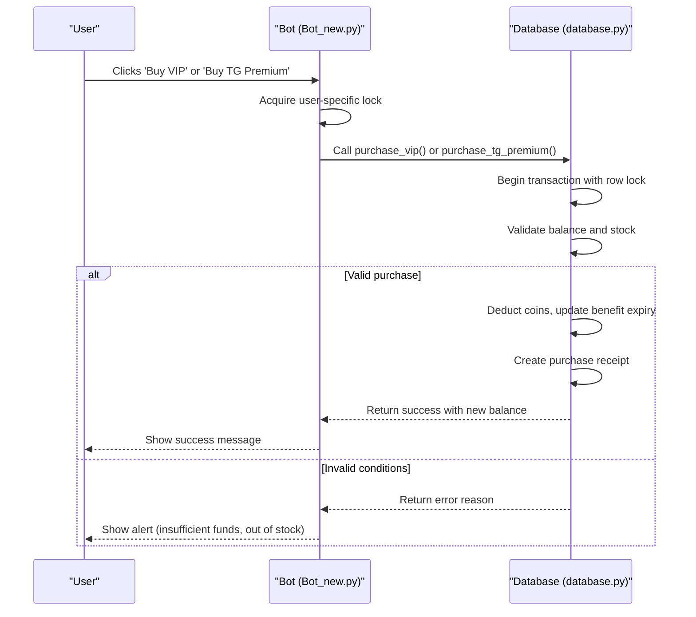
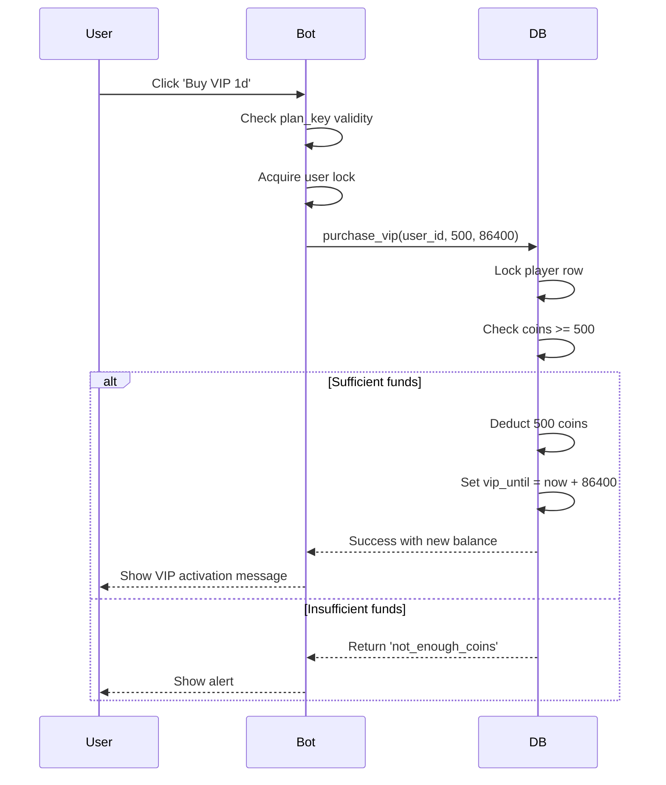
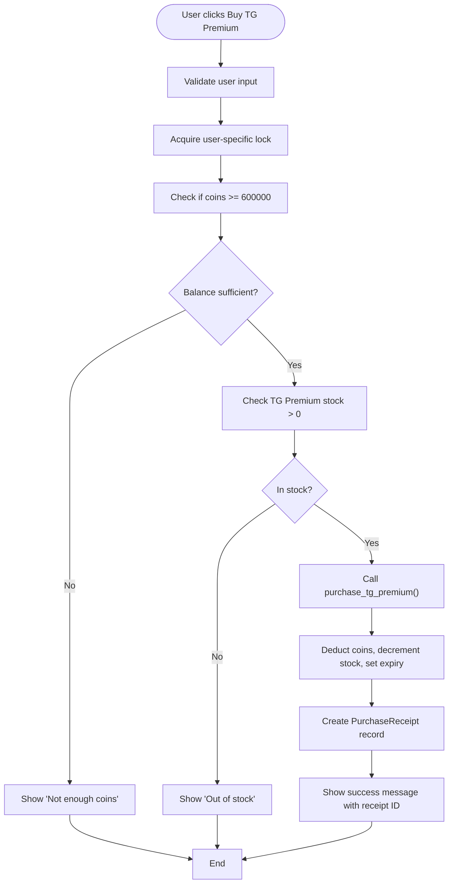
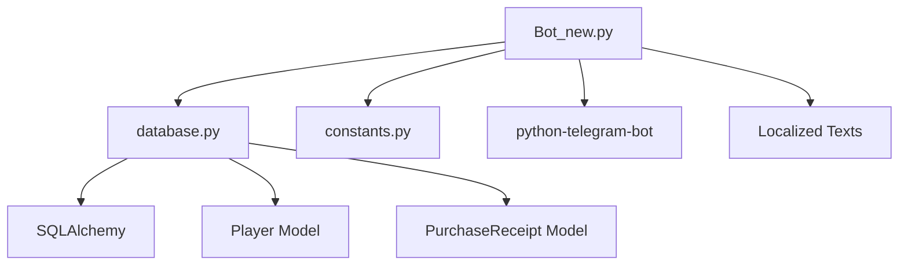

# Purchase System

<cite>
**Referenced Files in This Document**   
- [Bot_new.py](file://Bot_new.py)
- [constants.py](file://constants.py)
- [database.py](file://database.py)
</cite>

## Table of Contents
1. [Introduction](#introduction)
2. [Core Components](#core-components)
3. [Architecture Overview](#architecture-overview)
4. [Detailed Component Analysis](#detailed-component-analysis)
5. [Dependency Analysis](#dependency-analysis)
6. [Performance Considerations](#performance-considerations)
7. [Troubleshooting Guide](#troubleshooting-guide)
8. [Best Practices](#best-practices)
9. [Conclusion](#conclusion)

## Introduction
The Purchase System in RELOAD enables users to acquire Telegram Premium features and in-game advantages using septims, the internal game currency. This system supports transactions for VIP subscriptions, auto-search functionality, and other premium offerings such as Steam games and star packs. The implementation revolves around command handlers in `Bot_new.py`, particularly `/buy` and `/upgrade`, which coordinate with repository methods in `database.py` to validate funds, apply purchases, and persist state changes. Pricing is controlled through configuration constants like `PREMIUM_PRICE` and `UPGRADE_COST`. The system integrates tightly with the VIP and economic subsystems to activate benefits and deduct balances. It ensures transactional integrity and handles edge cases such as insufficient funds, duplicate purchases, and payment rollbacks.

## Core Components

The purchase system is composed of three primary components: the command handlers in `Bot_new.py`, the database interaction layer in `database.py`, and the pricing/configuration constants defined in `constants.py`. These components work in concert to process user purchases, validate conditions, update user state, and maintain transaction records.

**Section sources**
- [Bot_new.py](file://Bot_new.py#L2518-L2571)
- [constants.py](file://constants.py#L35-L48)
- [database.py](file://database.py#L2517-L2539)

## Architecture Overview

The purchase system follows a layered architecture where user interactions initiate purchase flows through Telegram callback handlers. These handlers delegate validation and persistence logic to the database layer, which enforces transactional integrity using database locks and session management.

**Diagram sources**
- [Bot_new.py](file://Bot_new.py#L2518-L2571)
- [database.py](file://database.py#L2517-L2539)

## Detailed Component Analysis

### VIP and TG Premium Purchase Flow

The purchase system supports two main categories of premium features: VIP subscriptions and Telegram Premium access. Both are accessed through dedicated command handlers that validate user eligibility, funds, and inventory availability before finalizing transactions.

#### VIP Subscription Purchase
Users can purchase VIP status in three tiers: 1 day, 7 days, or 30 days. The `buy_vip` handler in `Bot_new.py` processes these transactions by validating the selected plan, checking the user's coin balance, and invoking `purchase_vip` in `database.py`. Upon success, the user's `vip_until` timestamp is updated, granting access to benefits such as reduced cooldowns and doubled coin rewards.

**Diagram sources**
- [Bot_new.py](file://Bot_new.py#L2518-L2571)
- [database.py](file://database.py#L2517-L2539)

#### Telegram Premium Purchase
The `buy_tg_premium` handler allows users to purchase 90 days of Telegram Premium for 600,000 septims. This flow checks both coin balance and stock availability in the `bonus_stock` table. Each successful purchase decrements the global stock and extends the user's `tg_premium_until` timestamp.

**Diagram sources**
- [Bot_new.py](file://Bot_new.py#L3093-L3150)
- [database.py](file://database.py#L1942-L1979)

### Configuration and Pricing Strategy

Pricing for all premium features is defined in `constants.py` using immutable constants that are imported into `Bot_new.py`. This separation allows for centralized price management and easy adjustments without modifying business logic.

**Pricing Configuration**

| Feature | Duration | Cost (Septims) | Constant |
|--------|---------|----------------|----------|
| VIP Subscription | 1 day | 500 | VIP_COSTS['1d'] |
| VIP Subscription | 7 days | 3,000 | VIP_COSTS['7d'] |
| VIP Subscription | 30 days | 10,000 | VIP_COSTS['30d'] |
| Telegram Premium | 90 days | 600,000 | TG_PREMIUM_COST |

**Section sources**
- [constants.py](file://constants.py#L35-L48)

## Dependency Analysis

The purchase system depends on several core modules and maintains strict separation of concerns. The primary dependencies are:

The system uses `database.py` for all data persistence operations, `constants.py` for pricing and configuration, and leverages SQLAlchemy for ORM-based database interactions. The `Player` model stores user state including coin balance and benefit expiry times, while the `PurchaseReceipt` model maintains an audit trail of all transactions.

**Diagram sources**
- [Bot_new.py](file://Bot_new.py#L2518-L2571)
- [database.py](file://database.py#L2517-L2539)

## Performance Considerations

The purchase system implements several performance optimizations:
- **Row-level locking** during transactions to prevent race conditions
- **Async locks** per user to prevent double-click purchases
- **Connection pooling** via SQLAlchemy session management
- **Indexing** on critical database fields like `user_id` and `receipt_id`

These measures ensure that the system can handle concurrent purchase requests without data corruption or balance inconsistencies.

## Troubleshooting Guide

Common issues in the purchase system and their handling mechanisms:

**Insufficient Funds**
- Detected during transaction processing in `database.py`
- Returns `{"ok": false, "reason": "not_enough_coins"}`
- Handled by showing localized alert in `Bot_new.py`

**Out of Stock**
- Applies to limited inventory items like TG Premium
- Checked via `get_bonus_stock()` before purchase
- Returns `{"ok": false, "reason": "out_of_stock"}`

**Duplicate Purchase Attempts**
- Prevented using asyncio locks per user (`_get_lock()`)
- Ensures only one purchase transaction per user at a time

**Payment Rollback**
- Implemented via SQLAlchemy session rollback on exception
- Ensures atomicity: either all changes commit or none do
- Maintains balance and stock consistency

**Section sources**
- [Bot_new.py](file://Bot_new.py#L2518-L2571)
- [database.py](file://database.py#L2517-L2539)

## Best Practices

When extending the purchase system with new offerings:

1. **Define constants first** in `constants.py` for pricing and durations
2. **Use existing purchase patterns** from `purchase_vip` or `purchase_tg_premium`
3. **Implement user locks** to prevent race conditions
4. **Maintain transactional integrity** with database row locks
5. **Create audit records** using the `PurchaseReceipt` model
6. **Handle all error cases** with clear user feedback
7. **Use stock management** for limited inventory items
8. **Localize all user messages** through the `TEXTS` dictionary

For securing purchase flows:
- Always validate user input and plan selection
- Use parameterized queries to prevent injection
- Log all purchase attempts for audit purposes
- Implement rate limiting if necessary
- Regularly verify database integrity

## Conclusion

The RELOAD purchase system provides a robust framework for monetizing premium features through septim-based transactions. By leveraging transactional database operations, user locking, and centralized configuration, it ensures reliable and secure purchases while maintaining data integrity. The system's modular design allows for easy extension with new offerings, and its comprehensive error handling provides a smooth user experience even in edge cases. Integration with the VIP and economic systems enables seamless benefit activation and balance management, making it a core component of the game's progression and monetization strategy.