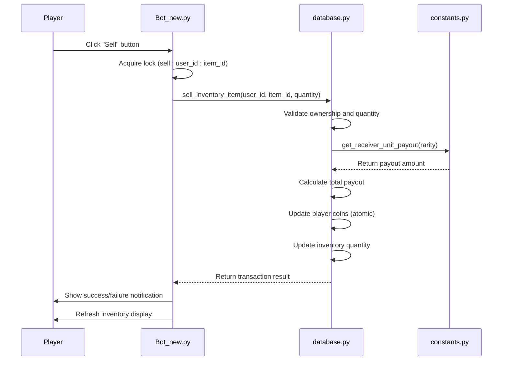
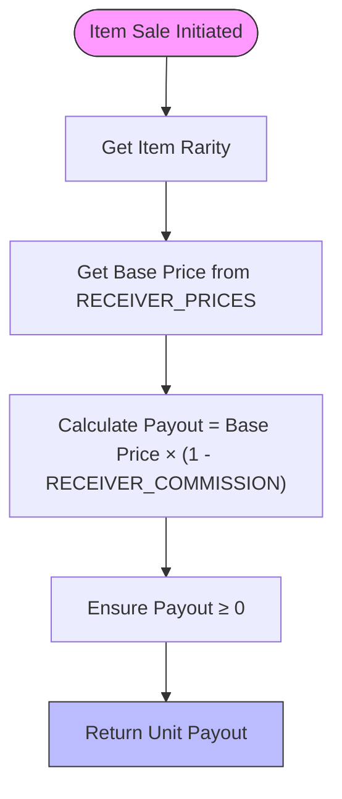
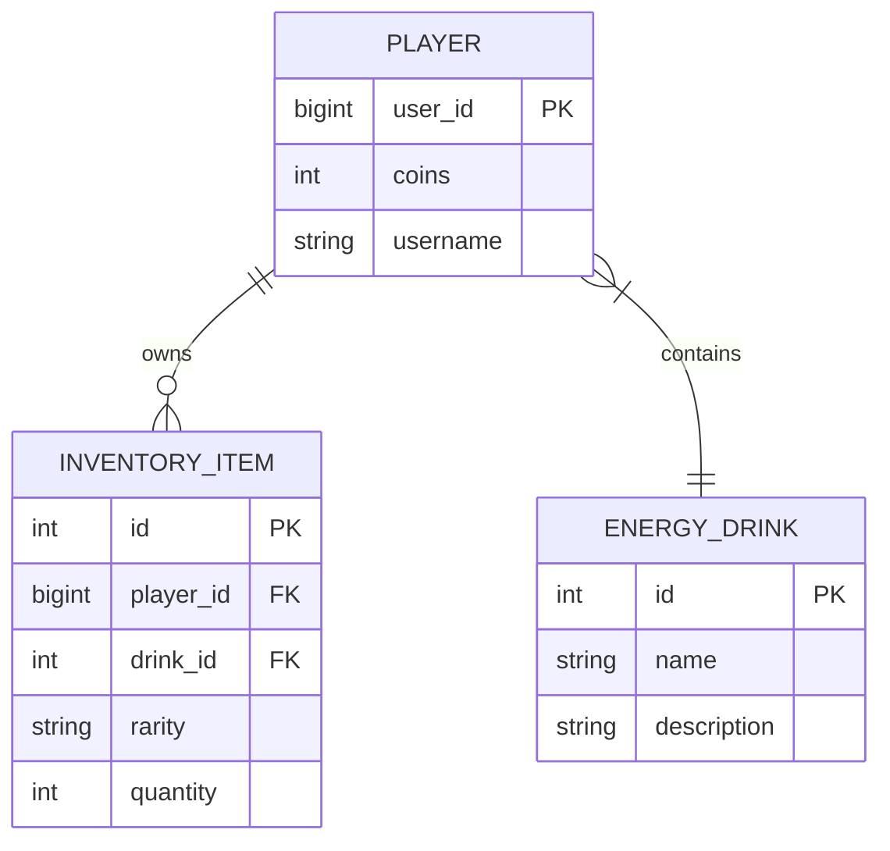
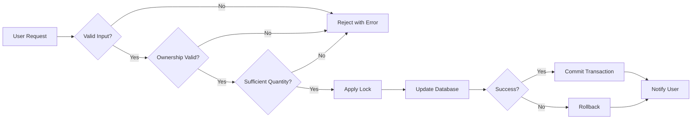

# Receiver System (Item Selling)

<cite>
**Referenced Files in This Document**   
- [Bot_new.py](file://Bot_new.py)
- [database.py](file://database.py)
- [constants.py](file://constants.py)
</cite>

## Table of Contents
1. [Introduction](#introduction)
2. [Core Components](#core-components)
3. [Business Logic Flow](#business-logic-flow)
4. [Pricing Mechanism](#pricing-mechanism)
5. [Inventory and Economic Integration](#inventory-and-economic-integration)
6. [Security and Anti-Cheat Measures](#security-and-anti-cheat-measures)
7. [Configuration and Maintenance](#configuration-and-maintenance)
8. [Troubleshooting Guide](#troubleshooting-guide)

## Introduction
The Receiver System enables players to sell energy drinks and other inventory items for septims (in-game currency). This system is accessible through the `/sell` command and related interface elements in the bot's inventory menu. The business logic is implemented across multiple components, primarily in `Bot_new.py`, `database.py`, and `constants.py`. The system supports dynamic pricing based on item rarity, secure transaction processing, and integration with the broader economic and inventory management systems.

## Core Components

The Receiver System consists of three main components that work together to process item sales:

1. **Command Handlers in Bot_new.py**: The `handle_sell_action` function processes sell requests from users, validates inputs, and coordinates with the database layer.
2. **Database Operations in database.py**: The `sell_inventory_item` function performs atomic updates to inventory and balance records within a database transaction.
3. **Pricing Configuration in constants.py**: The `RECEIVER_PRICES` and `RECEIVER_COMMISSION` constants define the economic model for item sales.

The system uses callback queries to handle sell actions, with specific data patterns like `sell_{item_id}` and `sellall_{item_id}` to distinguish between selling one item or all items of a type.

**Section sources**
- [Bot_new.py](file://Bot_new.py#L952-L1008)
- [database.py](file://database.py#L2733-L2763)
- [constants.py](file://constants.py#L65-L72)

## Business Logic Flow

The item selling process follows a structured sequence of operations:

**Diagram sources**
- [Bot_new.py](file://Bot_new.py#L952-L1008)
- [database.py](file://database.py#L2733-L2763)
- [constants.py](file://constants.py#L65-L72)

When a player initiates a sale, the system first acquires a lock using `_get_lock(f"sell:{user_id}:{item_id}")` to prevent race conditions from double-clicking. The `handle_sell_action` function then calls `db.sell_inventory_item` with the user ID, item ID, and quantity to sell. For selling all items of a type, the quantity is set to a very large number (`10**9`), which the database layer normalizes to the available quantity.

## Pricing Mechanism

The pricing system uses a tiered approach based on item rarity, with prices defined in the `RECEIVER_PRICES` dictionary in `constants.py`. A commission is applied to all transactions, ensuring the system retains a percentage of each sale.

**Diagram sources**
- [constants.py](file://constants.py#L65-L72)
- [database.py](file://database.py#L2705-L2731)

The `get_receiver_unit_payout` function in `database.py` calculates the payout per item by applying the commission rate to the base price. For example, with a 30% commission rate (`RECEIVER_COMMISSION = 0.30`), a Basic energy drink with a base price of 10 septims yields 7 septims when sold (10 × (1 - 0.30) = 7).

### Example Transactions

**Selling a Common Energy Drink:**
- Item: Basic energy drink
- Base price: 10 septims
- Commission: 30% (3 septims)
- Payout: 7 septims per unit
- Transaction: Selling 5 units yields 35 septims

**Selling a Rare Collectible:**
- Item: Majestic energy drink
- Base price: 750 septims
- Commission: 30% (225 septims)
- Payout: 525 septims per unit
- Transaction: Selling 1 unit yields 525 septims

These examples demonstrate the dynamic pricing based on item attributes, where rarer items provide significantly higher returns.

**Section sources**
- [constants.py](file://constants.py#L65-L72)
- [database.py](file://database.py#L2705-L2731)

## Inventory and Economic Integration

The Receiver System is tightly integrated with both the inventory management system and the economic system to ensure data consistency and transaction security.

### Inventory Validation
Before processing a sale, the system validates that:
- The item exists in the database
- The player owns the item
- The requested quantity does not exceed available stock
- The item's rarity is supported for sale

This validation occurs in the `sell_inventory_item` function, which queries the `InventoryItem` table to verify ownership and quantity.

### Secure Fund Transfers
The economic system ensures secure fund transfers through atomic database operations:

**Diagram sources**
- [database.py](file://database.py#L10-L50)

The transaction process uses a database session with proper error handling and rollback capabilities. When updating the player's coin balance, the system uses `with_for_update(read=False)` to lock the player record and prevent race conditions. If any part of the transaction fails, the entire operation is rolled back, maintaining economic integrity.

The system returns detailed transaction results including:
- `unit_payout`: Septims received per item
- `quantity_sold`: Number of items sold
- `total_payout`: Total septims earned
- `coins_after`: Final coin balance
- `item_left_qty`: Remaining inventory quantity

**Section sources**
- [database.py](file://database.py#L2733-L2763)
- [Bot_new.py](file://Bot_new.py#L986-L1008)

## Security and Anti-Cheat Measures

The Receiver System implements multiple layers of protection against common exploits and system abuses.

### Input Validation
The system performs rigorous input validation at multiple levels:
- **Type checking**: Ensures all inputs are proper integers
- **Range validation**: Confirms quantities are positive and within available inventory
- **Ownership verification**: Validates that players can only sell their own items
- **Rarity validation**: Ensures only supported rarities can be sold

The `sell_inventory_item` function includes specific checks for:
- Item existence (`not_found`)
- Ownership (`forbidden`)
- Quantity validity (`bad_quantity`, `empty`)
- Supported rarity (`unsupported_rarity`)

### Atomic Updates
All database operations are performed atomically within a single transaction. This prevents race conditions and ensures that inventory decrements and coin increments happen simultaneously. The use of `dbs.commit()` only after all operations are validated ensures data consistency.

### Moderation Controls
The system includes moderation features to address potential abuses:
- **Transaction logging**: All sales are recorded and can be audited
- **Rate limiting**: The system prevents rapid-fire transactions through UI feedback
- **Admin oversight**: Administrators can review transactions and player balances

The lock mechanism (`_get_lock(f"sell:{user_id}:{item_id}")`) prevents double-spending attacks by serializing access to each item for a specific user.

**Diagram sources**
- [Bot_new.py](file://Bot_new.py#L952-L1008)
- [database.py](file://database.py#L2733-L2763)

**Section sources**
- [Bot_new.py](file://Bot_new.py#L952-L1008)
- [database.py](file://database.py#L2733-L2763)

## Configuration and Maintenance

The Receiver System is designed to be configurable and maintainable, with key parameters centralized in `constants.py`.

### Price Configuration
The pricing model can be adjusted by modifying two constants:
- `RECEIVER_PRICES`: Base prices for each rarity tier
- `RECEIVER_COMMISSION`: Commission rate (0.30 = 30%)

To add new sellable item types, developers can extend the `RECEIVER_PRICES` dictionary with new rarity keys. The system automatically calculates payouts based on the commission rate.

### Monitoring Transaction Volumes
Administrators can monitor economic stability through:
- Direct database queries on player balances
- Reviewing transaction patterns
- Tracking inventory turnover rates

The system's modular design allows for easy addition of monitoring features, such as logging all transactions to a dedicated table or implementing real-time analytics.

### Adding Sellable Item Types
To add new sellable items:
1. Ensure the item has a defined rarity in the `RARITIES` dictionary
2. Add the rarity to `RECEIVER_PRICES` with an appropriate base price
3. Verify the rarity is included in `RARITY_ORDER` for proper display

The system automatically integrates new rarities into the selling interface through the dynamic price list generation in `show_market_receiver`.

**Section sources**
- [constants.py](file://constants.py#L65-L72)
- [Bot_new.py](file://Bot_new.py#L2419-L2446)

## Troubleshooting Guide

This section addresses common issues encountered with the Receiver System and their solutions.

### Price Manipulation Prevention
**Issue**: Attempts to bypass pricing rules through direct API calls.
**Solution**: The system validates all transactions server-side. Price calculations occur in `get_receiver_unit_payout`, which reads from server-defined constants, making client-side manipulation ineffective.

### Inventory Desync Resolution
**Issue**: Display shows incorrect inventory quantities after transactions.
**Solution**: The system automatically refreshes the inventory display after each successful sale using `await show_inventory(update, context)`. This ensures the UI reflects the current database state.

### Market Flooding Mitigation
**Issue**: Excessive selling activity disrupting economic balance.
**Solution**: While the current system doesn't implement per-player sell limits, administrators can:
- Adjust `RECEIVER_PRICES` to reduce profitability
- Modify `RECEIVER_COMMISSION` to increase the take rate
- Implement temporary sell restrictions through code updates

### Common Error Codes
- **not_found**: Item does not exist in database
- **forbidden**: Player does not own the item
- **bad_quantity**: Invalid quantity requested
- **empty**: No items available to sell
- **unsupported_rarity**: Rarity not configured for selling
- **exception**: Internal server error

These errors are handled gracefully with user-friendly messages in the `handle_sell_action` function.

**Section sources**
- [Bot_new.py](file://Bot_new.py#L986-L1008)
- [database.py](file://database.py#L2733-L2763)