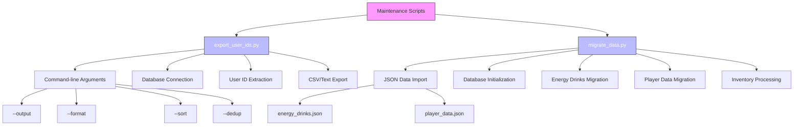

# Maintenance and Operations

<cite>
**Referenced Files in This Document**   
- [database.py](file://database.py)
- [export_user_ids.py](file://export_user_ids.py)
- [migrate_data.py](file://migrate_data.py)
</cite>

## Table of Contents
1. [Database Backup and Export Procedures](#database-backup-and-export-procedures)
2. [System Monitoring and Uptime Tracking](#system-monitoring-and-uptime-tracking)
3. [Update and Deployment Procedures](#update-and-deployment-procedures)
4. [Maintenance Scripts Overview](#maintenance-scripts-overview)
5. [Performance Monitoring and Error Logging](#performance-monitoring-and-error-logging)
6. [Disaster Recovery Planning](#disaster-recovery-planning)
7. [Routine Maintenance Tasks](#routine-maintenance-tasks)
8. [Common Operational Issues and Resolution](#common-operational-issues-and-resolution)

## Database Backup and Export Procedures

The RELOAD bot uses SQLite as its primary database system, with the database file named `bot_data.db`. Regular backups are essential to prevent data loss and ensure business continuity.

Database backups can be performed by directly copying the `bot_data.db` file while the bot is not running or during periods of low activity to ensure data consistency. The file should be copied to a secure, off-site location or cloud storage service. Automated backup scripts can be created to perform this operation on a scheduled basis using cron jobs (Linux) or Task Scheduler (Windows).

For data export operations, the bot provides the `export_user_ids.py` script which allows administrators to extract user identifiers from the database. This script connects to the database through the `database.py` module and queries the `players` table to retrieve all `user_id` values. The export can be formatted as CSV or plain text and supports sorting and deduplication options.

The export process uses SQLAlchemy ORM to safely query the database and write results to the specified output file. Administrators can customize the output path, format, and sorting behavior through command-line arguments when executing the script.

**Section sources**
- [database.py](file://database.py#L1-L3060)
- [export_user_ids.py](file://export_user_ids.py#L1-L95)

## System Monitoring and Uptime Tracking

System monitoring for the RELOAD bot focuses on tracking bot uptime, user activity patterns, and performance metrics. The bot's operational status can be monitored through several approaches.

Basic uptime monitoring can be implemented by setting up external health checks that periodically send a `/start` command to the bot and verify that a response is received within an expected timeframe. This can be automated using monitoring services or custom scripts that log response times and availability.

User activity tracking is built into the database schema through various timestamp fields in the `Player` model, including `last_search`, `last_bonus_claim`, and `last_add`. These fields can be queried to generate activity reports, identify active users, and detect usage patterns over time.

The bot also maintains audit logs through the `ModerationLog` table, which records administrative actions and moderation decisions with timestamps. This provides visibility into administrative operations and can help identify unusual activity patterns.

For real-time monitoring, administrators can implement logging mechanisms that capture key events and errors, which can then be forwarded to centralized logging solutions for analysis and alerting.

**Section sources**
- [database.py](file://database.py#L15-L3060)
- [Bot_new.py](file://Bot_new.py#L1-L3982)

## Update and Deployment Procedures

Deploying new versions of the RELOAD bot requires careful planning to minimize downtime and ensure data integrity. The update process should follow a structured approach.

Before deploying updates, administrators should create a complete backup of the current `bot_data.db` file and configuration files. This ensures that the system can be restored to a working state if issues arise during the update process.

The deployment procedure involves stopping the current bot instance, replacing the code files with updated versions, and then restarting the bot. During this process, users will be unable to interact with the bot, so updates should be scheduled during periods of low activity.

When updates include database schema changes, the `migrate_data.py` script can be used to safely migrate data between versions. This script handles the transfer of data from JSON files to the SQLite database and can be adapted for schema evolution scenarios.

After deployment, administrators should verify that the bot is functioning correctly by testing key features and monitoring logs for errors. Automated health checks can also be used to confirm successful deployment.

**Section sources**
- [migrate_data.py](file://migrate_data.py#L1-L110)
- [database.py](file://database.py#L1-L3060)

## Maintenance Scripts Overview

The RELOAD bot includes several maintenance scripts that support operational tasks and data management.

The `export_user_ids.py` script provides functionality for extracting user identifiers from the database. This script uses command-line arguments to configure output format (CSV or text), file path, sorting, and deduplication. It imports database functionality from `database.py` and uses SQLAlchemy to query the `players` table for `user_id` values. This script is useful for generating user lists for analytics, communication, or migration purposes.

The `migrate_data.py` script handles data migration from JSON format to the SQLite database. It processes two JSON files: `energy_drinks.json` containing drink definitions and `player_data.json` containing player information and inventories. The script first ensures database tables exist, then migrates energy drink data, followed by player data and their inventories. During migration, it parses inventory item keys to extract drink names and rarities, linking them to appropriate database records.

These scripts can serve as templates for developing additional maintenance tools, such as data cleanup utilities, reporting tools, or integration scripts with external systems.

**Diagram sources**
- [export_user_ids.py](file://export_user_ids.py#L1-L95)
- [migrate_data.py](file://migrate_data.py#L1-L110)

**Section sources**
- [export_user_ids.py](file://export_user_ids.py#L1-L95)
- [migrate_data.py](file://migrate_data.py#L1-L110)

## Performance Monitoring and Error Logging

Performance monitoring and error logging are critical for maintaining the reliability and responsiveness of the RELOAD bot.

The bot implements Python's logging module to record operational events, errors, and warnings. Log entries include timestamps, source components, and descriptive messages that help diagnose issues. The logging configuration in `Bot_new.py` sets up a basic format that captures essential information for troubleshooting.

Key performance metrics that should be monitored include command response times, database query performance, and memory usage. Slow database queries can be identified by examining operations that involve multiple table joins or large result sets, such as inventory retrieval with pagination.

Error handling is implemented throughout the codebase with try-except blocks that catch exceptions and prevent the bot from crashing. When errors occur, they are logged with stack traces to facilitate debugging. The bot also implements transaction management with proper rollback procedures to maintain data integrity during database operations.

Administrators should regularly review logs to identify recurring issues, performance bottlenecks, or unusual activity patterns. Log rotation should be implemented to prevent log files from consuming excessive disk space over time.

**Section sources**
- [Bot_new.py](file://Bot_new.py#L1-L3982)
- [database.py](file://database.py#L1-L3060)

## Disaster Recovery Planning

Disaster recovery planning for the RELOAD bot focuses on preparing for and responding to data loss, corruption, or system failures.

The primary component of disaster recovery is regular, verified backups of the `bot_data.db` file. Backups should be stored in multiple locations, including off-site or cloud storage, to protect against local hardware failures. Backup integrity should be periodically tested by restoring to a test environment and verifying data consistency.

In the event of database corruption, administrators can restore from the most recent clean backup. The SQLite database format is generally resilient, but corruption can occur due to improper shutdowns or storage issues. The `database.py` file includes schema definitions that can be used to recreate the database structure if needed.

For complete system recovery, administrators should maintain documentation of the deployment environment, including Python version, required packages (listed in `requirements.txt`), and configuration settings. This enables rapid reconstruction of the operational environment on new hardware if necessary.

Regular disaster recovery drills should be conducted to ensure that recovery procedures work as expected and that recovery time objectives are met.

**Section sources**
- [database.py](file://database.py#L1-L3060)
- [requirements.txt](file://requirements.txt#L1-L10)

## Routine Maintenance Tasks

Routine maintenance tasks for the RELOAD bot include database optimization, log management, and system health checks.

Database optimization should be performed periodically to maintain performance. This includes running the SQLite `VACUUM` command to defragment the database file and reclaim unused space. The `ANALYZE` command can also be used to update statistics that help the query planner make better decisions.

Log file rotation should be implemented to prevent excessive disk usage. Old log files should be compressed and archived, with a retention policy that balances storage requirements with the need for historical data.

System health checks should be performed regularly to verify that all bot functions are operating correctly. This includes testing command responses, database connectivity, and background tasks such as automated reminders.

Data integrity checks can be implemented to verify relationships between tables, such as ensuring that inventory items reference existing drinks and players. Scripts can be developed to identify and report orphaned records or inconsistent data.

**Section sources**
- [database.py](file://database.py#L1-L3060)
- [Bot_new.py](file://Bot_new.py#L1-L3982)

## Common Operational Issues and Resolution

Several common operational issues may arise during the operation of the RELOAD bot, along with their resolution strategies.

Database corruption can occur due to improper shutdowns or storage issues. Symptoms include inability to start the bot or database connection errors. Resolution involves restoring from the most recent backup and investigating the root cause to prevent recurrence.

Migration failures may happen when using the `migrate_data.py` script, particularly if the JSON data format does not match expectations. These failures are typically due to malformed JSON, missing required fields, or data type mismatches. Resolution involves validating the input data format and ensuring all required fields are present and correctly formatted.

Performance degradation can occur as the database grows in size, leading to slower query response times. This can be addressed through database optimization (VACUUM, ANALYZE), adding appropriate indexes, or query optimization.

Authentication and permission issues may arise with administrative commands. These are typically resolved by verifying administrator credentials in the `ADMIN_USERNAMES` constant and ensuring proper role assignments in the `admin_users` table.

Memory leaks or resource exhaustion can occur with long-running bot instances. Regular restarts as part of maintenance procedures can help mitigate this issue, along with monitoring memory usage patterns.

**Section sources**
- [database.py](file://database.py#L1-L3060)
- [migrate_data.py](file://migrate_data.py#L1-L110)
- [admin.py](file://admin.py#L1-L185)