# Casino Gambling Mini-game

<cite>
**Referenced Files in This Document**   
- [Bot_new.py](file://Bot_new.py)
- [constants.py](file://constants.py)
- [database.py](file://database.py)
</cite>

## Table of Contents
1. [Introduction](#introduction)
2. [Game Mechanics](#game-mechanics)
3. [Command Handler Implementation](#command-handler-implementation)
4. [Payout Logic and Risk-Reward Balance](#payout-logic-and-risk-reward-balance)
5. [VIP Status Effects](#vip-status-effects)
6. [Error Handling and Rate Limiting](#error-handling-and-rate-limiting)
7. [Security Considerations](#security-considerations)

## Introduction
The casino gambling mini-game is an integral part of the EnergoBot gaming experience, allowing players to wager their septims currency on a simple coin-flip style game of chance. This document details the implementation of the casino system, including game mechanics, command handling, payout calculations, and integration with the player economy. The system is designed to provide entertainment while maintaining balance through carefully configured odds and risk-reward parameters.

## Game Mechanics
The casino mini-game operates on a straightforward betting system where players can place wagers on a binary outcome. The game mechanics are governed by several key components:

- **Bet Validation**: Before any game can proceed, the system validates that the player has sufficient septims to cover their wager. The bet amount must be positive and cannot exceed the player's current balance.
- **Random Outcome Generation**: The game uses Python's `random` module to determine the outcome of each bet. The `random.random()` function generates a floating-point number between 0 and 1, which is then compared against the configured win probability.
- **Win/Loss Probability**: The probability of winning is determined by the `CASINO_WIN_PROB` constant defined in `constants.py`. This value is set to 0.35, meaning players have a 35% chance of winning each bet, giving the house a statistical advantage.

The game implements a 1:1 payout system, where winners receive their original bet amount plus an equal amount as winnings, effectively doubling their wager. Losers forfeit their entire bet amount.

```mermaid
flowchart TD
Start([Player Initiates Bet]) --> ValidateBet["Validate Bet Amount\n> 0 and ≤ Player Balance"]
ValidateBet --> |Valid| LockPlayer["Acquire Player Lock\nto Prevent Concurrent Bets"]
LockPlayer --> DeductBet["Deduct Bet Amount\nfrom Player Balance"]
DeductBet --> GenerateOutcome["Generate Random Outcome\nusing random.random()"]
GenerateOutcome --> CheckWin{"Outcome < CASINO_WIN_PROB\n(35%)?"}
CheckWin --> |Yes| CalculateWin["Calculate Winnings\nBet × 2"]
CheckWin --> |No| UpdateLoss["Record Loss\nNo Additional Payout"]
CalculateWin --> UpdateWin["Add Winnings to\nPlayer Balance"]
UpdateWin --> DisplayResult["Display Result to Player"]
UpdateLoss --> DisplayResult
DisplayResult --> ReleaseLock["Release Player Lock"]
ReleaseLock --> End([Game Complete])
```



**Diagram sources**
- [Bot_new.py](file://Bot_new.py#L1131-L1162)
- [constants.py](file://constants.py#L28)

**Section sources**
- [Bot_new.py](file://Bot_new.py#L1131-L1162)
- [constants.py](file://constants.py#L28)

## Command Handler Implementation
The `/casino` command handler in `Bot_new.py` serves as the entry point for the casino mini-game, processing user interactions and coordinating with other system components. The handler is triggered through callback queries with data patterns starting with `casino_bet_`, which contain the specific bet amount.

The command handler follows a structured process:
1. **Input Parsing**: Extracts the bet amount from the callback data
2. **Validation**: Ensures the bet amount is positive and within acceptable limits
3. **Concurrency Control**: Uses asyncio locks to prevent multiple simultaneous bets from the same player
4. **Player Data Retrieval**: Fetches the player's current state from the database
5. **Balance Verification**: Confirms the player has sufficient funds for the wager
6. **Transaction Processing**: Handles the financial aspects of the bet
7. **Outcome Determination**: Generates the random result and updates the player's balance accordingly
8. **User Feedback**: Displays the result and updated balance to the player

The handler integrates with the `Player` model in `database.py` to manage septims transactions, deducting bets and awarding winnings through the `increment_coins` function. This ensures atomic operations and prevents race conditions in the financial system.

```mermaid
sequenceDiagram
participant Player as "Player"
participant Handler as "Casino Handler"
participant Database as "Database"
Player->>Handler : Clicks bet button (e.g., "🎲 100")
Handler->>Handler : Parse bet amount from callback data
Handler->>Handler : Validate bet amount > 0
Handler->>Handler : Acquire player-specific lock
Handler->>Database : Get player data (get_or_create_player)
Handler->>Handler : Check if balance >= bet amount
alt Insufficient funds
Handler->>Player : Show "Not enough septims" alert
Handler->>Handler : Redisplay casino screen
else Valid balance
Handler->>Database : Deduct bet (increment_coins with negative value)
Handler->>Handler : Generate random outcome
alt Win (35% chance)
Handler->>Database : Award winnings (increment_coins with bet × 2)
Handler->>Player : Display "🎉 Victory!" message
else Loss (65% chance)
Handler->>Player : Display "💥 Defeat!" message
end
Handler->>Player : Show updated balance
Handler->>Handler : Redisplay casino interface
end
Handler->>Handler : Release player lock
```



**Diagram sources**
- [Bot_new.py](file://Bot_new.py#L1131-L1180)
- [database.py](file://database.py#L2490-L2500)

**Section sources**
- [Bot_new.py](file://Bot_new.py#L1054-L1207)
- [database.py](file://database.py#L2490-L2500)

## Payout Logic and Risk-Reward Balance
The casino implements a balanced risk-reward system designed to provide entertainment while maintaining the integrity of the in-game economy. The payout logic follows a simple 1:1 model, where successful bets return double the wagered amount.

The risk-reward balance is controlled by the `CASINO_WIN_PROB` constant in `constants.py`, which is set to 0.35 (35%). This creates a house edge of 30%, calculated as follows:

House Edge = (1 - (Win Probability × Payout Multiplier)) = (1 - (0.35 × 2)) = 0.30

This mathematical advantage ensures the casino maintains a positive expected value over time while still providing players with a reasonable chance of winning. The system displays the approximate win probability (~35%) in the casino interface, providing transparency to players about their odds.

The integration with the septims currency system is seamless, with all transactions recorded in the player's account. When a player wins, their balance is increased by twice their bet amount (original bet returned plus equal winnings). When a player loses, the bet amount is deducted from their balance.

Example scenarios:
- Player bets 100 septims and wins: Balance increases by 200 septims (net gain: +100)
- Player bets 100 septims and loses: Balance decreases by 100 septims (net loss: -100)

The system ensures that players cannot bet more than their current balance, preventing negative account balances and maintaining economic stability within the game.

**Section sources**
- [Bot_new.py](file://Bot_new.py#L1162-L1180)
- [constants.py](file://constants.py#L28)

## VIP Status Effects
VIP status in the system provides various gameplay advantages but does not directly affect the casino mini-game mechanics. According to the configuration in `constants.py` and implementation in `Bot_new.py`, VIP benefits include:

- Leaderboard badge (👑)
- Reduced search cooldown (50% of normal)
- Reduced daily bonus cooldown (50% of normal)
- Doubled coin rewards from searches
- Priority search reminders

The casino game maintains consistent rules and probabilities for all players, regardless of VIP status. This design decision ensures fairness and prevents VIP players from having an unfair advantage in gambling activities. The `CASINO_WIN_PROB` remains at 35% for both VIP and non-VIP players, and the 1:1 payout structure applies equally to all participants.

VIP status is managed through the `purchase_vip` function in `database.py`, which handles the transaction of septims for VIP duration. Players can purchase VIP status for 1 day (500 septims), 7 days (3,000 septims), or 30 days (10,000 septims). The system tracks VIP expiration through the `vip_until` field in the Player model.

```mermaid
classDiagram
class Player {
+BigInteger user_id
+String username
+Integer coins
+Integer last_search
+Integer last_bonus_claim
+String language
+Boolean remind
+Integer vip_until
+Integer tg_premium_until
+Boolean auto_search_enabled
+Integer auto_search_count
+Integer auto_search_reset_ts
+Integer auto_search_boost_count
+Integer auto_search_boost_until
}
class Constants {
+Integer SEARCH_COOLDOWN = 300
+Integer DAILY_BONUS_COOLDOWN = 86400
+String ENERGY_IMAGES_DIR = 'energy_images'
+Dict RARITIES
+Dict COLOR_EMOJIS
+List RARITY_ORDER
+Integer ITEMS_PER_PAGE = 10
+Float CASINO_WIN_PROB = 0.35
+String VIP_EMOJI = '👑'
+Dict VIP_COSTS
+Dict VIP_DURATIONS_SEC
+Integer TG_PREMIUM_COST = 600000
+Integer TG_PREMIUM_DURATION_SEC = 7776000
+Set ADMIN_USERNAMES = {'aAntiLoxX'}
+Integer AUTO_SEARCH_DAILY_LIMIT = 60
+Float RECEIVER_COMMISSION = 0.30
+Dict RECEIVER_PRICES
+Dict SHOP_PRICES
}
class Database {
+get_or_create_player(user_id, username)
+increment_coins(user_id, amount)
+purchase_vip(user_id, cost_coins, duration_seconds)
+is_vip(user_id)
+get_vip_until(user_id)
+get_auto_search_daily_limit(user_id)
+get_boost_info(user_id)
}
Player --> Database : "Uses"
Constants --> Database : "Configures"
Constants --> Player : "Defines VIP benefits"
```

**Diagram sources**
- [constants.py](file://constants.py#L1-L76)
- [database.py](file://database.py#L2517-L2539)
- [Bot_new.py](file://Bot_new.py#L2872-L2891)

**Section sources**
- [constants.py](file://constants.py#L1-L76)
- [database.py](file://database.py#L2517-L2539)

## Error Handling and Rate Limiting
The casino system implements comprehensive error handling to ensure a smooth user experience and protect against abuse. Key error handling mechanisms include:

- **Insufficient Funds**: When a player attempts to place a bet exceeding their current balance, the system displays an alert message ("Not enough septims") and prevents the transaction from proceeding. The casino interface is then redisplayed, allowing the player to place a smaller bet.
- **Invalid Bet Amount**: Bets of zero or negative amounts are rejected with an alert ("Invalid bet"), preventing exploitation of the system.
- **Concurrency Protection**: The system uses asyncio locks (`_get_lock`) to prevent players from placing multiple bets simultaneously, which could lead to race conditions and balance inconsistencies.
- **Database Transaction Safety**: Financial operations are wrapped in try-catch blocks to handle potential database errors, with appropriate rollback procedures to maintain data integrity.

Rate limiting is implemented through the use of player-specific locks, which prevent rapid-fire betting that could overwhelm the system or create a poor user experience. While there is no explicit cooldown between bets, the lock mechanism naturally limits the rate at which a single player can place wagers.

The error handling strategy prioritizes user feedback, using Telegram's alert system to provide immediate visual feedback for invalid actions, while silently handling technical errors to maintain system stability.

**Section sources**
- [Bot_new.py](file://Bot_new.py#L1131-L1162)
- [database.py](file://database.py#L2490-L2500)

## Security Considerations
The current implementation uses Python's standard `random` module for outcome generation, which is suitable for entertainment purposes but may not provide sufficient cryptographic security for high-stakes gambling. The `random.random()` function uses a deterministic algorithm that could theoretically be predicted with sufficient knowledge of the system state.

For enhanced security, the system could be modified to use cryptographically secure randomization through Python's `secrets` module, which is already imported in `Bot_new.py`. The `secrets.randbelow()` or `secrets.choice()` functions would provide better protection against prediction and manipulation.

Potential improvements include:
- Replacing `random.random()` with `secrets.randbelow(100) < 35` for win determination
- Implementing periodic reseeding of the random number generator
- Adding server-side validation of client requests to prevent tampering
- Logging suspicious betting patterns for administrative review

The current implementation does not appear to have unfair win rates, as the 35% win probability is clearly documented and consistently applied. However, monitoring actual win rates in production would be advisable to ensure the system behaves as expected and maintains player trust.

**Section sources**
- [Bot_new.py](file://Bot_new.py#L1158-L1162)
- [constants.py](file://constants.py#L28)