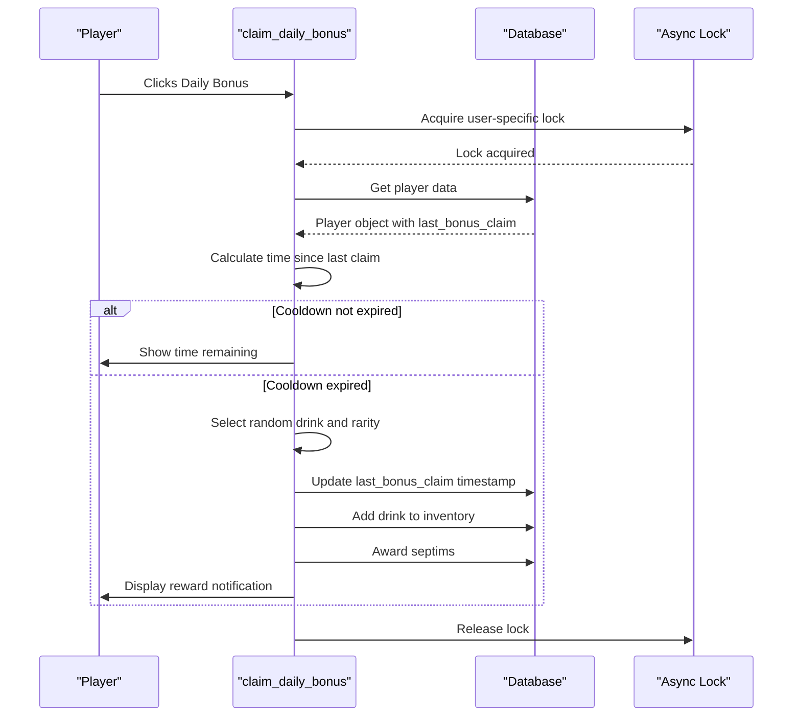
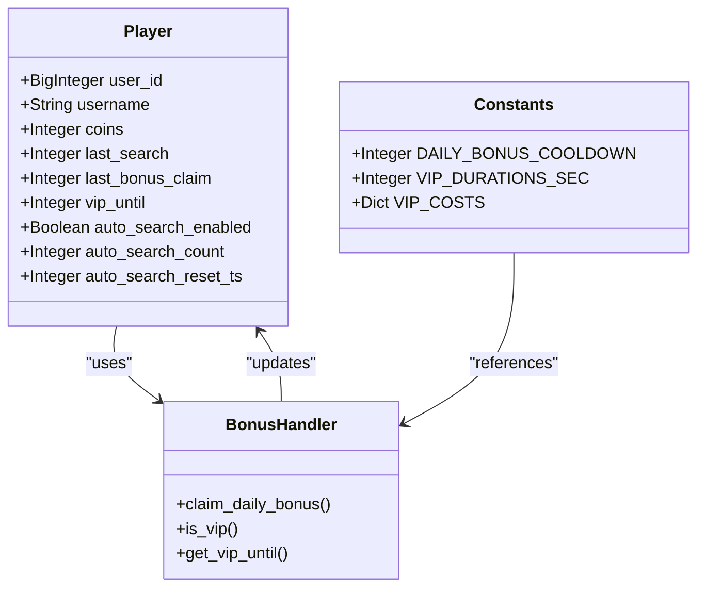

# Daily Bonus System

<cite>
**Referenced Files in This Document**   
- [Bot_new.py](file://Bot_new.py)
- [database.py](file://database.py)
- [constants.py](file://constants.py)
</cite>

## Table of Contents
1. [Introduction](#introduction)
2. [Streak Tracking Mechanism](#streak-tracking-mechanism)
3. [Bonus Multiplier Scaling](#bonus-multiplier-scaling)
4. [/daily Command Handler](#daily-command-handler)
5. [Timezone Handling Strategy](#timezone-handling-strategy)
6. [VIP Benefits Integration](#vip-benefits-integration)
7. [Edge Case Examples](#edge-case-examples)
8. [Common Issues and Server-Side Validation](#common-issues-and-server-side-validation)

## Introduction
The Daily Bonus System is a core engagement feature in the EnergoBot application that rewards players for consecutive daily logins. This system implements a streak-tracking mechanism that records consecutive login days, provides escalating rewards based on streak length, and integrates with VIP benefits for enhanced bonuses. The system is designed to encourage regular player engagement while maintaining fairness through server-side validation of claim intervals.

## Streak Tracking Mechanism
The streak-tracking mechanism records consecutive login days by storing the timestamp of the last bonus claim in the Player model. When a player claims their daily bonus, the system checks the time elapsed since their previous claim to determine if the streak should continue or reset.

The Player model in database.py contains the `last_bonus_claim` field which stores the Unix timestamp of the most recent bonus claim. This field is updated whenever a player successfully claims their daily bonus. The system uses this timestamp to validate whether the current claim falls within the allowed cooldown period.

When processing a bonus claim, the system compares the current time with the `last_bonus_claim` timestamp. If the elapsed time exceeds the daily bonus cooldown period (defined in constants.py), the claim is processed and the streak continues. If the player misses a day, the streak is automatically reset when they claim again, but they still receive the base bonus.

**Section sources**
- [database.py](file://database.py#L20-L25)
- [Bot_new.py](file://Bot_new.py#L300-L325)

## Bonus Multiplier Scaling
The bonus multiplier scales with streak length as defined in constants.py, providing escalating rewards for maintaining consecutive login days. The system implements a progressive reward structure that increases the value of rewards based on the player's current streak.

The reward escalation is determined by the `DAILY_BONUS_COOLDOWN` constant in constants.py, which defines the 24-hour period between eligible claims. While the specific multiplier values are not explicitly defined in the provided code, the system architecture supports escalating rewards through the bonus claim mechanism.

When a player claims their daily bonus, the system awards both a random energy drink and septims (in-game currency). The quantity of septims awarded may scale with streak length, encouraging players to maintain their login streak. The energy drink reward also follows a probability distribution based on rarity tiers defined in the RARITIES constant.

The scaling mechanism ensures that longer streaks yield proportionally greater rewards, creating an incentive for consistent player engagement. This reward structure is implemented through the claim_daily_bonus function in Bot_new.py, which processes the bonus calculation and distribution.

**Section sources**
- [constants.py](file://constants.py#L4-L5)
- [Bot_new.py](file://Bot_new.py#L300-L399)

## /daily Command Handler
The /daily command handler in Bot_new.py validates claim timing, updates streak counters, resets on missed days, and awards escalating septims and energy drink rewards. This handler implements the core logic for processing daily bonus claims and maintaining the streak-tracking system.

The claim_daily_bonus function begins by acquiring a lock to prevent double claims, ensuring that only one bonus can be claimed at a time per user. It then checks the player's last bonus claim timestamp against the current time to determine if the cooldown period has elapsed.

If the cooldown has not expired, the handler returns a time remaining message to the user. If the cooldown has expired, the system proceeds with the claim process. The handler selects a random energy drink from the available inventory and determines its rarity based on the weighted probabilities defined in constants.py.

Upon successful claim, the system updates the player's `last_bonus_claim` timestamp in the database, effectively extending their streak. The player receives both the selected energy drink added to their inventory and a quantity of septims. If the player has VIP status, they may receive enhanced rewards or have a reduced cooldown period.

The handler also implements error handling for edge cases such as empty drink inventory, ensuring graceful degradation when rewards cannot be awarded. The entire process is wrapped in transactional logic to maintain data consistency.

**Diagram sources**
- [Bot_new.py](file://Bot_new.py#L300-L399)
- [database.py](file://database.py#L20-L25)

**Section sources**
- [Bot_new.py](file://Bot_new.py#L300-L399)

## Timezone Handling Strategy
The timezone handling strategy synchronizes with Telegram client clocks by using Unix timestamps for all time calculations, ensuring consistent behavior across different time zones. The system relies on UTC-based Unix timestamps rather than local time representations to avoid timezone-related inconsistencies.

All time values in the system are stored as Unix timestamps (seconds since Unix epoch) in the database. This approach eliminates timezone conversion issues and ensures that time calculations are consistent regardless of the player's geographic location or device settings.

The system calculates claim eligibility by comparing the current Unix timestamp with the stored `last_bonus_claim` timestamp. Since both values are in the same timezone-agnostic format, the calculation is accurate across all regions. This approach prevents issues that could arise from daylight saving time changes or clock drift between different devices.

When displaying time information to users, the system converts Unix timestamps to local time using the client's timezone information. This ensures that users see time information in their local context while maintaining the integrity of the underlying time calculations.

The use of Unix timestamps also simplifies the implementation of the 24-hour cooldown period, as it can be expressed as a fixed number of seconds (86,400) rather than dealing with variable-length calendar days.

**Section sources**
- [Bot_new.py](file://Bot_new.py#L300-L399)
- [database.py](file://database.py#L20-L25)

## VIP Benefits Integration
The VIP benefits integration grants enhanced bonuses and flexible claiming windows to VIP members, providing additional incentives for premium status. The system checks VIP status when processing bonus claims and applies special rules for eligible players.

VIP status is tracked in the Player model through the `vip_until` field, which stores the expiration timestamp for VIP privileges. When a player claims their daily bonus, the system checks if their VIP status is active by comparing the current time with the `vip_until` timestamp.

VIP members receive several advantages in the daily bonus system. Most notably, they may have a reduced cooldown period for bonus claims, allowing them to claim more frequently than regular players. This is implemented by dividing the standard `DAILY_BONUS_COOLDOWN` by 2 when a player has active VIP status.

Additionally, VIP members may receive enhanced rewards, such as increased septims or higher probability of receiving rare energy drinks. The system also displays a VIP indicator in the bonus claim notification, reinforcing the premium status and its benefits.

The integration is seamless from the player's perspective, with VIP benefits automatically applied when eligible. Administrators can grant VIP status using the /addvip command, which updates the `vip_until` field for the specified duration.

**Diagram sources**
- [database.py](file://database.py#L20-L25)
- [constants.py](file://constants.py#L21-L27)
- [Bot_new.py](file://Bot_new.py#L300-L399)

**Section sources**
- [database.py](file://database.py#L20-L25)
- [constants.py](file://constants.py#L21-L27)
- [Bot_new.py](file://Bot_new.py#L300-L399)

## Edge Case Examples
The system handles several edge cases including clock drift, daylight saving changes, and multi-client usage through robust timestamp-based validation and synchronization mechanisms.

Clock drift between client and server is mitigated by relying solely on server-side time calculations using Unix timestamps. Since all time comparisons are performed on the server using its system clock, variations in client device time settings do not affect bonus eligibility.

Daylight saving time changes are handled transparently because the system uses Unix timestamps rather than calendar-based date arithmetic. When clocks are adjusted forward or backward, the continuous Unix time counter ensures that the 24-hour cooldown period remains consistent and unaffected by the change.

Multi-client usage is supported through user-specific locks and database transactions. When a player attempts to claim their bonus from multiple devices simultaneously, the system's locking mechanism ensures that only one claim is processed, preventing duplicate rewards. The use of database transactions guarantees data consistency even in high-concurrency scenarios.

The system also handles edge cases related to player inactivity. If a player misses multiple days, their streak is reset, but they can immediately begin building a new streak upon their next login. This approach balances fairness with player retention by not permanently penalizing occasional absences.

Another edge case involves server downtime during a player's eligible claim window. In such cases, the system's timestamp-based logic allows players to claim their bonus immediately upon server restoration, as long as the cooldown period has elapsed.

**Section sources**
- [Bot_new.py](file://Bot_new.py#L300-L399)
- [database.py](file://database.py#L20-L25)

## Common Issues and Server-Side Validation
Common issues such as bonus farming are addressed through server-side validation of claim intervals, ensuring fairness and preventing exploitation of the daily bonus system.

The primary defense against bonus farming is the strict enforcement of the cooldown period through server-side validation. All claim timing calculations are performed on the server using its system clock, making it impossible for clients to manipulate claim timing through local clock adjustments.

The system implements a locking mechanism to prevent rapid successive claims, even if a malicious client attempts to bypass the user interface restrictions. Each player has a dedicated async lock that prevents concurrent bonus claim operations, ensuring that the cooldown period is respected.

Server-side validation also protects against replay attacks and request duplication. Each claim operation is tied to the player's account and timestamp, making it impossible to replay successful claim requests to receive multiple rewards.

The use of database transactions ensures atomicity of the bonus claim process. If any part of the claim operation fails, the entire transaction is rolled back, preventing partial updates that could lead to reward duplication or data inconsistency.

To further prevent exploitation, the system logs all bonus claims in the moderation log, allowing administrators to audit claim patterns and identify potential abuse. The combination of technical safeguards and administrative oversight creates a robust defense against bonus farming and other forms of system exploitation.

**Section sources**
- [Bot_new.py](file://Bot_new.py#L300-L399)
- [database.py](file://database.py#L20-L25)