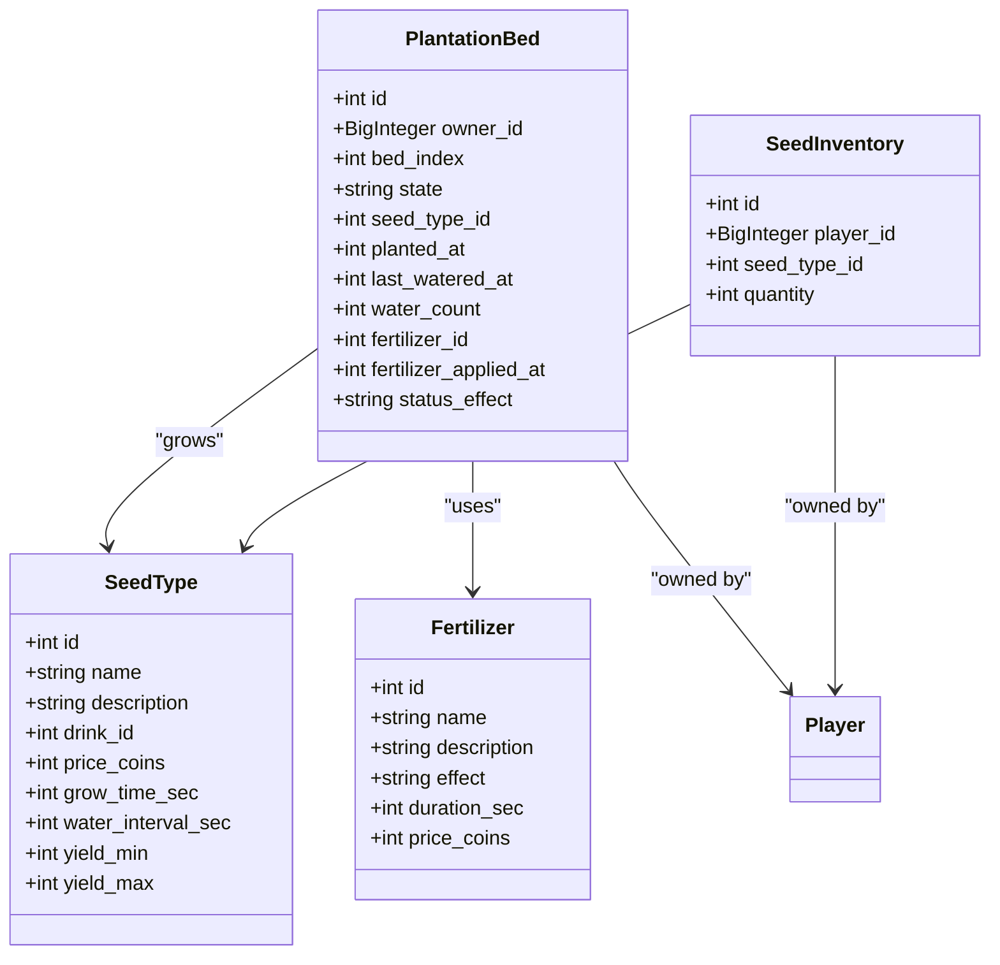

# Plantation Farming System

<cite>
**Referenced Files in This Document**   
- [Bot_new.py](file://Bot_new.py)
- [constants.py](file://constants.py)
- [database.py](file://database.py)
</cite>

## Table of Contents
1. [Introduction](#introduction)
2. [Plantation Growth Cycle Mechanics](#plantation-growth-cycle-mechanics)
3. [Command Interface and Database Models](#command-interface-and-database-models)
4. [Constants and Environmental Modifiers](#constants-and-environmental-modifiers)
5. [Community Plantations and Reward Distribution](#community-plantations-and-reward-distribution)
6. [Asynchronous Updates and Job Scheduling](#asynchronous-updates-and-job-scheduling)
7. [Security and Exploit Mitigation](#security-and-exploit-mitigation)
8. [Conclusion](#conclusion)

## Introduction
The Plantation Farming System is a time-based mini-game within the EnergoBot application that allows players to grow crops, harvest yields, and earn rewards. The system leverages UTC timestamps stored in a SQLite database to manage growth cycles, enforce cooldowns, and prevent time manipulation exploits. Players interact with the system via the `/plantation` command, which provides access to planting, watering, harvesting, and community participation features. This document details the mechanics, architecture, and implementation of the plantation system, focusing on time-based calculations, database interactions, and reward distribution logic.

## Plantation Growth Cycle Mechanics
The plantation system operates on a time-based growth cycle governed by UTC timestamps. Each crop progresses through distinct stages: planting, growing, ready for harvest, and withered (if neglected). The growth duration and watering intervals are defined per seed type in the database.

When a player plants a seed using `handle_plantation_plant`, the system records the current timestamp in the `planted_at` field of the `PlantationBed` model. The crop enters the "growing" state, and its readiness is determined by comparing the elapsed time against the `grow_time_sec` value defined in the `SeedType` model. Players can water the crop using the `water_bed` function, which updates the `last_watered_at` timestamp and increments the `water_count`. Watering must occur within the interval defined by `water_interval_sec` to avoid penalties.

The system periodically checks if a crop has reached maturity using the `_update_bed_ready_if_due` internal function. If the time since `planted_at` exceeds `grow_time_sec`, the bed's state is automatically updated to "ready". If the crop is not harvested within a certain period, it may enter a "withered" state due to environmental effects like drought, weeds, or pests.

**Section sources**
- [database.py](file://database.py#L258-L280)
- [Bot_new.py](file://Bot_new.py#L1946-L1969)

## Command Interface and Database Models
The `/plantation` command in `Bot_new.py` serves as the primary interface for interacting with the plantation system. It leverages custom database models defined in `database.py` to track crop states, player inventories, and yield data.

Key database models include:
- `PlantationBed`: Tracks individual planting beds, including ownership, state, seed type, planting time, and watering history.
- `SeedType`: Defines crop characteristics such as growth duration, watering interval, yield range, and associated energy drink.
- `SeedInventory`: Manages player-owned seeds available for planting.
- `Fertilizer` and `FertilizerInventory`: Handle fertilizer types and player-held fertilizers that can enhance crop yields.

When a player initiates an action (e.g., planting, watering, harvesting), the bot calls corresponding functions in the `db` module (e.g., `plant_seed`, `water_bed`, `harvest_bed`). These functions perform atomic operations within database transactions, ensuring data consistency. For example, `plant_seed` verifies that the player has sufficient seeds, updates the bed state, and decrements the seed inventory in a single transaction.

The system uses SQLAlchemy ORM for database interactions, with relationships established between models (e.g., `PlantationBed` references `SeedType` and `Player`). Indexes are defined on frequently queried fields (e.g., `owner_id`, `bed_index`) to optimize performance.

**Diagram sources**
- [database.py](file://database.py#L204-L280)

**Section sources**
- [Bot_new.py](file://Bot_new.py#L1946-L1969)
- [database.py](file://database.py#L204-L280)

## Constants and Environmental Modifiers
The `constants.py` file defines key parameters that govern plantation behavior, including growth durations, yield ranges, and environmental modifiers. These constants are imported into `Bot_new.py` and used to configure seed types and calculate rewards.

Key constants include:
- `SEARCH_COOLDOWN`: Base cooldown for player actions (5 minutes).
- `RARITIES`: Weighted probabilities for different item rarities.
- `COLOR_EMOJIS`: Visual indicators for rarity levels.
- `RARITY_ORDER`: Sorting order for inventory display.

Seed-specific parameters are stored in the `SeedType` model, but default values are defined in code. For example, growth time (`grow_time_sec`) typically ranges from 3600 to 7200 seconds (1-2 hours), while yield ranges (`yield_min`, `yield_max`) determine the base number of items produced upon harvest.

Environmental modifiers affect yield quantity and quality:
- **Watering**: Each successful watering within the interval provides a 5% bonus to yield (capped at 5 waterings, +25% total).
- **Fertilizers**: Active fertilizers provide a 20% yield multiplier and slightly increase the probability of higher-rarity drops.
- **Negative Statuses**: Conditions like "weeds", "pests", or "drought" reduce yield (by 10-20%) and decrease the likelihood of rare drops.

These modifiers are applied during the harvest calculation in the `harvest_bed` function, where they influence both the total yield and the distribution of item rarities.

**Section sources**
- [constants.py](file://constants.py#L0-L75)
- [database.py](file://database.py#L1368-L1436)

## Community Plantations and Reward Distribution
The system supports community plantations through the `CommunityPlantation` and related models. Multiple users can participate in shared projects, contributing resources toward a common goal.

The `CommunityPlantation` model stores project metadata (title, description, creator), while `CommunityProjectState` tracks progress toward a goal amount. Players join projects via the `join_community_project` function, which creates a `CommunityParticipant` record. Contributions are logged in `CommunityContributionLog`, and rewards are distributed proportionally when the project is completed.

Reward distribution occurs when a participant claims their reward after project completion. The system calculates each user's share based on their contribution relative to the total progress. The total reward pool (`reward_total_coins`) is divided according to contribution percentages, with results rounded to whole numbers. The `reward_claimed` flag in `CommunityParticipant` prevents double claiming.

Community features are accessed through dedicated commands in `Bot_new.py`, such as `show_plantation_community_rewards`, which displays available rewards and handles the claiming process. The interface provides transparency into project status, individual contributions, and pending rewards.

**Section sources**
- [database.py](file://database.py#L283-L289)
- [Bot_new.py](file://Bot_new.py#L1443-L1465)

## Asynchronous Updates and Job Scheduling
The system employs asynchronous updates using Python's `asyncio` and the Telegram Bot API's `JobQueue` for scheduled callbacks. This enables background processing of time-based events without blocking the main application loop.

Key asynchronous operations include:
- **Auto-search for VIP users**: The `auto_search_job` function runs periodically for VIP players, automatically performing searches and sending results. It reschedules itself based on the search cooldown.
- **Search reminders**: The `search_reminder_job` function sends notifications when cooldowns expire, encouraging player engagement.
- **Periodic state updates**: While not explicitly shown, the architecture supports scheduled tasks for updating plantation states, checking for withered crops, or applying daily resets.

These jobs are managed by the `Application.job_queue`, which handles timing and execution. The system uses locks (`_LOCKS`) to prevent race conditions when multiple jobs or user actions interact with the same resource. For example, the `auto_search_job` acquires a user-specific lock before performing a search, ensuring that manual and automatic searches do not conflict.

Error handling is implemented to maintain job stability. If an exception occurs during job execution, the system logs the error and attempts to reschedule the job after a short delay, preventing permanent job loss due to transient issues.

**Section sources**
- [Bot_new.py](file://Bot_new.py#L1579-L1583)
- [Bot_new.py](file://Bot_new.py#L1997-L2078)

## Security and Exploit Mitigation
The system implements several measures to prevent time manipulation exploits and ensure fair play:

1. **Server-side timestamp validation**: All time calculations use UTC timestamps from the server (`time.time()`), preventing clients from manipulating local clocks to bypass cooldowns.
2. **Database-enforced cooldowns**: Cooldown states are stored in the database (`last_search`, `last_bonus_claim`), making them persistent and tamper-resistant.
3. **Atomic operations**: Critical actions (planting, harvesting) use database transactions with `with_for_update(read=False)` to prevent race conditions and double-spending.
4. **Input validation**: Functions validate parameters (e.g., bed index, seed type ID) before processing, rejecting invalid requests.
5. **Rate limiting**: The auto-search feature is limited to `AUTO_SEARCH_DAILY_LIMIT` (60 searches/day), with additional restrictions for VIP users.

The system also employs anti-abuse measures:
- **Double-click prevention**: Async locks (`_get_lock`) prevent users from rapidly clicking buttons to trigger multiple actions.
- **Cooldown enforcement**: The `handle_plantation_harvest` function checks if a crop is truly "ready" before allowing harvest, even if the client-side display suggests otherwise.
- **Data consistency checks**: Functions like `ensure_player_beds` and `ensure_default_seed_types` maintain database integrity by creating missing default records.

These security measures work together to create a robust system resistant to common exploits while maintaining a smooth user experience.

**Section sources**
- [database.py](file://database.py#L1280-L1367)
- [Bot_new.py](file://Bot_new.py#L1997-L2078)

## Conclusion
The Plantation Farming System is a comprehensive mini-game that integrates time-based mechanics, database persistence, and community features within the EnergoBot application. By leveraging UTC timestamps and server-side validation, the system ensures fair and secure gameplay while providing engaging progression through planting, growing, and harvesting cycles. The modular design, with clear separation between command handlers, database models, and constants, allows for easy maintenance and extension. Future enhancements could include more complex environmental effects, seasonal variations, or advanced community project types, building upon the solid foundation described in this document.