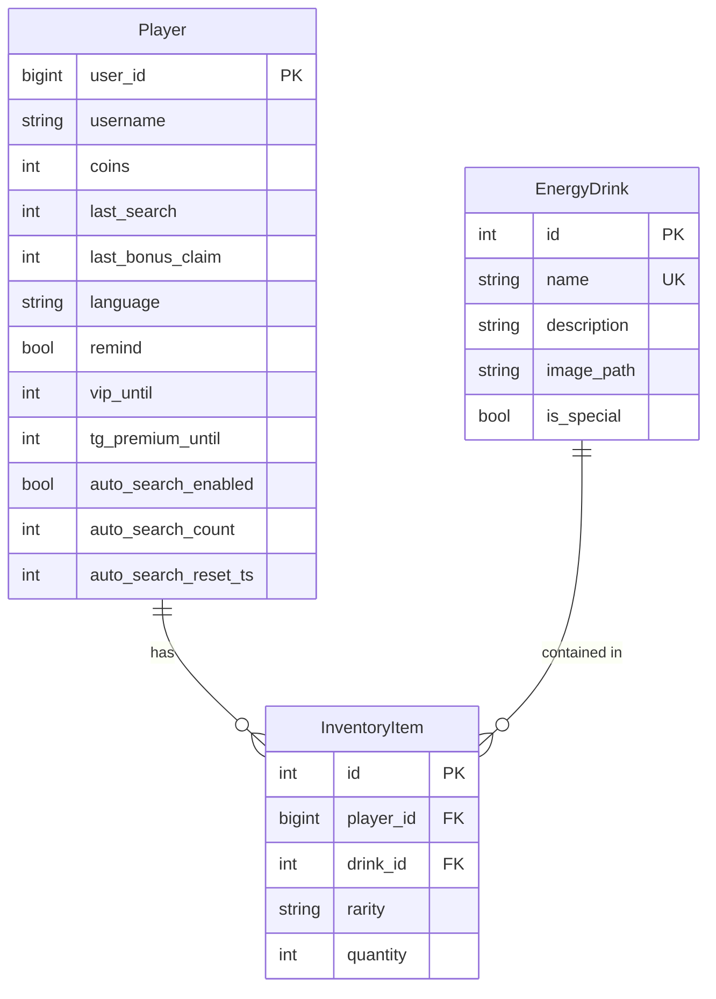

# Project Overview

<cite>
**Referenced Files in This Document**   
- [Bot_new.py](file://Bot_new.py)
- [database.py](file://database.py)
- [constants.py](file://constants.py)
- [admin.py](file://admin.py)
- [admin2.py](file://admin2.py)
- [fullhelp.py](file://fullhelp.py)
- [add_energy_drink_new.py](file://add_energy_drink_new.py)
</cite>

## Table of Contents
1. [Introduction](#introduction)
2. [Core Architecture](#core-architecture)
3. [User Workflow](#user-workflow)
4. [Key Components](#key-components)
5. [Database Structure](#database-structure)
6. [Administrative Controls](#administrative-controls)
7. [Community Features](#community-features)
8. [Technical Implementation](#technical-implementation)

## Introduction

The RELOAD Telegram bot is a gamified energy drink collection application built on the python-telegram-bot framework. It enables users to collect virtual energy drinks, manage inventories, and participate in community activities through an interactive Telegram interface. The system features VIP subscriptions that provide enhanced benefits, administrative controls for moderation, and various community engagement mechanisms.

Users interact with the bot through a menu-driven interface, collecting energy drinks at regular intervals, managing their inventory, and participating in special events. The bot uses a points system called "septims" as its in-game currency, which users earn through various activities and can spend on premium features or items.

The application implements a sophisticated state management system to handle user interactions, with cooldown periods ("cooldowns") governing the frequency of actions like energy drink collection. A rarity-based sorting system organizes collected items, providing a structured collection experience.

**Section sources**
- [Bot_new.py](file://Bot_new.py#L0-L100)
- [constants.py](file://constants.py#L0-L76)

## Core Architecture

The RELOAD bot is built on the python-telegram-bot framework (version 20.7), leveraging its asynchronous capabilities for efficient message handling and user interaction. The architecture follows a modular design pattern, with distinct components handling different aspects of functionality.

At the core of the system is the Bot_new.py file, which serves as the main entry point and orchestrates the various components. The application uses SQLAlchemy ORM (version 2.0) for database interactions, providing an object-relational mapping layer that abstracts the underlying SQLite database.

The system implements a callback-based interaction model where user actions trigger specific handler functions. These handlers process user requests, interact with the database, and generate appropriate responses. The architecture includes a comprehensive locking mechanism using asyncio.Lock to prevent race conditions during concurrent operations.

Configuration management is handled through a constants.py module that centralizes all configurable parameters, including cooldown periods, rarity weights, pricing structures, and administrative settings. This approach ensures consistency across the application and simplifies maintenance.

The bot employs JobQueue for asynchronous event handling, scheduling periodic tasks such as auto-search for VIP users, group notifications, and boost expiration monitoring. This allows the system to perform background operations without blocking the main event loop.

**Section sources**
- [Bot_new.py](file://Bot_new.py#L0-L100)
- [database.py](file://database.py#L0-L100)
- [constants.py](file://constants.py#L0-L76)
- [requirements.txt](file://requirements.txt#L0-L3)

## User Workflow

The user journey begins with the /start command, which initializes the user's profile and displays the main menu. New users are automatically registered in the database with default settings, including language preference and initial coin balance.

From the main menu, users can perform several key actions:
- **Find energy**: Search for a random energy drink, subject to cooldown restrictions
- **Inventory**: View collected energy drinks sorted by rarity
- **Stats**: Access personal statistics and collection progress
- **Settings**: Configure language, reminders, and other preferences

The energy drink collection process follows a specific workflow. When a user initiates a search, the system checks the cooldown status, which varies based on VIP status. VIP users enjoy a 50% reduction in cooldown time. Upon successful search, the system randomly selects an energy drink from the available pool, determines its rarity based on weighted probabilities defined in the RARITIES constant, and adds it to the user's inventory.

Users can manage their inventory through a paginated interface that displays items grouped by rarity, using the RARITY_ORDER for sorting. Each page shows ITEMS_PER_PAGE items, allowing users to navigate through their collection efficiently.

The daily bonus system provides additional rewards at regular intervals, with VIP users again benefiting from reduced cooldown periods. This creates a consistent engagement loop that encourages daily interaction with the bot.

**Section sources**
- [Bot_new.py](file://Bot_new.py#L799-L1500)
- [constants.py](file://constants.py#L0-L76)
- [database.py](file://database.py#L2000-L2100)

## Key Components

The RELOAD bot features several key components that work together to deliver its functionality. The modular command structure separates concerns and enables maintainable code organization. Each major feature is implemented as a distinct handler function, such as find_energy, claim_daily_bonus, and show_inventory.

State management is implemented through a combination of database persistence and in-memory tracking. User states, including cooldown timers, VIP status, and inventory contents, are stored in the SQLite database using SQLAlchemy models. The system uses player objects retrieved via get_or_create_player to maintain user context across interactions.

Role-based access control is enforced through a hierarchical permission system. Administrative privileges are defined in the AdminUser model, with three levels of access: Junior Moderator (level 1), Senior Moderator (level 2), and Head Admin (level 3). The Creator role, defined in ADMIN_USERNAMES, has the highest level of access.

The system implements a sophisticated economy around "septims," the in-game currency. Users earn septims through energy drink collection (with VIP users receiving double rewards) and can spend them on VIP subscriptions or other premium features. The pricing structure is defined in constants like VIP_COSTS and SHOP_PRICES.

Inventory management uses a relational structure where each inventory item is linked to both a player and a specific energy drink. The system tracks quantities and rarities separately, allowing for efficient querying and display of collection data.

**Section sources**
- [Bot_new.py](file://Bot_new.py#L100-L500)
- [database.py](file://database.py#L100-L500)
- [constants.py](file://constants.py#L0-L76)

## Database Structure

The RELOAD bot uses a comprehensive database schema implemented with SQLAlchemy ORM to persist user data, game state, and administrative information. The primary entities include Player, EnergyDrink, and InventoryItem, which form the core of the collection mechanics.

The Player model stores user-specific data including user_id, username, coin balance (coins), and timestamps for various actions like last_search and last_bonus_claim. It also tracks VIP status through vip_until and auto-search preferences through auto_search_enabled and related fields.

The EnergyDrink model represents the collectible items, with attributes for name, description, image_path, and is_special flag. The InventoryItem model serves as a junction table, linking players to specific energy drinks while tracking the rarity and quantity of each collected item.

Administrative functionality is supported by several specialized tables:
- AdminUser: Manages administrator roles and permissions
- PendingAddition: Tracks user-submitted energy drink additions
- ModerationLog: Records administrative actions for audit purposes
- PurchaseReceipt: Documents transactions for premium features

The database also includes models for community features such as PlantationBed for virtual farming and CommunityPlantation for group projects. These tables support more complex gameplay mechanics beyond simple collection.

Indexes are strategically applied to frequently queried fields like player_id and drink_id to optimize performance. The schema design follows normalization principles while maintaining efficient query patterns for the application's access patterns.

**Diagram sources**
- [database.py](file://database.py#L100-L300)

**Section sources**
- [database.py](file://database.py#L0-L1000)

## Administrative Controls

The RELOAD bot implements a comprehensive administrative control system that enables moderation and management of the application. Administrative privileges are granted through the AdminUser model, with a hierarchical structure that includes three levels of administrators plus a Creator role with ultimate authority.

Administrative commands are distributed across multiple modules. The admin.py file contains core administrative functions like user management through /admin add|remove|list, while admin2.py houses more advanced commands accessible only to higher-level administrators.

Key administrative features include:
- User management: Adding, removing, and modifying administrator privileges
- Content moderation: Reviewing and approving pending additions, edits, and deletions
- Inventory management: Adjusting stock levels for premium items like TG Premium
- User intervention: Granting VIP status or auto-search boosts to specific users

The system implements role-based access control where command availability depends on the administrator's level. For example, only Creator and level 3 administrators can use commands like /addvip or /addautosearch. This ensures that sensitive operations are restricted to trusted personnel.

Audit logging is implemented through the ModerationLog model, which records all administrative actions including the actor, action type, and timestamp. This provides accountability and enables tracking of changes to the system state.

Administrative interfaces include both command-line operations and interactive menus. For instance, the /requests command displays pending moderation requests with approval and rejection buttons, streamlining the review process.

**Section sources**
- [admin.py](file://admin.py#L0-L185)
- [admin2.py](file://admin2.py#L0-L772)
- [database.py](file://database.py#L500-L1000)

## Community Features

The RELOAD bot incorporates several community features designed to enhance user engagement and foster interaction among players. These features extend beyond individual collection mechanics to create shared experiences and collaborative opportunities.

The virtual plantation system allows users to engage in farming mechanics, growing energy drinks from seeds and managing their crops. This feature includes water management, growth timers, and yield calculations, providing a secondary gameplay loop that complements the core collection mechanics.

Community projects enable group collaboration through the CommunityPlantation model. Users can join community efforts with shared goals, contributing to collective progress and earning rewards upon completion. This creates social incentives for participation and encourages community building.

The gifting system facilitates direct interaction between users, allowing them to send energy drinks as gifts to other players. This promotes social connections within the community and adds a layer of interpersonal engagement to the collection experience.

Leaderboard functionality, accessed through the /leaderboard command, creates competitive elements by ranking users based on their collection achievements. The VIP_EMOJI badge highlights VIP users in these rankings, providing visible recognition for premium subscribers.

Group integration allows the bot to function in group chats, with periodic notifications and reminders sent to registered groups. This extends the bot's reach beyond individual conversations and creates shared experiences among group members.

**Section sources**
- [Bot_new.py](file://Bot_new.py#L2000-L3000)
- [database.py](file://database.py#L1000-L2000)
- [fullhelp.py](file://fullhelp.py#L0-L150)

## Technical Implementation

The RELOAD bot demonstrates sophisticated technical implementation across several key areas. The system integrates database persistence, configuration management, and asynchronous event handling to deliver a responsive and reliable user experience.

Database operations are carefully managed through SQLAlchemy sessions, with proper transaction handling and error recovery. The system uses context managers and try-finally blocks to ensure database connections are properly closed, preventing resource leaks.

Configuration is centralized in the constants.py module, which defines all configurable parameters including SEARCH_COOLDOWN, DAILY_BONUS_COOLDOWN, and rarity weights in the RARITIES dictionary. This approach enables easy tuning of game mechanics without modifying core logic.

Asynchronous event handling is implemented through the python-telegram-bot JobQueue system. The bot schedules periodic tasks such as auto-search for VIP users, group notifications, and boost expiration monitoring. These jobs run independently of user interactions, enabling background processing without blocking the main event loop.

The system implements comprehensive error handling and race condition prevention. Locks are used to serialize access to critical operations like energy drink collection, preventing duplicate actions during brief network delays. Exception handling is implemented throughout the codebase to gracefully handle unexpected conditions.

User interface elements are dynamically generated based on user state and preferences. The system adapts button labels and messages according to the user's language setting, providing a localized experience. Interactive elements like pagination and nested menus create a rich user experience within the Telegram interface.

The modular design allows for easy extension and maintenance. New features can be added by implementing additional handler functions and registering them with the application dispatcher, following the established patterns in the codebase.

**Section sources**
- [Bot_new.py](file://Bot_new.py#L0-L5444)
- [database.py](file://database.py#L0-L3060)
- [constants.py](file://constants.py#L0-L76)