# Silk City

<cite>
**Referenced Files in This Document**   
- [SILK_CITY_GUIDE.md](file://SILK_CITY_GUIDE.md)
- [SILK_IMPLEMENTATION_REPORT.md](file://SILK_IMPLEMENTATION_REPORT.md)
- [silk_city.py](file://silk_city.py)
- [silk_ui.py](file://silk_ui.py)
- [constants.py](file://constants.py)
- [database.py](file://database.py)
- [Bot_new.py](file://Bot_new.py)
- [test_silk_city.py](file://test_silk_city.py)
</cite>

## Table of Contents
1. [Introduction](#introduction)
2. [Project Structure](#project-structure)
3. [Core Components](#core-components)
4. [Architecture Overview](#architecture-overview)
5. [Detailed Component Analysis](#detailed-component-analysis)
6. [Dependency Analysis](#dependency-analysis)
7. [Performance Considerations](#performance-considerations)
8. [Troubleshooting Guide](#troubleshooting-guide)
9. [Conclusion](#conclusion)

## Introduction

The Silk City feature is a new gameplay system within the RELOAD bot that allows players to invest septims in silk plantations, grow silk, and trade it for profit. This document provides comprehensive documentation on its purpose, implementation details, API interfaces, integration patterns, practical examples, and troubleshooting guidance.

The system enables players to create plantations at different investment levels, manage their growth cycles, harvest silk of varying quality, and sell it on a dynamic market. VIP players receive enhanced benefits including increased yield, improved quality, reduced growth time, and higher bonus coins.

**Section sources**
- [SILK_CITY_GUIDE.md](file://SILK_CITY_GUIDE.md#L1-L85)
- [SILK_IMPLEMENTATION_REPORT.md](file://SILK_IMPLEMENTATION_REPORT.md#L1-L132)

## Project Structure

The Silk City feature is implemented across multiple files in the RELOAD bot project:

- **silk_city.py**: Core business logic for managing silk plantations, harvesting, and trading
- **silk_ui.py**: User interface functions and callback handlers for the Telegram bot
- **constants.py**: Configuration constants including investment levels, silk types, and market prices
- **database.py**: Database models and functions for silk-related data storage
- **SILK_CITY_GUIDE.md**: User guide documentation
- **SILK_IMPLEMENTATION_REPORT.md**: Implementation report and technical specifications
- **test_silk_city.py**: Test suite for Silk City functionality

The feature integrates with the main bot through callback handlers in Bot_new.py and uses the existing database infrastructure for persistent storage.

**Diagram sources**
- [Bot_new.py](file://Bot_new.py#L1-L5862)
- [silk_ui.py](file://silk_ui.py#L1-L539)
- [silk_city.py](file://silk_city.py#L1-L522)
- [database.py](file://database.py#L1-L3463)
- [constants.py](file://constants.py#L1-L170)

**Section sources**
- [silk_city.py](file://silk_city.py#L1-L522)
- [silk_ui.py](file://silk_ui.py#L1-L539)
- [constants.py](file://constants.py#L1-L170)

## Core Components

The Silk City feature consists of three main components:

1. **Plantation Management**: Handles creation, growth tracking, and harvesting of silk plantations
2. **Inventory System**: Manages player-owned silk inventory with quality attributes
3. **Market Trading**: Facilitates buying and selling of silk with dynamic pricing

The system uses a state-based approach where plantations progress through different statuses (growing, ready, completed) and triggers notifications when harvest is ready.

Key functionality includes:
- Investment in plantations at four levels (Starter, Standard, Premium, Master)
- Automatic calculation of yield with random modifiers for quality and weather
- VIP bonuses that enhance yield, quality, and reduce growth time
- Dynamic market pricing with quality-based price adjustments
- Bonus coins awarded for successful harvests

**Section sources**
- [silk_city.py](file://silk_city.py#L1-L522)
- [constants.py](file://constants.py#L1-L170)
- [database.py](file://database.py#L1-L3463)

## Architecture Overview

The Silk City architecture follows a layered pattern with clear separation between business logic, user interface, and data persistence layers.

**Diagram sources**
- [silk_ui.py](file://silk_ui.py#L1-L539)
- [silk_city.py](file://silk_city.py#L1-L522)
- [database.py](file://database.py#L1-L3463)
- [Bot_new.py](file://Bot_new.py#L1-L5862)

## Detailed Component Analysis

### Plantation Management System

The plantation management system handles the entire lifecycle of silk plantations from creation to harvest.

#### Plantation Creation Flow

**Diagram sources**
- [silk_city.py](file://silk_city.py#L1-L522)
- [silk_ui.py](file://silk_ui.py#L1-L539)

#### Plantation Status States

**Diagram sources**
- [silk_city.py](file://silk_city.py#L1-L522)

**Section sources**
- [silk_city.py](file://silk_city.py#L1-L522)
- [database.py](file://database.py#L1-L3463)

### Market Trading System

The market trading system implements a dynamic pricing model with quality-based adjustments.

#### Silk Type Configuration
| Type | Name | Base Price | Probability | Emoji |
|------|------|------------|-------------|-------|
| raw | Raw Silk | 30 septims | 70% | 🧵 |
| refined | Refined Silk | 40 septims | 25% | 🪡 |
| premium | Premium Silk | 50 septims | 5% | ✨ |

**Section sources**
- [constants.py](file://constants.py#L1-L170)

#### Price Calculation Algorithm

**Diagram sources**
- [silk_city.py](file://silk_city.py#L1-L522)

**Section sources**
- [silk_city.py](file://silk_city.py#L1-L522)
- [constants.py](file://constants.py#L1-L170)

### User Interface System

The user interface system provides an interactive experience through Telegram inline keyboards.

#### Navigation Structure

```mermaid
graph TD
CityMenu[City Menu] --> SilkCity["🧵 Silk City"]
SilkCity --> Main["Silk City Main Menu"]
Main --> Plantations["🌳 My Plantations"]
Main --> Market["🏪 Silk Market"]
Main --> Inventory["📦 Silk Inventory"]
Main --> Stats["📊 Statistics"]
Plantations --> Create["➕ Create Plantation"]
Plantations --> Harvest["🌾 Harvest Ready"]
Market --> Sell["Sell Silk Options"]
Inventory --> View["View Silk Types and Quantities"]
Stats --> ViewStats["View Investment and Profit Stats"]
```

**Diagram sources**
- [silk_ui.py](file://silk_ui.py#L1-L539)

**Section sources**
- [silk_ui.py](file://silk_ui.py#L1-L539)

## Dependency Analysis

The Silk City feature has dependencies on several core systems within the RELOAD bot.

**Diagram sources**
- [silk_city.py](file://silk_city.py#L1-L522)
- [silk_ui.py](file://silk_ui.py#L1-L539)
- [database.py](file://database.py#L1-L3463)
- [constants.py](file://constants.py#L1-L170)

**Section sources**
- [silk_city.py](file://silk_city.py#L1-L522)
- [silk_ui.py](file://silk_ui.py#L1-L539)
- [database.py](file://database.py#L1-L3463)
- [constants.py](file://constants.py#L1-L170)

## Performance Considerations

The Silk City system is designed with performance and scalability in mind:

1. **Database Optimization**: All silk-related tables have appropriate indexes on frequently queried columns like player_id, status, and harvest_ready_at.

2. **Batch Processing**: The `update_plantation_statuses` function processes all plantations in a single transaction, minimizing database overhead.

3. **Caching Strategy**: Market prices are generated on demand but could be cached to reduce computation.

4. **JobQueue Integration**: Periodic status checks run every 5 minutes, distributing load evenly.

5. **Memory Efficiency**: The system uses SQLAlchemy's joinedload for efficient relationship loading, reducing the number of database queries.

6. **Error Handling**: Comprehensive try-catch blocks with proper rollback mechanisms ensure data integrity during failures.

The system is designed to handle unlimited players with a per-player limit of 5 active plantations, ensuring fair resource distribution.

**Section sources**
- [silk_city.py](file://silk_city.py#L1-L522)
- [database.py](file://database.py#L1-L3463)
- [SILK_IMPLEMENTATION_REPORT.md](file://SILK_IMPLEMENTATION_REPORT.md#L1-L132)

## Troubleshooting Guide

This section addresses common issues players may encounter with the Silk City feature and their solutions.

### Common Issues and Solutions

| Issue | Cause | Solution |
|------|------|----------|
| "Insufficient septims" error | Player balance too low for investment | Check current balance and select lower investment level |
| "Max plantations reached" error | 5 active plantations limit reached | Harvest existing plantations before creating new ones |
| "Not ready" error when harvesting | Plantation growth period not complete | Wait until harvest_ready_at timestamp or check progress bar |
| "Insufficient silk" error | Not enough silk in inventory to sell | Harvest more plantations or sell smaller quantities |
| No harvest notifications | Notification system failure | Ensure bot messages are not blocked and check JobQueue status |

### Debugging Functions

The system includes several diagnostic functions:

- `get_silk_city_stats()`: Returns comprehensive player statistics
- `get_player_plantations()`: Lists all plantations with their statuses
- `get_silk_inventory()`: Shows current silk inventory with quantities
- `get_current_silk_prices()`: Displays current market prices

These functions can be used to verify system state and troubleshoot issues.

**Section sources**
- [silk_city.py](file://silk_city.py#L1-L522)
- [silk_ui.py](file://silk_ui.py#L1-L539)
- [test_silk_city.py](file://test_silk_city.py#L1-L288)

## Conclusion

The Silk City feature provides a comprehensive economic gameplay system that enhances player engagement through investment, resource management, and trading mechanics. The implementation follows the existing architectural patterns of the RELOAD bot with clean separation of concerns between business logic, user interface, and data persistence layers.

Key strengths of the implementation include:
- Well-defined investment levels with progressive returns
- Dynamic market system with quality-based pricing
- VIP bonus system that enhances but doesn't imbalance gameplay
- Robust notification system for harvest readiness
- Comprehensive error handling and data integrity measures

The system is production-ready with complete testing coverage and proper documentation. Future enhancements could include additional silk types, special events with price fluctuations, or player-to-player trading capabilities.

**Section sources**
- [SILK_IMPLEMENTATION_REPORT.md](file://SILK_IMPLEMENTATION_REPORT.md#L1-L132)
- [test_silk_city.py](file://test_silk_city.py#L1-L288)