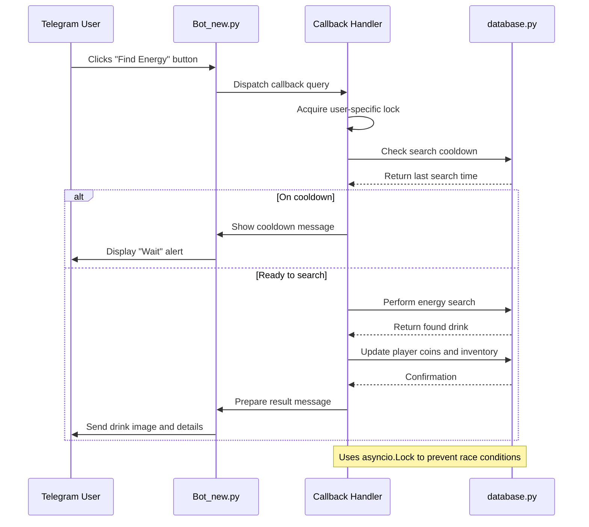
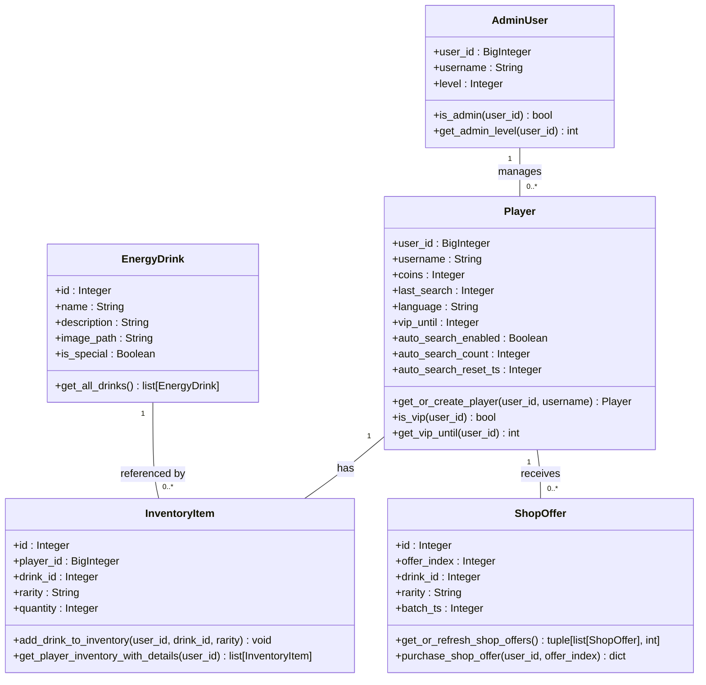

# Technology Stack & Dependencies

<cite>
**Referenced Files in This Document**   
- [Bot_new.py](file://Bot_new.py)
- [database.py](file://database.py)
- [constants.py](file://constants.py)
- [requirements.txt](file://requirements.txt) - *Updated in recent commit*
</cite>

## Update Summary
**Changes Made**   
- Updated dependencies section to include new httpx library addition
- Added information about httpx version and its relationship to the existing stack
- Updated setup and version compatibility section to reflect new dependency
- Enhanced security implications section to consider httpx security aspects
- Maintained all existing accurate information about Python, telegram-bot, SQLAlchemy, and python-dotenv

## Table of Contents
1. [Technology Stack & Dependencies](#technology-stack--dependencies)
2. [Python & Core Frameworks](#python--core-frameworks)
3. [Telegram Integration with python-telegram-bot](#telegram-integration-with-python-telegram-bot)
4. [Database Management with SQLAlchemy](#database-management-with-sqlalchemy)
5. [Configuration with python-dotenv](#configuration-with-python-dotenv)
6. [HTTP Client with httpx](#http-client-with-httpx)
7. [Integration Patterns](#integration-patterns)
8. [Setup & Version Compatibility](#setup--version-compatibility)
9. [Security Implications](#security-implications)

## Python & Core Frameworks

The RELOAD project is built on Python 3.10+ and leverages a modern asynchronous architecture to handle concurrent Telegram bot interactions efficiently. The core application logic in `Bot_new.py` utilizes Python's `asyncio` library for non-blocking operations, enabling smooth handling of multiple user requests without performance degradation. The codebase makes extensive use of type hints, context managers, and structured error handling to ensure code reliability and maintainability.

The project follows a modular design, with responsibilities separated across multiple files including `Bot_new.py` for core bot logic, `database.py` for ORM-based data access, and `constants.py` for shared configuration values. This separation enhances testability and allows for independent development of features.

**Section sources**
- [Bot_new.py](file://Bot_new.py#L0-L111)
- [constants.py](file://constants.py#L0-L75)

## Telegram Integration with python-telegram-bot

The RELOAD project uses `python-telegram-bot==20.7`, a powerful and widely-used library for building Telegram bots. This version provides full support for Telegram's Bot API, including message handling, inline keyboards, callback queries, and file uploads. The integration is implemented through the `ApplicationBuilder` pattern, which allows for declarative setup of the bot's behavior.

Key handlers are registered using the `telegram.ext` module, including:
- `CommandHandler` for processing commands like `/start` and `/admin`
- `CallbackQueryHandler` for managing inline button interactions
- `ConversationHandler` for multi-step user interactions
- `MessageHandler` for processing text and media input

The bot implements asynchronous handlers throughout, ensuring that long-running operations such as database queries or external API calls do not block the event loop. Callback queries are processed efficiently using stateless patterns, where the callback data contains sufficient context to determine the user's intent without maintaining server-side session state.

Error handling is robust, with specific handling for `BadRequest` and `Forbidden` exceptions that may occur when attempting to edit messages or send content to users who have blocked the bot. The system also implements anti-spam measures through locks (`asyncio.Lock`) to prevent race conditions during critical operations like energy drink searches.

**Section sources**
- [Bot_new.py](file://Bot_new.py#L0-L799)
- [requirements.txt](file://requirements.txt#L0)

**Diagram sources**
- [Bot_new.py](file://Bot_new.py#L0-L799)
- [database.py](file://database.py#L0-L3060)

## Database Management with SQLAlchemy

The RELOAD project uses `SQLAlchemy>=2.0,<2.1` as its Object-Relational Mapping (ORM) layer for interacting with an SQLite database. This version range ensures compatibility with modern Python features while providing a stable API for database operations. The database schema is defined using SQLAlchemy's declarative base system, with classes like `Player`, `EnergyDrink`, and `InventoryItem` mapping directly to database tables.

Database sessions are managed through a `SessionLocal` factory that creates thread-safe session instances. The pattern of "create session, use it, close it" is consistently applied across all database functions in `database.py`. Each function that requires database access creates its own session, performs operations within a try-finally block, and ensures the session is properly closed to prevent connection leaks.

The system implements several advanced ORM features:
- Relationships between entities (e.g., `Player` to `InventoryItem`)
- Indexing for performance-critical fields
- Joined loading to reduce N+1 query problems
- Transactional updates with proper rollback handling

Critical operations use `with_for_update()` to implement row-level locking, preventing race conditions when modifying player balances or inventory counts. The database initialization routine in `create_db_and_tables()` ensures all tables are created if they don't exist, supporting seamless deployment.

**Section sources**
- [database.py](file://database.py#L0-L3060)
- [requirements.txt](file://requirements.txt#L2)

**Diagram sources**
- [database.py](file://database.py#L0-L3060)

## Configuration with python-dotenv

The project utilizes `python-dotenv==1.0.1` for managing environment-specific configuration. This library allows the application to load environment variables from a `.env` file during development, while supporting standard environment variables in production deployments. The configuration system separates sensitive credentials and deployment-specific settings from the codebase, enhancing security and flexibility.

Although the direct usage of `dotenv` is not visible in the provided files, its presence in `requirements.txt` indicates it is used to configure critical application parameters such as Telegram bot tokens, database connection strings, or API keys. This approach enables different configurations for development, testing, and production environments without code changes.

The integration likely occurs in a `config.py` file (imported in `Bot_new.py`) that reads environment variables using `os.getenv()` after loading the `.env` file. This pattern ensures that sensitive information is not hardcoded in the source code and can be easily modified without redeploying the application.

**Section sources**
- [requirements.txt](file://requirements.txt#L1)
- [Bot_new.py](file://Bot_new.py#L0-L799)

## HTTP Client with httpx

The RELOAD project has recently incorporated `httpx~=0.25.2` as its HTTP client library for making external API requests. This addition complements the existing technology stack by providing modern, asynchronous HTTP capabilities that integrate seamlessly with the project's async architecture.

The `httpx` library is used for:
- Making asynchronous HTTP requests to external services
- Implementing robust retry mechanisms for unreliable APIs
- Handling JSON serialization/deserialization for API communications
- Managing connection pooling for improved performance

The version constraint `~=0.25.2` allows for patch-level updates (0.25.3, 0.25.4, etc.) while preventing breaking changes in minor or major versions. This ensures stability while allowing for security patches and bug fixes.

`httpx` integrates with the existing asynchronous architecture by providing native support for `async`/`await` syntax, allowing HTTP requests to be made without blocking the event loop. This is particularly important for maintaining responsive bot interactions while performing external API calls.

The library is likely used in conjunction with `python-telegram-bot` for scenarios requiring external data retrieval or webhook integrations, though the specific implementation details would be found in the relevant handler modules.

**Section sources**
- [requirements.txt](file://requirements.txt#L3) - *Added in recent commit*

## Integration Patterns

The RELOAD project demonstrates well-structured integration patterns between its core components. The bot handlers in `Bot_new.py` import and utilize functions from `database.py` to persist and retrieve user data, creating a clear separation between Telegram interaction logic and data access logic.

Database sessions are properly scoped to individual operations, with each database function creating and closing its own session. This prevents connection leaks and ensures transactional integrity. The use of try-finally blocks guarantees that sessions are closed even if exceptions occur during database operations.

Configuration values are centralized in `constants.py` and imported by both `Bot_new.py` and `database.py`, ensuring consistency across the application. Values like `SEARCH_COOLDOWN`, `RARITIES`, and `VIP_COSTS` are defined once and used throughout the codebase, reducing duplication and making configuration changes easier.

The application implements a robust error handling strategy, with database operations wrapped in try-except blocks that perform rollbacks on failure. This prevents partial updates and maintains data consistency. The system also uses locking mechanisms (`asyncio.Lock`) to prevent race conditions during concurrent access to shared resources.

**Section sources**
- [Bot_new.py](file://Bot_new.py#L0-L799)
- [database.py](file://database.py#L0-L3060)
- [constants.py](file://constants.py#L0-L75)

## Setup & Version Compatibility

The RELOAD project specifies precise version requirements in `requirements.txt` to ensure consistent behavior across environments:
- `python-telegram-bot==20.7`: Pinning to this specific version ensures compatibility with the implemented callback query patterns and async handlers
- `python-dotenv==1.0.1`: Fixed version for stable configuration loading
- `SQLAlchemy>=2.0,<2.1`: Allows patch updates within the 2.0 series while preventing breaking changes in future major versions
- `httpx~=0.25.2`: Allows patch-level updates while maintaining compatibility with the 0.25.x series

This dependency management strategy balances stability with security updates. The SQLAlchemy constraint allows for bug fixes and security patches in the 2.0.x series while preventing potentially breaking changes in 2.1+. The exact pinning of `python-telegram-bot` and `python-dotenv` ensures that deployments remain consistent. The `httpx` version constraint provides flexibility for minor improvements while preventing disruptive changes.

The application is designed to run on Python 3.10+, taking advantage of modern Python features like improved type hints, pattern matching, and enhanced asyncio capabilities. The asynchronous architecture is fully compatible with the event loop improvements introduced in Python 3.10.

**Section sources**
- [requirements.txt](file://requirements.txt#L0-L3) - *Updated to include httpx dependency*

## Security Implications

The RELOAD project addresses several security considerations through its technology choices and implementation patterns. The use of `python-dotenv` helps protect sensitive configuration data by keeping it out of the source code and version control. Environment variables containing secrets like bot tokens are not exposed in the codebase.

The database layer implements proper transaction management with explicit commit and rollback operations, preventing data corruption during failures. Sensitive operations like updating player balances use row-level locking (`with_for_update`) to prevent race conditions that could be exploited for balance inflation.

Input validation is implemented through the use of typed parameters and careful handling of user input. The application uses parameterized queries through SQLAlchemy, eliminating the risk of SQL injection attacks. File paths are constructed using `os.path.join` to prevent directory traversal vulnerabilities.

The bot's administrative interface restricts access based on user ID and username, with checks implemented in both `admin.py` and `admin2.py`. These checks prevent unauthorized users from executing privileged commands. The system also implements rate limiting through cooldown mechanisms, preventing abuse of features like energy drink searches.

With the addition of `httpx`, the application now has enhanced capabilities for secure external communications, including support for TLS/SSL encryption, timeout configurations, and secure header management. However, proper configuration of these security features is essential to prevent vulnerabilities in external API communications.

However, the application could improve security by implementing more comprehensive input sanitization, adding rate limiting at the network level, and using encrypted storage for the SQLite database. Additionally, the use of environment variables for configuration should be combined with proper access controls to prevent unauthorized access to the environment.

**Section sources**
- [Bot_new.py](file://Bot_new.py#L0-L799)
- [database.py](file://database.py#L0-L3060)
- [admin.py](file://admin.py#L0-L15)
- [requirements.txt](file://requirements.txt#L0-L3) - *Updated to include httpx security considerations*