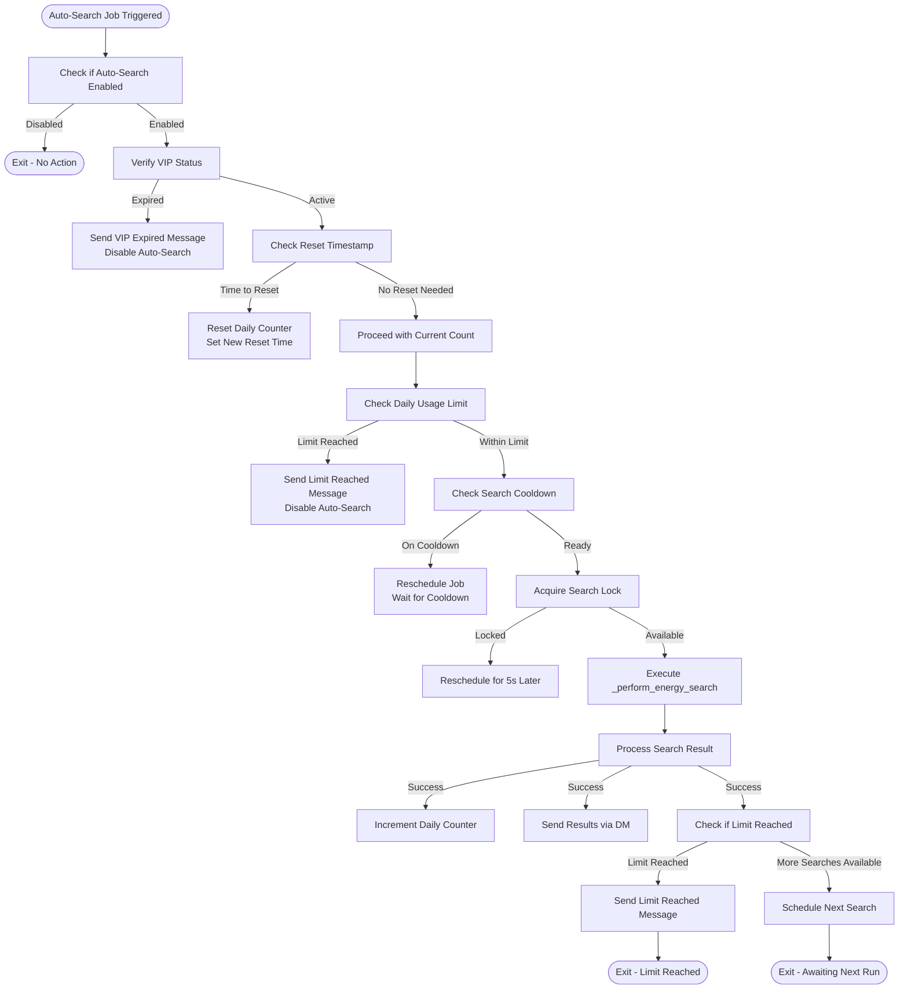
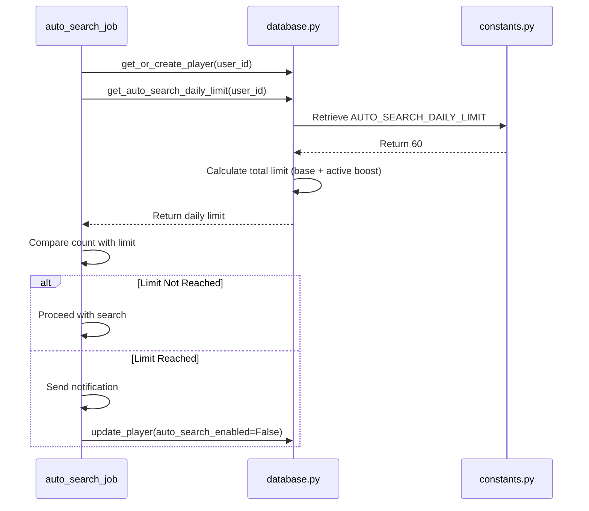
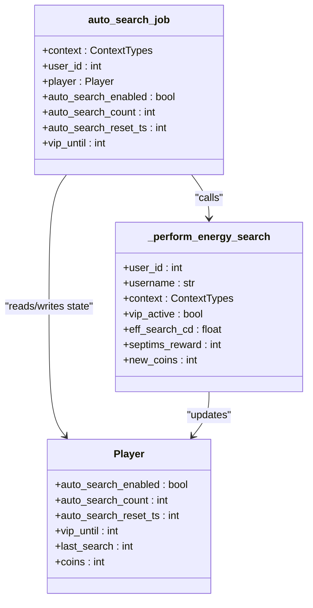

# Auto-Search Mechanics

<cite>
**Referenced Files in This Document**   
- [Bot_new.py](file://Bot_new.py)
- [constants.py](file://constants.py)
- [database.py](file://database.py)
</cite>

## Table of Contents
1. [Introduction](#introduction)
2. [Core Components](#core-components)
3. [Auto-Search Workflow](#auto-search-workflow)
4. [Daily Limit and Reset Mechanism](#daily-limit-and-reset-mechanism)
5. [Integration with Energy Search](#integration-with-energy-search)
6. [Concurrency Control](#concurrency-control)
7. [Feedback and Notification System](#feedback-and-notification-system)
8. [Error Handling and Recovery](#error-handling-and-recovery)

## Introduction
The VIP auto-search functionality enables VIP users to automatically search for energy drinks at regular intervals without manual interaction. This system is implemented through the `auto_search_job` function in Bot_new.py, which runs periodically via the JobQueue scheduler. The feature respects user preferences, VIP status, and daily usage limits while providing feedback through direct messages. The system incorporates robust error handling and recovery mechanisms to ensure reliable operation.

## Core Components

The auto-search functionality relies on three core components working in concert:

1. **JobQueue Scheduler**: Manages the periodic execution of auto-search jobs for each enabled user
2. **Player State Management**: Tracks auto-search configuration and usage metrics in the database
3. **Search Execution Engine**: Performs the actual energy drink search and inventory updates

The system checks multiple conditions before executing a search: auto-search must be enabled by the user, the user must have active VIP status, and the daily usage limit must not be exceeded. These checks occur at the beginning of each job execution cycle.

**Section sources**
- [Bot_new.py](file://Bot_new.py#L326-L496)
- [database.py](file://database.py#L1550-L1573)
- [constants.py](file://constants.py#L65-L68)

## Auto-Search Workflow

The auto-search process follows a sequential decision-making flow that ensures compliance with all system constraints:

**Diagram sources**
- [Bot_new.py](file://Bot_new.py#L326-L496)

**Section sources**
- [Bot_new.py](file://Bot_new.py#L326-L496)

## Daily Limit and Reset Mechanism

The system implements a 24-hour rolling window for tracking auto-search usage, with automatic reset at the end of each cycle. The daily limit is governed by the `AUTO_SEARCH_DAILY_LIMIT` constant defined in constants.py, which sets the base limit of 60 searches per day for VIP users.

The reset mechanism uses two player attributes stored in the database:
- `auto_search_count`: Tracks the number of completed auto-searches in the current cycle
- `auto_search_reset_ts`: Stores the Unix timestamp when the current cycle ends and the counter should be reset

When the current time exceeds the reset timestamp, the system resets the counter to zero and establishes a new 24-hour window. The system also accounts for potential boosts to the daily limit through the `get_auto_search_daily_limit` function, which combines the base limit with any active boost allocations.

**Diagram sources**
- [constants.py](file://constants.py#L65-L68)
- [database.py](file://database.py#L1550-L1573)
- [Bot_new.py](file://Bot_new.py#L326-L496)

**Section sources**
- [constants.py](file://constants.py#L65-L68)
- [database.py](file://database.py#L1550-L1573)

## Integration with Energy Search

The auto-search functionality integrates directly with the core energy search mechanism through the `_perform_energy_search` function. This shared implementation ensures consistency between manual and automatic searches while applying the same business rules and reward structures.

When executing an automatic search, the system:
1. Validates the search cooldown period, applying VIP multiplier (x0.5)
2. Selects a random energy drink from the available inventory
3. Determines the item's rarity based on weighted probabilities
4. Updates the user's inventory and coin balance
5. Returns structured results for notification delivery

The integration preserves all VIP benefits, including doubled coin rewards and reduced cooldown periods. The search results include appropriate metadata such as the image path, caption with HTML formatting, and navigation buttons for user interaction.

**Diagram sources**
- [Bot_new.py](file://Bot_new.py#L326-L496)
- [Bot_new.py](file://Bot_new.py#L498-L568)
- [database.py](file://database.py#L2500-L2507)

**Section sources**
- [Bot_new.py](file://Bot_new.py#L498-L568)
- [database.py](file://database.py#L2500-L2507)

## Concurrency Control

To prevent race conditions between automatic and manual search operations, the system implements a locking mechanism using asyncio.Lock objects. The `_LOCKS` dictionary maintains a collection of named locks, with each user having a dedicated search lock identified by the pattern `user:{user_id}:search`.

When an auto-search job executes, it first attempts to acquire the user's search lock. If the lock is already held (indicating an ongoing manual search), the auto-search job reschedules itself to run after a 5-second delay. This prevents simultaneous search operations that could lead to inconsistent state or database conflicts.

The locking mechanism works in conjunction with the cooldown system to provide layered protection against abuse and technical issues. Even if the lock mechanism fails, the cooldown enforcement in `_perform_energy_search` provides a secondary safeguard against rapid-fire searches.

**Section sources**
- [Bot_new.py](file://Bot_new.py#L326-L496)
- [Bot_new.py](file://Bot_new.py#L100-L105)

## Feedback and Notification System

The auto-search system maintains a comprehensive feedback loop with users through direct messaging. After each successful search, the system sends a detailed notification containing:
- The discovered energy drink with name and description
- The item's rarity with appropriate emoji
- Coin rewards earned (doubled for VIP users)
- Updated coin balance
- VIP expiration information (if applicable)

When operational limits are reached, the system provides clear notifications:
- When the daily auto-search limit is reached, users receive a message indicating the limit has been exhausted and auto-search has been disabled
- When VIP status expires, users are notified that auto-search has been disabled due to expired VIP

These notifications are sent via direct message to ensure users are aware of the system's status even when not actively using the bot. The system gracefully handles messaging failures by catching exceptions and continuing operation without interruption.

**Section sources**
- [Bot_new.py](file://Bot_new.py#L326-L496)
- [Bot_new.py](file://Bot_new.py#L498-L568)

## Error Handling and Recovery

The auto-search system implements robust error handling and recovery mechanisms to ensure reliability in production environments. The `auto_search_job` function wraps its entire execution in a try-except block that catches all exceptions, preventing job queue failures from terminating the scheduler.

When an unexpected error occurs, the system:
1. Logs the complete exception traceback for diagnostic purposes
2. Reschedules the job to run again after a 60-second delay
3. Preserves the user's auto-search enabled status for retry

This recovery strategy allows transient issues (such as temporary database connectivity problems or network timeouts) to resolve themselves without requiring user intervention. The system also handles specific error conditions in the search workflow:
- "Cooldown" status triggers rescheduling based on remaining cooldown time
- "No drinks" status results in a notification and 10-minute rescheduling
- Messaging failures are caught and ignored to prevent cascading failures

The combination of comprehensive error handling and automatic recovery ensures that the auto-search functionality remains resilient to common operational issues.

**Section sources**
- [Bot_new.py](file://Bot_new.py#L326-L496)