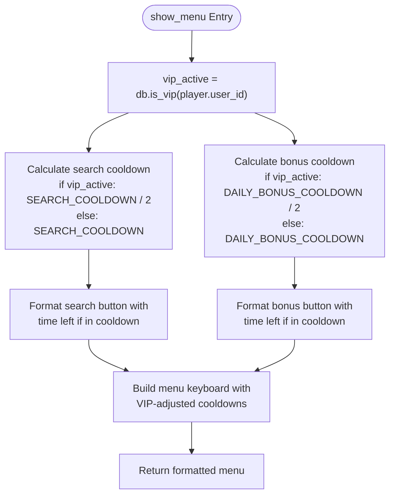
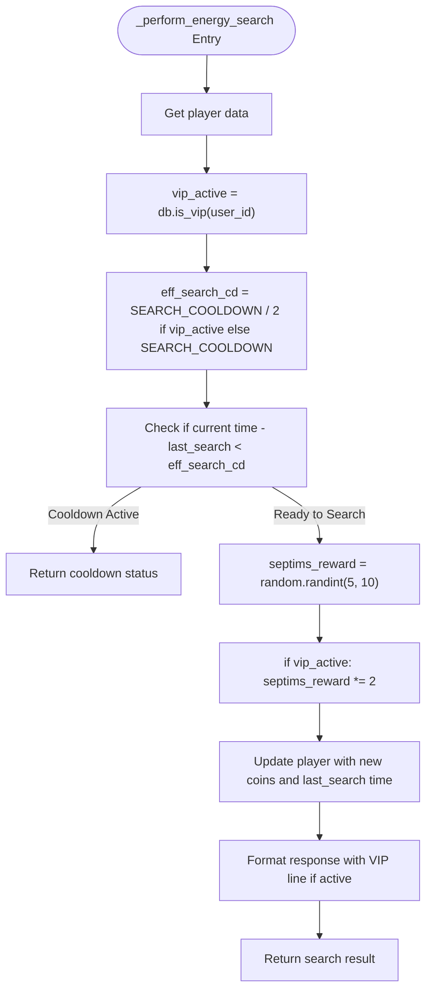
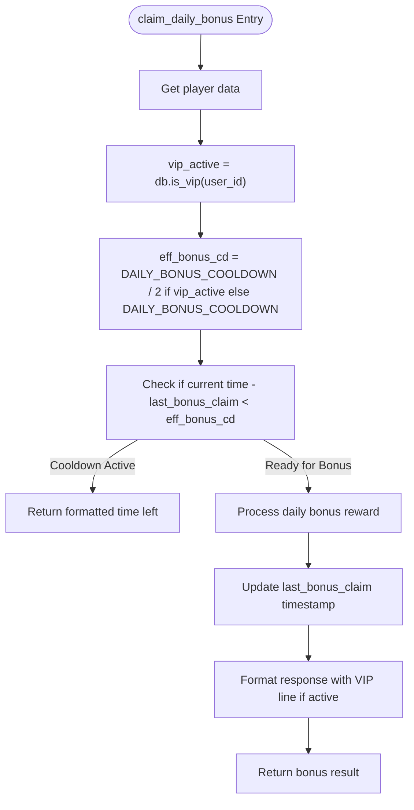
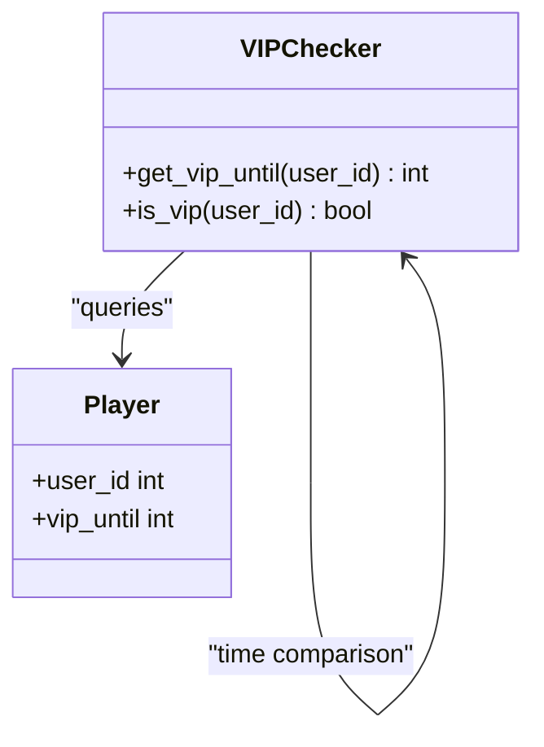
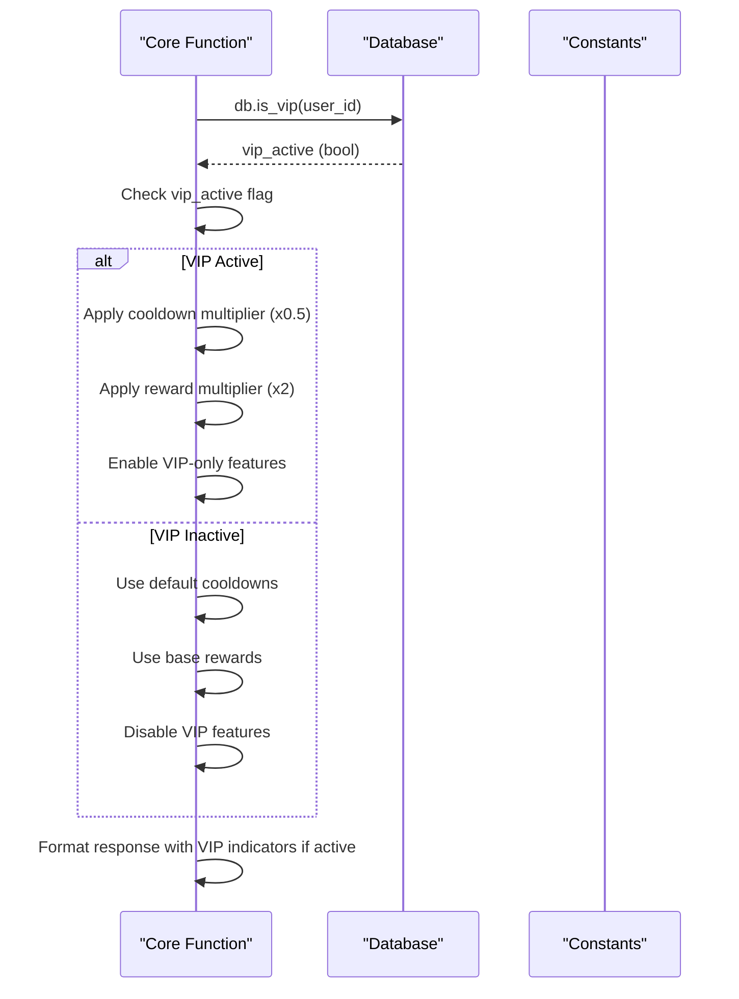
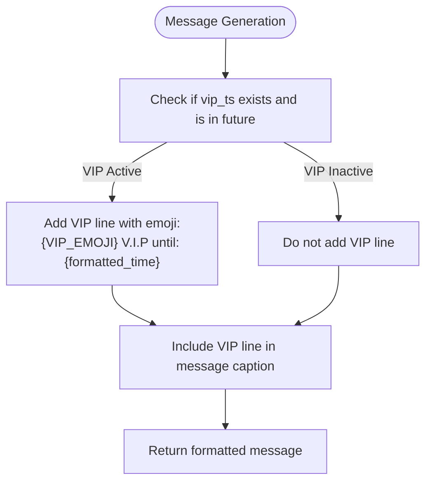
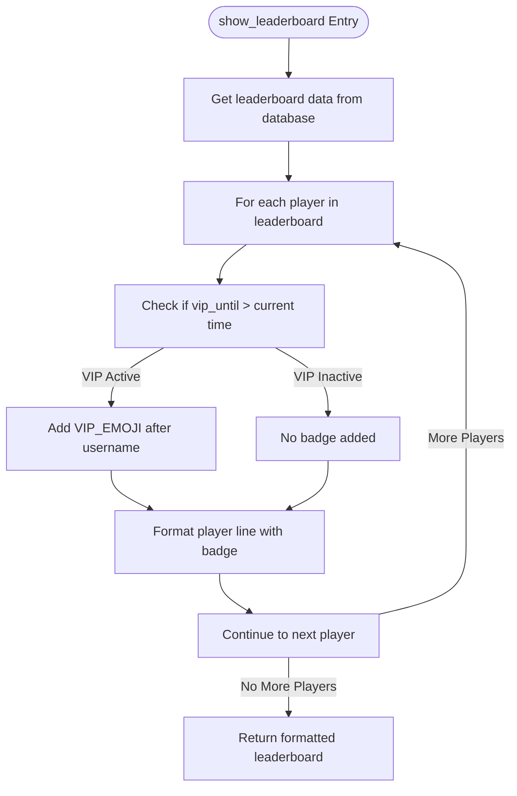
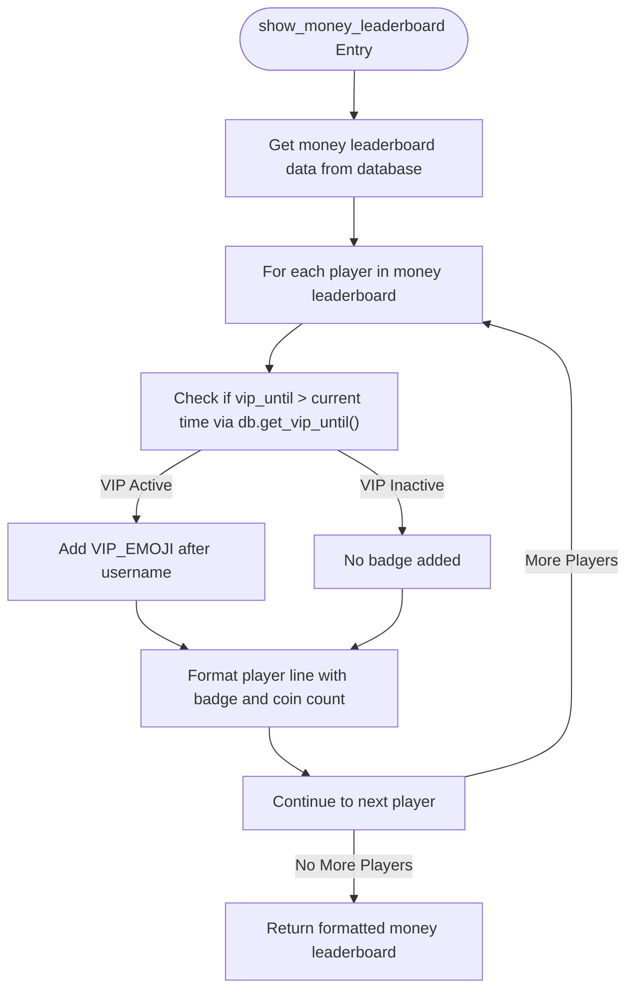
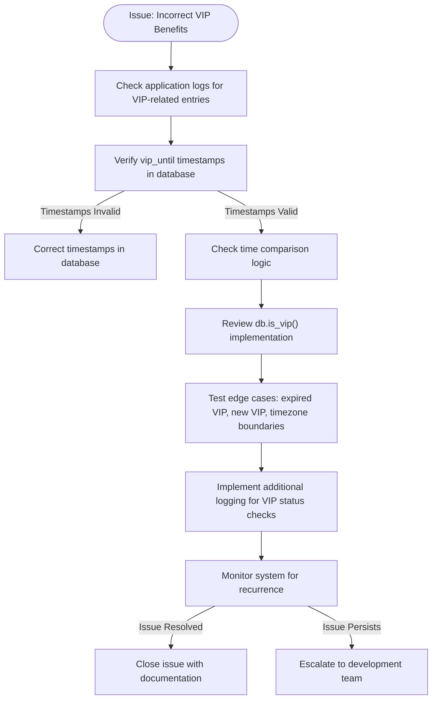

# Benefits Implementation

<cite>
**Referenced Files in This Document**   
- [Bot_new.py](file://Bot_new.py) - *Updated in recent commit c3085cc*
- [database.py](file://database.py) - *Updated in recent commit c3085cc*
- [constants.py](file://constants.py)
</cite>

## Update Summary
**Changes Made**   
- Added documentation for VIP badge in money leaderboard functionality
- Updated visual indicators section to include new money leaderboard implementation
- Enhanced diagram sources to reflect updated leaderboard display logic
- Added new section sources for money leaderboard functions
- Maintained consistency with existing VIP benefit documentation

## Table of Contents
1. [VIP Benefits Overview](#vip-benefits-overview)
2. [Conditional Logic in Core Functions](#conditional-logic-in-core-functions)
3. [VIP Status Detection and Application](#vip-status-detection-and-application)
4. [Visual Indicators of VIP Status](#visual-indicators-of-vip-status)
5. [Potential Issues and Debugging Strategies](#potential-issues-and-debugging-strategies)

## VIP Benefits Overview

The VIP benefits system provides enhanced gameplay mechanics for premium users, including reduced cooldowns and increased rewards. The core benefits are defined in the `constants.py` file and include:

- **Search Cooldown Reduction**: VIP users experience a 50% reduction in search cooldown (from 300 seconds to 150 seconds)
- **Daily Bonus Cooldown Reduction**: VIP users have a 50% reduction in daily bonus cooldown (from 86400 seconds to 43200 seconds)
- **Doubled Coin Rewards**: VIP users receive double the coin rewards from energy searches
- **VIP Auto-search**: Exclusive access to automated search functionality
- **VIP Badge**: Special visual indicator in leaderboards and user interfaces

The VIP status is managed through the `Player` model in the database, which stores the `vip_until` timestamp to determine active status. The system uses a multiplier-based approach for cooldown reduction, effectively implementing a `VIP_COOLDOWN_MULTIPLIER` of 0.5 without explicitly defining it as a constant.

**Section sources**
- [constants.py](file://constants.py#L30-L48)
- [database.py](file://database.py#L17-L25)

## Conditional Logic in Core Functions

### show_menu Function

The `show_menu` function in `Bot_new.py` implements conditional logic to display appropriate cooldown timers based on VIP status. The function checks VIP status using `db.is_vip()` and applies different cooldown calculations accordingly:

**Diagram sources**
- [Bot_new.py](file://Bot_new.py#L312-L349)

### _perform_energy_search Function

The `_perform_energy_search` function contains the core logic for applying VIP benefits during energy searches. It implements conditional logic for both cooldown reduction and reward multiplication:

**Diagram sources**
- [Bot_new.py](file://Bot_new.py#L504-L558)

### claim_daily_bonus Function

The `claim_daily_bonus` function implements VIP-specific cooldown logic for daily bonuses. The conditional flow ensures that VIP users benefit from reduced cooldown periods:

**Diagram sources**
- [Bot_new.py](file://Bot_new.py#L636-L660)

## VIP Status Detection and Application

### VIP Status Checking Mechanism

The system uses a two-step process to determine VIP status, implemented in the `database.py` file:

The `is_vip()` function first retrieves the `vip_until` timestamp from the database using `get_vip_until()`, then compares it with the current timestamp to determine if the VIP status is active.

**Diagram sources**
- [database.py](file://database.py#L2472-L2515)

### Benefit Application Flow

The application of VIP benefits follows a consistent pattern across multiple functions, using the `vip_active` flag to control benefit application:

**Diagram sources**
- [Bot_new.py](file://Bot_new.py#L312-L349)
- [Bot_new.py](file://Bot_new.py#L504-L558)
- [Bot_new.py](file://Bot_new.py#L636-L660)

## Visual Indicators of VIP Status

### VIP Emoji in Messages

The system uses the `VIP_EMOJI` constant ('👑') to visually indicate VIP status in various messages throughout the application. This emoji is included in search and bonus results when a user has active VIP status:

**Diagram sources**
- [Bot_new.py](file://Bot_new.py#L544-L548)
- [Bot_new.py](file://Bot_new.py#L686-L690)

### VIP Badge in Leaderboards

The leaderboard system displays a special VIP badge next to users with active VIP status. This is implemented in the `show_leaderboard` function:

**Diagram sources**
- [Bot_new.py](file://Bot_new.py#L5038-L5055)
- [Bot_new.py](file://Bot_new.py#L5059-L5091)

### VIP Badge in Money Leaderboard

The system has been updated to include VIP badge support in the money leaderboard display. The `show_money_leaderboard` function implements similar VIP badge logic as the standard leaderboard but uses a different data structure:

**Section sources**
- [Bot_new.py](file://Bot_new.py#L5059-L5091) - *Added in recent commit c3085cc*
- [database.py](file://database.py#L3430-L3462) - *Added in recent commit c3085cc*

**Diagram sources**
- [Bot_new.py](file://Bot_new.py#L5059-L5091) - *Added in recent commit c3085cc*

## Potential Issues and Debugging Strategies

### Timestamp Validation Errors

One potential issue in the VIP system is incorrect benefit application due to timestamp validation errors. The system relies on Unix timestamps for VIP expiration checking, which could lead to issues if:

1. Server time synchronization is inaccurate
2. Database timestamps become corrupted
3. Timezone handling issues occur

The following debugging strategy can be employed to identify and resolve such issues:

**Diagram sources**
- [database.py](file://database.py#L2472-L2515)
- [Bot_new.py](file://Bot_new.py#L826-L855)

### Logging Patterns for Debugging

The system includes comprehensive logging that can be leveraged for debugging VIP benefit issues. Key log entries include:

- Search operations with VIP status and reward amounts
- VIP purchase transactions with timestamps and coin balances
- Daily bonus claims with cooldown calculations

These logs can be analyzed to trace the flow of VIP benefits and identify where incorrect application might be occurring.

**Section sources**
- [Bot_new.py](file://Bot_new.py#L79-L85)
- [Bot_new.py](file://Bot_new.py#L550-L552)
- [Bot_new.py](file://Bot_new.py#L680-L682)